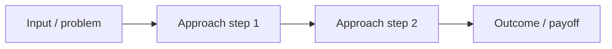
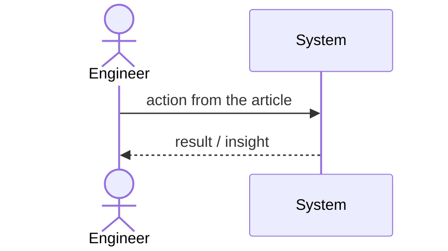
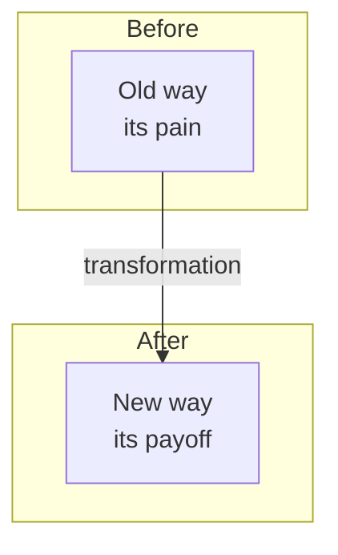

# Substack summary — output template & Mermaid recipes

Write the summary in this order. Keep it tight — an AI engineer should get the whole thing in ~2
minutes. Ground every claim in the cleaned article; if it isn't in the text, don't assert it.

## Section skeleton

```markdown
# <Article title> — Summary

> One-line hook: what this article is about and why it matters.
_Source: [<title>](<url>) — <author> · <date>_

## Executive summary
~5 sentences (or tight bullets) a busy reader can absorb in 30 seconds: the core thesis, the 2–3 key
takeaways, and the single most important insight.

## Problem → Solution → Transformation
- **Problem** — the pain or gap the article addresses; who feels it and why it matters now.
- **Solution** — what the article proposes: the core idea, mechanism, or approach.
- **Transformation** — the before → after; what changes once you adopt the solution, and the payoff.

## Visual explanation
One or more Mermaid diagrams that make the article's argument visual (recipes below). Add a sentence
under each diagram saying what it shows.

## Apply it as an AI engineer
- **Adopt** — specific practices, patterns, or techniques to put to work.
- **Watch for** — pitfalls, trade-offs, or limits the article flags.
- **This week** — the smallest concrete experiment you could run to try it.
```

## Mermaid recipes

Use fenced ` ```mermaid ` blocks. Pick the diagram that fits the article — don't force all three.

### Concept / pipeline — `graph`



### Process / interaction — `sequenceDiagram`



### The shift — before → after



## Quality bar

- Every diagram reflects the article's actual argument — no invented steps.
- The executive summary stands alone; the rest adds depth.
- "Apply it as an AI engineer" is concrete enough to act on, not generic advice.
