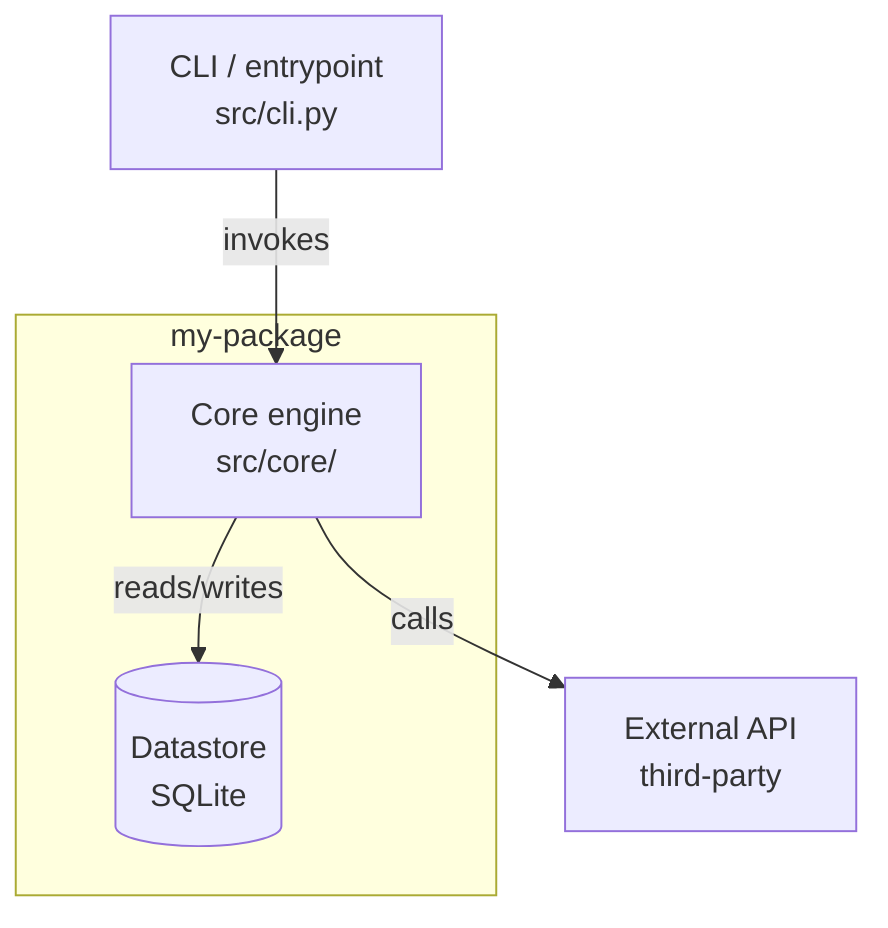
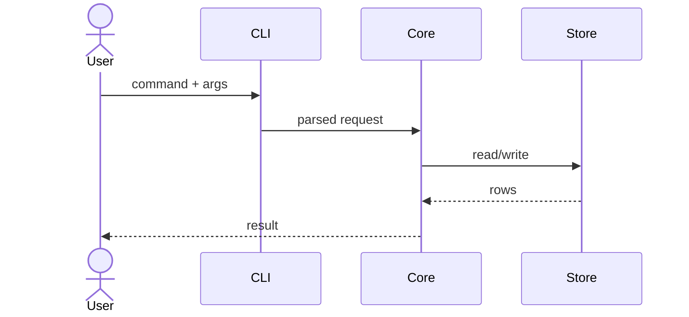
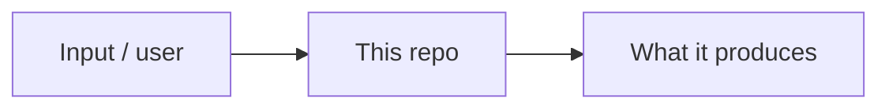

# ARCHITECTURE.md — output template & diagram recipes

Write the file in this order. Keep prose tight and let the diagrams carry the structure. Ground every
component and edge in a file you read — never add a box to make a diagram look complete.

## Section skeleton

```markdown
# <Repo name>

> One sentence: what this repository is.

## What problem it solves
2–4 sentences: the problem, who has it, and how this repo addresses it. Then a short bullet list of the
core capabilities.

## How to use it
- **Install / run** — the actual commands from the README or package manifest.
- **Minimal example** — the smallest real usage snippet you found (cite where it came from).
- **Entry point** — the CLI command, HTTP server, library import, or service a user starts with.

## Architecture
A high-level paragraph, then the component diagram (see "Component diagram" below).

### Key components
| Component | Path | Responsibility |
|---|---|---|
| … | `src/…` | one line |

### Interfaces
For each key component, its public surface — the functions/classes/routes/events others call, and the
file they live in. A few lines each.

### How they connect
Prose for the wiring a diagram can't label: ownership, lifecycles, sync vs async, what crosses a
process/network boundary, where the data stores sit.

## End-to-end dataflow
Pick ONE representative path (a request, a CLI run, a job). Walk it hop by hop, citing the file at each
hop, then the sequence diagram (see "Sequence diagram" below).
```

## Mermaid diagram recipes

Use fenced ` ```mermaid ` blocks. At least two diagrams: a **component graph** (required) and a
**sequence diagram** for the dataflow (required); add a **context diagram** when it clarifies the
problem.

### Component diagram — how the pieces connect



Real names + paths. `[(...)]` for data stores, `subgraph` for process/package boundaries, edge labels
(`-->|writes|`) for the relationship.

### Sequence diagram — the end-to-end path



One participant per component on the path; one arrow per hop you traced. Stick to the single path, not
every branch.

### Context diagram (optional) — problem framing



A small `graph LR` placing the repo between its inputs and outputs when that clarifies what it's for.

## Quality bar

- Every box/participant maps to a path you read; every edge to a call/import/dependency you confirmed.
- Diagrams and prose agree. Couldn't verify a connection? Label it `(unverified)` — don't draw it as
  fact.
- A newcomer who reads only the diagrams + section headers still gets the shape of the system.
