<div align="center">
  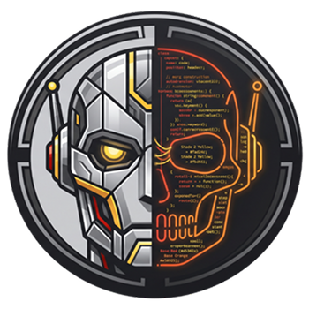
  <h1>Building a Coding Agent From Scratch</h1>
  <h3>The harness, not the model, makes a coding agent good. Build one from scratch, from a bare-bones agent loop to a swarm of cloud agents.</h3>
  <p class="tagline">Open-source course by <a href="https://www.decodingai.com">Decoding AI</a> in collaboration with <a href="https://modal.com?source=decodingai&campaign=harnesseng">Modal</a>, <a href="https://www.comet.com/site/?utm_source=workshop&utm_medium=partner&utm_campaign=paul&utm_content=coding_agent_course">Opik (by Comet)</a> and <a href="https://www.zenml.io/product/kitaru?utm_source=decodingai&utm_medium=referral&utm_campaign=coding-agent-course&utm_content=brand">Kitaru (by ZenML)</a>.</p>
</div>

<p align="center">
  
  
  
  
  
  
</p>

<p align="center">
  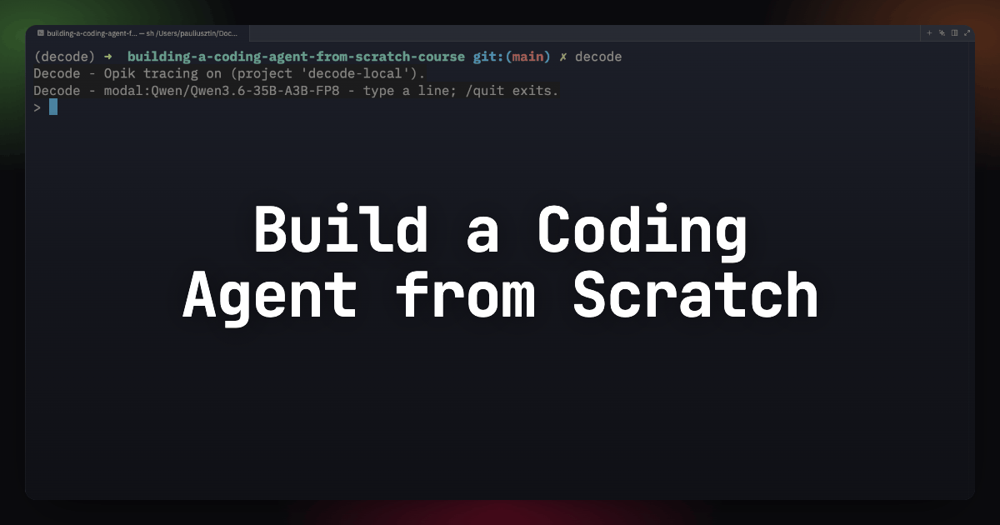
</p>

> **Try the finished agent first — 5 minutes, $0:**
>
> ```bash
> git clone https://github.com/decodingai-magazine/building-a-coding-agent-from-scratch-course.git
> cd building-a-coding-agent-from-scratch-course
> make install
> cp .env.example .env   # set LLM API key
> uv run decode
> ```
>
> Then type `/demo-` and pick a demo — see [what they do](#-see-it-work) below. [Full setup guide.](#-running-the-code)

<p align="center">
  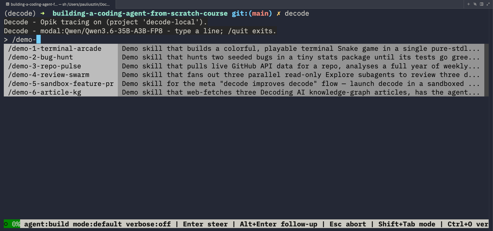
</p>
<p align="center"><i>Type <code>/demo-</code> and the six demos are one keystroke away.</i></p>

## 📖 About This Course

In [LangChain's Terminal-Bench experiment](https://www.langchain.com/blog/the-anatomy-of-an-agent-harness), changing only the harness (with the same model) moved a coding agent from ~30th place into the top 5: the harness, not the model, is what makes a coding agent good.

### The agent is ~20 lines. The course is everything else.

```python
agent = Agent(
    build_model(settings.llm_provider),        # gemini | openrouter | modal
    deps_type=AgentDeps,                       # cwd, event sink, permission gate
    output_type=[str, DeferredToolRequests],   # final answer, or tools paused for approval
)
register_tools(agent)                          # read, edit, bash, grep, ...

async with agent.iter(prompt, message_history=history) as run:
    async for node in run:                     # model request → tool calls → repeat
        stream_events(node)
```

That's the _entire_ tool-calling agent — the thing people call "the agent" ends here. Everything else in this repo — the tools, skills, the permission layer, sandbox, steering queue, memory, compaction, durable runtime, remote execution, the subagent fan-out, the evals — is the harness. That's what you're here to build.

<p align="center">
  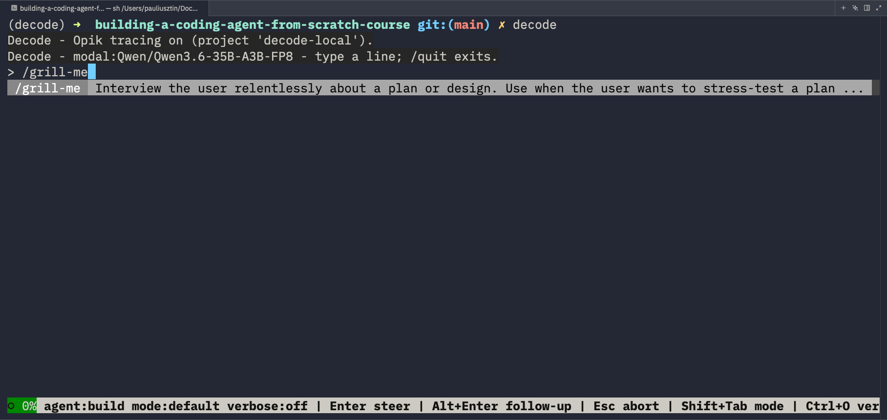
  <br/>
  <i>A fresh session powered by Qwen 3.6 35B hosted on Modal</i>
</p>

We spent months under the hood of Claude Code (via its leaked source), [OpenCode](https://github.com/anomalyco/opencode), [Pi](https://github.com/earendil-works/pi), and [Aider](https://github.com/aider-ai/aider), then distilled it into 8 articles and 4 videos where you'll build **decode**, your own coding agent, from scratch — one headless core hooked to two modes: an interactive TUI and a remote runtime running N copies in parallel.

<p align="center">
  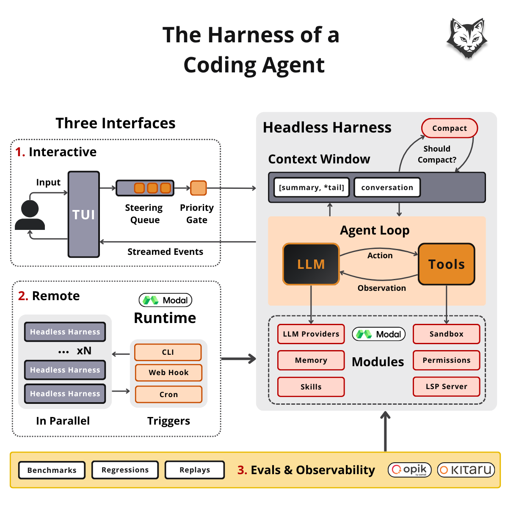
</p>
<p align="center"><i>Two interface modes on the left, the headless harness on the right, the evals plane underneath.</i></p>

## 🎮 See It Work

The finished agent ships with demo skills under [`.decode/skills/`](.decode/skills/). Open the TUI, type `/demo-`, pick one, and watch the harness you're about to build do real work:

<p align="center">
  
  <br/>
  <b>Implement the Skills Standard</b>
  <br/>
  <i>Type <code>/demo-</code> and the six demos are one keystroke away.</i>
</p>

<table>
  <tr>
    <td width="50%">
      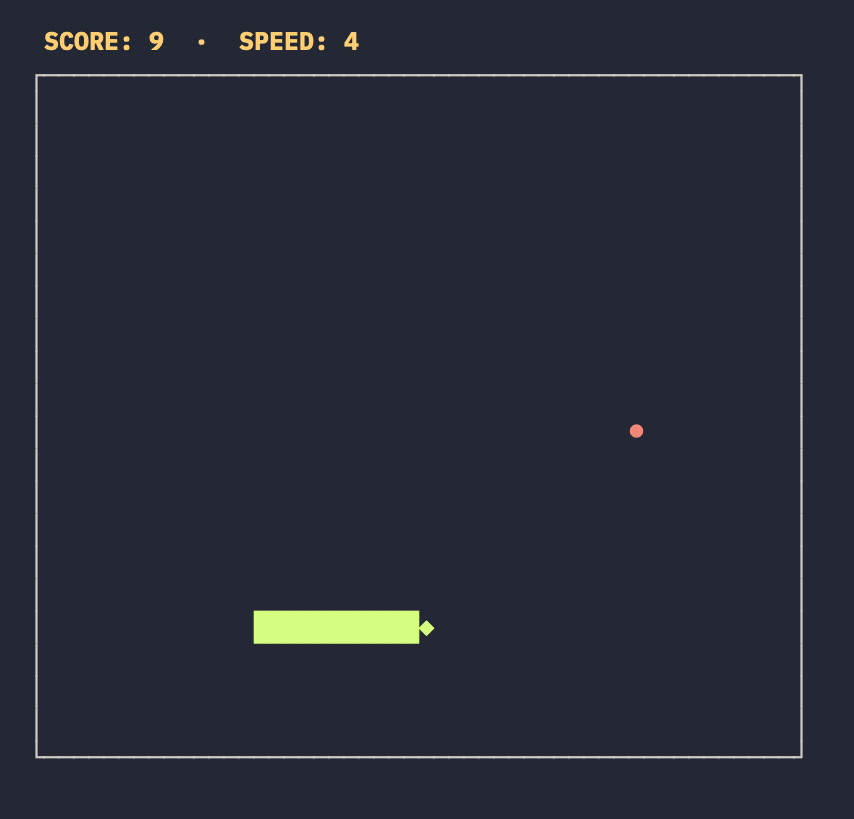
      <p align="center"><b>Capable of Creating Games</b><br/><i><code>/demo-1-terminal-arcade</code> — one prompt, a playable Snake game</i></p>
    </td>
    <td width="50%">
      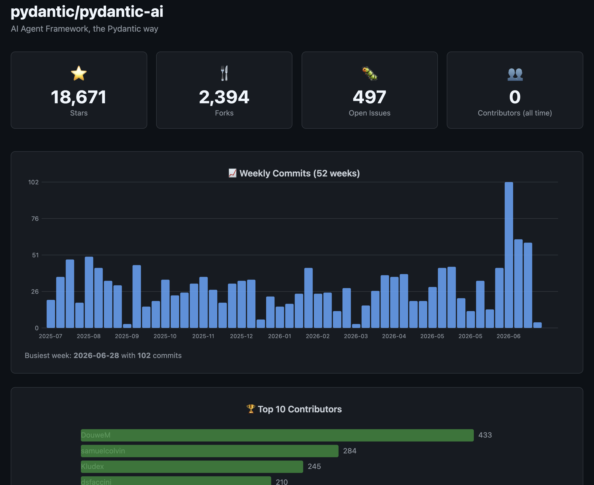
      <p align="center"><b>Fetching Data & Creating Dashboards</b><br/><i><code>/demo-3-repo-pulse</code> — live GitHub API data rendered as a dashboard</i></p>
    </td>
  </tr>
  <tr>
    <td colspan="2" align="center">
      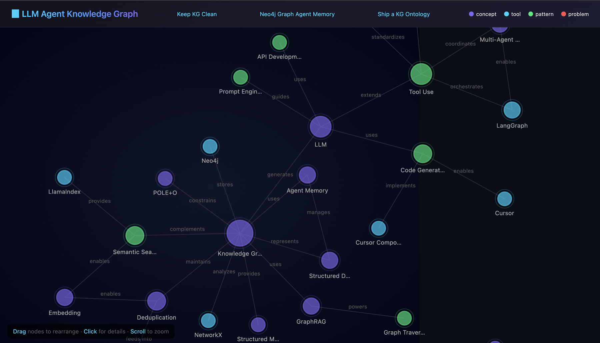
      <p align="center"><b>Extracting Ontologies & Rendering Graphs</b><br/><i><code>/demo-6-article-kg</code> — web articles scraped into an interactive knowledge graph</i></p>
    </td>
  </tr>
</table>

And the infra that powers the agents:

<table>
  <tr>
    <td width="50%">
      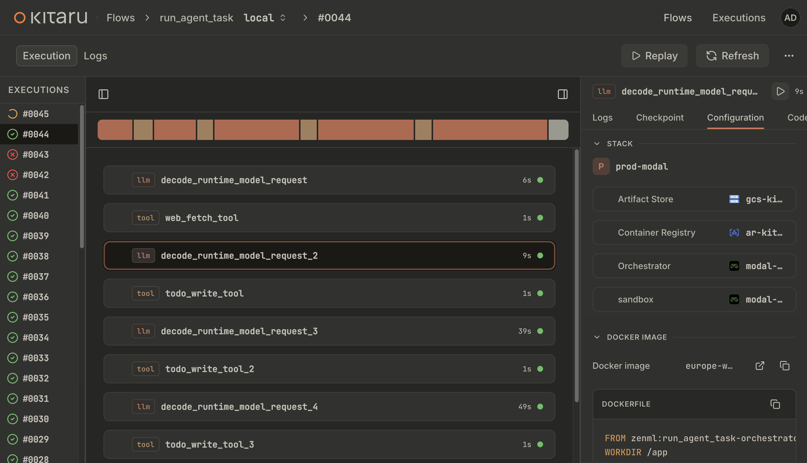
      <p align="center"><b>Durability & Replay for AI Agents</b><br/><i>Every run recorded step by step in <a href="https://www.zenml.io/product/kitaru?utm_source=decodingai&utm_medium=referral&utm_campaign=coding-agent-course&utm_content=brand">Kitaru</a> — kill it, resume it, replay it with the model swapped</i></p>
    </td>
    <td width="50%">
      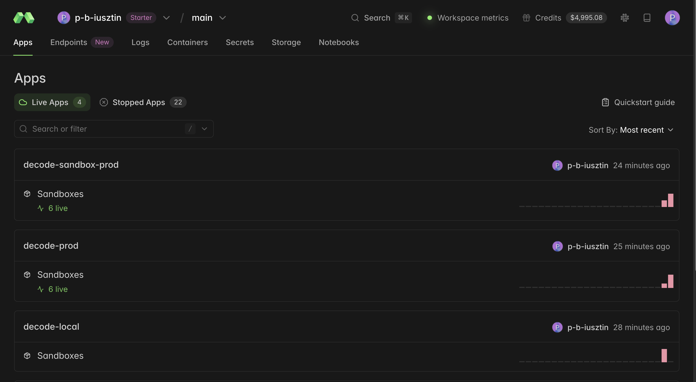
      <p align="center"><b>Remote Sandboxing</b><br/><i>The agent's <code>bash</code> runs in disposable <a href="https://modal.com/docs/guide/sandboxes?source=decodingai&campaign=harnesseng">Modal sandboxes</a></i></p>
    </td>
  </tr>
  <tr>
    <td width="50%">
      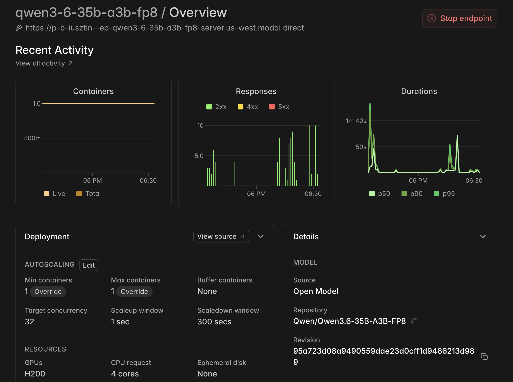
      <p align="center"><b>Powered by Open Source Models</b><br/><i>Your own Qwen3.6-35B served on an H200 via a <a href="https://modal.com/docs/guide/endpoints?source=decodingai&campaign=harnesseng">Modal endpoint</a></i></p>
    </td>
    <td width="50%">
      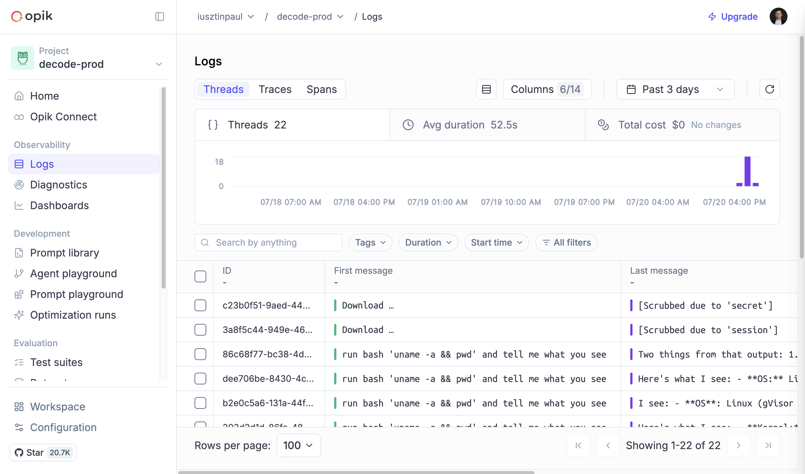
      <p align="center"><b>Adding AI Evals & Observability</b><br/><i>Every session traced in <a href="https://www.comet.com/site/?utm_source=workshop&utm_medium=partner&utm_campaign=paul&utm_content=coding_agent_course">Opik</a></i></p>
    </td>
  </tr>
</table>

## 🤖 You'll Walk Away Knowing How To

- Design a coding agent harness from scratch
- Implement a headless coding agent loop
- Attach the headless harness to multiple modes: TUI and remote
- Add a runtime for durable execution, human-in-the-loop and replays when running parallel agents
- Implement guardrails and safety nets for the agent's behavior by adding a permission layer and local & remote sandboxing
- Build essential context engineering techniques: memory, compaction, skills
- Hook up an LSP server for faster feedback loops
- Implement an agents catalog: build, plan, code reviewer and exploration agents
- Spawn parallel subagents via fan-out strategies
- Add observability
- Design an eval harness for benchmarking the agent and checking for regressions
- Deploy and run swarms of agents

<p align="center">
  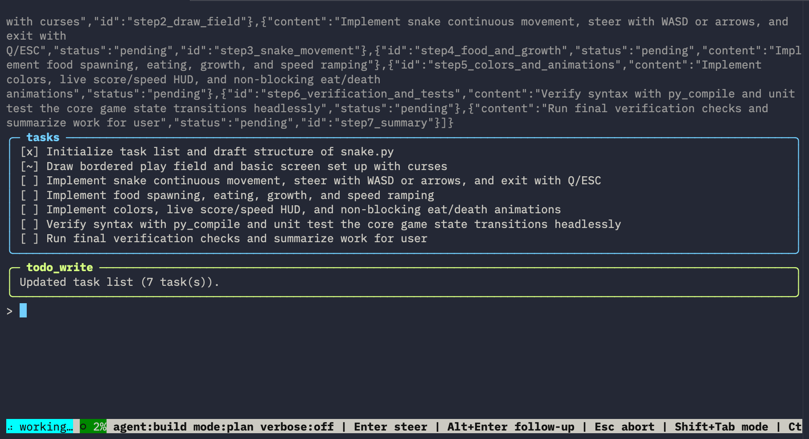
</p>
<p align="center"><i>Plan mode, live: the agent breaks the Snake demo into a task list with the <code>todo</code> tool — <code>[x]</code> done, <code>[~]</code> in progress.</i></p>

### Tech Stack

The code is written in Python, with the following frameworks and libraries:

- **Agent Framework:** [Pydantic AI](https://ai.pydantic.dev)
- **LLM Providers:** [Modal](https://modal.com/docs/guide/endpoints?source=decodingai&campaign=harnesseng) (open weights you serve yourself via SGLang), OpenRouter (open weights as a service), or Gemini (proprietary).
- **Durable Runtime & Replays:** [Kitaru](https://www.zenml.io/product/kitaru?utm_source=decodingai&utm_medium=referral&utm_campaign=coding-agent-course&utm_content=brand)
- **Observability & Evals:** [Opik](https://www.comet.com/site/?utm_source=workshop&utm_medium=partner&utm_campaign=paul&utm_content=coding_agent_course)
- **Sandboxing:** local Docker & remote [Modal sandboxes](https://modal.com/docs/guide/sandboxes?source=decodingai&campaign=harnesseng)
- **Deploying:** GCP & Modal

Otherwise, we build all the functionality from scratch, to teach you the foundations that last, not frameworks that abstract away the hard parts.

## 💡 The code tells you _what_. The lessons tell you _why_.

For the full experience, go through the articles and videos that cover what the code can't. **The why behind every decision.**

Why we have a headless harness and two interface modes: TUI + Remote.
What the essential components of a coding agent are, and what is optional.
Why we plugged in 9 tools, no more, no less.
Why we need a durable runtime and replays.
What guardrails are actually useful.
Why compaction fires at ~80% of the window instead of at the limit.
Why you need benchmarks, regression tests and online evals.

## 📚 Course Outline

<table>
  <tr>
    <th align="center">Lesson</th>
    <th align="center">Written Lesson</th>
    <th align="center">Video Lesson</th>
    <th align="center">Description</th>
    <th align="center">Running the code</th>
  </tr>
  <tr>
    <td align="center"><b>1</b><br/>Building a Coding Agent From Scratch: Harness Architecture</td>
    <td align="center"><a href="https://www.decodingai.com/p/building-a-coding-agent-from-scratch-system-design" target="_blank"></a></td>
    <td align="center">🎬 <i>Video 1 — coming soon</i></td>
    <td align="center">Designing the harness around the model, from the agent loop to a remote swarm.</td>
    <td align="center"><a href="running_the_code/01_install_and_usage.md">01_install_and_usage.md</a> · <a href="running_the_code/02_modal_endpoints.md">02_modal_endpoints.md</a></td>
  </tr>
  <tr>
    <td align="center"><b>2</b><br/>The Bare-Bones Coding Agent Loop</td>
    <td align="center"><a href="https://www.decodingai.com/p/the-coding-agent-loop" target="_blank">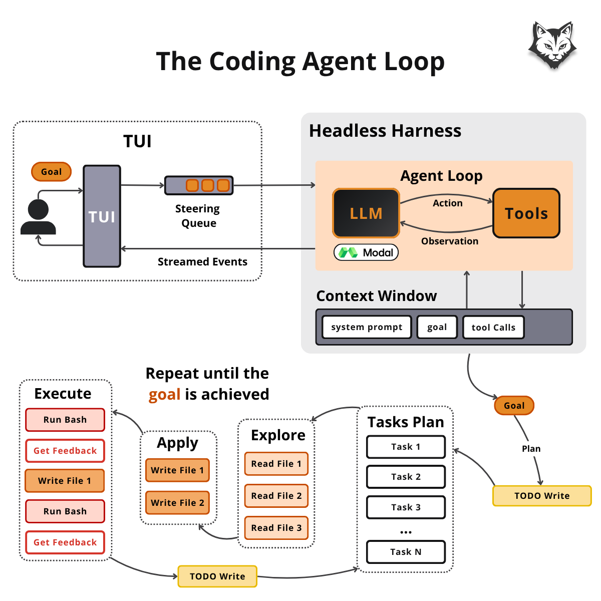</a></td>
    <td align="center">🎬 <i>Video 2 — coming soon</i></td>
    <td align="center">One agent loop, 9 tools, and a terminal you can steer.</td>
    <td align="center"><a href="running_the_code/01_install_and_usage.md">01_install_and_usage.md</a> · <a href="running_the_code/02_modal_endpoints.md">02_modal_endpoints.md</a></td>
  </tr>
  <tr>
    <td align="center"><b>3</b><br/>The Runtime: Durable Execution, HITL & Replays (The Headless Mode)</td>
    <td align="center">📄 <i>Coming soon</i></td>
    <td align="center">🎬 <i>Video 2 — coming soon</i></td>
    <td align="center"><code>kill -9</code> a headless run, resume it from checkpoints, replay it with the model swapped.</td>
    <td align="center"><a href="running_the_code/01_install_and_usage.md">01_install_and_usage.md</a> · <a href="running_the_code/02_modal_endpoints.md">02_modal_endpoints.md</a> · <a href="running_the_code/03_runtime.md">03_runtime.md</a></td>
  </tr>
  <tr>
    <td align="center"><b>4</b><br/>Containing the Agent: Permissions & Sandbox</td>
    <td align="center">📄 <i>Coming soon</i></td>
    <td align="center">🎬 <i>Video 3 — coming soon</i></td>
    <td align="center">Four permission modes, then Docker and Modal sandboxes — nothing executes on your machine.</td>
    <td align="center"><a href="running_the_code/01_install_and_usage.md">01_install_and_usage.md</a> · <a href="running_the_code/02_modal_endpoints.md">02_modal_endpoints.md</a> · <a href="running_the_code/04_sandboxing.md">04_sandboxing.md</a></td>
  </tr>
  <tr>
    <td align="center"><b>5</b><br/>Context Engineering for Coding Agents</td>
    <td align="center">📄 <i>Coming soon</i></td>
    <td align="center">🎬 <i>Video 3 — coming soon</i></td>
    <td align="center">Memory, compaction, skills, and LSP — the context window treated as a budget.</td>
    <td align="center"><a href="running_the_code/01_install_and_usage.md">01_install_and_usage.md</a> · <a href="running_the_code/02_modal_endpoints.md">02_modal_endpoints.md</a></td>
  </tr>
  <tr>
    <td align="center"><b>6</b><br/>Agents Catalog, Subagents & Parallel Fan-out</td>
    <td align="center">📄 <i>Coming soon</i></td>
    <td align="center">🎬 <i>Video 3 — coming soon</i></td>
    <td align="center">One call fans out N parallel subagents, each with a budget and a report contract.</td>
    <td align="center"><a href="running_the_code/01_install_and_usage.md">01_install_and_usage.md</a> · <a href="running_the_code/02_modal_endpoints.md">02_modal_endpoints.md</a></td>
  </tr>
  <tr>
    <td align="center"><b>7</b><br/>Does It Work? Benchmarks, Regression & Online AI Evals</td>
    <td align="center">📄 <i>Coming soon</i></td>
    <td align="center">🎬 <i>Video 4 — coming soon</i></td>
    <td align="center">Benchmarks, regression probes, and online evals: does it work, still work, keep working?</td>
    <td align="center"><a href="running_the_code/01_install_and_usage.md">01_install_and_usage.md</a> · <a href="running_the_code/02_modal_endpoints.md">02_modal_endpoints.md</a> · <a href="running_the_code/05_evals.md">05_evals.md</a></td>
  </tr>
  <tr>
    <td align="center"><b>8</b><br/>Running Swarms of Remote Agents</td>
    <td align="center">📄 <i>Coming soon</i></td>
    <td align="center"><i>No video</i></td>
    <td align="center">Deploy to GCP + Modal and build the same feature 5–10× in parallel — judged, winner merged.</td>
    <td align="center"><a href="running_the_code/01_install_and_usage.md">01_install_and_usage.md</a> · <a href="running_the_code/02_modal_endpoints.md">02_modal_endpoints.md</a> · <a href="running_the_code/03_runtime.md">03_runtime.md</a> · <a href="running_the_code/04_sandboxing.md">04_sandboxing.md</a> · <a href="running_the_code/06_credentials.md">06_credentials.md</a> ·<br/><a href="running_the_code/07_infra.md">07_infra.md</a></td>
  </tr>
</table>

## 👥 Who Should Join?

**For: engineers who learn by building.** You finish with a working coding agent that teaches you harness engineering patterns to steal for your own agentic applications.

Best for **ML/AI engineers** who want to level up their craft and for **software engineers and data scientists** who want to transition into building agentic systems from scratch.

## 🎓 Prerequisites

| Category     | Requirements                                                                          |
| ------------ | ------------------------------------------------------------------------------------- |
| **Skills**   | - Python (Intermediate) <br/> - LLMs & agents (Beginner)                              |
| **Hardware** | Any modern machine will do. No GPU required, as we run all the LLMs in the cloud.     |
| **Level**    | Intermediate (but with a little sweat and patience, anyone can do it)                 |
| **Time**     | ~4–8 hours for the whole course — 4 if you read and watch, 6–8 if you run everything. |

## 💰 Cost Structure

Running the code costs **$0** if you stick to free tiers:

| Service                                                                                                                                                      | Cost                                                                                                             |
| ------------------------------------------------------------------------------------------------------------------------------------------------------------ | ---------------------------------------------------------------------------------------------------------------- |
| Gemini API (default provider — easy setup, but limited API requests)                                                                                         | free tier ([Google AI Studio](https://aistudio.google.com/apikey))                                               |
| [Modal](https://modal.com?source=decodingai&campaign=harnesseng) (recommended provider + remote sandbox)                                                     | $30 free credits — enough to run the course                                                                      |
| OpenRouter (alternative provider)                                                                                                                            | $0 on `:free` models (optional $10 credit raises the daily cap)                                                  |
| [Opik](https://www.comet.com/site/?utm_source=workshop&utm_medium=partner&utm_campaign=paul&utm_content=coding_agent_course) (tracing + evals)               | free tier                                                                                                        |
| [Kitaru](https://www.zenml.io/product/kitaru?utm_source=decodingai&utm_medium=referral&utm_campaign=coding-agent-course&utm_content=brand) (durable runtime) | free, runs locally offline                                                                                       |
| GCP — deploy the agent to run remotely _(optional)_                                                                                                          | ~$16/month while it's up; new GCP accounts get $300 in credits — see [07_infra.md](running_the_code/07_infra.md) |

**Reading-only? Everything's free!**

## ⚙️ How It Works

As an open-source course, everything is self-paced, based on this repository, plus the attached lessons that walk you through the code. No paywall. No platform.

Read the lessons on the [Decoding AI Magazine](https://www.decodingai.com), watch the videos from the [Decoding AI Channel](https://www.youtube.com/@itsdecodingai), run the code on your own machine, break it, fix it, and learn from the process.

## 🏗️ Project Structure

One Python package; each module maps to one part of the architecture:

```
.
├── docs/
│   ├── adr/                  # Architecture Decision Records — the "why" of every choice
│   ├── glossary.md           # one canonical name per concept
│   └── evals.md              # the four-track eval suite, mapped
├── evals/                    # benchmark + regression probes + demo skills
├── tests/{unit,integration}/ # mirrors src/ 1:1; milestone capstones prove each milestone
└── src/decode/
    ├── cli.py                # Click entrypoint → launches the TUI
    ├── tui/                  # input: prompt_toolkit · output: Rich
    ├── harness/              # message queue + priority gate around the loop
    ├── agent/                # the Pydantic-AI ReAct loop (LLM ⇄ tools)
    ├── agents/               # agents catalog: Build / Plan / Code-Reviewer + Explore subagent
    ├── tools/                # file I/O, bash, web, todo, skills dispatch, LSP, ask_user
    ├── permissions/          # allow/ask/deny · modes · settings.json
    ├── sandbox/              # bash + file tools seam: none (host) / docker / modal
    ├── services/lsp/         # hand-rolled stdio LSP client (ty)
    ├── runtime/              # Kitaru durable flow: decode run / replay / HITL
    ├── context/              # compaction + conversation log (JSONL)
    ├── memory/               # AGENTS.md / MEMORY.md loading + write-back
    ├── observability/        # Opik tracing
    └── config/, entities/    # settings singleton · shared models
```

## 🚀 Running the Code

Everything lives under [`running_the_code/`](running_the_code/). One core guide, plus one focused guide per side quest:

| Guide                                                               | What's inside                                        |
| ------------------------------------------------------------------- | ---------------------------------------------------- |
| [00_troubleshooting.md](running_the_code/00_troubleshooting.md)     | Every known failure, and its fix                     |
| [01_install_and_usage.md](running_the_code/01_install_and_usage.md) | Start here                                           |
| [02_modal_endpoints.md](running_the_code/02_modal_endpoints.md)     | Serving open models on Modal                         |
| [03_runtime.md](running_the_code/03_runtime.md)                     | Runtime setup for headless mode                      |
| [04_sandboxing.md](running_the_code/04_sandboxing.md)               | Docker (local) / Modal (remote) setup for sandboxing |
| [05_evals.md](running_the_code/05_evals.md)                         | Benchmarks, regression probes, and online evals      |
| [06_credentials.md](running_the_code/06_credentials.md)             | Environments & secrets, walked end-to-end            |
| [07_infra.md](running_the_code/07_infra.md)                         | Deploying the remote runtime to GCP and Modal        |

## 🤝 Sponsors

<p align="center">
  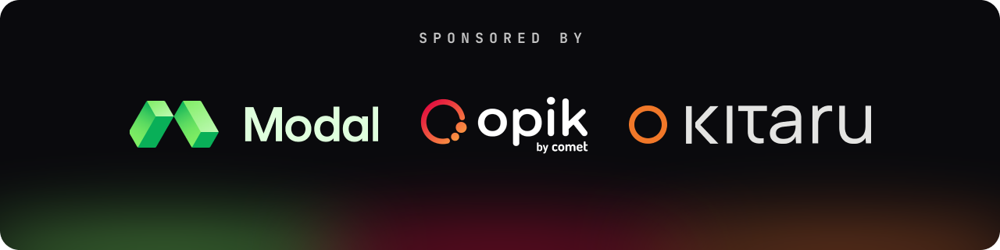
</p>

<p align="center">
  Special thanks to <a href="https://modal.com?source=decodingai&campaign=harnesseng" target="_blank"><b>Modal</b></a>, <a href="https://www.comet.com/site/?utm_source=workshop&utm_medium=partner&utm_campaign=paul&utm_content=coding_agent_course" target="_blank"><b>Opik</b></a> (by Comet), and <a href="https://www.zenml.io/product/kitaru?utm_source=decodingai&utm_medium=referral&utm_campaign=coding-agent-course&utm_content=brand" target="_blank"><b>Kitaru</b></a> (by ZenML) for sponsoring this open-source course and keeping it free!
</p>

<p align="center">
  Opik and Kitaru are open source. Consider starring their repositories: <a href="https://github.com/comet-ml/opik" target="_blank">Opik on GitHub</a> · <a href="https://github.com/zenml-io/kitaru" target="_blank">Kitaru on GitHub</a>.
</p>

## 🗣️ Questions and Troubleshooting

Open a [GitHub issue](https://github.com/decodingai-magazine/building-a-coding-agent-from-scratch-course/issues) for course questions, setup trouble, or concept clarifications. Known gotchas are documented in the [`running_the_code/`](running_the_code/) guides.

## ❓ FAQ

**Do I need a paid API key?**
No. The default Gemini provider has a free tier, OpenRouter routes across `:free` models, and [Modal](https://modal.com?source=decodingai&campaign=harnesseng) gives $30 in credits — see [Cost Structure](#-cost-structure).

**Why Python and not TypeScript or Go?**
Accessibility: our audience knows Python. The course focuses on the design decisions, which transfer to any language.

**Why build from scratch instead of extending Pi, DeepAgents, or an existing harness?**
Because adding custom logic to an existing harness is the easy part — _knowing what to add_ requires understanding the internals. That's the fundamentals, and it's what still makes AI engineers valuable. Build a coding agent once and you're equipped to build a custom agent for any use case.

## 🥂 Contributing

Found a bug and know the fix? Fork, fix, run `make ci` (no API key needed), and open a pull request. Future readers will thank you 🤗

## 👨‍🏫 Course Author

<table style="border-collapse: collapse; border: none;">
  <tr style="border: none;">
    <td width="15%" align="center" style="border: none;">
      <a href="https://www.pauliusztin.ai/" target="_blank">
        
      </a>
      <br/>
      <b>Paul Iusztin</b>
    </td>
    <td width="85%" style="border: none;">
      Senior AI Engineer, Educator & Founder of Decoding AI. Author of the best-selling <a href="https://www.amazon.com/LLM-Engineers-Handbook-engineering-production/dp/1836200072">LLM Engineer's Handbook</a>.
    </td>
  </tr>
</table>

## 📬 Learn How to Build Coding Agents From Scratch

> Join 40k+ engineers subscribed to [the Decoding AI Magazine](https://www.decodingai.com/) to learn to build coding agents from scratch.

<a href="https://www.decodingai.com/" target="_blank">
  
</a>

## ⭐ One More Thing

If you found this course useful, consider starring the repository so others can find it too.

## License

Released under [Apache-2.0](LICENSE) — clone, fork, and build on it; keep the LICENSE and credit this repo.
