<div align="center">
  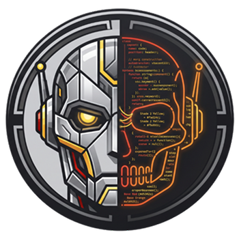
  <h1>Building a Coding Agent From Scratch</h1>
  <h3>Learn harness engineering by building Claude Code from scratch, from a bare-bones agent loop to a swarm of cloud agents.</h3>
  <p class="tagline">Open-source harness engineering course<br/>by <a href="https://www.decodingai.com">Decoding AI</a> in collaboration with <a href="https://modal.com?source=decodingai&campaign=harnesseng">Modal</a>, <a href="https://www.comet.com/site/?utm_source=workshop&utm_medium=partner&utm_campaign=paul&utm_content=coding_agent_course">Opik (by Comet)</a> and <a href="https://www.zenml.io/product/kitaru?utm_source=decodingai&utm_medium=referral&utm_campaign=coding-agent-course&utm_content=brand">Kitaru (by ZenML)</a>.</p>
</div>

<p align="center">
  
  
  
  
  
  
</p>

<p align="center">
  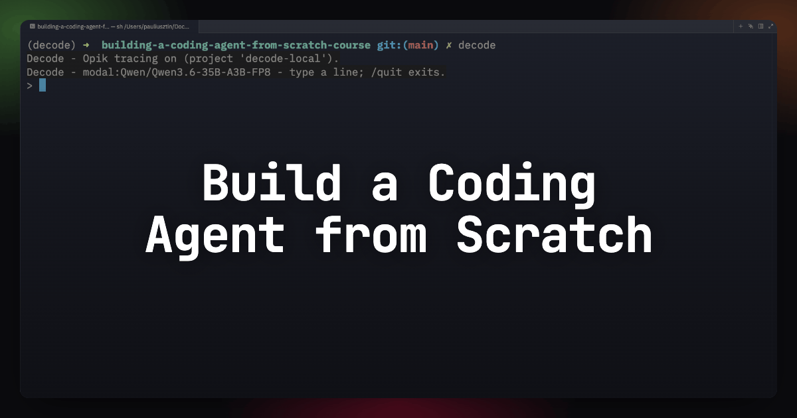
</p>

<p align="center">
  <a href="https://www.decodingai.com/p/building-a-coding-agent-from-scratch-system-design" target="_blank"><b>📖 Read Lesson 1 (17 min)</b></a>
  &nbsp;·&nbsp;
  <a href="https://www.youtube.com/watch?v=sJpop1juVBQ" target="_blank"><b>🎬 Watch Lesson 1</b></a>
  &nbsp;·&nbsp;
  <a href="#-course-outline"><b>📚 See all 8 lessons</b></a>
</p>

> **Try the finished agent first — 5 minutes, $0:**
>
> ```bash
> git clone https://github.com/decodingai-magazine/building-a-coding-agent-from-scratch-course.git
> cd building-a-coding-agent-from-scratch-course
> make install
> cp .env.example .env   # set LLM API key
> uv run decode
> ```
>
> Then type `/demo-` and pick a demo. See [what they do](#-see-it-work) below. [Full setup guide.](#-running-the-code)

<p align="center">
  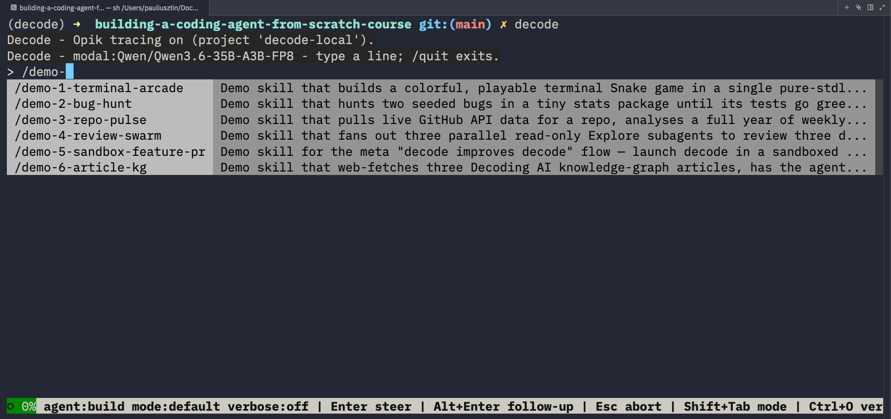
</p>
<p align="center"><i>Type <code>/demo-</code> and the six demos are one keystroke away.</i></p>

## 📖 About This Course

In [LangChain's Terminal-Bench experiment](https://www.langchain.com/blog/the-anatomy-of-an-agent-harness), changing only the harness (with the same model) moved a coding agent from ~30th place into the top 5: the harness, not the model, is what makes a coding agent good.

### The agent is ~20 lines. The course is everything else, known as the harness.

```python
agent = Agent(
    build_model(settings.llm_provider),        # gemini | openrouter | modal
    deps_type=AgentDeps,                       # cwd, event sink, permission gate
    output_type=[str, DeferredToolRequests],   # final answer, or tools paused for approval
)
register_tools(agent)                          # read, edit, bash, grep, ...

async with agent.iter(prompt, message_history=history) as run:
    async for node in run:                     # model request → tool calls → repeat
        stream_events(node)
```

That's the _entire_ tool-calling agent. Everything else in this repo (the tools, skills, permission layer, sandbox, steering queue, memory, compaction, session recording & replay, remote execution, subagent fan-out, and evals) **is the harness**. That's what you're here to build.

<p align="center">
  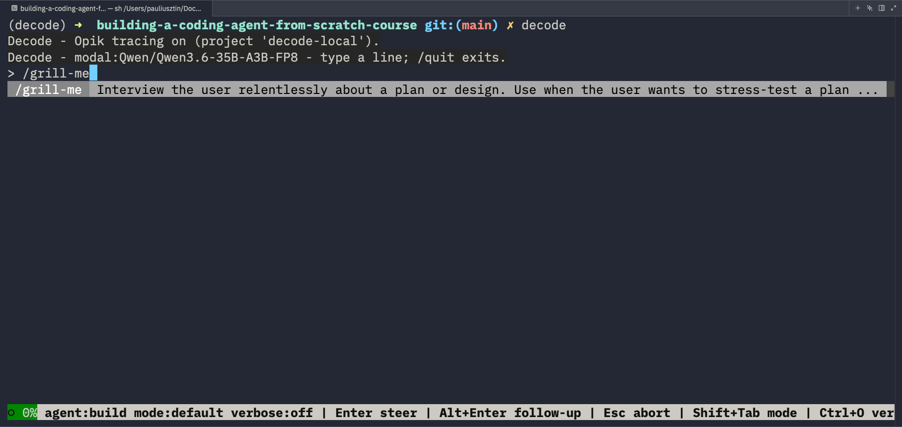
  <br/>
  <i>A fresh session powered by Qwen 3.6 35B hosted on Modal</i>
</p>

We spent months under the hood of Claude Code (via its leaked source), [OpenCode](https://github.com/anomalyco/opencode), [Pi](https://github.com/earendil-works/pi), and [Aider](https://github.com/aider-ai/aider), then distilled what we learned into 8 articles and 6 videos where you'll build **decode**, your own coding agent, from scratch. One headless core hooked to two modes: an interactive TUI and Modal serverless functions running N copies in parallel, fired by CLI, webhook, or cron.

> [!WARNING]
> Building a coding harness from scratch can make you dangerously good at building any other AI product, whether in finance, medicine, or e-commerce.

<p align="center">
  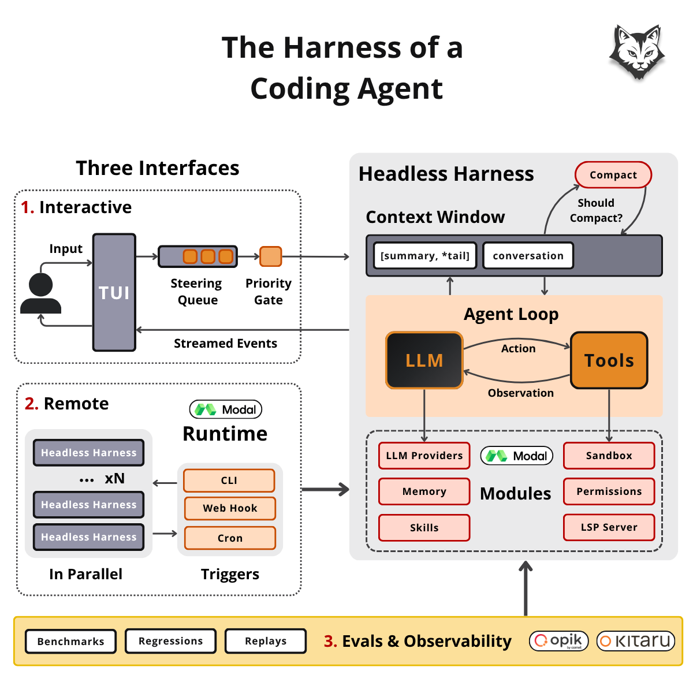
</p>
<p align="center"><i>The harness architecture of the coding agent you will build during this course.</i></p>

<h3 align="center">
  <a href="#-course-outline">📚 Explore the 8 lessons: articles + videos</a>
</h3>

## 🎮 See It Work

The finished agent ships with demo skills under [`.decode/skills/`](.decode/skills/). Open the TUI, type `/demo-`, pick one, and watch the harness you're about to build do real work:

<p align="center">
  
  <br/>
  <b>Implement the Skills Standard</b>
  <br/>
  <i>Type <code>/demo-</code> and the six demos are one keystroke away.</i>
</p>

<table>
  <tr>
    <td width="50%">
      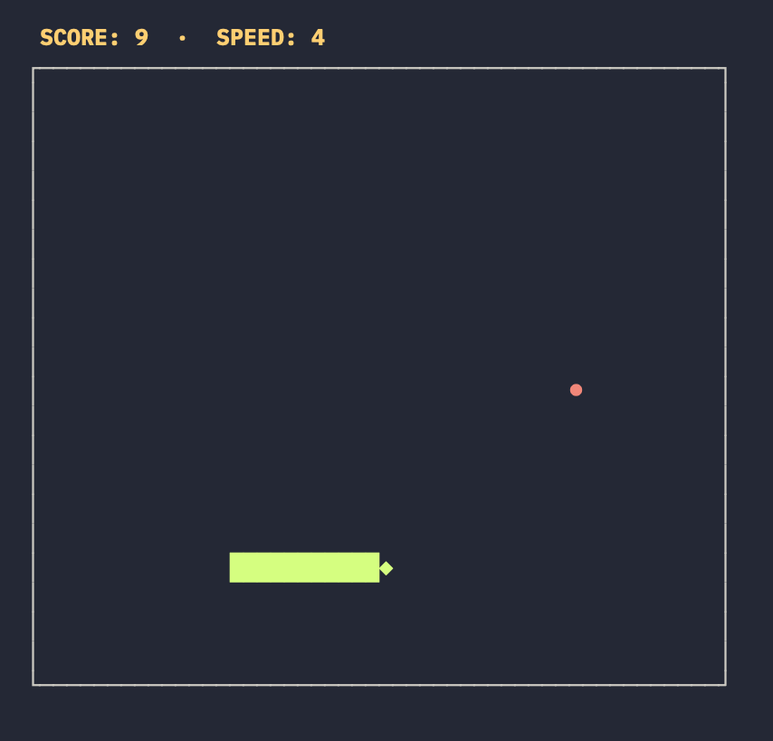
      <p align="center"><b>Capable of Creating Games</b><br/><i><code>/demo-1-terminal-arcade</code> — one prompt, a playable Snake game</i></p>
    </td>
    <td width="50%">
      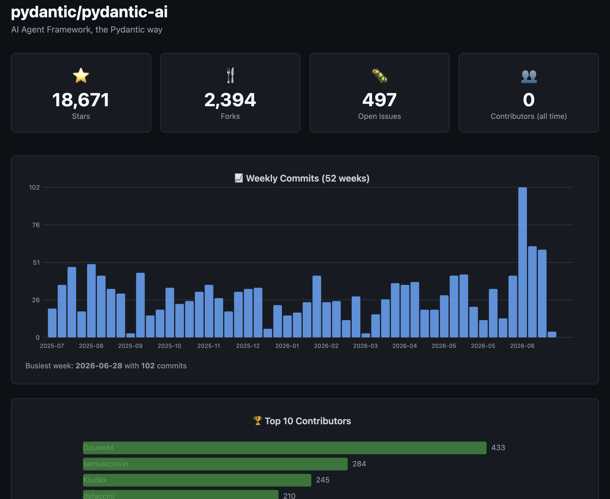
      <p align="center"><b>Fetching Data & Creating Dashboards</b><br/><i><code>/demo-3-repo-pulse</code> — live GitHub API data rendered as a dashboard</i></p>
    </td>
  </tr>
  <tr>
    <td colspan="2" align="center">
      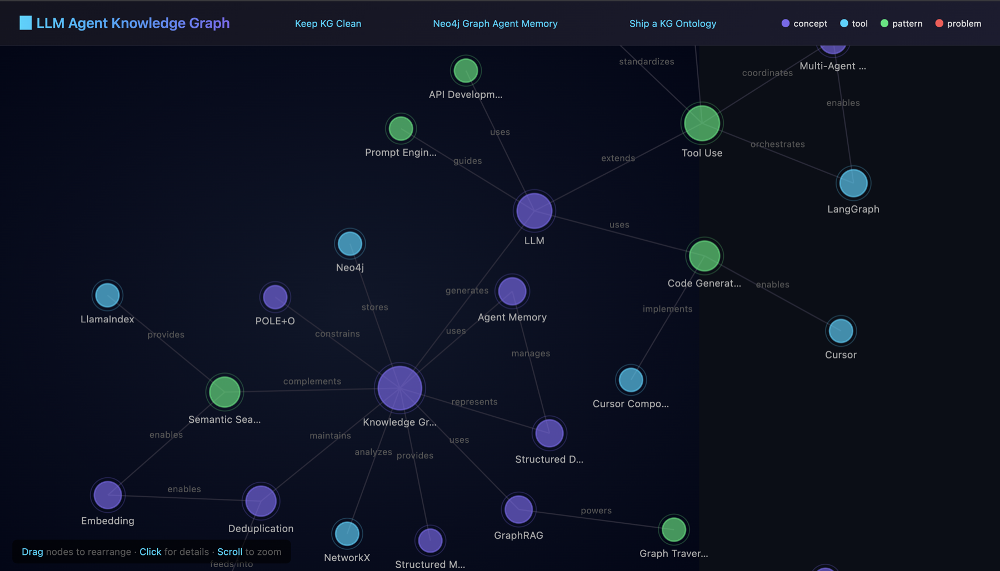
      <p align="center"><b>Extracting Ontologies & Rendering Graphs</b><br/><i><code>/demo-6-article-kg</code> — web articles scraped into an interactive knowledge graph</i></p>
    </td>
  </tr>
</table>

<p align="center">
  And the infra that powers the agents.
</p>

<table>
  <tr>
    <td width="50%">
      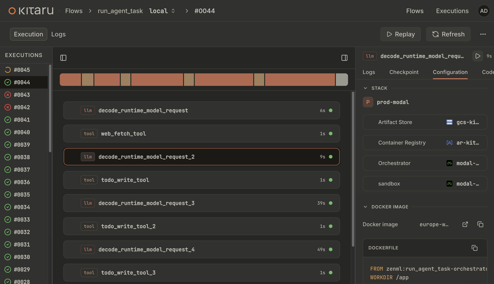
      <p align="center"><b>Record & Replay for AI Agents</b><br/><i>Every run recorded step by step in <a href="https://www.zenml.io/product/kitaru?utm_source=decodingai&utm_medium=referral&utm_campaign=coding-agent-course&utm_content=brand">Kitaru</a> — replay it on a Kitaru Worker with the model swapped, then compare the two runs</i></p>
    </td>
    <td width="50%">
      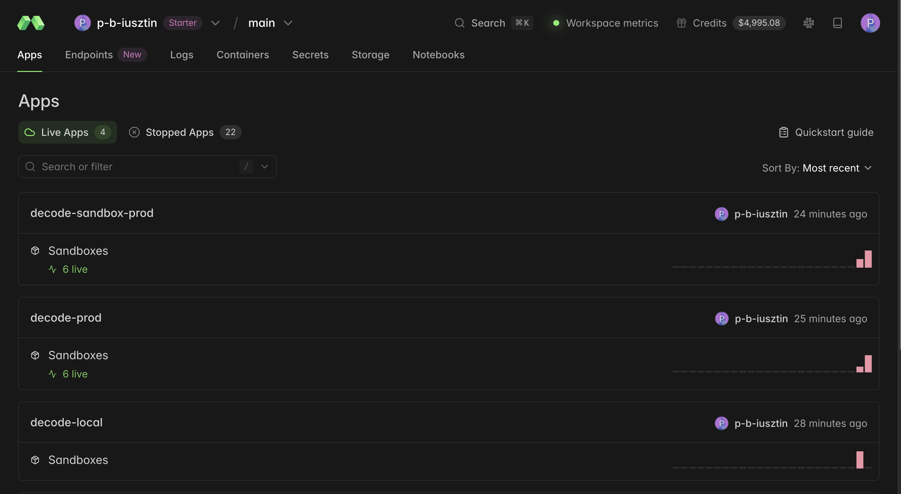
      <p align="center"><b>Remote Sandboxing</b><br/><i>The agent's <code>bash</code> runs in disposable <a href="https://modal.com/docs/guide/sandboxes?source=decodingai&campaign=harnesseng">Modal sandboxes</a></i></p>
    </td>
  </tr>
  <tr>
    <td width="50%">
      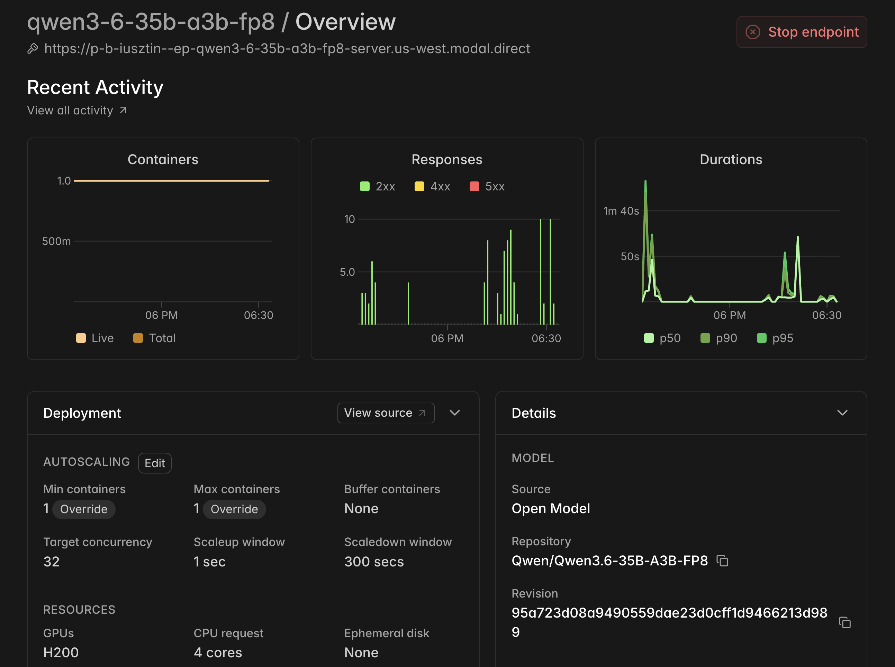
      <p align="center"><b>Powered by Open-Source Models</b><br/><i>Your own Qwen3.6-35B served on an H200 via a <a href="https://modal.com/docs/guide/endpoints?source=decodingai&campaign=harnesseng">Modal endpoint</a></i></p>
    </td>
    <td width="50%">
      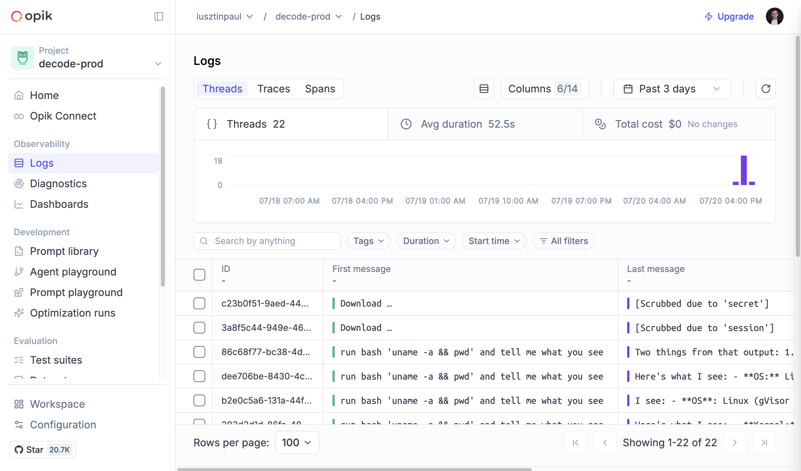
      <p align="center"><b>Adding AI Evals & Observability</b><br/><i>Every session traced in <a href="https://www.comet.com/site/?utm_source=workshop&utm_medium=partner&utm_campaign=paul&utm_content=coding_agent_course">Opik</a></i></p>
    </td>
  </tr>
</table>

## 🤖 You'll Walk Away Knowing How To

- Design a coding agent harness from scratch ([article 1](https://www.decodingai.com/p/building-a-coding-agent-from-scratch-system-design) · [video 1](https://www.youtube.com/watch?v=sJpop1juVBQ))
- Implement the coding agent loop as a headless harness ([article 2](https://www.decodingai.com/p/the-coding-agent-loop) · [video 1](https://www.youtube.com/watch?v=sJpop1juVBQ))
- Attach the headless harness to multiple interfaces: a terminal UI, a CLI, or even a remote runtime ([article 6](https://www.decodingai.com/p/coding-agents-in-remote-headless) · _video 5 soon_)
- Execute the agent's tools within local Docker or remote Modal sandboxes ([article 3](https://www.decodingai.com/p/run-coding-agents-safely) · [video 2](https://www.youtube.com/watch?v=7CHMb8jWs6A))
- Host open-source models as SGLang servers on Modal ([article 2](https://www.decodingai.com/p/the-coding-agent-loop) · [video 1](https://www.youtube.com/watch?v=sJpop1juVBQ))
- Implement guardrails by adding a permission layer ([article 1](https://www.decodingai.com/p/building-a-coding-agent-from-scratch-system-design) · [video 1](https://www.youtube.com/watch?v=sJpop1juVBQ))
- Build essential context engineering techniques: memory, compaction, skills ([article 4](https://www.decodingai.com/p/context-engineering-for-coding-agents) · [video 3](https://www.youtube.com/watch?v=dx77BRFZ0_M))
- Hook up an LSP server for faster feedback loops ([article 4](https://www.decodingai.com/p/context-engineering-for-coding-agents) · [video 3](https://www.youtube.com/watch?v=dx77BRFZ0_M))
- Implement a configurable agents catalog: build, plan, code reviewer and exploration agents ([article 5](https://www.decodingai.com/p/subagents-are-context-engineering) · _video 4 soon_)
- Deploy the headless harness on Modal, triggering remote agents via the CLI, a webhook, or a cron job ([article 6](https://www.decodingai.com/p/coding-agents-in-remote-headless) · _video 5 soon_)
- Spawn parallel subagents via fan-out strategies ([article 5](https://www.decodingai.com/p/subagents-are-context-engineering) · _video 4 soon_)
- Add observability ([article 2](https://www.decodingai.com/p/the-coding-agent-loop) · [video 1](https://www.youtube.com/watch?v=sJpop1juVBQ))
- Design an eval harness for benchmarking the agent and checking for regressions ([article 7](https://www.decodingai.com/p/evaluate-ai-agents-benchmarks-regression-tests) · _video 5 soon_)
- Organically grow your regression suite from failed agent traces ([article 8](https://www.decodingai.com/p/transform-agent-traces-into-regression-cases) · _video 6 soon_)
- Reproduce agent failures and check for regressions when changing your prompts or models by replaying traces with Kitaru ([article 8](https://www.decodingai.com/p/transform-agent-traces-into-regression-cases) · _video 6 soon_)

<p align="center">
  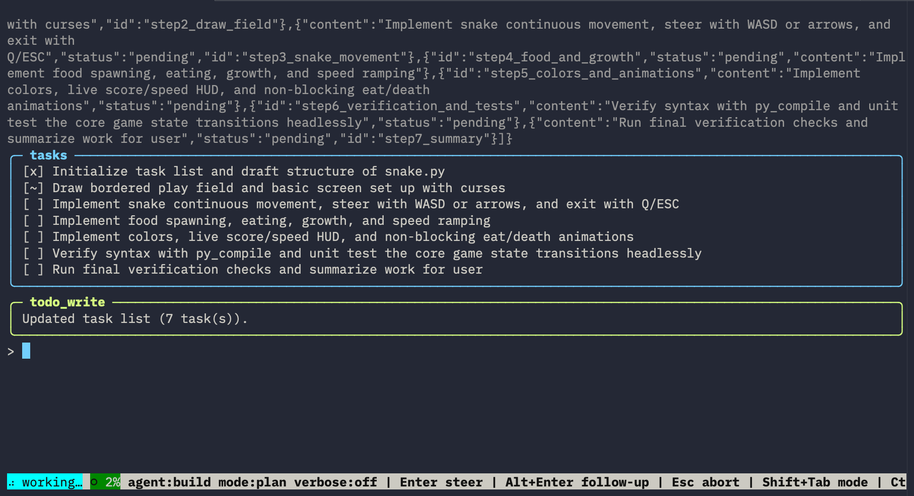
</p>
<p align="center"><i>Plan mode, live: the agent breaks the Snake demo into a task list with the <code>todo</code> tool — <code>[x]</code> done, <code>[~]</code> in progress.</i></p>

### Tech Stack

The code is written in Python, with the following frameworks and libraries:

- **Agent Framework:** [Pydantic AI](https://ai.pydantic.dev)
- **LLM Providers:** [Modal](https://modal.com/docs/guide/endpoints?source=decodingai&campaign=harnesseng) (open weights you serve yourself via SGLang), OpenRouter (open weights as a service), or Gemini (proprietary).
- **Session Recording & Replays:** [Kitaru](https://www.zenml.io/product/kitaru?utm_source=decodingai&utm_medium=referral&utm_campaign=coding-agent-course&utm_content=brand)
- **Observability & Evals:** [Opik](https://www.comet.com/site/?utm_source=workshop&utm_medium=partner&utm_campaign=paul&utm_content=coding_agent_course)
- **Sandboxing:** local Docker & remote [Modal sandboxes](https://modal.com/docs/guide/sandboxes?source=decodingai&campaign=harnesseng)
- **Deploying:** [Modal](https://modal.com/?source=decodingai&campaign=harnesseng) as headless agents (fired by hand, by cron, or by webhook)

Otherwise, we build all the functionality from scratch, to teach you the foundations that last, not frameworks that abstract away the hard parts.

## 💡 The code tells you _what_. The lessons tell you _why_.

For the full experience, go through the articles and videos that cover what the code can't. **The why behind every decision.**

- What the essential components of a coding agent are, and what is optional. ([article 1](https://www.decodingai.com/p/building-a-coding-agent-from-scratch-system-design) · [video 1](https://www.youtube.com/watch?v=sJpop1juVBQ))
- Why we have a headless harness and two interface modes: TUI + Remote. ([article 1](https://www.decodingai.com/p/building-a-coding-agent-from-scratch-system-design) · [video 1](https://www.youtube.com/watch?v=sJpop1juVBQ))
- Why we plugged in 9 tools, no more, no less. ([article 2](https://www.decodingai.com/p/the-coding-agent-loop) · [video 1](https://www.youtube.com/watch?v=sJpop1juVBQ))
- What guardrails are actually useful. ([article 3](https://www.decodingai.com/p/run-coding-agents-safely) · [video 2](https://www.youtube.com/watch?v=7CHMb8jWs6A))
- Why compaction fires at ~80% of the window instead of at the limit. ([article 4](https://www.decodingai.com/p/context-engineering-for-coding-agents) · [video 3](https://www.youtube.com/watch?v=dx77BRFZ0_M))
- Why subagents are context engineering: scoped windows instead of one bloated context. ([article 5](https://www.decodingai.com/p/subagents-are-context-engineering) · _video 4 soon_)
- Why your agents should keep working after you close your laptop lid. ([article 6](https://www.decodingai.com/p/coding-agents-in-remote-headless) · _video 5 soon_)
- Why you need both benchmarks and regression tests. ([article 7](https://www.decodingai.com/p/evaluate-ai-agents-benchmarks-regression-tests) · _video 5 soon_)
- Why we record every run, and what a replay buys you that a re-run doesn't. ([article 8](https://www.decodingai.com/p/transform-agent-traces-into-regression-cases) · _video 6 soon_)

## 📚 Course Outline

<table>
  <tr>
    <th align="center">Lesson</th>
    <th align="center">Written Lesson</th>
    <th align="center">Video Lesson</th>
    <th align="center">Running the code</th>
  </tr>
  <tr>
    <td align="center"><b>1</b><br/>Building a Coding Agent From Scratch<br/><br/><i>Sketch the full harness: a headless core, six modules, TUI and remote modes, and an evals layer.</i><br/><sub>⏱ 17-min read</sub></td>
    <td align="center"><a href="https://www.decodingai.com/p/building-a-coding-agent-from-scratch-system-design" target="_blank"></a><br/><i><a href="https://www.decodingai.com/p/building-a-coding-agent-from-scratch-system-design" target="_blank">Article 1</a></i></td>
    <td align="center" rowspan="2"><a href="https://www.youtube.com/watch?v=sJpop1juVBQ" target="_blank">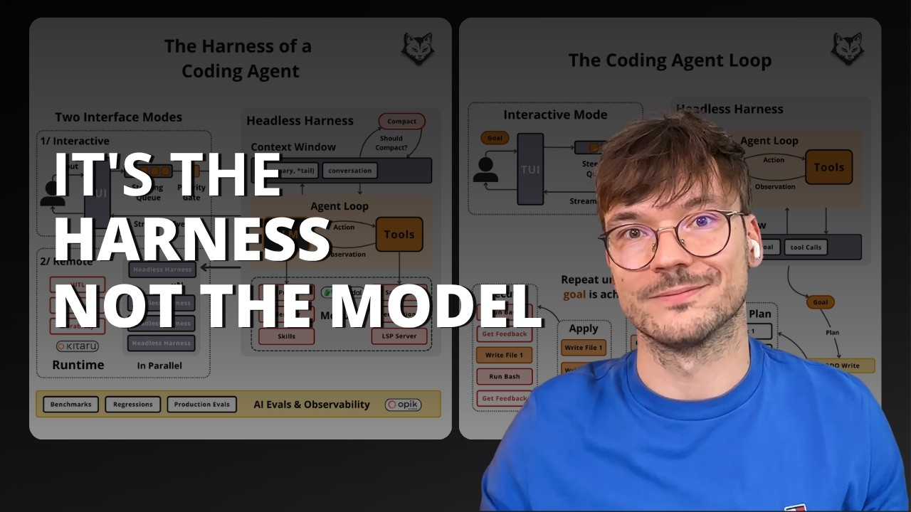</a><br/><i><a href="https://www.youtube.com/watch?v=sJpop1juVBQ" target="_blank">Video 1</a></i></td>
    <td align="center"><a href="running_the_code/01_install_and_usage.md">01_install_and_usage.md</a> · <a href="running_the_code/02_modal_endpoints.md">02_modal_endpoints.md</a></td>
  </tr>
  <tr>
    <td align="center"><b>2</b><br/>The Bare-Bones Coding Agent Loop<br/><br/><i>Your agent loops over 9 tools and 3 swappable LLM providers in a steerable TUI.</i><br/><sub>⏱ 25-min read</sub></td>
    <td align="center"><a href="https://www.decodingai.com/p/the-coding-agent-loop" target="_blank">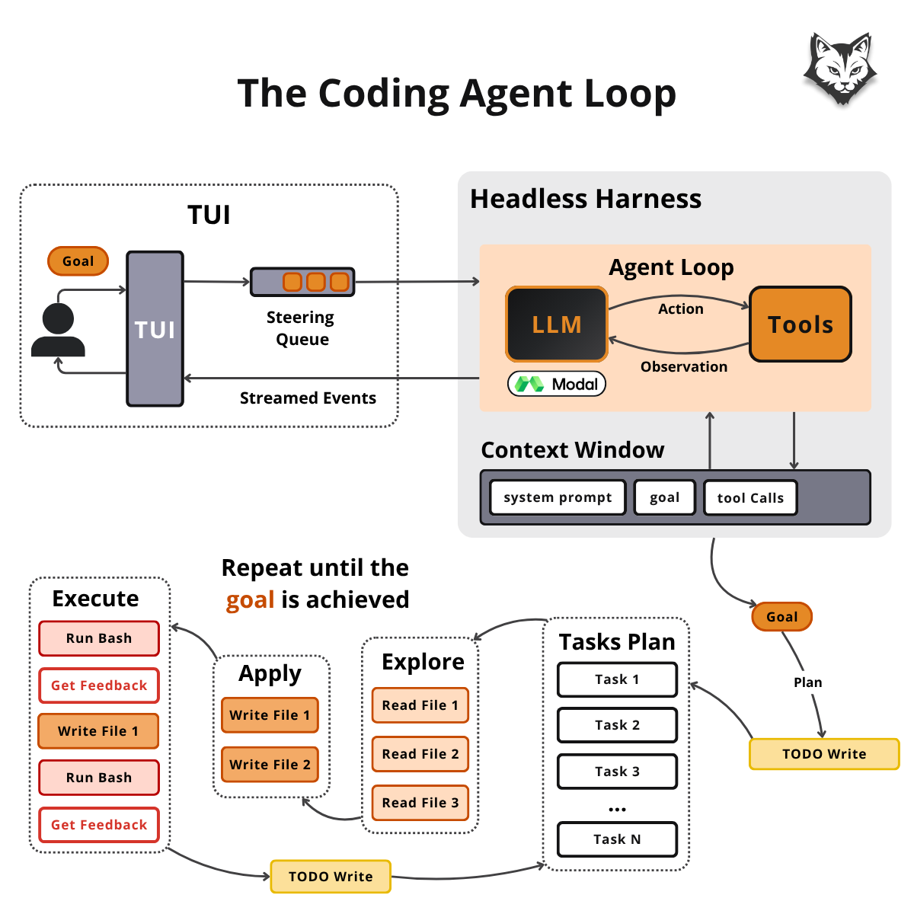</a><br/><i><a href="https://www.decodingai.com/p/the-coding-agent-loop" target="_blank">Article 2</a></i></td>
    <td align="center"><a href="running_the_code/01_install_and_usage.md">01_install_and_usage.md</a> · <a href="running_the_code/02_modal_endpoints.md">02_modal_endpoints.md</a></td>
  </tr>
  <tr>
    <td align="center"><b>3</b><br/>From a Raw Shell to a Sandboxed Coding Agent<br/><br/><i>Your agent's tools run in a Docker or Modal sandbox, never on your host.</i><br/><sub>⏱ 13-min read</sub></td>
    <td align="center"><a href="https://www.decodingai.com/p/run-coding-agents-safely" target="_blank">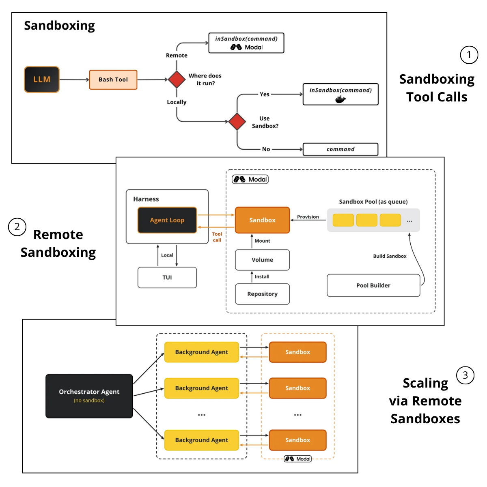</a><br/><i><a href="https://www.decodingai.com/p/run-coding-agents-safely" target="_blank">Article 3</a></i></td>
    <td align="center"><a href="https://www.youtube.com/watch?v=7CHMb8jWs6A" target="_blank">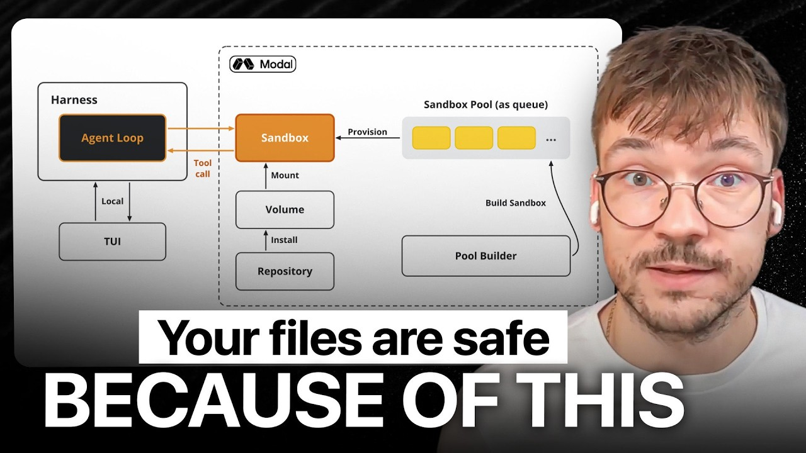</a><br/><i><a href="https://www.youtube.com/watch?v=7CHMb8jWs6A" target="_blank">Video 2</a></i></td>
    <td align="center"><a href="running_the_code/01_install_and_usage.md">01_install_and_usage.md</a> · <a href="running_the_code/02_modal_endpoints.md">02_modal_endpoints.md</a> · <a href="running_the_code/03_sandboxing.md">03_sandboxing.md</a></td>
  </tr>
  <tr>
    <td align="center"><b>4</b><br/>Context Engineering for Coding Agents<br/><br/><i>Your agent loads memory, invokes skills, reads LSP diagnostics, and auto-compacts at 80%.</i><br/><sub>⏱ 15-min read</sub></td>
    <td align="center"><a href="https://www.decodingai.com/p/context-engineering-for-coding-agents" target="_blank">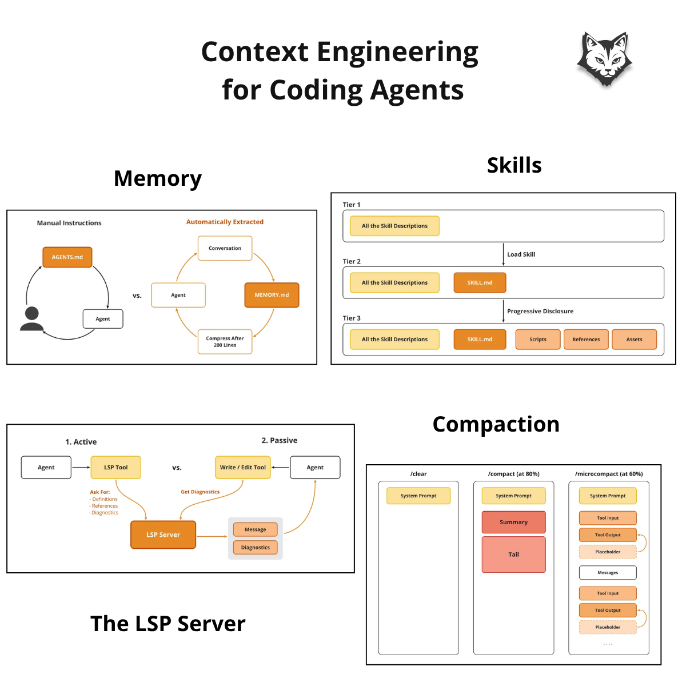</a><br/><i><a href="https://www.decodingai.com/p/context-engineering-for-coding-agents" target="_blank">Article 4</a></i></td>
    <td align="center"><a href="https://www.youtube.com/watch?v=dx77BRFZ0_M" target="_blank">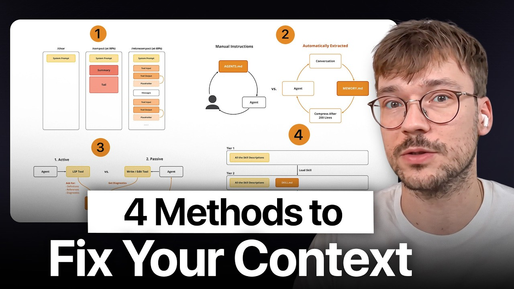</a><br/><i><a href="https://www.youtube.com/watch?v=dx77BRFZ0_M" target="_blank">Video 3</a></i></td>
    <td align="center"><a href="running_the_code/01_install_and_usage.md">01_install_and_usage.md</a> · <a href="running_the_code/02_modal_endpoints.md">02_modal_endpoints.md</a></td>
  </tr>
  <tr>
    <td align="center"><b>5</b><br/>Subagents Are Context Engineering<br/><br/><i>Your agent fans out parallel Explore subagents and switches between build, plan, and code-reviewer personas.</i><br/><sub>⏱ 14-min read</sub></td>
    <td align="center"><a href="https://www.decodingai.com/p/subagents-are-context-engineering" target="_blank">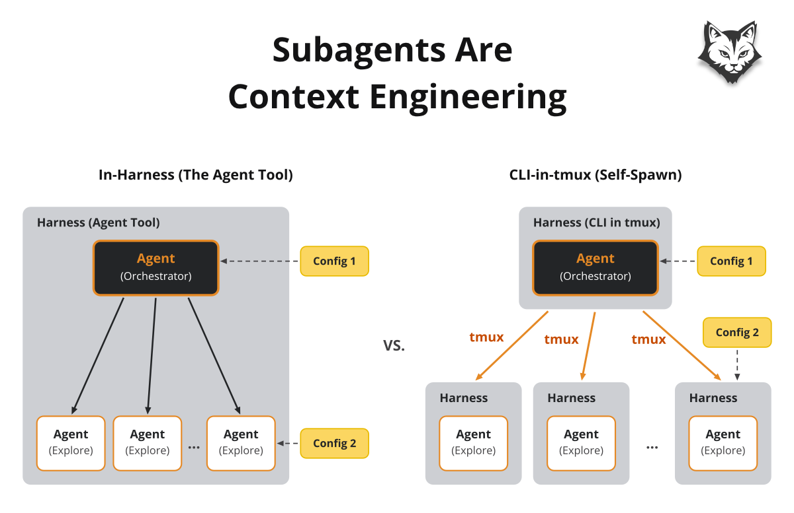</a><br/><i><a href="https://www.decodingai.com/p/subagents-are-context-engineering" target="_blank">Article 5</a></i></td>
    <td align="center">🎬 <i>Video 4 — coming soon</i></td>
    <td align="center"><a href="running_the_code/01_install_and_usage.md">01_install_and_usage.md</a> · <a href="running_the_code/02_modal_endpoints.md">02_modal_endpoints.md</a></td>
  </tr>
  <tr>
    <td align="center"><b>6</b><br/>Deploy a Headless Coding Agent Harness to Modal<br/><br/><i>Your agent runs headless on Modal, fired by the CLI, a webhook, or a cron job, and ships branches.</i><br/><sub>⏱ 15-min read</sub></td>
    <td align="center"><a href="https://www.decodingai.com/p/coding-agents-in-remote-headless" target="_blank">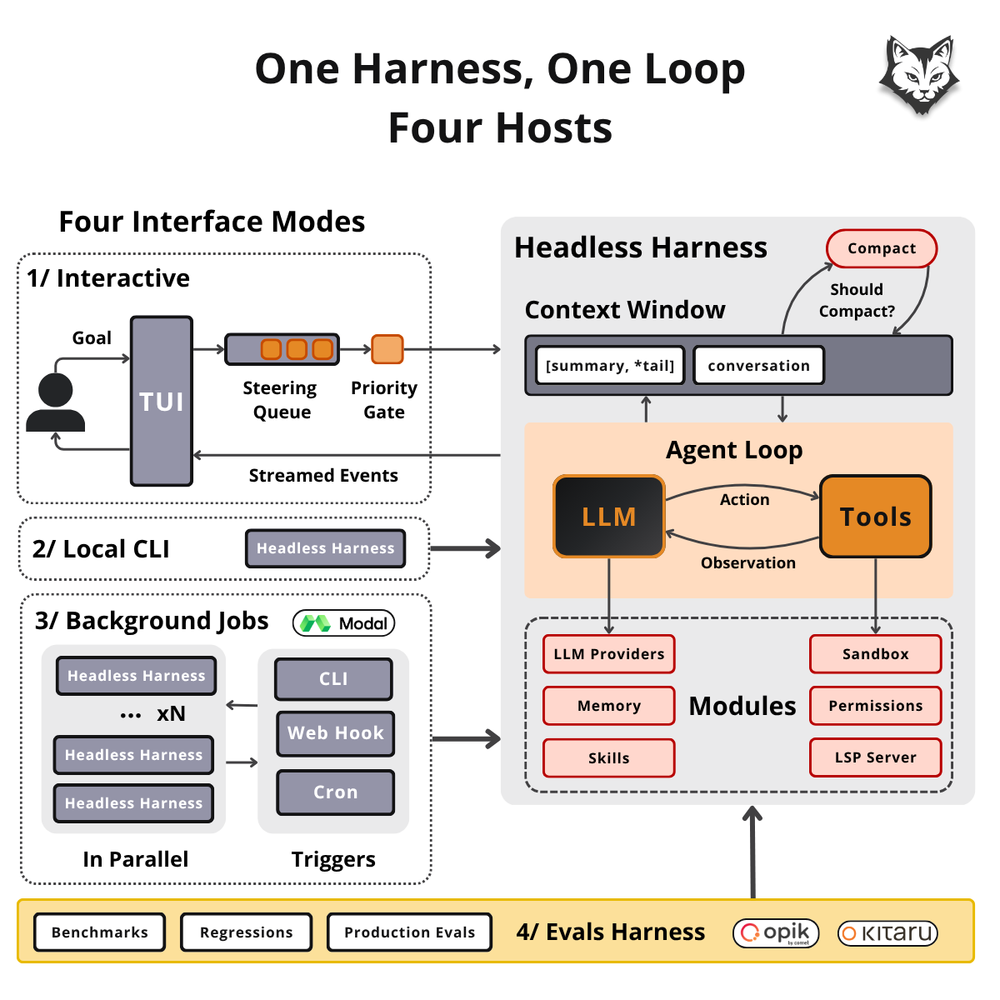</a><br/><i><a href="https://www.decodingai.com/p/coding-agents-in-remote-headless" target="_blank">Article 6</a></i></td>
    <td align="center" rowspan="2">🎬 <i>Video 5 — coming soon</i></td>
    <td align="center"><a href="running_the_code/01_install_and_usage.md">01_install_and_usage.md</a> · <a href="running_the_code/02_modal_endpoints.md">02_modal_endpoints.md</a> · <a href="running_the_code/03_sandboxing.md">03_sandboxing.md</a> · <a href="running_the_code/04_deploy.md">04_deploy.md</a></td>
  </tr>
  <tr>
    <td align="center"><b>7</b><br/>AI Evals Foundations: Benchmarks, Regression and Online<br/><br/><i>Score your agent on a 19-task benchmark and a regression suite in Opik.</i><br/><sub>⏱ 19-min read</sub></td>
    <td align="center"><a href="https://www.decodingai.com/p/evaluate-ai-agents-benchmarks-regression-tests" target="_blank">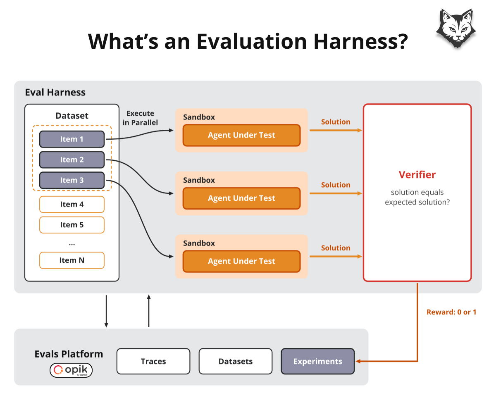</a><br/><i><a href="https://www.decodingai.com/p/evaluate-ai-agents-benchmarks-regression-tests" target="_blank">Article 7</a></i></td>
    <td align="center"><a href="running_the_code/01_install_and_usage.md">01_install_and_usage.md</a> · <a href="running_the_code/02_modal_endpoints.md">02_modal_endpoints.md</a> · <a href="running_the_code/05_evals.md">05_evals.md</a></td>
  </tr>
  <tr>
    <td align="center"><b>8</b><br/>AI Evals on Steroids via Replays<br/><br/><i>Record runs in Kitaru, cluster failures into cohorts, and replay them to verify fixes.</i><br/><sub>⏱ 16-min read</sub></td>
    <td align="center"><a href="https://www.decodingai.com/p/transform-agent-traces-into-regression-cases" target="_blank">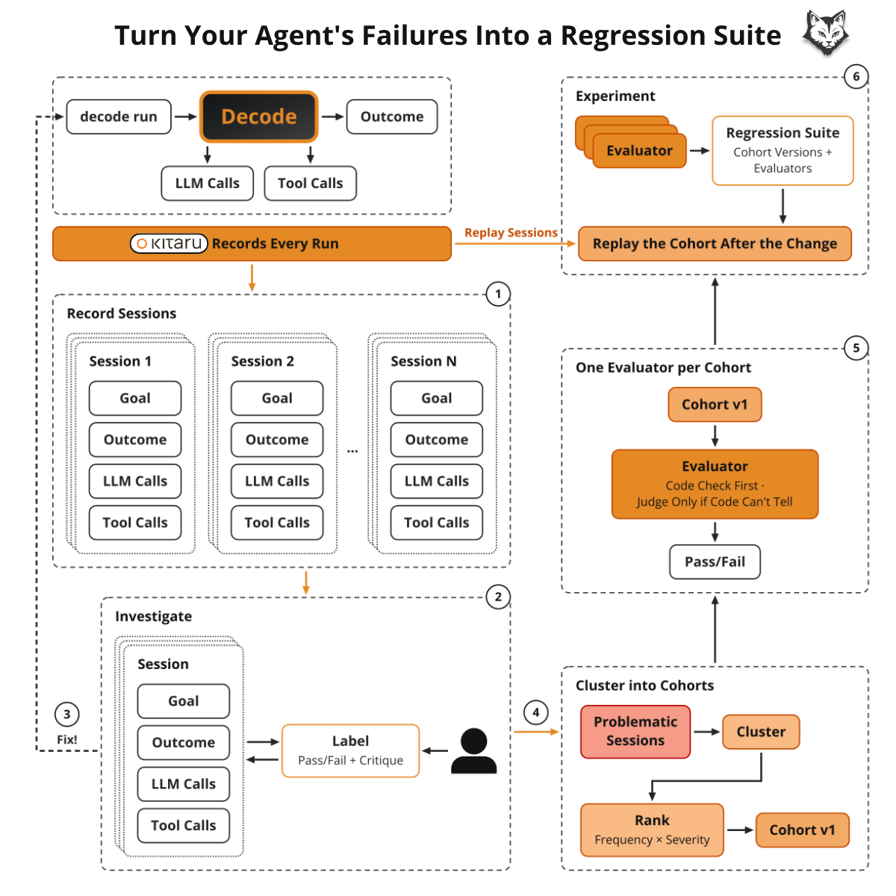</a><br/><i><a href="https://www.decodingai.com/p/transform-agent-traces-into-regression-cases" target="_blank">Article 8</a></i></td>
    <td align="center">🎬 <i>Video 6 — coming soon</i></td>
    <td align="center"><a href="running_the_code/01_install_and_usage.md">01_install_and_usage.md</a> · <a href="running_the_code/02_modal_endpoints.md">02_modal_endpoints.md</a> · <a href="running_the_code/06_evals_replays.md">06_evals_replays.md</a></td>
  </tr>
</table>

<p align="center">
  <a href="https://www.decodingai.com/t/building-a-coding-agent-from-scratch" target="_blank"><b>📖 Read all the articles on Substack</b></a>
  &nbsp;·&nbsp;
  <a href="https://www.youtube.com/playlist?list=PLanusVPiXCT0" target="_blank"><b>🎬 Watch all the videos on YouTube</b></a>
</p>

## 📬 Learn Harness Engineering

> Join 45k+ engineers subscribed to [the Decoding AI Magazine](https://www.decodingai.com/) to learn to build coding agents from scratch.

<a href="https://www.decodingai.com/" target="_blank">
  
</a>

## 👥 Who Should Join?

**Engineers who learn by building.** You finish with a working coding agent that teaches you harness engineering patterns to steal for your own agentic applications.

Best for **ML/AI engineers** who want to level up their craft and for **software engineers and data scientists** who want to transition into building agentic systems from scratch.

## 🎓 Prerequisites

| Category     | Requirements                                                                          |
| ------------ | ------------------------------------------------------------------------------------- |
| **Skills**   | - Python (Intermediate) <br/> - LLMs & agents (Beginner)                              |
| **Hardware** | Any modern machine will do. No GPU required, as we run all the LLMs in the cloud.     |
| **Level**    | Intermediate (but with a little sweat and patience, anyone can do it)                 |
| **Time**     | ~4–8 hours for the whole course — 4 if you read and watch, 6–8 if you run everything. |

## 💰 Cost Structure

Running the code costs **$0** if you stick to free tiers:

| Service                                                                                                                                                          | Cost                                                               |
| ---------------------------------------------------------------------------------------------------------------------------------------------------------------- | ------------------------------------------------------------------ |
| Gemini API (default provider — easy setup, but limited API requests)                                                                                             | free tier ([Google AI Studio](https://aistudio.google.com/apikey)) |
| [Modal](https://modal.com?source=decodingai&campaign=harnesseng) (recommended provider, remote sandbox, remote agents)                                           | $30 free credits — enough to run the course                        |
| OpenRouter (alternative provider)                                                                                                                                | $0 on `:free` models (optional $10 credit raises the daily cap)    |
| [Opik](https://www.comet.com/site/?utm_source=workshop&utm_medium=partner&utm_campaign=paul&utm_content=coding_agent_course) (tracing + evals)                   | free tier                                                          |
| [Kitaru](https://www.zenml.io/product/kitaru?utm_source=decodingai&utm_medium=referral&utm_campaign=coding-agent-course&utm_content=brand) (recording + replays) | free — the OSS server runs on your laptop (`make kitaru-local`)    |

_**Reading-only? Everything's free!**_

## ⚙️ How It Works

As an open-source course, it is entirely self-paced and based on this repository, plus the attached lessons that walk you through the code. No paywall. No platform.

Read the lessons on the [Decoding AI Magazine](https://www.decodingai.com), watch the videos from the [Decoding AI Channel](https://www.youtube.com/@itsdecodingai), run the code on your own machine, break it, fix it, and learn from the process.

## 🏗️ Project Structure

One Python package; each module maps to one part of the architecture:

```
.
├── docs/
│   ├── adr/                  # Architecture Decision Records — the "why" of every choice
│   └── glossary.md           # one canonical name per concept
├── evals/                    # benchmark tasks + regression cases + the Opik harness
├── scripts/                  # operator scripts: Kitaru bootstrap + eval table generation
├── tests/{unit,integration}/ # mirrors src/ 1:1; milestone capstones prove each milestone
└── src/decode/
    ├── cli.py                # Click entrypoint → launches the TUI
    ├── tui/                  # input: prompt_toolkit · output: Rich
    ├── harness/              # message queue + priority gate around the loop
    ├── agent/                # the Pydantic-AI ReAct loop (LLM ⇄ tools)
    ├── agents/               # agents catalog: Build / Plan / Code-Reviewer + Explore subagent
    ├── tools/                # file I/O, bash, web, todo, skills dispatch, LSP, ask_user
    ├── permissions/          # allow/ask/deny · modes · settings.json
    ├── sandbox/              # bash + file tools seam: none (host) / docker / modal
    ├── services/lsp/         # hand-rolled stdio LSP client (ty)
    ├── runtime/              # plain headless decode run + the Recording Seam
    ├── remote/               # decode remote deploy|run|attempts|logs — the Modal Headless App (CLI, webhook, cron)
    ├── context/              # compaction + conversation log (JSONL)
    ├── memory/               # AGENTS.md / MEMORY.md loading + write-back
    ├── observability/        # Opik tracing
    └── config/, entities/    # settings singleton · shared models
```

## 🚀 Running the Code

The guides live under [`running_the_code/`](running_the_code/). Follow them in order; each ends with a link to the next:

| Guide                                                               | What's inside                                                      |
| ------------------------------------------------------------------- | ------------------------------------------------------------------ |
| [00_troubleshooting.md](running_the_code/00_troubleshooting.md)     | Every known failure, and its fix                                   |
| [01_install_and_usage.md](running_the_code/01_install_and_usage.md) | Start here: install, one key, first session                        |
| [02_modal_endpoints.md](running_the_code/02_modal_endpoints.md)     | Serving open models on Modal                                       |
| [03_sandboxing.md](running_the_code/03_sandboxing.md)               | Docker (local) / Modal (remote) sandboxing + the sandbox git token |
| [04_deploy.md](running_the_code/04_deploy.md)                       | The headless harness on Modal — CLI, webhook, cron                 |
| [05_evals.md](running_the_code/05_evals.md)                         | Benchmarks and regression cases on Opik                            |
| [06_evals_replays.md](running_the_code/06_evals_replays.md)         | Kitaru on your laptop: record, replay & the full evals loop        |

## 🤝 Sponsors

<p align="center">
  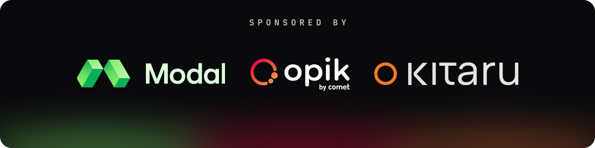
</p>

<p align="center">
  Special thanks to <a href="https://modal.com?source=decodingai&campaign=harnesseng" target="_blank"><b>Modal</b></a>, <a href="https://www.comet.com/site/?utm_source=workshop&utm_medium=partner&utm_campaign=paul&utm_content=coding_agent_course" target="_blank"><b>Opik</b></a> (by Comet), and <a href="https://www.zenml.io/product/kitaru?utm_source=decodingai&utm_medium=referral&utm_campaign=coding-agent-course&utm_content=brand" target="_blank"><b>Kitaru</b></a> (by ZenML) for sponsoring this open-source course and keeping it free!
</p>

<p align="center">
  Opik and Kitaru are open source. Consider starring their repositories: <a href="https://github.com/comet-ml/opik" target="_blank">Opik on GitHub</a> · <a href="https://github.com/zenml-io/kitaru" target="_blank">Kitaru on GitHub</a>.
</p>

## 🗣️ Questions and Troubleshooting

Open a [GitHub issue](https://github.com/decodingai-magazine/building-a-coding-agent-from-scratch-course/issues) for course questions, setup trouble, or concept clarifications. Known gotchas are documented in the [`running_the_code/`](running_the_code/) guides.

## ❓ FAQ

**Do I need a paid API key?**
No. The default Gemini provider has a free tier, OpenRouter routes across `:free` models, and [Modal](https://modal.com?source=decodingai&campaign=harnesseng) gives $30 in credits — see [Cost Structure](#-cost-structure).

**Why Python and not TypeScript or Go?**
Accessibility: our audience knows Python. The course focuses on the design decisions, which transfer to any language.

**Why build from scratch instead of extending Pi, DeepAgents, or an existing harness?**
Because adding custom logic to an existing harness is the easy part. _Knowing what to add_ requires understanding the internals. That's the fundamentals, and it's what still makes AI engineers valuable. Build a coding agent once and you're equipped to build a custom agent for any use case.

## 🥂 Contributing

Found a bug and know the fix? Fork, fix, run `make ci` (no API key needed), and open a pull request. Future readers will thank you 🤗

## 👨‍🏫 Course Author

<table style="border-collapse: collapse; border: none;">
  <tr style="border: none;">
    <td width="15%" align="center" style="border: none;">
      <a href="https://www.pauliusztin.ai/" target="_blank">
        
      </a>
      <br/>
      <b>Paul Iusztin</b>
    </td>
    <td width="85%" style="border: none;">
      Senior AI Engineer, Educator & Founder of Decoding AI. Author of the best-selling <a href="https://www.amazon.com/LLM-Engineers-Handbook-engineering-production/dp/1836200072">LLM Engineer's Handbook</a>.
    </td>
  </tr>
</table>

## 📬 Learn Harness Engineering

> Join 45k+ engineers subscribed to [the Decoding AI Magazine](https://www.decodingai.com/) to learn to build coding agents from scratch.

<a href="https://www.decodingai.com/" target="_blank">
  
</a>

## ⭐ One More Thing

If you found this course useful, consider starring the repository so others can find it too.

<a href="https://www.star-history.com/?type=date&repos=decodingai-magazine%2Fbuilding-a-coding-agent-from-scratch-course">
 <picture>
   <source media="(prefers-color-scheme: dark)" srcset="https://api.star-history.com/chart?repos=decodingai-magazine/building-a-coding-agent-from-scratch-course&type=date&theme=dark&legend=top-left" />
   <source media="(prefers-color-scheme: light)" srcset="https://api.star-history.com/chart?repos=decodingai-magazine/building-a-coding-agent-from-scratch-course&type=date&legend=top-left" />
   
 </picture>
</a>

## License

Released under [Apache-2.0](LICENSE). Clone, fork, and build on it; keep the LICENSE and credit this repo.
