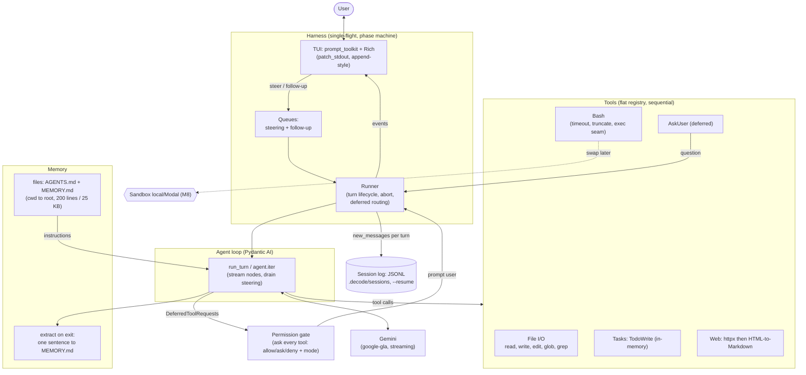

# 0002. Milestone 1 architecture — vanilla on-device coding agent

**Status:** Accepted
**Date:** 2026-06-19

## Context

Milestone 1 builds the first working vertical of `decode`: a terminal REPL running a **Pydantic AI** ReAct loop on **Gemini**, with a core tool set, **ask-on-every-tool** permissions, mid-turn **steering**, a memory layer, and a replayable session log. The design was grilled decision-by-decision and cross-validated against three reference harnesses (claude-code, opencode, pi) from the research wiki. These decisions are interrelated — the loop, permissions, queueing, TUI, memory, and persistence reinforce each other — so they are recorded here as **one** milestone-architecture ADR rather than one-per-task. The ordered task breakdown lives in [`tasks/`](../../tasks/) (feature `m1-vanilla-agent`); this ADR records the *why*. See [ADR-0001](0001-record-architecture-decisions.md).

## System architecture (M1)

**Component view** — modules under `src/decode/` and the in-process flow. Dashed edges mark deliberate seams that later milestones fill (no cycles; `config`/`logging`/`entities` are leaves and omitted for clarity).



**Turn lifecycle** — one turn fragments into `iter → deferred pause → resume` legs; each deferred pause is both the permission/AskUser gate (before execution) and the steering injection point.

```mermaid
sequenceDiagram
    actor U as User
    participant T as TUI
    participant H as Harness
    participant A as Agent (iter)
    participant M as Gemini
    participant G as Gate
    participant X as Tool

    U->>T: prompt (idle)
    T->>H: enqueue, start turn (lock)
    H->>A: run_turn(history + memory)
    A->>M: model request (stream)
    M-->>A: text deltas + tool_use
    A-->>H: DeferredToolRequests (gate BEFORE exec)
    Note over H: drain steering here<br/>(append user msg before resume)
    H->>G: check(tool, args)
    G->>T: approve? / AskUser question
    U->>T: allow / deny / answer
    T->>H: decision
    H->>A: resume(DeferredToolResults)
    A->>X: execute (if allowed)
    X-->>A: result (or ToolDenied)
    A->>M: next request
    M-->>A: final text (no tool_use)
    A-->>H: turn done
    H->>T: stream answer
    Note over H: drain follow-up? else idle;<br/>persist new_messages to session log
```

## Decision

We build M1 as a standalone single Python package with the following load-bearing choices:

1. **Agent loop via Pydantic AI on Gemini.** Construct the model via the `google-gla:` API-key path (reads `GEMINI_API_KEY`); model id is config-driven (`settings.gemini_model`). The framework owns the ReAct loop; we drive `agent.iter()` for streaming. *(M2 swaps in OpenRouter/Modal behind the same factory.)*
2. **HITL via deferred-tool-requests** — both tool approval and `AskUser` use Pydantic AI's `DeferredToolRequests`/`DeferredToolResults`. A turn becomes legs (`iter → deferred pause → resume`). The surveyed harnesses gate *inline*, but with `agent.iter()` a run is one atomic turn, so the deferred break point is what mechanically **enables mid-turn steering** (append a steering message before resuming) **and** is serializable → future-proof for **M7** Kitaru durable HITL and **M9** remote deploy.
3. **Permissions: ask on every tool call.** `PermissionGate.check()` returns `allow/ask/deny` + a `mode` field; tools carry a `read_only` flag (tagged, still asked in v1). Extensible to **M3** modes (`default/plan/edit/bypass`), read-only auto-allow, and persisted rules with no rewrite.
4. **Two-queue interaction model.** A **steering** queue drained *before each model-request leg* (boundary-inject, never interrupts an in-flight stream/tool) + a **follow-up** queue drained *only at the would-stop boundary*. While busy: plain `Enter` = steer, `Alt+Enter` = follow-up. A single-flight lock spans the entire multi-leg turn (phase set before the first `await`). This is the architecture's *Priority Gate*; pi is the reference.
5. **Cooperative abort.** `Esc` sets a flag; the turn stops at the next boundary (a runaway `bash` is bounded by `bash_timeout_s`). Hard/immediate cancellation is deferred to **M8** (sandboxing), where killing a process is well-defined.
6. **TUI via `patch_stdout()` + concurrent `prompt_async()`**, append-style Rich output above a persistent input line (not a full-screen renderer). Tool calls render on completion to avoid flicker. The migration path to a full-screen/differential renderer swaps only the `tui` layer.
7. **Core tools.** File I/O (`read` line-paginated; `write`/`edit` gated; `edit` strips BOM + normalizes CRLF↔LF, matches exact-then-whitespace-fuzzy requiring a unique match, `ModelRetry` on 0/>1); `bash` (timeout + 2000-line/50 KB truncation with temp-file overflow, behind a `tools/exec.py` executor seam for M8); `tasks` (in-memory TodoWrite-style); `web` (`httpx` GET → HTML→Markdown to cut tokens); `AskUser` (deferred). Sequential execution in v1 (parallel read-only + per-realpath mutation queue arrive with M3).
8. **Memory.** Read `AGENTS.md` + `MEMORY.md` walking cwd→**filesystem-root** (cwd-most wins), cap at **200 lines AND 25 KB**, inject into the agent's instructions. The walk stops at the filesystem root (`path.parent == path`) rather than a `.git` repo-root marker — the simplest rule that needs no project-layout heuristic, matching the surveyed harnesses' ancestor walk; a `.git`-marker stop is a reasonable M3 hardening (pairs with permission modes). Write-back is **cwd-pinned**: on session end, one cheap Gemini call appends a dated one-sentence summary to `cwd/MEMORY.md` (the launch project root — no walk) — a deliberately minimal teaching version; real compaction/extraction is **M4**.
9. **Persistence.** Append-only **JSONL** session log via Pydantic AI's message serialization (header line 0 + typed entries) at `.decode/sessions/<ts>_<uuid>.jsonl`; `decode --resume` replays the latest. SQLite/Kitaru durability is later.
10. **Discipline (from AGENTS.md).** `init_logger()` at module level in entrypoints; a pydantic-settings `settings` singleton; async-for-IO/sync-for-CPU; infrastructure imported, not abstracted; `tests/` mirror `src/` 1:1 with `filterwarnings=["error"]`, model calls exercised with `TestModel`/`FunctionModel` (no network in CI).

## Consequences

- **Accepted divergences from the surveyed harnesses:** deferred (not inline) HITL, and a `patch_stdout` (not full-screen) TUI. Both are deliberate — the first buys mid-turn steering + durable HITL, the second buys simplicity and a clean later upgrade.
- A turn **fragments into multiple `iter` legs**; the single-flight lock must wrap the whole turn, and steering only lands at model-request boundaries (never mid-tool/mid-stream). You cannot redirect a turn until the current tool/stream finishes.
- The **append-style TUI** has no self-rewriting live region (spinners/partial tool calls); acceptable for M1.
- **Minimal memory write-back** is a stepping stone, not production memory.
- **Seams deliberately left for later milestones:** provider-swap (M2); modes + agents catalog (M3); compaction (M4); executor→sandbox (M8); deferred→durable/remote HITL (M7/M9); single trace chokepoint in `run_turn` (M11); flat tool registry → MCP (M12).
- **Risks to confirm during implementation:** Pydantic AI's `GoogleProvider` API-key kwarg, current Gemini model id, and that a steering user-message can be appended at a deferred resume (task 004); the exact message-serialization API (task 014); that the prompt stays pinned under heavy streaming (task 002).
