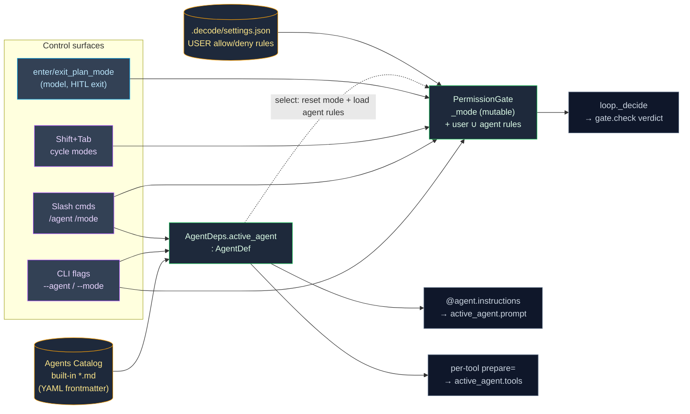

# 0003. Milestone 2 — permission system & agents catalog

**Status:** Accepted
**Date:** 2026-06-25

## Context

Milestone 1 shipped a vanilla on-device agent that **asks the human on every tool call**
(ADR-0002 §3). The gate (`permissions/gate.py`) is a pure policy object whose `check()` always
returns `ask`; `PermissionMode` has a single value `ASK`; the loop (`agent/loop.py` `_decide`)
calls `gate.check()` but **ignores the verdict** and unconditionally asks the human. M1 also runs a
single fixed system prompt with the full flat tool set always available.

ADR-0002 explicitly left this milestone as a planned extension ("Extensible to M3 modes
`default/plan/edit/bypass`, read-only auto-allow, and persisted rules with no rewrite"; "modes +
agents catalog" under the deliberate seams). *(The M1 code comments call this work "M3" and call
LLM-providers "M2"; the course plan numbers this step 2 — the labels refer to the same milestone.)*

Milestone 2 turns the gate into a **real allow/ask/deny policy** driven by mode + tool kind +
project/agent rules, and adds an **agents catalog** (Build / Plan / Explore / Code-Reviewer) that
each scope the system prompt, the allowed tool set, and the default mode. The decisions were grilled
and locked by the human across two rounds; they are interrelated (a mode is meaningless without a
tool-kind classification; selecting an agent resets the mode and contributes rules; the control
surfaces mutate the same shared state), so they are recorded here as **one** milestone ADR — mirroring
ADR-0002. The ordered task breakdown lives in [`tasks/`](../../tasks/) (feature
`permission-system-agents-catalog`); this ADR records the *why*. See
[ADR-0001](0001-record-architecture-decisions.md), [ADR-0002](0002-milestone-1-vanilla-agent-architecture.md).

Two framework facts were verified against the installed **pydantic-ai 1.107.0** (not assumed),
because they shape the design:

* `Agent.__init__` has **no** `prepare_tools` kwarg, but `Agent.tool(...)` has a per-tool
  `prepare: ToolPrepareFunc = Callable[[RunContext[Deps], ToolDefinition], Awaitable[ToolDefinition | None]]`.
  Returning `None` hides that tool **for the current run** and the callback receives `ctx.deps`. A
  runnable spike confirmed it (a `TestModel` that calls every visible tool called only the
  allow-listed one). `FunctionToolset.filtered(...)` is an alternative but needs registration
  restructured into an explicit toolset first.
* Shift+Tab arrives in prompt_toolkit as the `s-tab` key (`Keys.BackTab`).

## Decision

1. **Four permission modes replace the single `ASK`.** `PermissionMode` becomes
   `{DEFAULT, PLAN, EDIT, BYPASS}` (the old `ASK` *mode* value is removed; the gate default is
   `DEFAULT`). The `PermissionOutcome` enum `allow/ask/deny` is unchanged. Semantics by tool kind:
   - **default** — read-only tools auto-**ALLOW**; mutating tools **ASK** the human.
   - **plan** — read-only auto-**ALLOW**; any mutating tool **DENY**, with a reason telling the
     model to present its plan and call `exit_plan_mode`.
   - **edit** — read-only auto-**ALLOW**; **file-edit** tools (`write`/`edit`) auto-**ALLOW**; other
     mutating tools (`bash`) **ASK**.
   - **bypass** — everything **ALLOW** (no prompt).

2. **A `ToolKind` classification (`READ_ONLY | FILE_EDIT | OTHER`) replaces the single `read_only`
   bool on the registry.** Edit mode must distinguish a file edit from a shell exec, which one bool
   cannot express. `ToolSpec` carries `kind: ToolKind`; `read_only` is derived (`kind is READ_ONLY`)
   so existing `is_read_only()` callers keep working. Mapping: `read`/`glob`/`grep`/`web_fetch` →
   `READ_ONLY`; **`todo_write` → `READ_ONLY`** (an in-memory checklist with no disk/exec side
   effect — it must stay usable in plan mode, where the plan agent builds its checklist, and need
   not prompt anywhere); `write`/`edit` → `FILE_EDIT`; `bash` → `OTHER`. (`ask_user` and the
   orchestration tools are ungated and never reach the gate.)

3. **The gate becomes a real decision and the mode is mutable.** `gate.check(request)` returns
   ALLOW/ASK/DENY by evaluating, **in precedence order**:
   **deny rule → allow rule → mode decision → (ASK the human)**. `PermissionGate` gains
   `set_mode(mode)` so the TUI/tools can switch modes mid-session. The loop's `_decide` is rewired to
   **honor the verdict**: ALLOW → run the tool without asking; DENY → return the reason (mapped to
   `ToolDenied`); ASK → ask the human (today's path). This is the single behavioural change that
   realizes modes.

4. **Two rule sources, one engine; precedence merges them.** A **Permission Rule** is `Tool(pattern)`
   or a bare `Tool`, matched (glob via `fnmatch`) against a per-kind **subject**: `bash` → the
   command; file tools → the path; `web_fetch` → the url; bare-`Tool` matches any call of that tool.
   Rules come from **two** sources:
   - **User settings** — a project-level `.decode/settings.json`
     (`{"permissions": {"allow": [...], "deny": [...]}}`) that is the **user's optional
     personalization** file (its sole purpose is permission rules; no user/global/org tiers — YAGNI).
     A missing/malformed file is non-fatal.
   - **Active-agent rules** — optional `allow`/`deny` lists in an agent's catalog frontmatter, so a
     built-in agent's defaults live **in the catalog, not seeded into the user's settings.json**
     (e.g. code-reviewer carries `allow: ["bash(git *)"]`).
   The gate evaluates the **union**: `deny(user ∪ agent) → allow(user ∪ agent) → mode → ask` (a deny
   rule from either source beats everything; a user deny can always tighten an agent allow). The
   interactive **always-allow** answer (`a`/`always`) **persists** a matching allow rule to the
   **user** `.decode/settings.json` (the next identical call auto-allows); `y`/`yes` stays
   allow-once. A persist write failure is non-fatal (log, fall back to allow-once).

5. **Agents catalog = Markdown files with YAML frontmatter + a loader/validator (not a hardcoded
   dict).** Each built-in agent is a bundled `*.md`: YAML frontmatter (`name`, `description`,
   `tools` allowlist, `mode` default, optional `allow`/`deny` rules) + a system-prompt body. **No
   `model` field yet** — agents run on the one configured Gemini model until the providers milestone
   (step 3); the loader ignores unknown keys, so adding `model` later is forward-compatible. An
   `AgentDef` entity (validated) is the parsed result; the loader fails with a clear error on an
   unknown tool name / bad mode / missing field. Four built-ins (main-agent only — **no subagent
   spawning** this milestone):
   - **build** — all tools (incl. `todo_write`, `enter_plan_mode`/`exit_plan_mode`/`sleep`),
     `mode: default`.
   - **plan** — read-only set + `todo_write` + `enter_plan_mode`/`exit_plan_mode` + `ask_user`,
     `mode: plan`.
   - **explore** — read-only set + `ask_user`, `mode: default`.
   - **code-reviewer** — read-only set + `bash` + `ask_user`, `mode: default`, with
     `allow: ["bash(git *)"]` so `git diff`/`log`/`show` auto-allow while other bash still asks.

6. **Per-agent tool restriction via the per-tool `prepare=` callback (pydantic-ai 1.107).** Each
   registered tool gets a `prepare` callback that reads `ctx.deps.active_agent.tools` and returns
   `None` to hide the tool when it is not in the active agent's allowlist (verified by spike). One
   Agent, **no rebuild, no `handler._agent` swap**.

7. **Active state location.** The active **mode** lives on the `PermissionGate` (mutable via
   `set_mode`). The active **agent** lives on `AgentDeps.active_agent: AgentDef` (mutable). Selecting
   an agent sets `deps.active_agent`, resets the gate to that agent's default mode, **and** loads the
   agent's rules into the gate. The per-agent system prompt rides the existing **dynamic**
   `@agent.instructions` hook (the mechanism memory uses): it reads `ctx.deps.active_agent.prompt`, so
   switching agents takes effect on the next turn with no rebuild.

8. **Orchestration + sleep tools.** `enter_plan_mode` switches the gate to `PLAN` and returns an
   acknowledgement. `exit_plan_mode` **presents the plan and asks the human to approve leaving plan
   mode** (via the existing Decision Channel — ungated like `ask_user`, so no double-prompt): on
   approve → switch to **EDIT** mode (so the agent can implement the just-approved plan) and return
   "approved"; on deny → stay in `PLAN` and return a "refine and call exit_plan_mode again" message.
   `sleep(seconds)` is a one-line `await asyncio.sleep(...)` capped at `settings.sleep_max_s` (a sane
   max) and rejects negative input with `ModelRetry`. All three are **ungated** controls (they touch
   no filesystem) and never reach the permission gate.

9. **Control surfaces.** Startup `--agent NAME` / `--mode NAME` Click options on `cli.py` (default
   agent `build`; unknown → one friendly stderr line + non-zero exit). Mid-session slash commands
   `/agent <name>` and `/mode <name>` parsed in the TUI input loop alongside `/quit`. A **Shift+Tab**
   (`s-tab`) keybind cycles modes `default → edit → plan → bypass → default`. The bottom toolbar
   shows the active agent + mode; a switch renders a confirmation line. All of this rides the single
   input surface (the Decision Channel invariant from M1 holds — no second `prompt_async()`).

10. **Discipline (unchanged from ADR-0002 / AGENTS.md).** `filterwarnings=["error"]`, UTC-aware
    datetimes, full type annotations incl. `-> None`, library code logs (never `print()`),
    infrastructure imported-not-abstracted, `tests/` mirror `src/` 1:1, TDD-first, no network in CI
    (`TestModel`/`FunctionModel`). PyYAML becomes a **declared** direct dependency (`uv add pyyaml`)
    for the catalog loader.

## Diagram

**Permission-decision flow** — every gated call walks deny-rule → allow-rule → mode → ask.

```mermaid
flowchart TD
    call["Gated tool call<br/>(name, subject, kind)"]:::call
    deny{"deny rule matches?<br/>(user ∪ agent)"}:::rule
    allow{"allow rule matches?<br/>(user ∪ agent)"}:::rule
    mode{"active mode"}:::mode

    DENY[["DENY<br/>(reason → model)"]]:::deny
    ALLOW[["ALLOW<br/>(run, no prompt)"]]:::allow
    ASK[["ASK<br/>(human via Decision Channel)"]]:::ask

    call --> deny
    deny -- yes --> DENY
    deny -- no --> allow
    allow -- yes --> ALLOW
    allow -- no --> mode

    mode -- bypass --> ALLOW
    mode -- plan --> kP{"kind"}:::kind
    kP -- read_only --> ALLOW
    kP -- file_edit / other --> DENY
    mode -- default --> kD{"kind"}:::kind
    kD -- read_only --> ALLOW
    kD -- file_edit / other --> ASK
    mode -- edit --> kE{"kind"}:::kind
    kE -- read_only / file_edit --> ALLOW
    kE -- other --> ASK

    classDef call fill:#1e293b,stroke:#0ea5e9,color:#e2e8f0
    classDef rule fill:#334155,stroke:#f59e0b,color:#fde68a
    classDef mode fill:#334155,stroke:#a855f7,color:#e9d5ff
    classDef kind fill:#334155,stroke:#38bdf8,color:#bae6fd
    classDef deny fill:#7f1d1d,stroke:#ef4444,color:#fee2e2
    classDef allow fill:#14532d,stroke:#22c55e,color:#dcfce7
    classDef ask fill:#713f12,stroke:#eab308,color:#fef9c3
```

**Agent + mode state** — where state lives and who mutates/reads it.



## Consequences

- **The M1 capstone changes.** Under `default` mode, read-only tools auto-allow, so the capstone's
  `read`, `todo_write`, and `web_fetch` steps no longer prompt and consume no permission verdict —
  only the two `write` steps still prompt (one approved, one denied). Task 017 updates
  `tests/integration/test_milestone1_capstone.py` and any "read prompts" unit test, keeping `make ci`
  green. The capstone still exercises all three outcomes (auto-allow + human allow + human deny). A
  deliberate behaviour change, not a regression.
- **`PermissionMode.ASK` is removed.** The four real modes replace it; `PermissionDecision`'s default
  `mode=` moves to `DEFAULT`. The *outcome* `PermissionOutcome.ASK` (allow/ask/deny) stays.
- **One Agent, swapped state — not swapped agents.** Per-agent prompt + tool restriction ride
  `ctx.deps` per turn (instructions hook + `prepare=`), so `/agent` mutates `deps.active_agent` with
  no Agent rebuild.
- **Rules are user `.decode/settings.json` + agent-catalog only.** No user/global/org tiers (YAGNI);
  adding tiers later is a precedence extension, not a rewrite. The user's settings.json is never
  pre-seeded with built-in agent defaults — those live in the catalog.
- **`always`-persist writes to disk mid-turn** (to the user's settings.json); a write failure is
  non-fatal so persistence never breaks a turn.
- **Seams left for later milestones:** subagent spawning (the catalog is main-agent-only here);
  per-user/global rule tiers; richer plan-mode UX; hook-based permission decisions; the `model`
  frontmatter field (providers, step 3).
- **Risks to confirm during implementation:** that `prepare=None` hides a tool under the real Gemini
  path as it does under `TestModel`; that `s-tab` fires in the user's real terminal/$TERM; that
  `fnmatch` subjects (esp. bash command strings) match intuitively; that switching modes mid-turn
  lands at a turn boundary (the gate is read per `_decide`, so it does); that the `exit_plan_mode`
  HITL approval rides the Decision Channel cleanly alongside permission/ask_user (single-flight holds).
