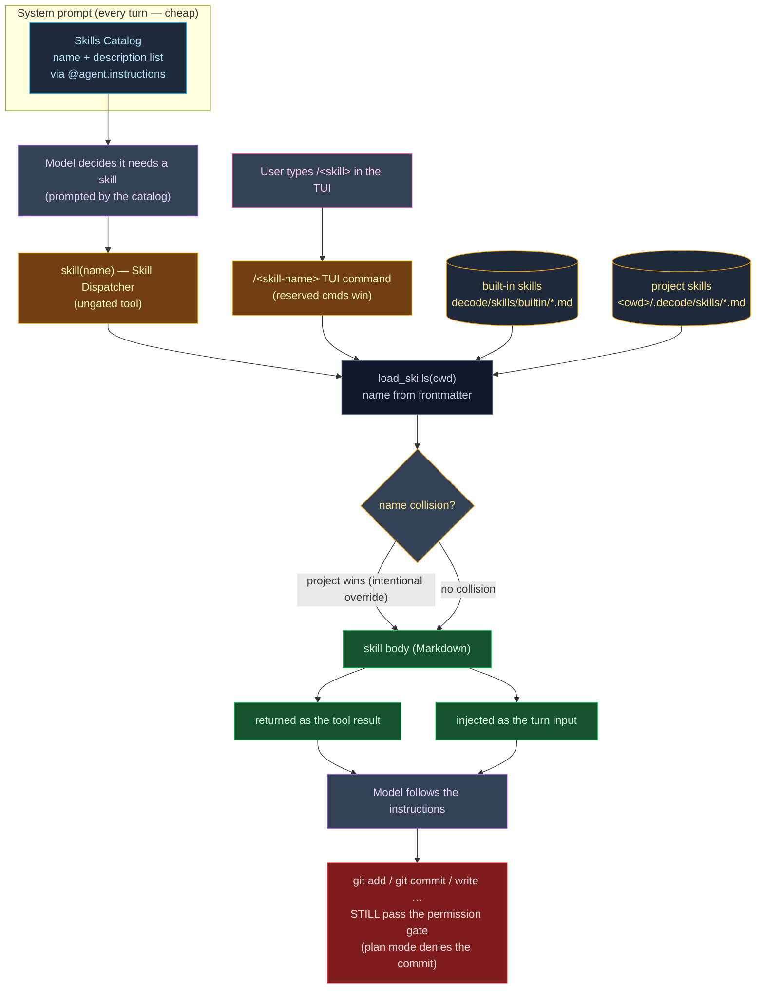

# 0004. Milestone 3 — Skills (progressive disclosure)

**Status:** Accepted
**Date:** 2026-06-25

## Context

Milestones 1 and 2 shipped a vanilla agent (ADR-0002) and a permission system + Agents Catalog
(ADR-0003). The model now runs a per-persona system prompt with a per-agent tool allowlist, all state
riding `AgentDeps` and the dynamic `@agent.instructions` hooks (memory + agent prompt).

Milestone 3 adds **Skills**: reusable, named instruction documents the model (or the user) can pull in
on demand — a `commit` skill that stages and commits the working tree, a `review-diff` skill that
reviews it, and any number of project-authored skills a team drops into their repo. The design problem
is *cost*: we want a library of skills available without paying their full token cost on every turn.

Skills are structurally a near-twin of the Agents Catalog (bundled Markdown + YAML frontmatter, a
loader/validator, packaged data via `importlib.resources`, project-local discovery like memory), so
this milestone **mirrors** that machinery rather than inventing new patterns. The decisions below were
grilled and locked by the human across two rounds; they are interrelated (the mechanism dictates the
entity shape, the sources dictate the precedence, the all-agents rule dictates the tool wiring, the
two entry points share one resolver), so they are recorded as **one** milestone ADR — mirroring
ADR-0002 and ADR-0003. The ordered task breakdown lives in [`tasks/`](../../tasks/) (feature
`skills`); this ADR records the *why*. See
[ADR-0002](0002-milestone-1-vanilla-agent-architecture.md),
[ADR-0003](0003-milestone-2-permission-system-and-agents-catalog.md).

Two framework facts are reused unchanged from ADR-0003 (verified against **pydantic-ai 1.107**): a
dynamic `@agent.instructions` function is called per run at prompt-build time and may read `ctx.deps`;
a per-tool `prepare=` callback returning `None` hides a tool for the current run. Both already back the
memory/agent-prompt hooks and the per-agent tool restriction — Skills bolt onto the same two seams.
The TUI's single input surface and its `/agent` / `/mode` slash-command parsing (ADR-0003 §9) are the
third reuse point — the `/<skill-name>` command mirrors them.

## Decision

1. **Mechanism = dispatcher-returns-body (NOT read-the-file).** Progressive disclosure is realised by
   two tiers: (a) a lightweight **Skills Catalog** — each skill's `name` + one-line `description` —
   injected into the system prompt by a dynamic `@agent.instructions` hook, always present and cheap;
   (b) a **Skill Dispatcher** `skill(name)` tool whose result IS that skill's full Markdown body,
   loaded **only on demand**. We deliberately do not adopt the "skill is a file the model `read`s"
   model (Pi-style): the catalog is the discoverable menu and the dispatcher is the single, typed entry
   point, so the model never has to know a skill's on-disk path and the body cost is paid only when a
   skill is actually used.

2. **Dispatcher signature is `skill(name)` only — no `args`.** A lazy v1: none of the built-in skills
   needs structured arguments, and free-form intent can ride the body or the user's trailing slash
   text (decision 5). Adding an `args` parameter later is additive and does not change the resolver.

3. **Two sources: built-in packaged + project-local; name from frontmatter; project intentionally
   overrides.** Built-in skills ship as packaged `.md` under `src/decode/skills/builtin/` (loaded via
   `importlib.resources.files("decode.skills.builtin")`, exactly like `agents/builtin/`). Project-local
   skills are discovered at `<cwd>/.decode/skills/*.md` (path via `settings.skills_dir`, the single
   config reader). A skill's **name comes from its `name:` frontmatter**, like the agents catalog — the
   filename is cosmetic. On a name collision the **project-local skill overrides** the built-in of the
   same name; this **override is intentional and silent** (a team shadows `commit`/`review-diff` with
   their own conventions), with the `source` field keeping it traceable in logs. A **built-in** parse
   failure raises loudly (our packaging bug); a malformed/unreadable **project** skill is logged at
   WARNING and skipped (a user's typo never breaks a session — mirrors memory's skip-unreadable and the
   user `settings.json` tolerance).

4. **All agents see all skills; the dispatcher must be in each agent's `tools`.** No new agent
   frontmatter field — the full catalog is injected for every agent. But the registry hides any tool
   not in the active agent's `tools` allowlist (`_restrict_to_active_agent`), so `skill` is added to all
   four built-in agents (`build`, `plan`, `explore`, `code-reviewer`) — otherwise the catalog would
   advertise skills the model has no tool to load.

5. **Two entry points, one resolver.** A skill is invokable two ways, both resolving through the same
   `load_skills(cwd)` to the same body:
   - **Model** — the `skill(name)` dispatcher tool (decision 1); the body returns as the tool result.
   - **User** — a `/<skill-name>` command typed in the TUI (e.g. `/commit`, `/review-diff`), mirroring
     the existing `/agent` / `/mode` parsing on the single input surface; the body is injected as the
     **turn input** (optional trailing text after the name is appended), and the model then follows it
     through the normal submit pipeline. **Built-in TUI commands win** (`/quit`, `/agent`, `/mode` take
     precedence; `/resume` is a CLI flag, not a TUI command) — a skill colliding with a reserved name is
     still reachable via the dispatcher. An unrecognised `/<x>` that is neither reserved nor a known
     skill shows a friendly line listing the available skills (no turn), doubling as discovery.

6. **`SkillDef` = pure injected instructions.** The entity (`entities/skill_def.py`, frozen + slotted,
   self-validating) mirrors `AgentDef` but trims to the M3 reality: `name`, `description`, `body`, and a
   `source` provenance field (so a project override is traceable). **No** `tools`/`mode`/`allow`/`deny`
   fields — a skill is guidance the model follows, not a persona and not code.

7. **The dispatcher is ungated; the actions a skill induces are not.** `skill(ctx, name)` is registered
   as `ToolKind.OTHER` but, like `ask_user` / `sleep` / `enter_plan_mode`, **never raises
   `ApprovalRequired`**, so it never reaches the permission gate — loading instructions is harmless. An
   unknown name raises `ModelRetry` listing the available skills. Crucially, ungating the *dispatcher*
   does **not** ungate the *actions a skill describes*. The **`commit` skill is the worked example**: it
   tells the model to run `git add` and `git commit`, which go through the gated `bash` tool — so in
   default mode the user still approves each git call, and in **plan mode the commit is denied**. Skills
   change *what the model is told*, never *what it is allowed to do*.

8. **Two built-in skills, with different side-effect profiles.** **`commit`** is **active**: it inspects
   the working tree, stages the appropriate files, composes a Conventional-Commits message, and runs
   `git commit` — committing exactly what it staged (all git operations through the gated `bash` tool,
   per decision 7). **`review-diff`** is **advisory / read-only**: it reads `git diff` and reports bugs +
   over-engineering, and does not edit or commit. Both are Markdown bodies of instructions the model
   follows, not executable code.

9. **Wiring reuses the existing seams.** `assemble_skills_catalog(cwd)` (in `skills/catalog.py`) formats
   the menu and returns `""` when empty (no empty header), exactly like `assemble_memory`. A new
   `_register_skills_catalog_instructions` hook in `agent/factory.py` injects it per run from
   `ctx.deps.cwd`, alongside the memory and agent-prompt hooks. The dispatcher is one more `ToolSpec` in
   the flat registry; `TOOL_KIND` / `KNOWN_TOOL_NAMES` derive `skill` automatically. The `/<skill-name>`
   command is one more pure parser (`parse_skill_command`) + handler in `tui/app.py`, after the
   `/agent` / `/mode` branches.

10. **Deferred (explicit non-goals this milestone):** a `~/.decode/skills` **user-home** source (this
    step is project-local only); **per-agent skill allowlists** (all agents see all skills — no per-agent
    scoping field); a **body-size cap** (skills are author-trusted and small, unlike the model-maintained
    `MEMORY.md` which *is* capped); and **structured `args`** on the dispatcher (decision 2). Each is an
    additive extension, not a rewrite: a home source is one more discovery tier in the merge, an
    allowlist is one more frontmatter field, a cap is one clip call, `args` is one more tool parameter.

11. **Discipline (unchanged from ADR-0002/0003/AGENTS.md).** `filterwarnings=["error"]`, UTC-aware
    datetimes, full type annotations incl. `-> None`, library code logs (never `print()`),
    infrastructure imported-not-abstracted, `tests/` mirror `src/` 1:1, TDD-first, no network in CI
    (`FunctionModel`). PyYAML is already a declared dependency (ADR-0003 §10) — no new dependency.

## Diagram

**Progressive-disclosure flow, two entry points** — the cheap catalog is always in the prompt; a body
is loaded only when invoked (by the model's dispatcher *or* the user's `/<skill>` command), resolving
project-over-built-in, and the model then acts through the normally-gated tools.

## Consequences

- **The catalog rides every prompt.** A small, always-present cost (names + descriptions); the body
  cost is paid only on invocation. Because built-ins always ship, the catalog is never empty in
  practice — the `""`-when-empty contract is defensive symmetry with `assemble_memory`.
- **All four built-in agents gain a `skill` tool.** Their `tools` lists grow by one (e.g. `build`
  12 → 13); any agent-catalog test that pins an exact tool count must update. A *custom* agent whose
  `tools` omits `skill` would have the catalog advertise skills it cannot load — hence all built-ins
  include it; per-agent skill scoping is a deferred extension.
- **`commit` is autonomous but stays gated.** It stages and commits without a separate "compose only"
  step, yet every git call flows through the existing `bash` gate — so default mode still asks and plan
  mode still denies. This is the same reasoning that ungates `ask_user`/`sleep`/`enter_plan_mode`: the
  dispatcher is a pure signal, the side effects keep their gates.
- **Two entry points, one body.** A user can fire a skill with `/commit` and the model can fire the same
  skill with `skill("commit")` — both resolve through `load_skills`, so there is one source of truth and
  one override rule. The user path injects the body as a turn; the model path returns it as a tool result.
- **A stray `/foo` now lists skills instead of going to the model.** Previously an unrecognised slash
  fell through to `runner.submit("/foo", …)`; with the `/<skill-name>` branch it is intercepted with an
  available-skills discovery line (no turn). A deliberate UX improvement — the SWE updates any TUI test
  that relied on the old fall-through.
- **Project skills override built-ins, silently and intentionally.** A team shadows `commit`/`review-diff`
  by dropping a same-`name` file in `<cwd>/.decode/skills/`; `source` makes the provenance visible in
  logs so an override is never a mystery.
- **`SkillDef` is intentionally thinner than `AgentDef`.** No tools/mode/rules — adding any later is a
  field addition the loader already tolerates (unknown frontmatter keys are ignored), forward-compatible.
- **Seams left for later milestones:** a `~/.decode/skills` user-home source, per-agent skill allowlists,
  a skill body-size cap (parallel to the `MEMORY.md` cap), and structured dispatcher `args` — each additive.
- **Risks to confirm during implementation:** that hatchling ships `skills/builtin/*.md` in the wheel by
  default (confirmed for `agents/builtin`; re-verify with `uv build` + `unzip -l`); that the extra catalog
  prompt text does not perturb `test_milestone1_capstone.py` (it asserts tool results + rendered
  transcript, not exact prompt text); that the `/<skill-name>` branch sits correctly after `/agent`/`/mode`
  so reserved commands always win on the single input surface; and that a project skill with the same name
  as a built-in cleanly overrides through `load_skills` for **both** entry points (the 029 capstone pins
  this).
