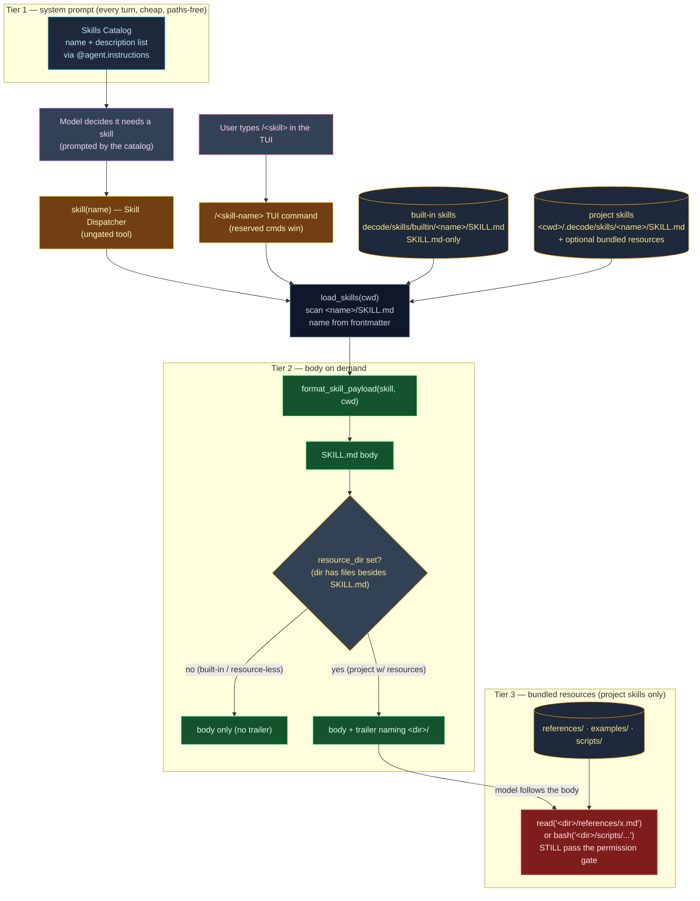

# 0004. Milestone 3 — Skills (progressive disclosure)

**Status:** Accepted
**Date:** 2026-06-25

## Context

Milestones 1 and 2 shipped a vanilla agent (ADR-0002) and a permission system + Agents Catalog
(ADR-0003). The model now runs a per-persona system prompt with a per-agent tool allowlist, all state
riding `AgentDeps` and the dynamic `@agent.instructions` hooks (memory + agent prompt).

Milestone 3 adds **Skills**: reusable, named instruction documents the model (or the user) can pull in
on demand — a `commit` skill that stages and commits the working tree, a `review-diff` skill that
reviews it, and any number of project-authored skills a team drops into their repo. The design problem
is *cost*: we want a library of skills available without paying their full token cost on every turn.

Skills are structurally a near-twin of the Agents Catalog (bundled Markdown + YAML frontmatter, a
loader/validator, packaged data via `importlib.resources`, project-local discovery like memory), so
this milestone **mirrors** that machinery rather than inventing new patterns. The on-disk shape is the
**Agent Skills directory convention** — each skill is a directory `<name>/SKILL.md` that may ship
bundled resource files — corrected to this from an initial flat-file draft before this milestone
merged. The decisions below were
grilled and locked by the human across two rounds; they are interrelated (the mechanism dictates the
entity shape, the sources dictate the precedence, the all-agents rule dictates the tool wiring, the
two entry points share one resolver), so they are recorded as **one** milestone ADR — mirroring
ADR-0002 and ADR-0003. The ordered task breakdown lives in [`tasks/`](../../tasks/) (feature
`skills`); this ADR records the *why*. See
[ADR-0002](0002-milestone-1-vanilla-agent-architecture.md),
[ADR-0003](0003-milestone-2-permission-system-and-agents-catalog.md).

Two framework facts are reused unchanged from ADR-0003 (verified against **pydantic-ai 1.107**): a
dynamic `@agent.instructions` function is called per run at prompt-build time and may read `ctx.deps`;
a per-tool `prepare=` callback returning `None` hides a tool for the current run. Both already back the
memory/agent-prompt hooks and the per-agent tool restriction — Skills bolt onto the same two seams.
The TUI's single input surface and its `/agent` / `/mode` slash-command parsing (ADR-0003 §9) are the
third reuse point — the `/<skill-name>` command mirrors them.

## Decision

1. **Mechanism = progressive disclosure in THREE tiers.** (a) **Tier 1 — Skills Catalog:** each skill's
   `name` + one-line `description`, injected into the system prompt by a dynamic `@agent.instructions`
   hook, always present, cheap, and **paths-free** (no directory ever bloats the always-on prompt).
   (b) **Tier 2 — Skill Dispatcher body:** the `skill(name)` tool (and the user's `/<skill-name>`
   command) returns that skill's full `SKILL.md` Markdown body **only on demand**. For tiers 1–2 we keep
   the dispatcher-returns-body model (NOT "the model `read`s a skill file", Pi-style): the catalog is the
   menu, the dispatcher is the single typed entry point, and the model never needs a skill's on-disk path
   to *invoke* it. (c) **Tier 3 — bundled resources:** a project skill's `SKILL.md` body may reference
   sibling files by relative path (`references/`, `examples/`, `scripts/`, …) that the model loads **only
   when it acts**, through its ordinary `read`/`bash` tools. The bridge from tier 2 to tier 3 is a short
   **resource trailer** appended to the returned body — **only** when the skill actually carries bundled
   resources (built-ins are SKILL.md-only, §3): it names the skill's directory (a `read`-resolvable,
   cwd-relative path) so the model knows where to read from. A built-in or a resource-less project skill
   returns the body with **no** trailer, so the read-the-file layer surfaces exactly when there is
   something to read. Tier 3 is therefore a **project-skill feature**.

2. **Dispatcher signature is `skill(name)` only — no `args`.** A lazy v1: none of the built-in skills
   needs structured arguments, and free-form intent can ride the body or the user's trailing slash
   text (decision 5). Adding an `args` parameter later is additive and does not change the resolver.

3. **On-disk shape = the directory convention `<name>/SKILL.md`; two sources; name from frontmatter;
   project intentionally overrides (hard switch — no flat format).** A skill is a **directory** containing
   a `SKILL.md` (YAML frontmatter + body); the loader recognizes **only** `<name>/SKILL.md` directories —
   there is no flat `<name>.md` support (this is pre-merge, so no released format is broken and no
   compatibility shim is carried). Built-in skills ship as packaged directories under
   `src/decode/skills/builtin/<name>/SKILL.md` (walked via `importlib.resources.files("decode.skills.builtin")`
   into each subdirectory, exactly mirroring `agents/builtin/`), and are **SKILL.md-only** (their resources
   would live unreadably in site-packages, so tier 3 is a project-skill feature — §1). Project-local skills
   are discovered at `<cwd>/.decode/skills/<name>/SKILL.md` (path via `settings.skills_dir`, the single
   config reader), and may ship sibling resource folders/files (`references/`, `examples/`, `scripts/`, or
   anything) loaded on demand. A skill's **name comes from its `name:` frontmatter**, not the directory
   name — the **directory name is cosmetic**: `skills/foo/SKILL.md` with `name: commit` *is* the `commit`
   skill. A directory-name ≠ frontmatter-name mismatch still loads (keyed by frontmatter `name`) but is
   logged at **WARNING**, to catch copy-paste slips. On a name collision the **project-local skill
   overrides** the built-in of the same name; this **override is intentional and silent** (a team shadows
   `commit`/`review-diff` with their own conventions), with the `source` field keeping it traceable in
   logs. A **built-in** parse failure raises loudly (our packaging bug); a malformed/unreadable **project**
   `SKILL.md`, and a subdirectory with no `SKILL.md`, are logged at WARNING and skipped (a user's typo
   never breaks a session — mirrors memory's skip-unreadable and the user `settings.json` tolerance).

4. **All agents see all skills; the dispatcher must be in each agent's `tools`.** No new agent
   frontmatter field — the full catalog is injected for every agent. But the registry hides any tool
   not in the active agent's `tools` allowlist (`_restrict_to_active_agent`), so `skill` is added to all
   four built-in agents (`build`, `plan`, `explore`, `code-reviewer`) — otherwise the catalog would
   advertise skills the model has no tool to load.

5. **Two entry points, one resolver, one payload.** A skill is invokable two ways, both resolving
   through the same `load_skills(cwd)` and the same `format_skill_payload(skill, cwd)` helper to the
   **identical** payload — the body, plus a resource trailer when (and only when) the skill carries
   bundled resources (decision 1, §6):
   - **Model** — the `skill(name)` dispatcher tool (decision 1); the payload returns as the tool result.
   - **User** — a `/<skill-name>` command typed in the TUI (e.g. `/commit`, `/review-diff`), mirroring
     the existing `/agent` / `/mode` parsing on the single input surface; the same payload is injected as
     the **turn input** (optional trailing text after the name is appended), and the model then follows it
     through the normal submit pipeline. **Built-in TUI commands win** (`/quit`, `/agent`, `/mode` take
     precedence; `/resume` is a CLI flag, not a TUI command) — a skill colliding with a reserved name is
     still reachable via the dispatcher. An unrecognised `/<x>` that is neither reserved nor a known
     skill shows a friendly line listing the available skills (no turn), doubling as discovery.

6. **`SkillDef` = pure injected instructions (+ one optional resource pointer).** The entity
   (`entities/skill_def.py`, frozen + slotted, self-validating) mirrors `AgentDef` but trims to the M3
   reality: `name`, `description`, `body`, a `source` provenance field (so a project override is
   traceable), and an **optional** `resource_dir: Path | None = None` — the project skill's
   bundled-resource directory **iff** that directory holds anything besides `SKILL.md`, else `None`
   (built-ins and resource-less project skills). It is the single bit the dispatcher reads to decide
   whether to append the resource trailer (decision 1). **No** `tools`/`mode`/`allow`/`deny` fields — a
   skill is guidance the model follows, not a persona and not code; the entity never touches the
   filesystem (the loader sets `resource_dir`).

7. **The dispatcher is ungated; the actions a skill induces are not.** `skill(ctx, name)` is registered
   as `ToolKind.OTHER` but, like `ask_user` / `sleep` / `enter_plan_mode`, **never raises
   `ApprovalRequired`**, so it never reaches the permission gate — loading instructions is harmless. An
   unknown name raises `ModelRetry` listing the available skills. Crucially, ungating the *dispatcher*
   does **not** ungate the *actions a skill describes*. The **`commit` skill is the worked example**: it
   tells the model to run `git add` and `git commit`, which go through the gated `bash` tool — so in
   default mode the user still approves each git call, and in **plan mode the commit is denied**. Skills
   change *what the model is told*, never *what it is allowed to do*.

8. **Two built-in skills, with different side-effect profiles.** **`commit`** is **active**: it inspects
   the working tree, stages the appropriate files, composes a Conventional-Commits message, and runs
   `git commit` — committing exactly what it staged (all git operations through the gated `bash` tool,
   per decision 7). **`review-diff`** is **advisory / read-only**: it reads `git diff` and reports bugs +
   over-engineering, and does not edit or commit. Both are Markdown bodies of instructions the model
   follows, not executable code.

9. **Wiring reuses the existing seams.** `assemble_skills_catalog(cwd)` (in `skills/catalog.py`) formats
   the menu and returns `""` when empty (no empty header), exactly like `assemble_memory`. A new
   `_register_skills_catalog_instructions` hook in `agent/factory.py` injects it per run from
   `ctx.deps.cwd`, alongside the memory and agent-prompt hooks. The dispatcher is one more `ToolSpec` in
   the flat registry; `TOOL_KIND` / `KNOWN_TOOL_NAMES` derive `skill` automatically. The `/<skill-name>`
   command is one more pure parser (`parse_skill_command`) + handler in `tui/app.py`, after the
   `/agent` / `/mode` branches.

10. **Deferred (explicit non-goals this milestone):** a `~/.decode/skills` **user-home** source (this
    step is project-local only); **per-agent skill allowlists** (all agents see all skills — no per-agent
    scoping field); a **body-size cap** (skills are author-trusted and small, unlike the model-maintained
    `MEMORY.md` which *is* capped); and **structured `args`** on the dispatcher (decision 2). Each is an
    additive extension, not a rewrite: a home source is one more discovery tier in the merge, an
    allowlist is one more frontmatter field, a cap is one clip call, `args` is one more tool parameter.

11. **Discipline (unchanged from ADR-0002/0003/AGENTS.md).** `filterwarnings=["error"]`, UTC-aware
    datetimes, full type annotations incl. `-> None`, library code logs (never `print()`),
    infrastructure imported-not-abstracted, `tests/` mirror `src/` 1:1, TDD-first, no network in CI
    (`FunctionModel`). PyYAML is already a declared dependency (ADR-0003 §10) — no new dependency.

## Diagram

**Three-tier progressive disclosure** — the cheap catalog is always in the prompt (tier 1, paths-free);
invoking a skill (model dispatcher *or* user `/<skill>`) returns the SKILL.md body (tier 2); when — and
only when — the skill carries bundled resources, a trailer names its directory so the model loads those
files on demand via the gated `read`/`bash` tools (tier 3). Built-ins stop at tier 2; project skills may
reach tier 3. Project-over-built-in override and the still-gated induced actions are unchanged.

## Consequences

- **The catalog rides every prompt — and stays paths-free.** A small, always-present cost (names +
  descriptions, no directories); the body cost is paid only on invocation, and a bundled-resource
  directory is named only in the dispatcher trailer (tier 2→3), never in the always-on prompt. Because
  built-ins always ship, the catalog is never empty in practice — the `""`-when-empty contract is
  defensive symmetry with `assemble_memory`.
- **All four built-in agents gain a `skill` tool.** Their `tools` lists grow by one (e.g. `build`
  12 → 13); any agent-catalog test that pins an exact tool count must update. A *custom* agent whose
  `tools` omits `skill` would have the catalog advertise skills it cannot load — hence all built-ins
  include it; per-agent skill scoping is a deferred extension.
- **`commit` is autonomous but stays gated.** It stages and commits without a separate "compose only"
  step, yet every git call flows through the existing `bash` gate — so default mode still asks and plan
  mode still denies. This is the same reasoning that ungates `ask_user`/`sleep`/`enter_plan_mode`: the
  dispatcher is a pure signal, the side effects keep their gates.
- **Two entry points, one payload.** A user can fire a skill with `/commit` and the model can fire the
  same skill with `skill("commit")` — both resolve through `load_skills` and the same
  `format_skill_payload(skill, cwd)` helper, so there is one source of truth, one override rule, and one
  body(+trailer) the two paths cannot drift apart on. The user path injects the payload as a turn; the
  model path returns it as a tool result.
- **The resource trailer is conditional, so the common case stays lean.** A skill with no bundled files
  returns exactly its body — no trailer noise. The model only ever hears about a resource directory when
  one exists and it has just chosen to load that skill, and it then reads those files through the ordinary
  gated `read`/`bash` tools (tier 3 grants no new authority — the gate still governs every read/exec).
  Built-in and project skills deliberately diverge by capability: built-ins are SKILL.md-only (tier 2
  max), since their files would sit unreadably in site-packages; project skills can carry tier-3 resources.
- **A stray `/foo` now lists skills instead of going to the model.** Previously an unrecognised slash
  fell through to `runner.submit("/foo", …)`; with the `/<skill-name>` branch it is intercepted with an
  available-skills discovery line (no turn). A deliberate UX improvement — the SWE updates any TUI test
  that relied on the old fall-through.
- **Project skills override built-ins, silently and intentionally.** A team shadows `commit`/`review-diff`
  by dropping a same-`name` file in `<cwd>/.decode/skills/`; `source` makes the provenance visible in
  logs so an override is never a mystery.
- **`SkillDef` is intentionally thinner than `AgentDef`.** No tools/mode/rules — just `name`,
  `description`, `body`, `source`, and one optional `resource_dir` (the bundled-resource pointer the
  dispatcher reads to decide on the trailer). Adding any further field later is an addition the loader
  already tolerates (unknown frontmatter keys are ignored), forward-compatible.
- **Seams left for later milestones:** a `~/.decode/skills` user-home source, per-agent skill allowlists,
  a skill body-size cap (parallel to the `MEMORY.md` cap), and structured dispatcher `args` — each additive.
- **Risks to confirm during implementation:** that hatchling ships the **nested**
  `skills/builtin/<name>/SKILL.md` data files in the wheel (the flat `*.md` shipped by default — re-verify
  the directory layout with `uv build` + `unzip -l`; if nested data is omitted, add an explicit wheel
  `artifacts`/`include` glob such as `src/decode/skills/builtin/**/*.md`, not stray `__init__.py` files);
  that `importlib.resources` traverses the built-in subdirectories (`iterdir`/`is_dir`/`joinpath`/`read_text`
  on the `Traversable`) from the installed wheel as well as in-tree; that the extra catalog prompt text does
  not perturb `test_milestone1_capstone.py` (it asserts tool results + rendered transcript, not exact prompt
  text); that the `/<skill-name>` branch sits correctly after `/agent`/`/mode` so reserved commands always
  win on the single input surface; that the trailer surfaces a path the `read`/`bash` tools accept
  (cwd-relative, within `cwd`); and that a project skill with the same name as a built-in cleanly overrides
  through `load_skills` for **both** entry points (the capstone pins this).
