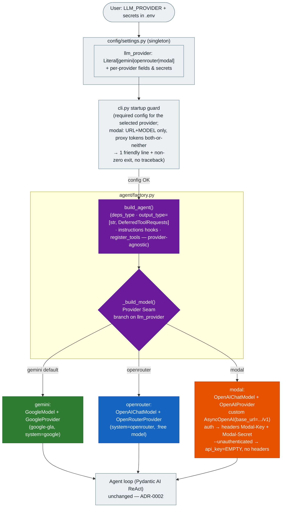

# 0005. Multi-LLM-provider support — selectable inference backends (Gemini / OpenRouter / Modal)

**Status:** Accepted
**Date:** 2026-06-26

## Context

Milestone 1 wired the agent loop to a single backend — Gemini via the `google-gla` API-key path — but
deliberately built `agent/factory.py` as a **provider-swap seam** ([ADR-0002](0002-milestone-1-vanilla-agent-architecture.md)
§1: "M2 swaps in OpenRouter/Modal behind the same factory"). Running `decode` therefore required a paid
Gemini key. To let people run it **for free**, we add two more inference backends behind that same seam:

- **OpenRouter** — an OpenAI-compatible gateway with `:free` model options.
- **Modal Auto Endpoints** — OpenAI-compatible `/v1` endpoints serving open-source models on Modal's
  $30 free credits. Model selection, GPU/serving trade-offs, and endpoint setup are documented in the
  companion catalog [`02_modal_endpoints.md`](../../running_the_code/02_modal_endpoints.md) (2026-06-26 snapshot) — this ADR records
  the *wiring* decision and references that file for *which model* and *how to create the endpoint*.

The seam was the only architecture ADR-0002 left open here; the loop, tools, permissions, memory, and
TUI are untouched. This ADR records the related choices as **one** feature decision (not one-per-task):
the explicit selector, the per-provider config, the three model constructions, Modal's optional
proxy-token auth, the shipped defaults + the tool-calling caveat, and the non-goals. The four-task
breakdown lives in [`tasks/`](../../tasks/) (feature `multi-provider-gateway`, tasks 037-040). All
wiring was verified against the **installed** pydantic-ai 1.107 / openai 2.43 and the live OpenRouter
model list during grooming, so it is not re-litigated downstream.

## Decision

1. **Explicit `LLM_PROVIDER` selector — no auto-detect.** A `llm_provider:
   Literal["gemini","openrouter","modal"] = "gemini"` field on the settings singleton picks the backend;
   pydantic validates the value at load. Default `gemini` is **backward-compatible** — an existing `.env`
   that only sets `GEMINI_API_KEY` keeps working with no new line. "Run for free" is served by
   documenting the opt-in, not by flipping the default. We reject auto-detecting the provider from which
   keys happen to be present: it is implicit, surprising, and ambiguous when several keys are set.

2. **Per-provider config fields, on the one settings reader.** OpenRouter: `openrouter_api_key`
   (`SecretStr`), `openrouter_model`. Modal **endpoint** (names per 02_modal_endpoints.md §6):
   `modal_endpoint_url` (no default — per-user deploy output; used as `base_url = f"{...}/v1"`),
   `modal_endpoint_model`, `modal_proxy_token_id` (`SecretStr`, the `Modal-Key: wk-...` header) and
   `modal_proxy_token_secret` (`SecretStr`, the `Modal-Secret: ws-...` header). These Modal endpoint
   vars are **distinct** from the existing `MODAL_TOKEN_ID`/`MODAL_TOKEN_SECRET` **account** tokens
   (`modal token set`, for the CLI/sandbox — 02_modal_endpoints.md §5.1): overloading them would conflate two
   unrelated credential scopes. All new vars are mirrored in `.env.example`; nothing reads `os.environ`
   in call sites.

3. **One `_build_model()` Provider Seam in the factory.** `build_agent()` delegates model construction
   to a small private `_build_model()` that branches on `settings.llm_provider`; the rest of
   `build_agent()` — `deps_type`, `output_type=[str, DeferredToolRequests]`, instructions,
   `register_tools`, and the three `@agent.instructions` hooks — is provider-agnostic and unchanged. A
   value past the three branches raises `ValueError` (defensive; the `Literal` blocks it upstream).

4. **Three model constructions** (verified against the installed SDK):
   - gemini (unchanged): `GoogleModel(settings.gemini_model, provider=GoogleProvider(api_key=...))` —
     google-gla, never `vertexai=` (`filterwarnings=["error"]`).
   - openrouter: `OpenAIChatModel(settings.openrouter_model,
     provider=OpenRouterProvider(api_key=...))` (`model.system == "openrouter"`).
   - modal: `OpenAIChatModel(settings.modal_endpoint_model,
     provider=OpenAIProvider(openai_client=AsyncOpenAI(...)))` — a custom client (see §5).

5. **Modal proxy-token auth is OPTIONAL — support `--unauthenticated` endpoints.** Modal Auto Endpoints
   require auth **by default**, via a **pair** of headers `Modal-Key` (wk-...) + `Modal-Secret` (ws-...)
   from `modal workspace proxy-tokens create` — not the OpenAI `Authorization: Bearer` scheme
   (02_modal_endpoints.md §5.3, §6.3). But a dev endpoint created with `--unauthenticated` needs no headers.
   So the modal branch always builds a **custom `AsyncOpenAI` client** (for the custom `base_url`) and:
   - **both** proxy tokens set → `AsyncOpenAI(base_url=f"{modal_endpoint_url}/v1",
     api_key=<modal_proxy_token_secret>, default_headers={"Modal-Key": <modal_proxy_token_id>,
     "Modal-Secret": <modal_proxy_token_secret>})`.
   - **neither** set → `AsyncOpenAI(base_url=f"{modal_endpoint_url}/v1", api_key="EMPTY")` with no Modal
     headers (the openai SDK requires a non-empty `api_key`, so a placeholder is passed).
   A single-bearer client would not authenticate an authed endpoint. The **both-or-neither** invariant
   is enforced at the cli guard (§6): exactly one token set is a friendly misconfiguration.

6. **Generalized startup guard.** The task-004 `GEMINI_API_KEY`-only guard in `cli.py` generalizes to
   validate the **selected** provider's required config, printing ONE friendly stderr line and exiting
   non-zero (no traceback), mirroring the existing guard's style and position (before agent/mode
   validation and before the agent is built): gemini → `GEMINI_API_KEY`; openrouter →
   `OPENROUTER_API_KEY`; modal → `MODAL_ENDPOINT_URL` + `MODAL_ENDPOINT_MODEL` only (proxy tokens **not**
   required), plus a both-or-neither check that flags exactly one proxy token set.

7. **Shipped defaults, the tool-calling caveat, and non-goals.** `openrouter_model` defaults to a
   **current** known-good free model that supports tool-calling + streaming (verified
   `qwen/qwen3-coder:free` against the live OpenRouter list on 2026-06-26; documented alternate
   `meta-llama/llama-3.3-70b-instruct:free`). `modal_endpoint_model` defaults to **`openai/gpt-oss-120b`**
   — 02_modal_endpoints.md's best-fit pick (native OpenAI tool-calling = the #1 harness criterion, single
   B200); documented alternates `Qwen/Qwen3.6-35B-A3B-FP8` (cheap dev, 1×H100) and `zai-org/GLM-5.2-FP8`
   (max). The agent loop needs a **tool-calling + streaming** capable model; docs carry a "if you swap
   models, pick a tool-capable one" warning for both OpenRouter and Modal. **Non-goals (simplest thing
   that works):** no provider auto-detection, and **no provider fallback / `FallbackModel`** — a
   misconfigured provider fails fast at the guard or the first request, it does not silently fall back.

## Diagram

Provider seam after this decision. The selector and guard read the settings singleton; `_build_model()`
returns one of three models; the modal client adapts to authenticated vs `--unauthenticated`; the loop
is provider-agnostic.

## Consequences

- **Free `decode` becomes possible** without code changes per user — opt in via `LLM_PROVIDER` +
  that provider's config; the gemini default keeps every existing `.env` working untouched.
- **The provider-swap seam ADR-0002 §1 deferred is now realized** as `_build_model()`; future backends
  add one branch + their settings fields + one guard case, nothing else.
- **OpenAI-compatible backends ride one model class** (`OpenAIChatModel`); only Modal needs a custom
  client, isolated to its branch because of the custom `base_url` and the optional dual-header
  proxy-token auth.
- **`--unauthenticated` Modal endpoints work for local dev** (no header plumbing); authenticated
  endpoints get the `Modal-Key`/`Modal-Secret` headers. The both-or-neither guard prevents the
  half-configured state that would otherwise 401 at the first request.
- **Free OpenRouter model ids churn** — the shipped default is verified at grooming and re-verified at
  implementation; a stale id surfaces as a first-request error, not a silent failure (no fallback).
  The Modal default `openai/gpt-oss-120b` is pinned to the catalog's best-fit; 02_modal_endpoints.md is the
  canonical place to pick an alternate.
- **Two Modal credential scopes now coexist** (account tokens vs endpoint proxy tokens); `.env.example`,
  the README, and 02_modal_endpoints.md §6 must keep them clearly separated to avoid user confusion.
- **No fallback is a deliberate simplicity choice** — a misconfigured provider fails fast (guard or
  first request) rather than masking the misconfiguration by switching backends; revisit if multi-model
  routing is wanted later.
- **CI stays offline:** model construction issues no network call, so the parametrized factory tests
  assert the model **type** + client shape (base_url, headers / placeholder api_key) per provider with
  `mocker.patch`ed settings; live provider auth is a manual e2e concern.
