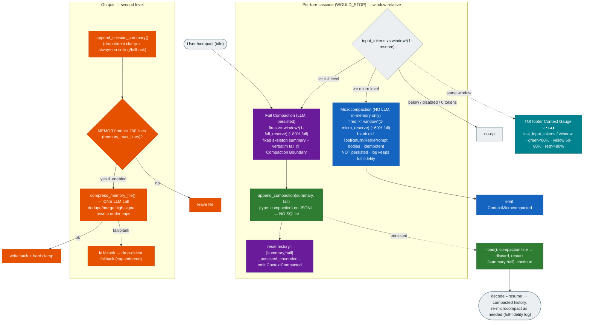

# 0006. Conversation compaction — window-relative two-tier in-context + on-exit memory compression, on JSONL

**Status:** Accepted
**Date:** 2026-06-26

## Context

[ADR-0002](0002-milestone-1-vanilla-agent-architecture.md) §8/§9 built the M1 context layer — the
append-only JSONL **session log** (`context/session_log.py`) powering `decode --resume`, and the
one-sentence on-exit memory write-back (`memory/extract.py::summarize_session`) — and **deliberately
deferred compaction**, naming `summarize_session` as "the seam M4 compaction grows from." A long session's
`message_history` grows toward the model's context window (cost/latency/truncation risk); separately, the
model-maintained `MEMORY.md` is kept under its cap by **dropping the oldest lines** (losing old facts).

This ADR records compaction as **three cooperating mechanisms** plus a UI affordance, as one feature
(tasks 041-049, feature `context-compaction`):

1. **Microcompaction** — cheap, no-LLM, in-memory tier that blanks old tool-output bodies.
2. **Full Compaction** — LLM tier that summarizes older history; **persisted** to the JSONL log.
3. **Memory Compression** — on-exit LLM compressor for `MEMORY.md`, replacing lossy drop-oldest.
4. **Context Gauge** — a footer fill circle reading the same window setting.

pydantic-ai touchpoints were verified against the **installed pydantic-ai 2.0.0** (§3), so they are not
re-litigated downstream.

## Decision

1. **Storage for full compaction: a typed `compaction` line on the existing append-only JSONL log — NO
   SQLite.** A deliberate, recorded **divergence** from the AGENTS.md "conversation log (SQLite)" wording
   and the Tech Stack "Datastore: SQLite" row. For a single-process, single-writer agent, an append-only
   JSONL log with a self-contained checkpoint line suffices and reuses the ADR-0002 §9 seam. SQLite stays
   a **deferred** option; task 048 corrects the AGENTS.md `context/` wording to `(JSONL)`. A `compaction`
   line carries the serialized summary message **and** the kept tail; on replay `load()` discards the
   accumulated history at that line and restarts from `[summary, *tail]`, then continues — earlier
   verbatim copies of the tail are superseded, never double-counted.

2. **Two in-context triggers, BOTH automatic, plus a manual one — a cheapest-first cascade.** After a turn
   persists at `WOULD_STOP`, and only when `compaction_enabled`:
   `if input_tokens >= full_level → full; elif input_tokens >= micro_level → microcompaction; else
   nothing`. Manual **`/compact`** (idle-only) forces a **full** compaction, ignoring thresholds and
   `compaction_enabled`. Microcompaction reduces tokens for **subsequent** turns.

3. **Measure: window-relative reserve (supersedes the earlier flat-threshold choice, at the user's
   request).** A tier fires when `input_tokens >= context_window * (1 - reserve)`, with a **configurable
   window** (`compaction_context_window_tokens`, default = Gemini 2.5 Flash's input window `1_048_576` —
   "set this to your active model's input window") and **per-tier reserve fractions**:
   `compaction_reserve_fraction = 0.20` (full fires at 80% full) and `microcompaction_reserve_fraction =
   0.40` (micro fires earlier, at 60% full). **INVARIANT:** `microcompaction_reserve_fraction >
   compaction_reserve_fraction` (micro reserves more → fires first), asserted on defaults. This
   **deliberately supersedes** the ADR's earlier flat-threshold / "no per-model window" stance — but the
   window is a **single configurable number, still not a per-model table**. **Verified pydantic-ai 2.0.0
   API:** usage is a **property** — `run.result.usage.input_tokens` (`run.result.usage()` raises
   `TypeError`; the 1.x `request_tokens` names are gone); `TestModel` populates `input_tokens` (56 for a
   short prompt). pydantic-ai's `ModelProfile` exposes **no** context-window field (verified), so the
   configurable setting is the sole contract — no auto-detect. **Safe fallback:** `input_tokens == 0`
   (unpopulated) → no tier fires that turn.

   3a. **Microcompaction is in-memory ONLY — never persisted.** It rebuilds messages **older** than the
   kept recent tail, replacing each `ToolReturnPart`/`RetryPromptPart` **content** with a placeholder
   (`"[tool output elided by microcompaction]"`) via `dataclasses.replace` (no in-place mutation). It only
   blanks content — never removes a message/part — so it can never orphan a tool-call/result pair (no
   boundary-snap needed). It is **idempotent**. It does **not** write to the JSONL log and does **not**
   move `_persisted_count`: the log keeps **full fidelity** for recovery; resume replays full history and
   re-microcompacts. This is the clean distinction from full compaction (which IS persisted).

4. **Full-compaction summary shape: a fixed Markdown skeleton.** A NEW, fuller summarizer
   (`context/compaction.py`), distinct from `summarize_session` (which stays for memory write-back) but
   reusing its `_resolve_model` pattern and transcript style. Skeleton (converged on by opencode and pi):
   `# Conversation summary` → `## Goal` → `## Constraints & Preferences` → `## Progress` (Done · In
   Progress · Blocked) → `## Key Decisions` → `## Next Steps` → `## Critical Context`. The filled skeleton
   becomes a synthetic head `ModelRequest`/`UserPromptPart`, framed as a summary of the earlier
   (compacted) conversation.

5. **What survives full compaction: summary message + a recent verbatim tail, snapped to a Compaction
   Boundary.** Post-compaction history is `[summary_message, *tail]`; the tail fits
   `compaction_keep_recent_tokens` (default `20_000`), cut **snapped back to a user-turn boundary** so it
   never splits a tool-call/result pair. **No file re-hydration** (re-confirmed by the user: keep recent
   turns verbatim, do not re-read files). The prior summary, as element 0, makes **successive full
   compactions merge for free** — no merge logic.

6. **Consistency invariant (full compaction).** A full compaction keeps the JSONL log (new `compaction`
   line), the in-memory `message_history` (`[summary, *tail]`), and `_persisted_count` (reset to that
   length) in lockstep. Auto runs inside the turn's single-flight section; `/compact` runs only when idle.

7. **Manual control.** `/compact` is a reserved slash command parsed before the skill branch, idle-only
   (busy → friendly line), forcing a full compaction with the `ContextCompacted` confirmation.

8. **Second level — on-exit Memory Compression for `MEMORY.md`, at the 200-line cap.** When the file
   reaches `memory_max_lines` (**200**), `compress_memory_file(cwd, *, model_or_settings)` makes **one**
   cheap LLM call (reusing `_resolve_model`) to dedupe/merge the highest-signal facts and rewrite under
   the caps, hard-clamped by `clip_lines_to_budget`. Hooked into `extract_on_exit` after the dated-bullet
   append, gated by `memory_compression_enabled` (default `True`), **fully non-fatal**. **Drop-oldest
   remains the guaranteed fallback** (the always-on ceiling inside `append_session_summary` AND the
   fallback when the call fails/blank) — so the cap is ALWAYS enforced, even with no/failed model.

9. **Context Gauge (UI affordance, same window = single source of truth).** A footer fill circle
   (`tui/render.py::context_gauge`) renders `last_input_tokens / compaction_context_window_tokens` as a
   pie-fill glyph `○◔◑◕●` + percentage, colored green/yellow/red by the **same** tier fill lines
   (`1 - micro_reserve` = 60%, `1 - full_reserve` = 80%), so the user watches context approach
   compaction. It reads a clean `AgentTurnHandler.last_input_tokens` property (never a private attr).
   Terminal note: a true ring-with-gap isn't single-character-renderable; `○◔◑◕●` is the portable
   pie-fill approximation.

## Diagram

## Consequences

- **The M1 compaction seam is realized** from `summarize_session` without disturbing it; full compaction
  and memory compression reuse the same `_resolve_model` pattern, so CI stays offline.
- **Window-relative thresholds replace the earlier flat numbers at the user's request.** The trigger is
  now "how full is the window" (`input_tokens >= window*(1-reserve)`), which adapts to whatever model/
  window the user configures — while remaining a single configurable number, **not** a per-model table.
  Because pydantic-ai exposes no model window, the setting is the contract (no auto-detect to drift).
- **Per-tier reserves give cheapest-first defense:** microcompaction (no LLM, in-memory) absorbs pressure
  from ~60% full; full compaction (one LLM call, persisted) only at ~80% full or on `/compact`.
- **Microcompaction is in-memory only** — the JSONL log retains full fidelity; resume re-applies it. It
  can never orphan a tool pair (blanks content, removes nothing). Trade-off: old tool-output detail leaves
  the in-context window (recoverable from the log) — the intended cost saving.
- **Recoverability is preserved on JSONL for full compaction**; a malformed checkpoint degrades safely to
  the un-compacted history (tolerant, like the `messages`-line replay).
- **The JSONL-over-SQLite divergence is deliberate and recorded** (§1); task 048 corrects AGENTS.md.
- **Tail sizing uses a coarse `chars≈/4` estimate** (keep-recent cut + micro "old" boundary only — never
  the trigger, which is provider-authoritative), because pydantic-ai exposes only aggregate per-leg usage.
  Bounded (affects only how much recent context is kept). Reviewed and accepted.
- **Memory Compression replaces lossy drop-oldest at the 200-line cap** with high-signal LLM compression,
  drop-oldest remaining the guaranteed fallback/ceiling — durable facts survive far longer than pure
  truncation allowed, and the cap is always enforced even with no/failed model.
- **The Context Gauge ties the same window to a visible warning** so the user sees compaction coming; its
  color tiers are derived from the same reserve fractions (single source of truth). Glyph style is a
  portable pie-fill approximation, swap-able in one helper.
- **Successive full compactions need no merge code** — the prior summary rides as the head.
- **Non-goals (deliberate):** file re-hydration (re-confirmed out), a per-model context-window table /
  auto-detection (the window is one configurable number), and any SQLite/durable store — all deferred.
  *(Microcompaction is no longer a non-goal; it is an in-scope tier.)*
