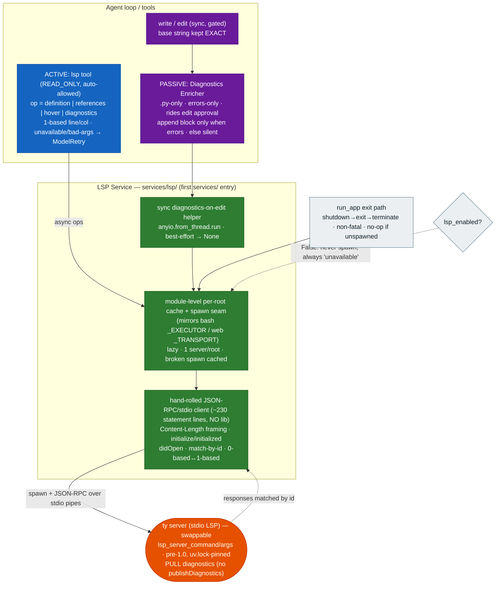

# 0007. LSP integration — `ty`-backed Python code intelligence via two channels, on a hand-rolled stdio client

**Status:** Accepted
**Date:** 2026-06-27

## Context

decode's tools see the codebase as **text**: `read` numbers lines, `grep` regex-matches, `glob` lists
paths. They cannot answer "where is this symbol defined?", "who calls it?", or "does this edit
type-check?" — the **semantic-graph** view. The research framing (the project wiki's
`concepts/lsp-integration.md` and `comparisons/lsp-integration-3way.md`) puts the real axis as
codebase-as-semantic-graph vs codebase-as-text, and identifies **two orthogonal delivery channels**
for an LSP integration that decode should ship **both** of:

1. an **active** channel — a model-callable tool the agent invokes on demand;
2. a **passive** channel — post-edit diagnostics folded into the edit's output, called out as
   *"the single best ROI of an LSP integration."*

The AGENTS.md target tree already reserves `services/` for "LSP servers"; this is the first concrete
entry. The cross-cutting lessons to honor: **lazy per-root launch** keyed by (root, server), **cache
broken spawns**, and keep everything **best-effort** so a missing/slow server never breaks a turn.

Constraints from the project: infrastructure is imported/called directly, not abstracted, until a
second implementation exists (AGENTS.md); async for network/subprocess I/O; secrets never matter here
(no credentials); CI is offline and unit tests must not spawn heavy subprocesses.

This ADR records the LSP feature (tasks 050-056, feature `lsp-integration`) as **one** design
decision.

## Decision

1. **Both channels, minimal, Python-only.**
   - **Active:** a single model-callable `lsp` tool with a four-op surface — `definition`,
     `references`, `hover`, `diagnostics`. It is `ToolKind.READ_ONLY` (it only reads code
     intelligence), so — exactly like `read`/`web_fetch` — it raises `ApprovalRequired` until the call
     is approved and the permission gate **auto-allows** it under `default` mode (no human prompt).
     Unavailable/unknown-op/bad-args map to `ModelRetry` (model-readable), never a crash.
   - **Passive:** the **Diagnostics Enricher** — after a *successful* `write`/`edit` on a `.py` file,
     a pull-diagnostic request runs and an **errors-only** summary is appended to the tool's return
     string (the existing `Wrote …`/`Edited …` base string is kept **exact**; the block is appended
     only when there are errors). It **rides the edit's already-granted approval** — no extra gate —
     and is **silent** on clean files and whenever the server is unavailable. Gated by
     `lsp_diagnostics_on_edit` (default `True`) under the master `lsp_enabled`.

2. **Server: `ty` (Astral), swappable.** The default Language Server is `ty server` (stdio LSP) —
   same vendor as the project's `ruff` + `uv`, installed via `uv add --dev ty` (invoked as a
   subprocess, never imported). It supports all four ops plus document-symbols/completions (we ship
   only the four) and the **pull** diagnostics model (`textDocument/diagnostic` request→response), so
   the client is **purely request/response — NO `publishDiagnostics` push handling**. The server is a
   **swappable setting** (`lsp_server_command` + `lsp_server_args`), so `pylsp` (or any stdio LSP
   server) is a documented drop-in. **Honest caveat:** `ty` is **pre-1.0 / preview** (~v0.0.55) —
   pinned by `uv.lock`; we accept the churn risk for the vendor alignment and speed, and the
   swappable seam is the escape hatch.

3. **Client: a hand-rolled thin JSON-RPC-over-stdio client** in a new `src/decode/services/lsp/`
   package (~230 statement lines, docstring-heavy) — the **first** `services/` entry. **No protocol library** (no `multilspy`,
   no `lsprotocol`): teaching the wire is the point. It spawns `ty server` with stdio pipes, does
   `Content-Length`+JSON framing, the `initialize`/`initialized` handshake, `textDocument/didOpen`,
   then `definition`/`references`/`hover` + a pull `diagnostic` request, **matching responses by id**;
   `shutdown`/`exit` on app close. It is **async** (asyncio subprocess) to fit decode's async tools/
   loop. It speaks LSP's **0-based** positions on the wire but exposes a **1-based** line/column
   surface to callers (consistent with `read`'s `cat -n` and `grep`'s `path:lineno`), converting at
   this one boundary.

4. **Lazy, one server per project root, behind a module-level seam — mirroring bash's `_EXECUTOR`.**
   The server is spawned on first use and **cached per root**; a **broken/failed spawn is cached** (a
   sentinel) so a missing or crashing `ty` does not trigger a retry storm on every edit/tool call —
   that root is "unavailable" until process restart. The spawn point is a **patchable seam** (like
   `web.py`'s `_TRANSPORT`) so unit tests inject a fake process with canned framed responses — **no
   real `ty`/subprocess in unit tests**. The `lsp` tool reaches the client through this seam; the
   enricher reaches diagnostics through a **sync** best-effort helper on the same service (one cache,
   one client).

5. **Sync→async bridge for the enricher.** `write`/`edit` are **sync** functions (local file I/O;
   pydantic-ai runs them in an anyio worker thread) while the client is async. The enricher therefore
   calls a **sync** service helper that bridges to the async client internally (e.g.
   `anyio.from_thread.run`, valid from the worker thread), is **best-effort**, and returns `None` on
   any failure (no portal, timeout, unavailable, or no errors). This keeps `files.py` sync and simple
   and confines the bridge to one place; unit tests patch the sync helper, so the bridge only runs in
   integration/real use.

6. **Best-effort everywhere; `lsp_enabled` is the master gate.** Spawn failure, per-request timeout
   (`lsp_request_timeout_s`, default `10.0`s; the initialize is bounded too), closed pipe, or
   malformed frame all resolve to "unavailable" — never an exception into the loop, the tool layer, or
   an edit's return. `lsp_enabled == False` short-circuits to "unavailable" with **no spawn at all**.
   The server is shut down on the existing `run_app` exit path (next to the memory write-back),
   non-fatally and as a no-op when nothing was spawned.

7. **Settings (config-driven, mirrored in `.env.example`):** `lsp_enabled` (`True`),
   `lsp_server_command` (`"ty"`), `lsp_server_args` (`["server"]`), `lsp_diagnostics_on_edit`
   (`True`), `lsp_request_timeout_s` (`10.0`). `ty` is a **dev-group** dependency — so an install
   without dev deps simply degrades to "unavailable", consistent with the best-effort posture.

## Diagram

## Consequences

- **decode gains the semantic-graph view** alongside text tools, through two channels that are useful
  independently: the model can query Code Intelligence on demand, and *every* `.py` edit gets a free
  error check folded inline — the highest-ROI half.
- **First `services/` entry, no premature abstraction.** The LSP Service is concrete and direct (one
  stdio client); no shared "services" interface is introduced until a second server (MCP, LLM gateway)
  arrives — honoring AGENTS.md's "no abstraction without a second caller." The module-level per-root
  seam reuses the established `_EXECUTOR`/`_TRANSPORT` pattern, so it is mockable and swappable.
- **Hand-rolled wire is the teaching payoff and a small maintenance cost.** Framing/handshake/match-
  by-id are ~230 statement lines we own; a protocol-library upgrade is deliberately forgone. The pull-only
  diagnostics model keeps the client request/response — no async notification state machine.
- **`ty` is pre-1.0 — recorded honestly.** It is pinned by `uv.lock` and lives in the dev group; the
  swappable-server setting is the escape hatch if `ty` churns or a user prefers `pylsp`. An install
  without dev deps (or without `ty` on PATH) degrades silently to "unavailable" — by design.
- **Best-effort is load-bearing.** A missing/slow/crashing server, a sync→async bridge with no portal,
  or a malformed frame never breaks a turn or an edit — the worst case is the absence of an inline
  diagnostic or a `ModelRetry` telling the model to fall back to `read`/`grep`. Broken spawns are
  cached to avoid retry storms on every edit.
- **The sync/async seam is confined.** `write`/`edit` stay sync (their base strings unchanged); the
  one sync→async bridge lives in the service and is patched out in unit tests, so the test suite never
  spawns a subprocess and CI stays offline.
- **READ_ONLY + no extra gate keeps UX consistent.** The `lsp` tool auto-allows like other read-only
  tools; the enricher rides the edit's existing approval — no new prompts, no double-gating.
- **Non-goals (deliberate):** ops beyond the four (document-symbols, completions, rename, formatting),
  `publishDiagnostics` push, non-Python languages, a multi-server registry, and promoting `ty` to a
  runtime dependency — all deferred. The swappable single-server seam is the extension point if any of
  these is revisited.
