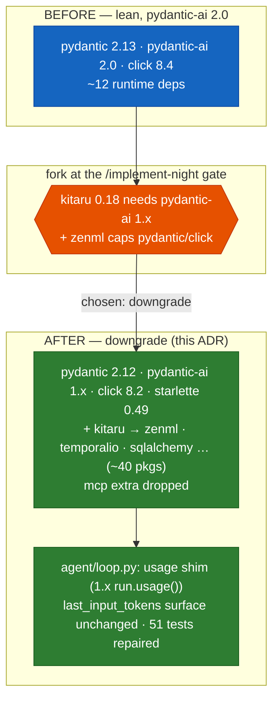

# 0009. Downgrade pydantic-ai 2.0 → 1.x (and cap pydantic/click) to integrate the Kitaru runtime

**Status:** Accepted
**Date:** 2026-06-28

## Context

ADR-0008 chose **Kitaru** for the durable runtime (tasks 057-062). Implementation immediately hit a
hard wall: **`kitaru` 0.18.0 (the latest release) cannot co-resolve with decode's core pins.** Kitaru
drags in `zenml[local]>=0.95.1` plus its PydanticAI adapter, which impose a chain of upper bounds the
lean decode stack violates:

| decode wants | kitaru/zenml/adapter caps at | via |
|---|---|---|
| `pydantic >=2.13.4` | `pydantic <=2.12.5` | `zenml[local]` |
| `pydantic-ai >=2.0.0` | `pydantic-ai-slim >=1.89,<1.104` (the **1.x** line) | `kitaru[pydantic-ai]` |
| `click >=8.4.2` | `click <=8.2.1` | `zenml[local]` |
| `pydantic-ai[mcp] → mcp >=1.24` | `mcp >=1.19,<1.20` | `kitaru[mcp]` |

No extras subset and no newer/pre-release kitaru resolves — **kitaru's `KitaruAgent` adapter, which
ADR-0008 depends on, only supports pydantic-ai 1.x.** decode adopted pydantic-ai 2.0 deliberately (the
agent loop + the M1 capstone are built on it), so this is a genuine fork, surfaced at the
`/implement-night` gate: **downgrade the project**, **isolate kitaru in its own env**, or **defer**.
The decision (human-gated) was **downgrade**.

A spike measured the real cost before committing:

- **Resolution converges** after rolling back `pydantic`→2.12, `pydantic-ai`→1.x, `click`→8.2,
  `starlette`→0.49, and **dropping kitaru's `mcp` extra** (it conflicts with pydantic-ai's own mcp).
- It pulls in **~40 transitive packages** — `zenml`, `temporalio`, `sqlalchemy`, `sqlmodel`,
  `tokenizers`, `xai-sdk`, … — a large footprint for a CLI that is "kept light on purpose".
- **Code breakage is small and centralized: 51 unit tests, sharing a few pydantic-ai 1.x↔2.0 API
  shims.** All core modules still import cleanly under 1.x; the dominant break is the `usage` API —
  2.0's `run.result.usage.input_tokens` (a property) is 1.x's `run.usage()` with
  `request_tokens`/`response_tokens`. The failures cluster entirely in the agent-loop / tool-through-
  agent / app-e2e paths that drive a real turn.

## Decision

1. **Pin to kitaru-compatible ranges** in `pyproject.toml`: `pydantic>=2.0,<2.13`,
   `pydantic-ai>=1.89,<1.104`, `click>=8.1,<8.3`; add `kitaru[local,pydantic-ai,llm]>=0.18.0`. `uv.lock`
   captures the full resolved tree.
2. **Drop kitaru's `mcp` extra.** It pins `mcp 1.19.x` against pydantic-ai's `mcp >=1.24`. decode has
   no MCP feature until step 15; revisit the extra (or a compatible kitaru) then.
3. **Repair the agent loop for pydantic-ai 1.x, minimally and centrally.** Fix the `usage` access in
   `agent/loop.py` (and any sibling 1.x shims) **behind decode's existing public surface** — the
   `last_input_tokens` property stays stable so ADR-0006 compaction triggers and the task-047 context
   gauge keep working untouched. Do **not** rewrite the loop; the 51 failures collapse to a handful of
   root causes.
4. **Accept the heavy transitive footprint** (zenml/temporalio/sqlalchemy/…) as the inherent cost of
   kitaru being zenml-based — recorded honestly here rather than hidden.

## Diagram

## Consequences

- **Step 7 is unblocked** — kitaru installs, and tasks 057-062 build in-process against the same
  `build_agent()` (no subprocess isolation needed now).
- **The footprint cost is real and recorded.** decode's runtime tree grows from ~12 deps to a
  zenml/temporalio-class stack; four libraries are rolled back; the `mcp` extra is deferred. This is
  the price of kitaru; the "kept light on purpose" note in `pyproject.toml` no longer fully holds for
  the runtime path.
- **The repair is small, not a rewrite.** 51 failing tests share a few 1.x API shims, confined to
  `agent/loop.py` behind a stable public surface; 872 tests were already green under 1.x.
- **A new ceiling.** Until kitaru supports pydantic-ai 2.x, decode cannot adopt pydantic-ai 2.x
  features, and the MCP step (15) must use a kitaru/mcp combination that resolves. The **isolation**
  fork (run the headless runtime in its own pydantic-ai-1.x env while the TUI stays on 2.0) remains the
  documented escape hatch if the shared downgrade becomes untenable.
- **Reversible.** The change is pins + `uv.lock` + a confined loop shim; reverting is `git revert` of
  task 063 + `uv sync`. ADR-0008's design is unaffected — only the version floor moved.

## Non-goals

- Isolating kitaru in a separate process/venv (the alternative fork — deferred, kept as the escape
  hatch).
- Restoring pydantic-ai 2.0 (blocked until kitaru catches up).
- The kitaru `mcp` extra (revisit at step 15).
