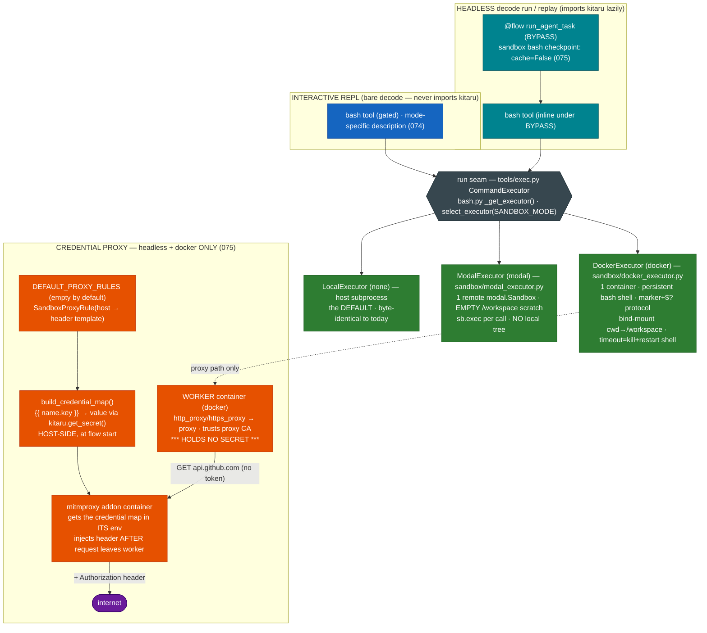

# 0011. Sandboxing + Credential Proxy — three executors behind one run seam, a headless mitmproxy for tool credentials

**Status:** Accepted
**Date:** 2026-07-02

## Context

decode runs model-chosen shell commands through the `bash` tool, which today dispatches to a
`LocalExecutor` — a host `asyncio` subprocess — behind the `CommandExecutor` Protocol in
`tools/exec.py`. That Protocol was designed from day one as **the one real abstraction** (ADR-0002
§7,10, AGENTS.md): `async run(command, *, cwd, timeout_s) -> ExecResult`, infra-agnostic, with
`bash.py` holding a module-level `_EXECUTOR`. ADR-0002 explicitly deferred the sandboxed
implementations to "M8". This is M8.

Two more forces converge here. ADR-0008 §5 + its "Future work — the Credential Proxy at the sandbox
step" fixed the design of Kitaru's real Credential Proxy and deferred it *for a structural reason*:
the proxy sits **between an isolated worker and the network**, and until now decode had no isolated
worker (`bash` ran in-process). This ADR is the implementation ADR that section promised. And ADR-0010
gave `decode run` a **what-if Replay** whose correctness assumes cached turns are pure — which shell
side effects are not, forcing an explicit decision here (Decision §5).

Facts confirmed while scoping (installed toolchain): `docker` CLI 29.4.3 present (daemon not always
running — the guard must handle it); the `docker` **Python SDK is present only transitively via
zenml** (must not be relied on); `modal 1.5.1` is a first-class runtime dependency exposing
`modal.Sandbox.create(app=…, image=…, timeout=…)`, `sb.exec(...)`, `Sandbox.terminate`, and
`App.lookup(name, create_if_missing=True)`; the canonical design lives in the kitaru repo
`examples/end_to_end/agent_harness_platform` @ 90f123f and the kitaru.ai walkthrough "Stage 2 — Your
agents need a sandbox" (decode **adapts** these; `SandboxProxyRule` / `build_credential_map` /
`DockerProxy` are NOT in the `kitaru` package). mitmproxy runs **inside its own container** (official
`mitmproxy/mitmproxy` image + a mounted addon) — it is not a decode dependency.

Project constraints honored: infrastructure is imported/called directly (no gateway); the interactive
REPL stays kitaru-free; `sandbox/` is the reserved module for the sandbox executors; **secrets never
reach the model or the sandbox payload** (AGENTS.md). This ADR is groomed into tasks **071–077**
(feature `sandboxing`) and **extends** ADR-0008 (it does not supersede it).

## Decision

1. **`SANDBOX_MODE=none|docker|modal`, default `none`, selecting the executor behind the existing
   seam (task 071/074).** A new pydantic-settings field (mirrored in `.env.example`) chooses the
   `CommandExecutor` `bash` uses. `none` = today's `LocalExecutor` — **byte-identical behavior for
   every existing `.env` and test**. The Protocol in `tools/exec.py` is unchanged (`run`-only);
   `LocalExecutor` stays there as the non-sandbox default. The two real sandboxes live in a new
   `src/decode/sandbox/` package (`docker_executor.py`, `modal_executor.py`) and are selected by a
   **lazy** seam in `bash.py` (`_get_executor()` → `decode.sandbox.select_executor(mode)`), so `none`
   mode imports no docker/modal sandbox code. A friendly one-line stderr **startup guard** (the
   task-004 `GEMINI_API_KEY` pattern) fires — in both the REPL startup chain and the headless
   `decode run`/`replay` preflight — when the chosen backend is unavailable (docker daemon
   unreachable / modal credentials absent): non-zero exit, never a traceback. Presence, not
   correctness (matching the provider-key guards). The mode is read **once at startup and fixed for
   the session** — the architecture diagram's "Where does it run?" diamond is answered by
   configuration, not per-command routing (the per-command dispatch alternative was offered and
   declined at grooming).

2. **Docker mode = ONE session-persistent container running a persistent shell (task 072).** Lazily
   `docker run -d --rm -v <cwd>:/workspace -w /workspace <image> sleep infinity` on the first `bash`
   call; every later command runs through **one long-lived `docker exec -i <id> bash --noprofile
   --norc`** whose stdin we write each command into, reading stdout up to a unique end-marker line
   carrying `$?`. So `cd` / `export` / `pip install` / background jobs **persist across bash calls**
   within a session — the canonical DockerSandbox shape, and the reason a per-call `docker exec sh -c`
   was rejected (it persists the filesystem but *not* `cd`/`export`). File tools stay host-side; the
   bind mount keeps one shared tree (no split-brain). Torn down on decode exit (`--rm` is the
   crash backstop). Isolation = process + everything outside the repo tree; the repo stays writable by
   design. Access is via the **standard docker CLI**, shelled out with `asyncio` subprocess (see
   Alternatives) — dependency-free and the teaching payoff.

   - **Timeout contract survives the persistent shell.** On timeout the `ExecResult` contract
     (`timed_out=True`, partial output, no orphaned processes) still holds via the simplest honest
     rule: **kill and restart the shell** (which resets shell state — cwd back to `/workspace`, env
     cleared), and **say so in the model-facing reply** (a `note` on `ExecResult`, appended by
     `bash._render`). `ponytail:` the ceiling — decode cannot surgically kill one hung command inside
     the container while preserving the session; a per-command PID/cgroup + `docker exec … kill` is
     the upgrade path.
   - **Recorded deviation from canonical.** The canonical Stage-2 example mounts an **empty named
     volume** (`workspace_<execution_id>`) at `/workspace` — no host tree. decode-docker deliberately
     **bind-mounts the cwd** instead, because decode keeps its file tools host-side and the real repo
     must be one shared tree with them. (decode-**modal**'s empty scratch `/workspace` *is* the
     canonical shape — §3.) This is the obvious reviewer question, pre-empted.

3. **Modal mode = ONE session-persistent remote `modal.Sandbox`, empty scratch (task 073).** Same
   lifecycle contract as Docker (lazy `Sandbox.create` via `App.lookup(name,
   create_if_missing=True)`, reuse, `terminate` on exit) but starting **EMPTY** at `/workspace` with
   **no local-tree sync** — the modal SDK imported directly (already a dependency). Each command is a
   fresh `sb.exec(...)` (filesystem changes — `git clone`, `pip install` — persist across calls on the
   sandbox fs; shell `cwd`/env reset per call, like `none` mode). On timeout the exec is terminated,
   the sandbox survives. Because the local tree is absent, the `bash` tool **description tells the
   model plainly** it runs in a remote scratch sandbox (git clone/fetch/generate to work with code) —
   the mode-specific description (task 074) is exactly why this can't surprise the model.

4. **Executor selection + mode-specific `bash` description (task 074).** `bash.py` keeps the cached
   `_EXECUTOR` seam (patchable/resettable for tests); on first use it selects by `SANDBOX_MODE` with
   lazy imports. The `bash` tool **description adapts per mode** via the tool's existing `prepare=`
   callback (mutating `ToolDefinition.description`): `none` stays **byte-identical** (zero change);
   `docker` states the live persistent-shell semantics + timeout-resets-state; `modal` states the
   remote-scratch / no-local-tree reality. Executor **teardown** (container/sandbox reap) wires into
   the `run_app` exit path next to the LSP shutdown + memory write-back (`tui/app.py`) and the
   headless flow's completion — best-effort, with `--rm`/modal-`timeout` as crash backstops. The
   permission gate is **unchanged** — sandbox is defense-in-depth beneath the same approval flow;
   "auto-allow sandboxed bash" is named future work.

5. **Headless replay-safety for sandbox bash (task 075) — reconciling with ADR-0010.** ADR-0010's
   Replay serves everything upstream of the anchor from **cache**; a cached `bash` turn would **not
   re-run its shell side effects** on replay (the article's explicit warning). Kitaru's own guidance
   for sandbox command tools is `checkpoint_strategy="calls"` (already decode's default, task 068) +
   `tool_checkpoint_config_by_name={<bash>: {"cache": False}}` so a replay **re-executes** bash instead
   of serving a stale, side-effect-free result. So in the bypass flow, **when `SANDBOX_MODE != none`**,
   `_build_runtime_agent` configures the `bash` checkpoint to re-execute rather than cache. (The HITL
   flow already opts `bash` out of its checkpoint entirely — a waiter — so it re-executes regardless;
   and `decode replay` is bypass-only.) The exact value shape (`{"cache": False}` vs a bare `False`,
   which would drop the checkpoint and lose replay-readiness) is **verified against the installed
   kitaru 0.18 SDK** before shipping. Trade-off, recorded: side-effectful commands re-run on replay
   (correct) rather than being cached (fast-but-stale).

6. **Credential Proxy — headless-only, docker-only, canonical (task 075).** Built exactly ADR-0008
   §5's three pieces, in `src/decode/sandbox/proxy.py`: `SandboxProxyRule` (per-host header templates),
   `build_credential_map(rules)` (host-side `{{ name.key }}` → value via `kitaru.get_secret(name).values`
   → `{host:{header:value}}`), and a `DockerProxy` topology — a `mitmproxy/mitmproxy` addon container
   on a shared docker network, the worker pointed at it via `http_proxy`/`https_proxy` and trusting its
   CA. The resolved map is handed **only to the proxy container's env, never the worker's**. Engaged
   only from the headless flow (a `_sandbox_proxy()` context manager in `runtime/flow.py`, mirroring
   `_durable_sleeper`/`_config_from_secret_store`) when `sandbox_mode == "docker"` and
   `sandbox_credential_proxy_enabled`; the REPL never builds it, so **bare `decode` never imports
   kitaru** (invariant untouched). `DEFAULT_PROXY_RULES` ships **empty** (opt-in; empty map = a
   passthrough proxy). Egress is **cooperative** (`http_proxy`/`https_proxy` + trusted CA) —
   `ponytail:` not an exfiltration barrier; internal-network lockdown is the upgrade path. The
   credential claim (worker never holds a token) holds regardless.

   - **Worker CA trust — stock image + CA-mount (task 075).** `SANDBOX_IMAGE` defaults to a stock
     `python:3.12-slim` (ca-certificates present, runs as root), so the no-proxy case needs no custom
     image. For the proxy path the worker must trust the mitmproxy CA: decode **mounts the proxy's
     generated CA into the worker and runs `update-ca-certificates` at container start** (rather than
     shipping an in-repo `sandbox.Dockerfile`). The outbound integration probe uses **python/urllib**,
     not curl (slim has no curl). Considered pair recorded in Alternatives.

7. **Isolation honesty + backend comparison.** Docker is the tutorial sandbox — *a filesystem and
   namespace boundary for accidental misbehavior, not a full hostile-code boundary* (shared kernel on
   Linux; on macOS Docker Desktop's VM adds a boundary for free). decode ships **rung 1 (Docker,
   laptop)** and **the hosted rung (Modal, remote)** behind one seam; the rest of the isolation
   spectrum is compared in the table below and is either a free daemon-config upgrade decode inherits
   for zero code, a future executor behind the same seam, or a documented non-fit.

### Isolation backends compared — why Docker + Modal

| Backend | Isolation boundary | Platform reach (student laptop) | Integration cost for decode | When it makes sense (honest) | Verdict (M8) |
|---|---|---|---|---|---|
| **`none` / `LocalExecutor`** | none (host subprocess, cwd-pinned) | macOS / Windows / Linux | shipped (baseline) | Trusted-host dev + CI hermeticity; the fast default | **KEEP as default** |
| **Docker (CHOSEN — local)** | container: namespaces + cgroups + fs; shared kernel (Linux); Docker Desktop VM boundary (macOS/Win) | macOS / Windows / Linux — **one install path** | one executor behind the seam (docker **CLI**, dependency-free) | Student laptop: contain *accidental* misbehavior; the canonical shape + the container network the Credential Proxy needs | **SHIP (rung 1)** |
| **Modal hosted sandbox (CHOSEN — remote)** | remote microVM; nothing runs on your machine (Modal runs gVisor underneath) | macOS / Windows / Linux (remote) | one executor behind the seam (modal SDK, **already a dep**) | Genuinely untrusted code; "nothing on my machine"; the M12 deploy target | **SHIP (hosted rung)** |
| **seatbelt (macOS) / bubblewrap (Linux)** | per-command OS jail (sandbox-exec / user namespaces) | macOS *or* Linux only; **nothing for Windows** | **two** per-OS executors; **no container network** (breaks the proxy topology) | Single-OS host, per-command jail with no daemon/image cost, no proxy needed (the claude-code approach) | Considered, **rejected** (2 backends, no Windows, no proxy network) |
| **gVisor** | user-space kernel (`runsc`) intercepts syscalls; strong on shared kernel | Linux only | **ZERO decode code** — daemon `--runtime=runsc` (inherited via the docker CLI) | Linux hosts / server-side multi-tenant hardening | **Free upgrade path** (docs, no task) |
| **Kata Containers** | per-container lightweight **VM** (KVM) | Linux only (KVM) | **ZERO decode code** — daemon `--runtime=kata` (inherited via the docker CLI) | Linux multi-tenant wanting VM-grade isolation with container UX | **Free upgrade path** (docs, no task) |
| **Firecracker microVMs** | minimal KVM microVM (kernel + rootfs + TAP) | Linux + KVM only | **whole new plumbing**; **no docker-CLI path** (raw FC; Kata-with-FC is the indirect route) | Linux/KVM multi-tenant *at scale*, typically via a platform (E2B / Lambda), not raw | **Non-goal** (macOS host; no CLI path) |
| **Other hosted (E2B, Daytona)** | remote container/microVM (vendor) | macOS / Windows / Linux (remote) | a new executor behind the seam (like Modal) | Same rung as Modal; a second hosted option if ever wanted | **Future executor** behind the seam |
| **WebAssembly (Wasm)** | capability-sandboxed VM; no ambient authority | macOS / Windows / Linux (constrained runtime) | new runtime + non-bash execution model | Constrained, non-bash, capability-scoped workloads | **Non-fit** — decode's tool *is* arbitrary bash |

**Why Docker + Modal, explicitly.** (a) **Portability / the educational argument** — they are the
only pair with **one install path across macOS, Windows, and Linux** student machines; the per-OS
jails (seatbelt/bwrap) and the Linux-only rungs (gVisor/Kata/Firecracker) can't be the *baseline* a
course ships. (b) **One code path each** behind the existing `CommandExecutor` seam — no new
abstraction. (c) **Docker** is the canonical `agent_harness_platform` shape **and** provides the
container-network topology the Credential Proxy requires (a per-command host jail does not).
(d) **Modal** is the article's hosted rung — "nothing executes on your own machine" — already a
dependency and the M12 deploy target. (e) **Threat-model split:** Docker contains *accidental*
misbehavior locally; genuinely untrusted code is answered by **Modal** (a different rung), not by a
thicker local jail. (f) On **macOS**, Docker Desktop's VM adds a hardware-ish boundary for free; on a
**Linux server** that bonus disappears — which is exactly when the **gVisor/Kata** rows become
relevant, and they cost decode **zero code** because `DockerExecutor` drives the standard docker CLI
(a Linux operator sets `--runtime=runsc`/`--runtime=kata` as the daemon default and every decode
sandbox command inherits that isolation). And when decode runs on **Modal**'s infra, the platform
already runs gVisor underneath. This is a direct dividend of the CLI-over-SDK choice (Alternatives).

### Alternatives considered (non-isolation-backend axis)

- **kitaru `run_sandbox_command` / stack sandbox flavors — rejected.** `zenml.sandboxes.LocalSandbox`
  is a subprocess with **no** isolation; a modal flavor exists but ties `bash` to a kitaru **stack**
  and would **import kitaru in the REPL** (breaking the bare-`decode`-is-kitaru-free invariant). decode
  keeps its own `CommandExecutor` seam. `kitaru.adapters.pydantic_ai.sandbox_command_toolset` likewise
  not adopted.
- **docker Python SDK vs docker CLI — chose the CLI.** The `docker` SDK is present only *transitively*
  via zenml; relying on a transitive dep is fragile, and `uv add docker` adds weight. Shelling out to
  the standard `docker` CLI via `asyncio` subprocess is dependency-free, mirrors `LocalExecutor`'s
  style, teaches the real commands, and — the strategic payoff — makes gVisor/Kata **zero-code**
  daemon-config upgrades (§7).
- **Modal local-tree sync — rejected.** The remote sandbox starts empty (`/workspace` scratch); no
  rsync/mount of the local tree. The model is told plainly (mode-specific description) and works with
  code via git/fetch/generate. Empty remote scratch *is* the canonical shape.
- **modal's dual proxy tokens as the credential path — out of scope here.** `MODAL_PROXY_TOKEN_*` are a
  request-header surface (the same shape this proxy injects); ADR-0008 §5 deliberately left `modal` off
  the model-key path for this reason. Unchanged.
- **stock image + CA-mount vs an in-repo `sandbox.Dockerfile` — chose stock + CA-mount.** The canonical
  example ships its own tiny image partly for CA trust + curl. decode keeps `SANDBOX_IMAGE` a stock
  `python:3.12-slim` and, on the proxy path only, mounts the mitmproxy CA + runs
  `update-ca-certificates` at container start (worker is root; slim has ca-certificates). Integration
  probe uses python/urllib (no curl in slim). An in-repo Dockerfile stays the escape hatch if the mount
  approach proves brittle.
- **Auto-allow sandboxed bash — future work.** The sandbox is defense-in-depth *beneath* the unchanged
  permission gate; treating "in a sandbox" as auto-approval is deferred.
- **Hard egress lockdown — future work.** Cooperative `http_proxy`/CA is the shipped ceiling
  (`ponytail:`); an internal-only network with default-deny egress is the upgrade path.
- **opencode-style git-shadow snapshots — non-goal.**

## Diagram

## Consequences

- **The one abstraction pays off exactly as designed.** Two new executors + a proxy land behind the
  ADR-0002 `run` seam with **zero** change to `bash`'s logic and **byte-identical** `none`-mode
  behavior — the default. The seam earns its keep by hosting three implementations.
- **Persistent-shell docker diverges from `none`/`modal` semantics — surfaced, not hidden.** `cd`/`env`
  persist in docker but not in `none`/`modal`; the mode-specific `bash` description is what keeps the
  model correct. A docker timeout resets the session (stated in the reply); the ceiling is recorded.
- **Replay stays honest for side effects.** Sandbox `bash` re-executes on replay (Decision §5) rather
  than serving a stale cached turn — the price is re-running side-effectful commands, the correct
  trade-off against ADR-0010's cache-upstream model.
- **The credential claim is real and testable.** The worker holds no token; the resolved map lives only
  in the proxy container; logs carry rule/host/header *names*, never values — the same
  names-not-values discipline as task 061, provable by scanning the worker env + logs.
- **Honest isolation, with a documented ladder.** Docker contains accidents locally; Modal is the
  untrusted-code rung; gVisor/Kata are free daemon-config upgrades decode inherits via the docker CLI;
  Firecracker/Wasm are non-goals/non-fits — all in one comparison table so the reader isn't misled.
- **CI stays offline.** The always-run capstone proves the executor **contract** + selection + the
  mode-description with a fake/`LocalExecutor` double; real docker/modal/proxy tests are `skipif`
  guarded so `make ci` is green without infra (mirroring the LSP `ty`-guarded and runtime local-stack
  patterns). Hermetic under `filterwarnings=["error"]` — executors close shells/containers
  deterministically.
- **The REPL stays kitaru-free.** The proxy is headless-only; `import decode.cli` still never imports
  kitaru.
- **Extends, does not supersede, ADR-0008.** It fulfils ADR-0008 §5's deferred "Future work — Credential
  Proxy" and cross-references ADR-0010's Replay. The glossary's `Sandbox` + `Credential Proxy` rows are
  updated and it gains `Sandbox Mode`, `Worker`, `Proxy Rule`.
