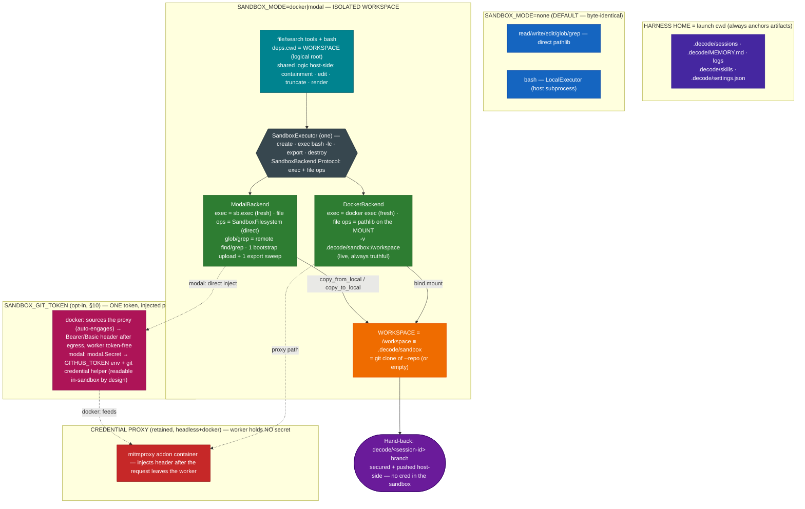

# 0012. Isolated Workspace — one SandboxExecutor + thin backends, file tools through the seam, clone-at-root

**Status:** Accepted
**Date:** 2026-07-03
**Amended:** 2026-07-04 — added §10: **one `SANDBOX_GIT_TOKEN`, two injection mechanisms** — modal
direct-injects it into the sandbox env; docker feeds it to the Credential Proxy (which auto-engages
when the token is set) so the worker stays cred-free. One knob lets the model push a branch / open a PR
from inside either sandbox; the docker-vs-modal split is only *how* the token is injected, not *which*
token or *where* it is configured.
**Amended:** 2026-07-13 — **§10 is superseded by [ADR-0016](0016-drop-credential-proxy.md)**: there are no
longer *two* injection mechanisms. The Credential Proxy is deleted and docker adopts modal's direct
injection, so `SANDBOX_GIT_TOKEN` reaches the Worker env as `GITHUB_TOKEN` in **both** backends — and a
sandboxed process can read it. §§1–9 (the whole Isolated-Workspace design, hand-back included) stand
unchanged. The §10 text below is left unedited as the record of what was decided on 2026-07-04.

Supersedes, in part, **[ADR-0011](0011-sandboxing-and-credential-proxy.md)**: §2 (the Docker
persistent-shell shape), §3 (the Modal empty-scratch / no-local-tree shape), and the two per-mode
`bash` descriptions. It **retains** ADR-0011 §1 (the `CommandExecutor` run-seam + `SANDBOX_MODE`
startup guard), §5 (replay-safety for sandbox bash), §6 (the headless docker Credential Proxy), and
§7 (the isolation-backend ladder).

## Context

ADR-0011 shipped `SANDBOX_MODE=docker|modal` as an **additive** split: the host file tools kept
operating on the real repo tree while only `bash` ran in a `.decode/sandbox/` scratch. The two
backends diverged sharply — Docker drove a *persistent shell* through a marker+`$?` protocol with a
kill-and-restart timeout; Modal ran *fresh-exec* in an empty remote scratch with no local tree — each
needing its own `bash` description. This works but is neither isolated (the agent's file tools still
touch the real repo) nor uniform (two shapes, two descriptions, two sets of edge cases).

The goal now is a **codex/opencode-style isolated Workspace**: in a sandbox mode the agent works on a
`git clone` of a **user-provided** repo at `/workspace`, with its *whole* tool scope (files + shell)
contained there, while decode's own harness artifacts stay put. `none` mode must stay byte-identical.

Two design forces were settled by the human during grooming:

1. **Truthful file tools.** A first design kept file tools on a host `.decode/sandbox/` **mirror** kept
   converged with the remote by an mtime-delta sync. This was **rejected**: an mtime delta cannot
   propagate a remote `rm`, so `read`/`glob` would eventually *lie* about the Workspace. Instead, file
   tools operate **directly on the sandbox filesystem through the backend seam** — the *pi* harness's
   `ExecutionEnv` "swap the set" pattern (swap the file-tool I/O backend per execution environment).
2. **Minimum transport.** With direct file ops there is no per-call sync; the only bytes that cross are
   ONE bootstrap upload at create and (Modal only) ONE end-of-session export sweep.

Facts confirmed while scoping (installed toolchain): `modal 1.5.1` exposes `Sandbox.filesystem`
(`SandboxFilesystem`) with `read_bytes` / `write_bytes` / `copy_from_local` (host→remote) /
`copy_to_local` (remote→host) / `list_files` / `make_directory` / `remove` / `stat` — verified via
`modal.sandbox_fs`; `ContainerProcess.stdin` is a writable `StreamWriter` (tar-over-exec is also
viable for the bootstrap). The docker CLI, the Credential Proxy topology, and the replay-safety
`{"cache": False}` config are unchanged from ADR-0011. This ADR is groomed into tasks **078–085**
(feature `isolated-workspace`).

## Decision

1. **Replace, not add.** In a sandbox mode the isolated Workspace *is* the behavior — the M8 split
   (host file tools on the real repo + `bash` in a scratch) retires as a user-facing state. `none`
   stays byte-identical (host `LocalExecutor`; direct-pathlib file tools; `deps.cwd` == launch cwd).

2. **One `SandboxExecutor` + two thin backends.** The two executors collapse into ONE `SandboxExecutor`
   (create → exec `bash -lc <cmd>` per call → destroy; **fresh-exec** in both) over a `SandboxBackend`
   Protocol that carries **exec + file ops + lifecycle**. Docker's persistent-shell + marker/`$?`
   protocol + shell-reset/kill-and-restart machinery is **deleted**; a docker timeout now kills the one
   `docker exec`, and the container survives (mirroring Modal's exec-dies-sandbox-survives rule).
   Filesystem persistence stays in both (one container / one sandbox per session).

3. **Workspace = clone at root.** `/workspace` (sandbox) ≡ host `.decode/sandbox/`
   (`settings.sandbox_workspace_dir`) ≡ a `git clone` of the repo the user supplies via
   `--repo <url-or-local-path>` / `SANDBOX_REPO` (host-side clone at the source's committed HEAD, using
   ambient git creds; `--local` for a fast local clone). No repo → an empty Workspace. `--repo` with
   `SANDBOX_MODE=none` → one friendly stderr line, non-zero exit. Results are returned via the built
   **Hand-back** (§8), not manual pushing.

4. **File tools operate on the sandbox filesystem through the seam ("swap the set").** The
   `SandboxBackend` Protocol grows `read_bytes` / `write_bytes` / `make_directory` / `list_dir` /
   `stat` / `remove`; the shared host-side logic (containment, edit's search/replace, truncation,
   rendering) stays *above* the seam and only byte transport is per-backend. **Docker** file ops are
   plain pathlib on the bind-mounted Workspace (the mount makes the host dir *be* the sandbox fs — zero
   remote plumbing, always truthful). **Modal** file ops are the `SandboxFilesystem` API (direct
   against the remote — no mirror). `glob`/`grep` run as **remote commands** (`find`/`grep`) via `exec`
   for both backends (never download the tree to search it), with output-parity to the host
   implementations. Containment is **layered**: above the seam, backend-agnostic path math
   (`_resolve_logical`, a logical-root fold — not host `Path.resolve`, since a Modal path is not a host
   path) rejects `..` / absolute escapes for *both* backends; and because a docker mount is shared with
   the host, the **docker** backend *additionally* resolves symlinks physically below the seam and
   raises `WorkspaceEscape` (an `OSError` the file layer renders as a refusal), so a symlink planted in
   the Workspace by `bash` cannot be followed off the mount onto the host — string math alone cannot see
   a symlink. **Modal** needs no such layer (remote-only file ops on a disposable sandbox — no host fs
   to escape onto). `none` mode keeps today's direct-pathlib tools, byte-identical.

5. **Transport is minimal (the mtime-sync is retired).** Docker: the bind mount is the only transport
   (always live — no bootstrap, no export). Modal: **ONE** bootstrap upload of the cloned repo +
   seeded skills at sandbox create (`copy_from_local` / tar-over-exec), and **ONE** end-of-session
   export sweep `/workspace` → host `.decode/sandbox/` (`copy_to_local`) so the final Workspace is
   host-visible for the git hand-back. A mid-session `/ship` may trigger the export standalone (the
   sandbox stays alive). No markers, no per-call deltas, no size-cap machinery.

6. **Harness Home vs tool scope.** The launch cwd is **Harness Home** — `.decode/sessions`,
   `.decode/MEMORY.md`, logs, `.decode/skills`, and the `.decode/settings.json` permission file always
   anchor there. Only the agent's tool scope (`deps.cwd`) moves into the Workspace. `AgentDeps` grows
   `harness_home`; the skills catalog/dispatcher and memory injection read `harness_home`, while the
   file/search tools + `bash` read `deps.cwd`. `extract_on_exit`, the session-log creation, and the
   permission-file load/persist are threaded with `harness_home` explicitly. In `none` mode the two
   are equal.

7. **Tool-placement rule: only arbitrary computation crosses the boundary.** Structured harness
   operations stay host-side, with their *effects* scoped to the Workspace where relevant:

   | Tool(s) | Placement | Scope |
   |---|---|---|
   | `read` / `write` / `edit` | host logic, byte transport through the backend seam | Workspace (`deps.cwd`) |
   | `glob` / `grep` | host logic; the search **executes in the sandbox** (`exec` find/grep) | Workspace |
   | `bash` | inside the sandbox | Workspace |
   | `enter_plan_mode` / `exit_plan_mode` / `sleep` / `todo_write` / `skill` / `ask_user` | host | pure harness state / context injection; Tasks + session/memory artifacts at Harness Home |
   | `web_fetch` | host, **stays gated** even in sandbox mode | reaches the host network |
   | `lsp` + post-edit Diagnostics Enricher | host (`ty`), pointed at the Workspace path | `none`+`docker`: live Workspace files; `modal`: best-effort-disabled + friendly note (ADR-0007-consistent) |
   | Agent / subagents (M10, future) | host loop; its tools **inherit the session seams** (module-level executor seam + same `deps.cwd`) — its `bash` lands in the SAME sandbox session, its file tools in the same Workspace | Workspace, for free (no new machinery) |
   | MCP factory (M15, future) | per-server placement decision (future-work) | — |

8. **Git hand-back — the harness ships the Workspace as a Session Branch, host-side.** The results of
   a sandbox session are guaranteed to survive: the harness (a) **collects** the local Workspace git
   state at `.decode/sandbox` (docker: the live mount; modal: swept down by the executor `export()`
   first — `/ship` triggers an export mid-session); (b) **secures** them onto a deterministic
   `decode/<session-id-short>` **Session Branch** — the model is not trusted to have committed, so the
   branch is pointed at the final state and any dirty worktree is auto-committed (the model's own
   branches/commits are preserved, never rewritten); and (c) **ships** them with `git push origin
   decode/<session-id>` using the user's **ambient host credentials** — `--repo <URL>` lands the branch
   on the remote, `--repo <local path>` in the local source repo, credential-free. **Every git command
   runs host-side against the local Workspace — no credential ever enters the sandbox**, the identical
   secrets-never-in-the-sandbox invariant the Credential Proxy (§9) upholds. It is **skipped** for
   no-repo / non-git / unchanged-vs-cloned-HEAD Workspaces. **Layered durability:** the local Session
   Branch always exists even when the push fails (one friendly line names it and its
   `.decode/sandbox/` location). Triggered **both** automatically (REPL exit — best-effort/non-fatal
   alongside the memory/LSP/executor teardown; headless `decode run --repo` completion) **and**
   explicitly (the idle-only `/ship` TUI command, reserved like `/compact`/`/clear`, printing the
   branch + push outcome; a friendly "no sandbox workspace" line in `none` mode).

9. **Retained from ADR-0011, unchanged.** The `CommandExecutor` run-seam + `SANDBOX_MODE` startup
   guard (§1); the replay-safety `{"cache": False}` bash checkpoint when `sandbox_mode != "none"` (§5);
   the headless docker Credential Proxy — now wired to the docker **backend adapter**, `install_executor`
   seam intact (§6); and the isolation-backend ladder table (§7). The interactive REPL stays kitaru-free
   and the `none` path imports no sandbox module.

10. **Sandbox tool credentials — one `SANDBOX_GIT_TOKEN`, injected differently per backend.** Beyond
    the host-side hand-back (§8), a model may want to make its *own* authenticated call from inside the
    Workspace — `git push` its branch, `gh pr create` — so the results go remote → remote without the
    host-side export/ship "sync" at all. A **single** setting, `SANDBOX_GIT_TOKEN`, supplies that
    credential for **both** backends; only the injection *mechanism* differs, because **only docker can
    co-locate a proxy**:
    - **docker → the Credential Proxy (cred-free).** The retained headless mitmproxy sidecar (§9 / §6)
      injects the credential *after* the request leaves the worker, on a per-run docker network — the
      worker holds **no** token. When `SANDBOX_GIT_TOKEN` is set **non-empty** the proxy **auto-engages**
      (no separate `SANDBOX_CREDENTIAL_PROXY_ENABLED` flag needed) and `github_token_rules` builds the two
      host-side header rules from that one token — Bearer for `api.github.com`, Basic `x-access-token:<PAT>`
      for the `github.com` git transport (GitHub's git-over-HTTPS does not accept Bearer). **git is
      installed into the proxy-wired worker at create** (its apt egresses through the proxy's passthrough
      to the Debian mirrors, the CA already trusted) so that Basic rule has a client — a model `git push`
      from inside the sandbox authenticates end to end while the worker stays token-free. (The gate is on
      the resolved *value*, mirroring modal's `if token:`: an explicit `SANDBOX_GIT_TOKEN=` resolves to no
      value and leaves the proxy **down** — it never engages and injects empty garbage headers.) The
      `SANDBOX_CREDENTIAL_PROXY_ENABLED` flag + `DEFAULT_PROXY_RULES` (Kitaru secrets) remain the general
      path for **other** hosts. This is the hardened path; it costs a mitmproxy container and a CA-trust
      step.
    - **modal → direct injection (`SANDBOX_GIT_TOKEN`).** Modal has no co-located network to run a proxy
      on, so the *same* token is injected **into** the sandbox: `SANDBOX_GIT_TOKEN` rides a `modal.Secret`
      into the sandbox env as `GITHUB_TOKEN`, and a baked git **credential helper** reads `$GITHUB_TOKEN`
      at push time (so the token rides the Secret, never the cached image layer). `GITHUB_TOKEN` serves
      both `git push` and `gh` at once — no base64, no rule ordering, no dummy token. Simpler, but the
      token **is** readable inside the sandbox.
    The **source** is unified (one setting); the **mechanism** asymmetry is chosen on purpose: docker
    shares the host kernel, so keeping the secret out of the worker (inject after egress) earns its
    complexity; modal is a **remote, ephemeral** box, so a *scoped* token inside it has a bounded blast
    radius and buys real simplicity — mitigated by requiring a **fine-grained, repo-scoped PAT** (Contents
    + Pull requests), not a broad classic token. `SANDBOX_GIT_TOKEN` empty — unset (the default) *or* an
    explicit `SANDBOX_GIT_TOKEN=` — injects nothing on either backend and leaves the docker proxy down
    unless the flag opts it in, so the strict "no secret in the sandbox" invariant holds until an operator
    opts in; the host-side hand-back (§8) stays the credential-free way to ship results.

    > **Amendment (2026-07-13 — `gh` ships in both sandboxes; docker needs a decoy token).** §10 named
    > `gh pr create` as a motivating case but only ever installed **git**. A real run proved the gap: the
    > model pushed its branch, then died on `gh: command not found` — the push had already landed, so the
    > turn ended half-done, which is the worst possible failure shape. `gh` is now installed alongside git
    > in **both** backends (it is not in Debian bookworm, so both pull GitHub's own apt repo): docker
    > installs it per session in `_git_setup_command()`; modal bakes it as a cached image layer.
    >
    > The docker path needed one thing this ADR did not foresee — and §10 above already hints at it when
    > it credits modal with needing "no dummy token". **`gh` refuses to issue any request at all when it
    > finds no token in its env**: it fails *locally* with `gh auth login`, never emitting the HTTP request
    > the proxy exists to authenticate. A token-free worker therefore cannot drive `gh`, no matter how
    > correct the Proxy Rules are. So the proxy hands the worker a **decoy** `GH_TOKEN`
    > (`proxy._GH_PLACEHOLDER_TOKEN`): `gh` proceeds, sends `Authorization: token <decoy>`, and the addon
    > **overwrites** that header with the real credential after the request has left the worker
    > (mitmproxy's `headers[name] = value` replaces rather than appends). The invariant is untouched — the
    > decoy is an inert string that authenticates nothing, and the real credential still lives only in the
    > proxy container. The observable cost: `docker exec <worker> env | grep -i token` now prints the
    > decoy instead of nothing, so "the worker holds no token" is verified by checking that what it holds
    > is *not the secret*, rather than that it holds nothing at all.
    >
    > modal needs no decoy: `gh` reads the real `GITHUB_TOKEN` the `modal.Secret` already injects.

    > **Amendment (2026-07-13 — `DEFAULT_PROXY_RULES` name `Settings` fields, not Kitaru secrets).**
    > Where §10 says the `SANDBOX_CREDENTIAL_PROXY_ENABLED` flag + `DEFAULT_PROXY_RULES` (Kitaru secrets)
    > remain the general path for other hosts, the **Kitaru secrets** half is superseded
    > ([ADR-0015 §6](0015-environment-bucket-secrets.md)): a rule's header template names a `Settings`
    > **field** (`{{ acme_api_token }}`) and resolves from the hydrated config — at a remote `DECODE_ENV`
    > the value arrived via the Environment Bucket. The flag, the rules list, and the general-path role
    > are unchanged; only the resolution seam moved. `SANDBOX_GIT_TOKEN` / `github_token_rules()` (this
    > section's subject) are **untouched** — they build literal header values, since the Basic base64
    > transform is a computation no template can express.

## Diagram

## Consequences

- **One seam, one shape, one description.** Two executors + two `bash` descriptions collapse to one
  `SandboxExecutor` + one unified sandbox paragraph; the fresh-exec rule is identical across backends.
  The persistent-shell edge cases (marker sync, shell reset, loop-free teardown) are **deleted code**.
- **File tools never lie.** Direct file ops (docker mount / modal `SandboxFilesystem`) mean `read` /
  `glob` always reflect the true Workspace — including deletions — which the rejected mirror+mtime-sync
  could not guarantee. The price is a per-op remote round-trip on Modal (acceptable; the tool layer is
  sequential).
- **Minimum transport.** Only a bootstrap upload (both) and an end-of-session export (Modal) cross the
  wire; docker rides its mount for free.
- **The isolation is real and uniform** — the agent's whole tool scope is the Workspace; the harness's
  own artifacts stay at Harness Home; git is the hand-back via a **small host-side push mechanism**
  (commit → branch → `git push`), with the credential staying in the host process — never in the
  Worker, the same invariant as the Credential Proxy.
- **Results survive in layers** — the hand-back always leaves a local `decode/<id>` branch (dirty work
  captured, model commits preserved), and pushes it to the `--repo` source when creds allow; a push
  failure is a friendly branch-naming line, never a lost session. Auto on exit + explicit `/ship`.
- **M10 subagents inherit this for free** — they run on the host loop but their tools pick up the
  module-level executor seam + `deps.cwd`, so their `bash` and file ops land in the same session
  Workspace with no extra wiring.
- **Retained guarantees hold** — the startup guard, replay-safety, the Credential Proxy (worker holds
  no secret), the isolation ladder, the kitaru-free REPL, and the byte-identical `none` path.
- **One token, two postures (§10).** A single `SANDBOX_GIT_TOKEN` supplies the in-sandbox credential for
  an authenticated tool call *from inside* the sandbox on **both** backends — docker feeds it to the
  Credential Proxy (auto-engaging, worker stays token-free), modal trades that hardness for simplicity by
  injecting it into the sandbox env. The source is unified; only the mechanism differs. The default
  (empty) injects nothing and leans on the host-side hand-back, so "no secret in the sandbox" still holds
  everywhere until an operator opts in. The honest cost: an opted-in *modal* token is readable by a
  prompt-injected agent, bounded only by the PAT's scope — the reason the docker path stays proxy-based.
- **Honest ceilings (`ponytail:`):**
  - **Modal LSP is best-effort-off** — `ty` runs host-side and cannot reach the remote fs. Upgrade
    path: run `ty` inside the sandbox over piped stdio (deferred).
  - **Modal in-flight loss on revival** — a max-lifetime-expired sandbox is recreated + re-bootstrapped
    from the host `.decode/sandbox` state; in-sandbox changes since the last export may be lost (the
    note says so) — still better than the old total reset.
  - **Local `--repo` clones HEAD only** — a local source's uncommitted working-tree dirt is not copied.

## Future work

- **Auto-allow sandboxed tools** — the gate stays byte-identical to `none` mode this feature (human-
  settled); treating "in a sandbox" as auto-approval is deferred (carried from ADR-0011).
- **Hard egress lockdown** — cooperative `http_proxy`/CA remains the ceiling; a default-deny internal
  network is the upgrade path (carried from ADR-0011).
- **Uniform egress for agent web traffic** — routing `web_fetch` (and other host-side outbound tool
  calls) through the sandbox / Credential Proxy for one egress story — considered, deferred.
- **`ty` inside the sandbox** — the Modal (and stricter docker) LSP upgrade over piped stdio.
- **Per-server MCP placement (M15)** — workspace-facing MCP servers inside the boundary, external-SaaS
  servers host-side; decided when the MCP factory lands.
- **git-aware / manifest transport** — if the bootstrap/export tar ever needs to scale, a
  content-addressed or git-diff transport replaces the whole-tree copy.
- **Auto-PR creation (`gh pr create`)** — turning the pushed `decode/<id>` Session Branch into a pull
  request — deferred to M14 (the cloud PR-reviewer step).
