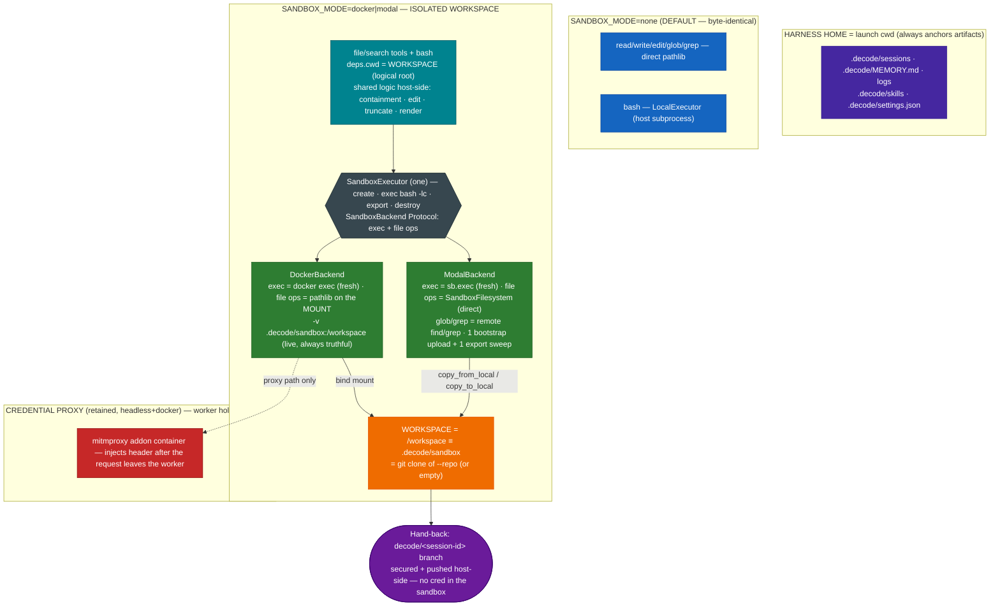

# 0012. Isolated Workspace — one SandboxExecutor + thin backends, file tools through the seam, clone-at-root

**Status:** Accepted
**Date:** 2026-07-03

Supersedes, in part, **[ADR-0011](0011-sandboxing-and-credential-proxy.md)**: §2 (the Docker
persistent-shell shape), §3 (the Modal empty-scratch / no-local-tree shape), and the two per-mode
`bash` descriptions. It **retains** ADR-0011 §1 (the `CommandExecutor` run-seam + `SANDBOX_MODE`
startup guard), §5 (replay-safety for sandbox bash), §6 (the headless docker Credential Proxy), and
§7 (the isolation-backend ladder).

## Context

ADR-0011 shipped `SANDBOX_MODE=docker|modal` as an **additive** split: the host file tools kept
operating on the real repo tree while only `bash` ran in a `.decode/sandbox/` scratch. The two
backends diverged sharply — Docker drove a *persistent shell* through a marker+`$?` protocol with a
kill-and-restart timeout; Modal ran *fresh-exec* in an empty remote scratch with no local tree — each
needing its own `bash` description. This works but is neither isolated (the agent's file tools still
touch the real repo) nor uniform (two shapes, two descriptions, two sets of edge cases).

The goal now is a **codex/opencode-style isolated Workspace**: in a sandbox mode the agent works on a
`git clone` of a **user-provided** repo at `/workspace`, with its *whole* tool scope (files + shell)
contained there, while decode's own harness artifacts stay put. `none` mode must stay byte-identical.

Two design forces were settled by the human during grooming:

1. **Truthful file tools.** A first design kept file tools on a host `.decode/sandbox/` **mirror** kept
   converged with the remote by an mtime-delta sync. This was **rejected**: an mtime delta cannot
   propagate a remote `rm`, so `read`/`glob` would eventually *lie* about the Workspace. Instead, file
   tools operate **directly on the sandbox filesystem through the backend seam** — the *pi* harness's
   `ExecutionEnv` "swap the set" pattern (swap the file-tool I/O backend per execution environment).
2. **Minimum transport.** With direct file ops there is no per-call sync; the only bytes that cross are
   ONE bootstrap upload at create and (Modal only) ONE end-of-session export sweep.

Facts confirmed while scoping (installed toolchain): `modal 1.5.1` exposes `Sandbox.filesystem`
(`SandboxFilesystem`) with `read_bytes` / `write_bytes` / `copy_from_local` (host→remote) /
`copy_to_local` (remote→host) / `list_files` / `make_directory` / `remove` / `stat` — verified via
`modal.sandbox_fs`; `ContainerProcess.stdin` is a writable `StreamWriter` (tar-over-exec is also
viable for the bootstrap). The docker CLI, the Credential Proxy topology, and the replay-safety
`{"cache": False}` config are unchanged from ADR-0011. This ADR is groomed into tasks **078–085**
(feature `isolated-workspace`).

## Decision

1. **Replace, not add.** In a sandbox mode the isolated Workspace *is* the behavior — the M8 split
   (host file tools on the real repo + `bash` in a scratch) retires as a user-facing state. `none`
   stays byte-identical (host `LocalExecutor`; direct-pathlib file tools; `deps.cwd` == launch cwd).

2. **One `SandboxExecutor` + two thin backends.** The two executors collapse into ONE `SandboxExecutor`
   (create → exec `bash -lc <cmd>` per call → destroy; **fresh-exec** in both) over a `SandboxBackend`
   Protocol that carries **exec + file ops + lifecycle**. Docker's persistent-shell + marker/`$?`
   protocol + shell-reset/kill-and-restart machinery is **deleted**; a docker timeout now kills the one
   `docker exec`, and the container survives (mirroring Modal's exec-dies-sandbox-survives rule).
   Filesystem persistence stays in both (one container / one sandbox per session).

3. **Workspace = clone at root.** `/workspace` (sandbox) ≡ host `.decode/sandbox/`
   (`settings.sandbox_workspace_dir`) ≡ a `git clone` of the repo the user supplies via
   `--repo <url-or-local-path>` / `SANDBOX_REPO` (host-side clone at the source's committed HEAD, using
   ambient git creds; `--local` for a fast local clone). No repo → an empty Workspace. `--repo` with
   `SANDBOX_MODE=none` → one friendly stderr line, non-zero exit. Results are returned via the built
   **Hand-back** (§8), not manual pushing.

4. **File tools operate on the sandbox filesystem through the seam ("swap the set").** The
   `SandboxBackend` Protocol grows `read_bytes` / `write_bytes` / `make_directory` / `list_dir` /
   `stat` / `remove`; the shared host-side logic (containment, edit's search/replace, truncation,
   rendering) stays *above* the seam and only byte transport is per-backend. **Docker** file ops are
   plain pathlib on the bind-mounted Workspace (the mount makes the host dir *be* the sandbox fs — zero
   remote plumbing, always truthful). **Modal** file ops are the `SandboxFilesystem` API (direct
   against the remote — no mirror). `glob`/`grep` run as **remote commands** (`find`/`grep`) via `exec`
   for both backends (never download the tree to search it), with output-parity to the host
   implementations. Containment is **layered**: above the seam, backend-agnostic path math
   (`_resolve_logical`, a logical-root fold — not host `Path.resolve`, since a Modal path is not a host
   path) rejects `..` / absolute escapes for *both* backends; and because a docker mount is shared with
   the host, the **docker** backend *additionally* resolves symlinks physically below the seam and
   raises `WorkspaceEscape` (an `OSError` the file layer renders as a refusal), so a symlink planted in
   the Workspace by `bash` cannot be followed off the mount onto the host — string math alone cannot see
   a symlink. **Modal** needs no such layer (remote-only file ops on a disposable sandbox — no host fs
   to escape onto). `none` mode keeps today's direct-pathlib tools, byte-identical.

5. **Transport is minimal (the mtime-sync is retired).** Docker: the bind mount is the only transport
   (always live — no bootstrap, no export). Modal: **ONE** bootstrap upload of the cloned repo +
   seeded skills at sandbox create (`copy_from_local` / tar-over-exec), and **ONE** end-of-session
   export sweep `/workspace` → host `.decode/sandbox/` (`copy_to_local`) so the final Workspace is
   host-visible for the git hand-back. A mid-session `/ship` may trigger the export standalone (the
   sandbox stays alive). No markers, no per-call deltas, no size-cap machinery.

6. **Harness Home vs tool scope.** The launch cwd is **Harness Home** — `.decode/sessions`,
   `.decode/MEMORY.md`, logs, `.decode/skills`, and the `.decode/settings.json` permission file always
   anchor there. Only the agent's tool scope (`deps.cwd`) moves into the Workspace. `AgentDeps` grows
   `harness_home`; the skills catalog/dispatcher and memory injection read `harness_home`, while the
   file/search tools + `bash` read `deps.cwd`. `extract_on_exit`, the session-log creation, and the
   permission-file load/persist are threaded with `harness_home` explicitly. In `none` mode the two
   are equal.

7. **Tool-placement rule: only arbitrary computation crosses the boundary.** Structured harness
   operations stay host-side, with their *effects* scoped to the Workspace where relevant:

   | Tool(s) | Placement | Scope |
   |---|---|---|
   | `read` / `write` / `edit` | host logic, byte transport through the backend seam | Workspace (`deps.cwd`) |
   | `glob` / `grep` | host logic; the search **executes in the sandbox** (`exec` find/grep) | Workspace |
   | `bash` | inside the sandbox | Workspace |
   | `enter_plan_mode` / `exit_plan_mode` / `sleep` / `todo_write` / `skill` / `ask_user` | host | pure harness state / context injection; Tasks + session/memory artifacts at Harness Home |
   | `web_fetch` | host, **stays gated** even in sandbox mode | reaches the host network |
   | `lsp` + post-edit Diagnostics Enricher | host (`ty`), pointed at the Workspace path | `none`+`docker`: live Workspace files; `modal`: best-effort-disabled + friendly note (ADR-0007-consistent) |
   | Agent / subagents (M10, future) | host loop; its tools **inherit the session seams** (module-level executor seam + same `deps.cwd`) — its `bash` lands in the SAME sandbox session, its file tools in the same Workspace | Workspace, for free (no new machinery) |
   | MCP factory (M15, future) | per-server placement decision (future-work) | — |

8. **Git hand-back — the harness ships the Workspace as a Session Branch, host-side.** The results of
   a sandbox session are guaranteed to survive: the harness (a) **collects** the local Workspace git
   state at `.decode/sandbox` (docker: the live mount; modal: swept down by the executor `export()`
   first — `/ship` triggers an export mid-session); (b) **secures** them onto a deterministic
   `decode/<session-id-short>` **Session Branch** — the model is not trusted to have committed, so the
   branch is pointed at the final state and any dirty worktree is auto-committed (the model's own
   branches/commits are preserved, never rewritten); and (c) **ships** them with `git push origin
   decode/<session-id>` using the user's **ambient host credentials** — `--repo <URL>` lands the branch
   on the remote, `--repo <local path>` in the local source repo, credential-free. **Every git command
   runs host-side against the local Workspace — no credential ever enters the sandbox**, the identical
   secrets-never-in-the-sandbox invariant the Credential Proxy (§9) upholds. It is **skipped** for
   no-repo / non-git / unchanged-vs-cloned-HEAD Workspaces. **Layered durability:** the local Session
   Branch always exists even when the push fails (one friendly line names it and its
   `.decode/sandbox/` location). Triggered **both** automatically (REPL exit — best-effort/non-fatal
   alongside the memory/LSP/executor teardown; headless `decode run --repo` completion) **and**
   explicitly (the idle-only `/ship` TUI command, reserved like `/compact`/`/clear`, printing the
   branch + push outcome; a friendly "no sandbox workspace" line in `none` mode).

9. **Retained from ADR-0011, unchanged.** The `CommandExecutor` run-seam + `SANDBOX_MODE` startup
   guard (§1); the replay-safety `{"cache": False}` bash checkpoint when `sandbox_mode != "none"` (§5);
   the headless docker Credential Proxy — now wired to the docker **backend adapter**, `install_executor`
   seam intact (§6); and the isolation-backend ladder table (§7). The interactive REPL stays kitaru-free
   and the `none` path imports no sandbox module.

## Diagram

## Consequences

- **One seam, one shape, one description.** Two executors + two `bash` descriptions collapse to one
  `SandboxExecutor` + one unified sandbox paragraph; the fresh-exec rule is identical across backends.
  The persistent-shell edge cases (marker sync, shell reset, loop-free teardown) are **deleted code**.
- **File tools never lie.** Direct file ops (docker mount / modal `SandboxFilesystem`) mean `read` /
  `glob` always reflect the true Workspace — including deletions — which the rejected mirror+mtime-sync
  could not guarantee. The price is a per-op remote round-trip on Modal (acceptable; the tool layer is
  sequential).
- **Minimum transport.** Only a bootstrap upload (both) and an end-of-session export (Modal) cross the
  wire; docker rides its mount for free.
- **The isolation is real and uniform** — the agent's whole tool scope is the Workspace; the harness's
  own artifacts stay at Harness Home; git is the hand-back via a **small host-side push mechanism**
  (commit → branch → `git push`), with the credential staying in the host process — never in the
  Worker, the same invariant as the Credential Proxy.
- **Results survive in layers** — the hand-back always leaves a local `decode/<id>` branch (dirty work
  captured, model commits preserved), and pushes it to the `--repo` source when creds allow; a push
  failure is a friendly branch-naming line, never a lost session. Auto on exit + explicit `/ship`.
- **M10 subagents inherit this for free** — they run on the host loop but their tools pick up the
  module-level executor seam + `deps.cwd`, so their `bash` and file ops land in the same session
  Workspace with no extra wiring.
- **Retained guarantees hold** — the startup guard, replay-safety, the Credential Proxy (worker holds
  no secret), the isolation ladder, the kitaru-free REPL, and the byte-identical `none` path.
- **Honest ceilings (`ponytail:`):**
  - **Modal LSP is best-effort-off** — `ty` runs host-side and cannot reach the remote fs. Upgrade
    path: run `ty` inside the sandbox over piped stdio (deferred).
  - **Modal in-flight loss on revival** — a max-lifetime-expired sandbox is recreated + re-bootstrapped
    from the host `.decode/sandbox` state; in-sandbox changes since the last export may be lost (the
    note says so) — still better than the old total reset.
  - **Local `--repo` clones HEAD only** — a local source's uncommitted working-tree dirt is not copied.

## Future work

- **Auto-allow sandboxed tools** — the gate stays byte-identical to `none` mode this feature (human-
  settled); treating "in a sandbox" as auto-approval is deferred (carried from ADR-0011).
- **Hard egress lockdown** — cooperative `http_proxy`/CA remains the ceiling; a default-deny internal
  network is the upgrade path (carried from ADR-0011).
- **Uniform egress for agent web traffic** — routing `web_fetch` (and other host-side outbound tool
  calls) through the sandbox / Credential Proxy for one egress story — considered, deferred.
- **`ty` inside the sandbox** — the Modal (and stricter docker) LSP upgrade over piped stdio.
- **Per-server MCP placement (M15)** — workspace-facing MCP servers inside the boundary, external-SaaS
  servers host-side; decided when the MCP factory lands.
- **git-aware / manifest transport** — if the bootstrap/export tar ever needs to scale, a
  content-addressed or git-diff transport replaces the whole-tree copy.
- **Auto-PR creation (`gh pr create`)** — turning the pushed `decode/<id>` Session Branch into a pull
  request — deferred to M14 (the cloud PR-reviewer step).
