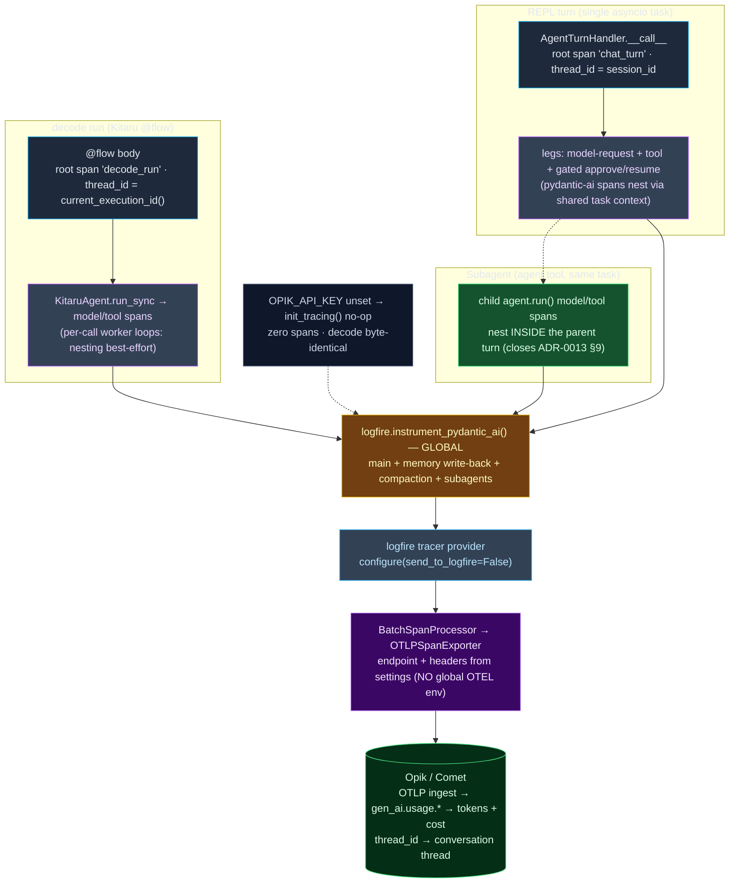

# 0014. Opik observability — traces for every turn, run, and subagent

**Status:** Accepted
**Date:** 2026-07-05

## Context

decode has an agent loop (REPL) and a headless `decode run` path, both driving pydantic-ai Agents,
plus M9 subagent fan-outs, memory write-back, and compaction — all of which make LLM calls. Until now
there is no way to see what a turn actually did: which model calls happened, with what
inputs/outputs, how many tokens, how much latency, and what it cost. ADR-0013 §9 explicitly deferred
"child token spend is invisible until Opik lands (M10)". Milestone 10 pays that off: **monitoring**
(tracing), not evaluation — evals are M13.

Constraints that shaped the design:

* **Every LLM call site in `src/` is already a pydantic-ai Agent** — the main loop
  (`agent/factory.build_agent`), memory write-back (`memory/extract.py`), compaction
  (`context/compaction.py`), and subagents (which re-enter the SAME Agent via
  `tools/agent.py`). So a single global instrumentation call can cover every surface at once, with no
  per-call-site code.
* **House rule: infrastructure imported, not abstracted; simplest thing that works.** Prefer the
  sanctioned integration over hand-rolled spans; one small module, no speculative seams.
* **House rule: never read/mutate `os.environ` deep in call sites; config lives in `settings.py`.**
  The Opik docs' default recipe configures export via global `OTEL_EXPORTER_OTLP_*` env vars — but
  kitaru→zenml also ships an OpenTelemetry SDK, and polluting global OTEL env could redirect *its*
  telemetry too. Export must be configured programmatically from settings, attached only to logfire's
  tracer provider.
* **Presence-based enablement, byte-identical when off.** Like every prior optional surface
  (sandbox, runtime), a no-key run must be indistinguishable from today.
* **`filterwarnings=["error"]`** — new deps' warnings and any deprecated instrumentation format would
  fail the suite.

Facts verified against the installed packages + official docs before deciding:

* **Official recipe** (comet.com/docs/opik/integrations/pydantic-ai): `logfire.configure(send_to_logfire=False)`
  + `logfire.instrument_pydantic_ai()`; thread grouping via `with logfire.span("chat_turn", thread_id=…)`;
  the programmatic `additional_span_processors=[…]` path is the docs' own pattern (the OpikSpanProcessor
  example).
* **OTLP ingest** (comet.com/docs/opik/integrations/opentelemetry): Opik's endpoint reads standard
  `gen_ai.usage.input_tokens|output_tokens|total_tokens` + `gen_ai.request/response.model` +
  `gen_ai.system`; cloud base `https://www.comet.com/opik/api/v1/private/otel`, self-host
  `http://localhost:5173/api/v1/private/otel`, headers `Authorization` + `Comet-Workspace` +
  `projectName`; the http trace exporter is `opentelemetry.exporter.otlp.proto.http.trace_exporter.OTLPSpanExporter`.
* **Cost** (comet.com/docs/opik/tracing/advanced/cost_tracking): Opik estimates cost server-side from
  (provider, model, usage) and "aggregates costs from all spans within a trace"; cost is `None` for
  unsupported models. Gemini is priced (Google AI); OpenRouter/Modal open models may be unpriced.
* **pydantic-ai `InstrumentationSettings` defaults** (pydantic.dev/docs/ai): `include_content=True`,
  `include_binary_content=True`, `version=5` (2–4 emit `PydanticAIDeprecationWarning`),
  `use_aggregated_usage_attribute_names=True` (agent-run totals go under the custom
  `gen_ai.aggregated_usage.*` namespace so backends that aggregate — Opik — don't double-count; leaf
  LLM spans keep standard `gen_ai.usage.*`). The defaults are exactly right — we pass no settings.
* **`logfire`** transitively brings `opentelemetry-exporter-otlp-proto-http` + `opentelemetry-sdk` +
  `protobuf` (verified on PyPI), so the exporter arrives with ONE new top-level dep.
* **`logfire.testing`** ships `TestExporter` / `capfire` / `CaptureLogfire` / `exported_spans_as_dict`
  — the hermetic span-assertion path.
* **`kitaru.current_execution_id()`** is a top-level export (installed kitaru 0.18) returning the
  active execution id inside a flow scope — the headless `thread_id` source.
* **Turn lifecycle** (`harness/runner.py`): `Runner._run_turn` drives one async generator per turn and
  calls `agen.aclose()` deterministically in `finally`, so one `AgentTurnHandler.__call__` == one turn
  == one root span.

### Terminology — how pydantic-ai, logfire, OpenTelemetry, and Opik fit

The four names in this ADR are **four layers of one pipeline**, not four alternatives — recorded here
because "why OTLP and not the Opik SDK?" is the natural first misread (they are not opposed):

| Layer | What it is | In decode |
|---|---|---|
| **pydantic-ai** | the LLM framework whose Agents make the calls — the thing being observed | main loop, memory write-back, compaction, subagents |
| **logfire** | **Pydantic's** instrumentation SDK — a thin wrapper *around* OpenTelemetry | `instrument_pydantic_ai()`, `configure()`, `span()` in `tracing.py` |
| **OpenTelemetry (OTel)** | the vendor-neutral standard + SDK for traces/metrics/logs; the wire format is **OTLP** | `OTLPSpanExporter`, `BatchSpanProcessor`, the `gen_ai.*` span attributes |
| **Opik** | the backend that ingests the spans and prices them | the OTLP endpoint the exporter POSTs to |

- **OpenTelemetry** is the common language. A **span** is one unit of work (an LLM or tool call) with a
  name, timing, and key-value **attributes**; spans nest into a **trace** (one REPL turn) via
  async-context propagation; **OTLP** is the protocol that ships them. The standardized attribute names
  (`gen_ai.usage.*`, `gen_ai.request.model`, `gen_ai.system` — OTel's **GenAI semantic conventions**)
  are exactly what Opik reads to surface tokens + cost with no glue code. Because OTel's `TracerProvider`
  is **process-global**, two libraries both configuring it collide — this is the root cause of the
  kitaru→zenml conflict that forces settings-driven (not global-`OTEL_*`-env) export (sub-decision 2).
- **logfire** *is* OTel underneath (`logfire.span` → an OTel span; `configure()` → an OTel provider). We
  use the **library, not Pydantic's hosted platform** — `send_to_logfire=False` borrows only its
  instrumentation and redirects spans to Opik. It earns its place two ways: (a)
  `instrument_pydantic_ai()` is a **one-call global** integration (Pydantic makes both libraries), vs.
  hand-writing spans at every call site with raw OTel; (b) installing `logfire` transitively brings the
  OTLP exporter + OTel SDK, so the whole pipeline arrives with **one** top-level dep.
- **"OTLP" is Opik's own documented transport** for the logfire/pydantic-ai recipe
  (comet.com/docs/opik/integrations/pydantic-ai) — **not** a bypass of the Opik SDK. The narrow choice
  we actually made is `OTLPSpanExporter` **over** the opik SDK's `OpikSpanProcessor`: both are Opik
  paths, but the exporter ships free with logfire while `OpikSpanProcessor` needs the whole `opik`
  package as a 2nd dep for no coverage gain (kept as the one-line escape hatch in sub-decision 8).

## Decision

**Mechanism = the official logfire integration, globally instrumented, exported programmatically to
Opik over OTLP.** Compared against the alternatives:

| Mechanism | What it is | Coverage | New deps | Cost / tokens | Verdict |
|---|---|---|---|---|---|
| **Plain OTel SDK (manual spans)** | hand-instrument every LLM/tool call with raw `opentelemetry-sdk` spans + `gen_ai.*` attributes | everything, but you write it at every call site | otlp exporter | you set `gen_ai.usage.*` yourself from `run.usage()` | rejected — reinvents what `instrument_pydantic_ai()` gives free; touches every surface; brittle |
| **logfire-official (CHOSEN)** | `logfire.configure(send_to_logfire=False)` + global `instrument_pydantic_ai()` + settings-driven OTLP exporter → Opik | ALL pydantic-ai agents (main, memory, compaction, subagents) in one call; zero per-call-site code | **`logfire` only** (brings the OTLP exporter) | `gen_ai.usage.*` on LLM spans → Opik prices; `aggregated_usage` avoids double-count | **chosen** — the sanctioned path; one global call; matches the locked scope |
| **opik SDK decorators (`@opik.track` / `OpikSpanProcessor`)** | wrap entrypoints in `@opik.track` and/or register `OpikSpanProcessor` to merge logfire spans into `@track` traces | only decorated entrypoints; merge needs the processor | `+opik` (and still logfire) | opik SDK path prices reliably | **deferred** — a 2nd dep + per-entrypoint decoration; earned only if OTLP cost proves absent (escape hatch below) |
| **Post-hoc reconstruction** | rebuild traces offline from the JSONL session log / Kitaru checkpoints | partial, lossy | none | no live latency/tokens/cost | rejected — lossy, no live signal, duplicates OTel |

Sub-decisions (all recorded so they are not re-litigated):

1. **Enablement = presence of `OPIK_API_KEY`.** Set → tracing on against Comet cloud;
   `OPIK_URL_OVERRIDE` switches the OTLP base to a self-hosted Opik; neither → `init_tracing()` is a
   silent no-op and decode is byte-identical. Full message/tool content is captured (pydantic-ai
   `include_content=True` default). One INFO line when active (a REPL console line + the log line).
2. **Export is settings-driven, not env-driven.** `init_tracing()` builds
   `OTLPSpanExporter(endpoint="<base>/v1/traces", headers={Authorization, Comet-Workspace, projectName})`
   from `settings` and attaches it via `logfire.configure(send_to_logfire=False,
   additional_span_processors=[BatchSpanProcessor(exporter)])`. No global `OTEL_*` env var is set, so
   kitaru/zenml's own OTel SDK is untouched.
3. **Instrumentation is global and default-configured.** `logfire.instrument_pydantic_ai()` with no
   `InstrumentationSettings` — the defaults give full content, format v5 (no deprecation warning), and
   `use_aggregated_usage_attribute_names=True` so Opik prices the leaf LLM spans without double-counting
   the aggregating agent-run span. One call covers main loop, memory write-back, compaction, and
   subagents.
4. **Trace shape.**
   * **REPL:** one trace per turn — a root span (`chat_turn`, `thread_id` = session id) wraps the
     whole `AgentTurnHandler.__call__` body, so a gated tool's approve/resume leg stays in the same
     trace and turn latency honestly includes the gate wait. Same-task contextvars nest the model/tool
     spans under it. (Careful: the `with` span crosses `yield`s; the runner's deterministic `aclose()`
     unwinds it on normal end, error, and abort — a test guards this.)
   * **Headless:** one trace per run — a root span (`decode_run` / `decode_run_hitl`,
     `thread_id = current_execution_id()`) wraps `run_sync`, opened inside the flow AFTER
     `_config_from_secret_store()` so a secret-store `OPIK_API_KEY` is honored.
   * **Free-riders:** memory write-back and compaction ride along as their own small traces (or nest,
     when inside a turn) via the same global instrumentation — no wiring.
   * **Subagents nest inside the parent turn's trace** (same task/contextvars), closing ADR-0013 §9's
     "child token spend invisible until Opik lands (M10)".
   * **Root-span input/output are set explicitly** (post-091 fix, verified live). pydantic-ai's own
     spans (`agent run` / `chat …` / `running tool`) get their I/O for free from the global
     instrumentation, but our **manually-opened** `chat_turn` / `decode_run[_hitl]` roots start blank —
     and Opik derives a **trace's** input/output from its ROOT span, never from descendants. So the roots
     carry the turn/run **input** (the prompt / task) as an `input` attribute and, at turn/run end, the
     final assistant text as an `output` attribute via `observability.record_output(span, …)`. Opik's
     OTLP ingest buckets these by a **prefix match on the attribute key** (`input*` → INPUT, `output*` →
     OUTPUT — verified in opik's `GeneralMappingRules`). This is load-bearing for **Threads**: the Thread
     view is built from **trace-level** input/output (`first_message.input` / `last_message.output`), so
     without it a whole conversation renders as blank `-` rows even though the nested LLM spans have I/O.
5. **Init seam = `observability.init_tracing()`**, idempotent (process-global `logfire.configure`), called
   from `run_app` (REPL) and inside each `@flow` body (headless). One small module
   (`observability/tracing.py`) holds `init_tracing` / `is_tracing_active` / `root_span` /
   `record_output` / `reset_tracing`.
6. **Deps = `logfire` only.** It brings `opentelemetry-exporter-otlp-proto-http`; not `logfire[httpx]`,
   not `opik`. Watch: logfire's OTel/protobuf pins must co-resolve with kitaru→zenml + modal at lock time.
7. **Test isolation.** An autouse `_no_opik_tracing` fixture blanks `opik_api_key` so ordinary tests
   never configure real export (mirrors `_no_real_provider_key`); span-asserting tests opt in with a
   fake key + `logfire.testing`'s in-memory exporter; `reset_tracing()` clears the module flags.
8. **Cost path — decode stamps the cost itself; the `opik` SDK escape hatch was NOT needed.**
   The tokens-only outcome this section allowed as "acceptable" turned out to be the outcome for
   *all three* providers, so it is now fixed in `observability/cost.py` +
   `CostAnnotatingExporter` (`tracing.py`). What was verified:
   * Opik's OTLP ingestion reads exactly **one** cost key — `gen_ai.usage.cost` — and an explicit
     value **short-circuits** its server-side `(provider, model)` price lookup, so it works even for
     a model Opik has never heard of. (Verified in opik's backend mapping rules, not its public
     docs — a real but **undocumented** contract. If a future Opik release renames it, cost goes
     quietly missing; the symptom to watch for is tokens present, cost blank.)
   * pydantic-ai already prices anything the genai-prices catalog knows, but publishes it as
     **`operation.cost`** — a key Opik does not read. That, not a missing price, was the Gemini gap.
   * Opik's price table has **no `openrouter` row at all**, and a self-hosted Modal endpoint
     (`Qwen/Qwen3.6-35B-A3B-FP8`) can never have one.

   So the exporter forwards pydantic-ai's catalog price under the key Opik reads, and falls back to
   `LLM_COST_{INPUT,OUTPUT}_USD_PER_MTOK` when the catalog had no row. Both rates unset (0.0) means
   "unknown" and **no** cost attribute is written — a blank cost beats a fabricated one.
   Per provider, what this actually buys:
   * **Gemini** — fixed outright; the catalog prices it and the bridge delivers it.
   * **OpenRouter** — fixed for the mainstream slugs the catalog knows (`anthropic/…`, `google/…`,
     `openai/…`, `deepseek/…`, `meta-llama/…`). A catalog miss (e.g. `qwen/qwen3-235b-a22b`) needs
     the manual rates. The default `openrouter/free` router is genuinely $0, so a blank cost is
     correct there rather than missing. OpenRouter *does* return its exact charged cost via usage
     accounting, but pydantic-ai drops that field — capturing it is a real plumbing job, not a knob,
     and is deliberately not done here.
   * **Modal — stays cost-free ON PURPOSE.** A self-hosted endpoint bills GPU-seconds, so no
     per-token figure describes what is actually paid; the rates must not be used to manufacture
     one. Modal traces carry tokens and latency, and the spend lives in Modal's own billing.
   Two consequences worth naming: it is an **exporter** wrapper, not a span processor, because
   `on_end` hands out an immutable span snapshot; and only spans carrying `gen_ai.request.model`
   are priced, because pydantic-ai repeats the run's aggregated usage on the parent `agent run`
   span and Opik SUMS span costs — pricing both would report every run at **double** its real spend.
   **Escape hatch (still open, still unused):** if the attribute contract breaks, swapping to the
   `opik` SDK (`additional_span_processors=[…, OpikSpanProcessor()]`) remains a one-line change.
9. **M13 (later) adds** evals / experiments / online scoring on top of these traces — not now.

## Diagram

**Span flow** — REPL turns and headless runs feed one global instrumentation, exported from settings to Opik.

## Consequences

- **One global call covers every surface.** Adding a future pydantic-ai LLM call site is traced for
  free — no per-site work.
- **decode is byte-identical without `OPIK_API_KEY`.** The whole feature is inert until a key is set;
  the REPL prints no line, the headless run's stdout is unchanged, zero spans are emitted.
- **Config stays in `settings.py`.** No global `OTEL_*` env var is mutated, so kitaru/zenml's own OTel
  SDK is unaffected.
- **Cost is best-effort by model.** Tokens always; cost for priced models (Gemini yes; open models via
  OpenRouter/Modal may be tokens-only). The `opik`-SDK escape hatch is a one-line swap if needed.
- **Headless run-level nesting is best-effort under `checkpoint_strategy="calls"`.** Per-call worker
  loops can break OTel context propagation, so some model spans may export as sibling traces rather
  than nested under the run root; every span still carries tokens. A documented ceiling, like the
  runtime ADRs.
- **ADR-0013 §9 is closed.** Subagent child spans nest in the parent turn's trace with visible child
  token usage.
- **Risks to confirm during implementation:** (a) `uv add logfire` co-resolving its OTel/protobuf pins
  with kitaru→zenml + modal (the one hard blocker if it fails); (b) the async-generator span crossing
  `yield`s closing exactly once on abort (guarded by the runner's `aclose()` + a test); (c) whether
  Gemini cost materializes via pure OTLP (checked by the live smoke; escape hatch ready); (d)
  `logfire.configure`'s process-global tracer-provider coexisting with any provider kitaru/zenml sets
  in the headless path.
- **Discipline (unchanged):** `filterwarnings=["error"]`, UTC-aware datetimes, full annotations, library
  code logs (never `print()`), `tests/` mirror `src/` 1:1, TDD-first, no network in CI (`FunctionModel`
  + `logfire.testing`; one live smoke `skipif`-guarded).
