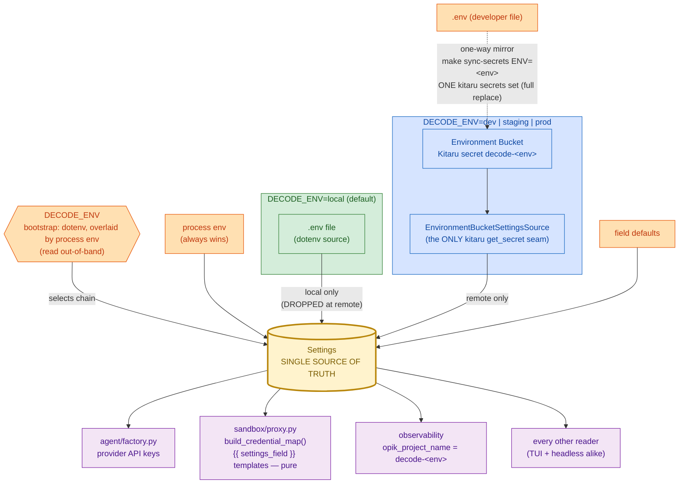

# 0015. Environment-Bucket secrets — one config surface, two injection mechanisms

Status: Accepted
Date: 2026-07-13

## Context

decode grew three overlapping secret knobs on the headless path (ADR-0008 §5):
`RUNTIME_SECRET_STORE_MODEL_KEY` (provider key from a Kitaru secret at model construction),
`RUNTIME_SECRET_STORE_CONFIG` (whole-surface hydration, headless-only, flipped by a module global from
`runtime/flow.py`), and `RUNTIME_SECRET_NAME` (the shared secret name). Meanwhile the Credential Proxy
(ADR-0011 §6, ADR-0012 §10) resolved `{{ secret-name.key }}` header templates through a *second*, independent
`kitaru.get_secret` seam.

The result: three ways for a credential to enter the process, two of them headless-only, none of them expressing
the question an operator actually asks — **which environment is this?** The knobs were also mutually confusable
(the model-key one shipped under the name "Credentials Proxy" and was mistaken for the header-injection
Credential Proxy often enough to warrant its own rename), and a developer's `.env` could silently backfill a key
missing from the deployment secret, hiding a provisioning gap until production.

`Settings` (pydantic-settings) is already the single reader of configuration. What was missing is a single,
environment-shaped answer to *where `Settings` gets its values*.

## Decision

**`Settings` is the SINGLE SOURCE OF TRUTH.** Both mechanisms load *into* it, and no code reads a credential
from anywhere else.

1. **`DECODE_ENV` selects the injection mechanism, and nothing else.**
   `decode_env: Literal["local","dev","staging","prod"] = "local"`. It is the *bootstrap* variable: it decides
   whether the bucket is read, so it can never come **from** the bucket. It is resolved out-of-band (parse the
   dotenv file, overlay `os.environ`; **process env wins**, matching every other setting), and the resolved value
   is fed back into the field so the gate and the field can never diverge.

2. **Two source chains.** `local` (the default): `init > process env > .env > defaults` — today's behaviour,
   kitaru never imported. Remote: `init > process env > Environment Bucket > defaults` — **`.env` is dropped from
   the chain entirely**, so a key missing from the bucket fails **loudly** instead of being silently backfilled
   from a developer's file. This is the point of having environments at all.

3. **The bucket name is DERIVED: `decode-<env>`.** No override knob — one less thing to drift, and
   "`DECODE_ENV=staging` pointed at the prod bucket" becomes unrepresentable.

4. **Clean break.** `runtime_secret_name`, `runtime_secret_store_config`, `runtime_secret_store_model_key` (and
   the long-retired alias `RUNTIME_CREDENTIALS_PROXY_ENABLED`) are **deleted**, with no shim and no fail-fast
   guard — a deliberate choice; `extra="ignore"` swallows stale entries silently. The removal is made loud in
   `.env.example`, this ADR, and `CREDENTIALS.md` instead. Deleting the model-key knob also deletes
   `resolve_provider_key_from_secret_store` / `SECRET_STORE_KEY` and the cli pre-flights built on them: the
   provider key now simply comes from `Settings`, hydrated by whichever mechanism is active.
   `build_agent(flow_mode=…)` **keeps** its `flow_mode` parameter — it still selects the keep-alive-free HTTP
   client (ADR-0010 §3) — but key sourcing no longer varies by mode.

5. **Hydration is process-scoped and surface-agnostic.** The `decode_env != "local"` gate replaces the
   headless-only module-global toggle: the TUI and headless `decode run` / `decode replay` hydrate identically,
   at singleton construction. The old invariant "bare `decode` never imports kitaru" is **restated**:
   **at `DECODE_ENV=local` (the default), decode never imports kitaru.** A missing or unreachable bucket
   (including the Kitaru local daemon being down) must not crash the import: the source captures the failure, and
   the REPL startup chain and the headless pre-flight surface it as ONE friendly line naming the fix
   (`make sync-secrets ENV=<env>`), exit non-zero, no traceback — the house failure pattern.

6. **The Credential Proxy resolves from `Settings`.** Proxy-rule templates name a Settings **field** —
   `{"Authorization": "Bearer {{ sandbox_git_token }}"}` — resolved host-side from the hydrated object.
   `_resolve_templates`, the `{{ name.key }}` form, and proxy-side `kitaru.get_secret` are deleted;
   `build_credential_map()` becomes a pure function of `settings` (no network, no store stubs in its tests).
   `github_token_rules()` is unaffected. After this, **Kitaru's only `get_secret` seam in the entire codebase is
   the Environment-Bucket settings source.**

7. **The sync script is the only writer.** `scripts/sync_secrets.py` (`make sync-secrets ENV=<env>`) mirrors
   `.env` → bucket in ONE `kitaru secrets set decode-<env> --private --KEY=value …` call. The verified fact this
   shape hangs on: **`kitaru secrets set` REPLACES the whole key set** — a partial update destroys the other keys
   — so full-surface-or-nothing is the only safe write, and it makes the bucket an exact mirror of the file.
   Overwrites print a KEY-NAME-ONLY diff (never values) and require confirmation (`--yes` for CI). One-way only:
   the file is the source of truth, Kitaru never is.

8. **Opik projects follow the environment.** `opik_project_name` defaults to `f"decode-{decode_env}"`; an
   explicitly-set `OPIK_PROJECT_NAME` (env / `.env` / bucket) always wins, detected via pydantic's
   `model_fields_set` (source-supplied values are in it; default-applied ones are not — verified against the
   installed pydantic-settings 2.14.2), never a sentinel comparison.

9. **Drift is a CI failure.** A unit test asserts `.env.example` `KEY=` lines ≡ `Settings` field names, **both
   directions, no allowlist** — every field documented, every documented key real. The three process-env-only
   operator variables (`DECODE_LOG_FILE`, `MODAL_TOKEN_ID`, `MODAL_TOKEN_SECRET`) become prose comments; they are
   read from `os.environ`, never from `.env`, so their current `KEY=` lines were misleading anyway.

**Non-goals.** `DECODE_ENV` does not change session dirs, log paths, or `MEMORY.md`. No compat shim or
deprecation warning for the deleted knobs. No bucket → `.env` pull. No per-PR / ephemeral environments — the
`Literal` is closed, so a new environment is a code change, deliberately.

**Amendments to earlier ADRs.**

- **ADR-0008 §5** is amended: the Secret-Store Config source and the model-key secret resolution it specified
  (with `RUNTIME_SECRET_NAME` / `RUNTIME_SECRET_STORE_CONFIG` / `RUNTIME_SECRET_STORE_MODEL_KEY`) are deleted and
  replaced by the `DECODE_ENV`-gated Environment Bucket (this ADR §§1–5). The "values land in `Settings` only,
  never `os.environ`; real env wins" invariants carry over unchanged.
- **ADR-0011 §6 / ADR-0012 §10** are amended: proxy rules no longer resolve `{{ secret-name.key }}` via
  `kitaru.get_secret`; templates name Settings fields and resolve from the hydrated config (this ADR §6). The
  worker-never-holds-a-token claim, the container topology, and the `SANDBOX_GIT_TOKEN` trade-off are unchanged.

## Diagram

## Consequences

**Positive.** One question ("which environment?") replaces three knobs. Provisioning gaps fail loudly at startup
with the fix named, instead of being masked by a developer's `.env`. The Credential Proxy loses its second kitaru
seam, and its unit tests lose their store stubs — `build_credential_map()` becomes a pure function. `.env.example`
can no longer lie (the drift test). Opik traces self-sort per environment. The bucket is always a faithful mirror
of the file — the full-replace write semantics turn from a foot-gun into the mechanism.

**Negative / accepted.**

- **A remote `DECODE_ENV` imports kitaru (and the ZenML stack) at settings-import time** — heavier startup, and a
  network/DB touch before the first prompt, in the TUI as well as headless. Accepted: it is exactly what "remote
  environment" means, and `local` (the default) stays byte-identical to today.
- **Stale `RUNTIME_SECRET_*` entries are silently ignored** (`extra="ignore"`). Mitigated by loud docs, not by
  code — a deliberate choice, and the one place this design trades safety for simplicity.
- **The Environment Bucket cannot supply modal *account* tokens.** `MODAL_TOKEN_ID` / `MODAL_TOKEN_SECRET` are
  read from `os.environ` (by `cli.py`'s guard, and by the modal SDK itself), never from `Settings` — and feeding
  them from the bucket would require writing a Kitaru secret into `os.environ`, breaking the invariant that keeps
  a model-chosen `bash` from inheriting secrets. So in a remote environment, modal auth must still come from the
  process env or `~/.modal.toml`. (`MODAL_PROXY_TOKEN_ID` / `_SECRET` — the served-endpoint auth headers — *are*
  `Settings` fields and hydrate from the bucket normally.)
- **The sync script passes values through the `kitaru secrets set` argv**, briefly visible to host `ps`.
  Operator-side, single machine, accepted for the one-call replace-safety it buys.
- **Tests lose unique-per-test secret names** (bucket names are derived), so isolation rests solely on the
  tmp-path ZenML store fixture.
- **A new environment is a code change** (the `Literal` is closed) — deliberate, see Non-goals.
