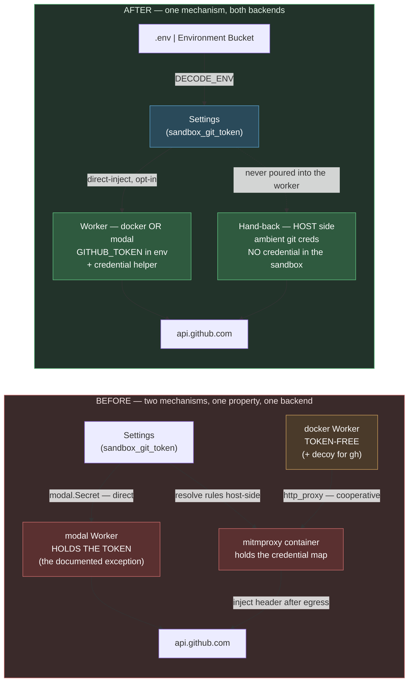

# 0016. Drop the Credential Proxy — one secret surface, one token-injection mechanism

**Status:** Accepted
**Date:** 2026-07-13

Supersedes **[ADR-0011](0011-sandboxing-and-credential-proxy.md)** §6 (the headless docker Credential
Proxy) and **[ADR-0012](0012-isolated-workspace.md)** §10 (the *two* injection mechanisms for one
`SANDBOX_GIT_TOKEN`). It retains everything else in both: the `CommandExecutor` run-seam and
`SANDBOX_MODE` startup guard (0011 §1), replay-safety (0011 §5), the isolation ladder (0011 §7), and
the whole Isolated-Workspace design (0012 §§1–9). It builds directly on
**[ADR-0015](0015-environment-bucket-secrets.md)**, which had already made `Settings` the single
config surface.

## Context

decode grew two answers to "how does a secret get where it is needed", and by ADR-0015 they had
stopped being two problems:

1. **Config hydration** — `.env` at `DECODE_ENV=local`, the **Environment Bucket** (`decode-<env>`)
   above it. One surface, `Settings`, two injection mechanisms (ADR-0015).
2. **The Credential Proxy** (ADR-0011 §6) — a mitmproxy container on a per-run docker network. The
   sandboxed **Worker** was pointed at it via `http_proxy`/`https_proxy`; the resolved credential map
   lived only in the proxy's env; the addon attached the auth header *after* the request left the
   token-free worker. The point was a real property: **the process running model-chosen commands holds
   no secret.**

The proxy delivered that property, and it is a genuinely interesting design. But it bought it at a
price that kept growing, and the price is now clearly out of proportion to what it protects:

- **It only ever worked in one of the three sandbox modes.** headless + `docker` only. `modal` — the
  *remote* backend, the one where isolation actually matters most — never had it: ADR-0012 §10
  direct-injects `SANDBOX_GIT_TOKEN` into the Modal sandbox env via a `modal.Secret`, because there is
  no docker network to hang a mitmproxy container off. So the "worker holds no token" invariant was
  already **false in modal**, and the codebase carried a documented exception saying so.
- **Two mechanisms for one knob.** ADR-0012 §10's own summary — "one `SANDBOX_GIT_TOKEN`, two injection
  mechanisms" — is the smell. The same user-facing knob behaved differently depending on a backend the
  user did not choose for security reasons.
- **The machinery is large and load-bearing in the wrong places.** A per-run docker network; a CA
  generated, bind-mounted, and folded into the worker's trust store *synchronously* before the first
  `bash` (a race that needed its own regression test); a teardown order that must reap the worker before
  the proxy or `docker network rm` fails; an `apt` install that has to egress *through* the proxy; and a
  **decoy token** (`decode-proxy-injects-the-real-token`) planted in the worker's env purely because
  `gh` refuses to issue any request with no token at all. Every one of those is a thing that breaks.
- **It was never an exfiltration barrier.** Egress is *cooperative*: the worker is **pointed** at the
  proxy by convention (`http_proxy` env vars that well-behaved client libraries honour). A model that
  wants to bypass it types `curl --noproxy '*'`. The proxy protected against a model *reading its own
  environment*, not against a model that means harm — and a model that means harm is the only threat
  model in which "the worker cannot read the token" is worth this much machinery.
- **The thing it protects is a scoped, revocable PAT** that the user chose to hand the agent so it could
  push a branch and open a PR. It is not a production database credential.

Meanwhile the property that actually matters — **secrets never reach the model's *context*** — is not
provided by the proxy at all. It is provided by `Settings` never being serialised into a prompt, by
`SecretStr`, and by the credential map never being logged. Those all survive this ADR untouched.

## Decision

1. **Delete the Credential Proxy.** `sandbox/proxy.py` (`SandboxProxyRule`, `DEFAULT_PROXY_RULES`,
   `github_token_rules`, `build_credential_map`, `DockerCredentialProxy`) and `sandbox/proxy_addon.py`
   are removed, along with `runtime/flow.py`'s `_sandbox_proxy` context manager and every piece of
   proxy wiring in `DockerBackend` (the network, `proxy_env`, the CA mount, `_trust_proxy_ca`, and the
   decoy token). Settings `sandbox_credential_proxy_enabled` and `sandbox_proxy_image` are deleted —
   a **clean break**, no shim, no deprecation warning: a retired key in a `.env` is simply ignored
   (`extra="ignore"`), exactly as ADR-0015 §9 handled its own retired knobs.

2. **`SANDBOX_GIT_TOKEN` is direct-injected into the Worker env — in *both* backends.** Docker adopts
   what Modal already does (ADR-0012 §10): when the field is set, the token enters the container env as
   `GITHUB_TOKEN`, plus the same git credential-helper (`x-access-token:$GITHUB_TOKEN`) so `git push`
   over HTTPS works and `gh` authenticates off it. One mechanism, two backends, symmetric behaviour.
   Empty/unset → no token in the env, no credential helper, and the container run is byte-identical to
   the no-token case. `none` mode is unaffected (it *is* the host).

3. **The invariant is rewritten, not quietly dropped.** The old AGENTS.md line —
   *"Secrets never reach the model or sandbox payload"* — was already only true in docker. It is
   replaced by the honest, uniform pair:
   - **Secrets never reach the model's context.** `Settings` is never serialised into a prompt; secrets
     are `SecretStr`; the log lines carry names, never values. This holds in every mode.
   - **The sandbox gets exactly the credentials the user hands it — no more.** Today that is
     `SANDBOX_GIT_TOKEN` and nothing else. The Environment Bucket hydrates the *harness's* `Settings`;
     it is never poured into a worker env. A sandboxed process can read `$GITHUB_TOKEN`, and the user is
     told so plainly: hand it a **scoped, revocable** PAT.

4. **Hand-back stays host-side and stays the default.** `sandbox/handback.py` is untouched: it pushes the
   final Workspace to the `decode/<session-id>` Session Branch with **ambient host git creds**, running
   every git command host-side against `.decode/sandbox`. **No credential enters the sandbox for
   hand-back** — that was true before this ADR and is true after it. `SANDBOX_GIT_TOKEN` remains
   *opt-in* and is needed only for the strictly larger ask: letting the **model itself** run
   `git push` / `gh pr create` from inside the sandbox. Leave it unset and the sandbox has no
   credentials at all.

   **Amendment (2026-07, first remote run).** A **headless flow container has no ambient git
   credential at all**, so "ambient creds only" made the hand-back a guaranteed no-op there. The push
   now uses `SANDBOX_GIT_TOKEN` when it is set, through the *same* credential helper the Worker gets —
   run in the **harness** process (the flow container), with the token passed via the environment and
   never into a command line. The load-bearing property is unchanged and still holds in every mode:
   **no credential is placed inside the sandbox for hand-back.** The token is opt-in as before; unset
   it and a headless run's hand-back simply cannot push (it says so, and names the branch it left
   behind). See ADR-0012 §8's amendment for where the hand-back runs.

5. **Non-goal: a replacement.** No egress allowlist, no rebuilt proxy behind a flag, no "credential
   broker" service. If a future step needs a sandboxed worker to call a *third-party* API without
   holding its key, that is a new ADR with a real use case behind it — not a hook left dangling here.
   Rebuilding this is `git revert` away; the design is recorded above and in ADR-0011 §6.

## Diagram

## Consequences

**Good.**
- One mechanism, two backends. `SANDBOX_GIT_TOKEN` now means the same thing everywhere, and the
  glossary's Worker entry loses its "opt-in exception" caveat because the exception *is* the rule.
- A large amount of fragile machinery is gone: the per-run network, the CA-trust race and its
  regression test, the teardown ordering constraint, apt-through-the-proxy, and the decoy token.
  `DockerBackend`'s `docker run` argv is now one shape, not two.
- The security story is now *true as written*, which is worth more than a stronger story that had a
  documented hole in it.
- The docker integration suite loses its slowest, flakiest file (a real mitmproxy container per test).

**Bad / accepted.**
- **A sandboxed process can now read `$GITHUB_TOKEN`.** This is the whole cost, stated plainly. Mitigation
  is policy, not code: the token is opt-in, scoped, and revocable, and the docs say so at every mention.
  Anyone who wants the stronger property runs without `SANDBOX_GIT_TOKEN` and takes host-side hand-back.
- **A teaching step retires.** The Credential Proxy was a good demonstration of after-egress header
  injection, and the course loses it as running code. The design survives here and in ADR-0011 §6, and
  the ADR pair now teaches something arguably more useful: how to notice a mechanism whose cost has
  outgrown the property it buys, and how to remove it without pretending it was never a good idea.
- **No path for third-party API credentials in the sandbox.** `DEFAULT_PROXY_RULES` was the general
  extension point ("any other host") and it is gone. It shipped empty and had no second caller — per
  AGENTS.md, that is exactly the abstraction that should not exist yet. When a real second use case
  arrives it earns its own ADR.
