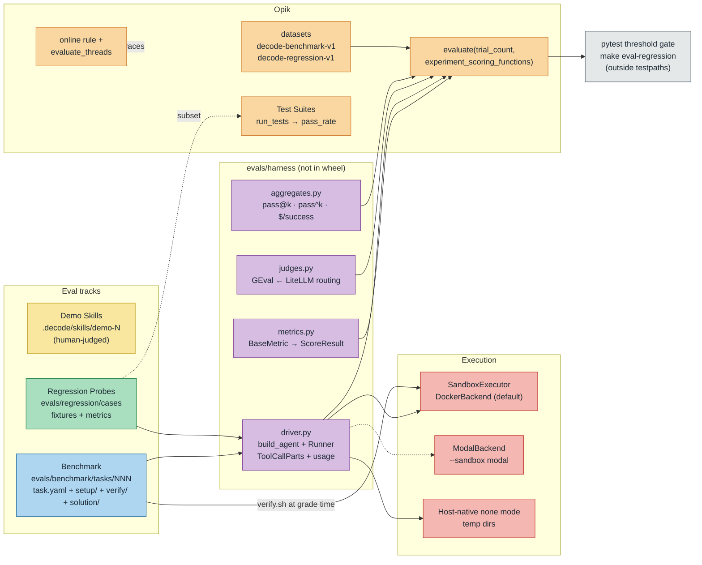

# 0017 — decode eval suite: demos, benchmark, regression probes, Opik harness

Status: Accepted
Date: 2026-07-13

## Context

decode has tracing (ADR-0014) but no way to answer "did this change make the agent better or
worse?". We want: (a) human-judged showcase demos, (b) an outcome benchmark ("can it do the
task?"), (c) a harness-behavior regression suite ("does it work the RIGHT way?" — right tool,
minimal diff, gate respected), and (d) the Opik evaluation infrastructure driving (b) and (c) —
in an educational codebase where the grading logic must stay readable and infrastructure is
imported, not abstracted. Constraints: `tests/` mirrors `src/` 1:1; the wheel ships only
`src/decode`; existing Opik tracing must not be disturbed; `make ci` must stay eval-free (evals
need API keys and cost money). Non-goals: Terminal-Bench/SWE-bench adapters, leaderboard UI,
credential-proxy involvement, best@k/majority-vote, user simulation.

## Decision

1. **Placement: top-level `evals/`, not `src/decode/evals/`.** Eval code is course material about
   the agent, not part of it — `[tool.hatch.build.targets.wheel]` already ships only `src/decode`,
   so the wheel is untouched with zero build config. Unit tests for harness code live in
   `tests/unit/evals/` (mirroring `evals/` exactly as `tests/unit/decode/` mirrors `src/decode/`):
   ONE pytest root means `make unit-tests`, pre-commit hooks, and CI cover the harness's offline
   logic for free. The one deliberate exception is `evals/regression/test_thresholds.py` — a
   key-requiring, money-costing module kept OUTSIDE `testpaths` and invoked only by
   `make eval-regression`.
2. **Four tracks, three judgment styles.** Demo Skills (human-judged, no Opik, plain
   `.decode/skills/demo-N-*/` per ADR-0004); a 20-task Benchmark (outcome oracles); a 20-probe
   Regression suite (behavior metrics + a few judges); the Opik harness underneath. Demos prove it
   impresses; the benchmark proves it works; the probes prove it works the way we designed
   (ADR-0002..0013 behaviors: read-tool discipline, plan mode, gate respect, compaction survival).
3. **Execution reuses decode's own sandbox seam — no new runner infra.** Benchmark runs get a
   fresh per-task Workspace through the existing `SandboxExecutor`/`DockerBackend`
   (`executor.start(tmp_workspace)` + the `decode.tools.bash` executor seam — the exact
   `runtime/flow.py::_warm_headless_executor` pattern);
   `--sandbox modal` swaps in `ModalBackend` on the same seam. Regression probes run host-native
   (`none` mode) on temp dirs — fast enough for a per-feature-branch ritual. The least-mechanism
   choice: the seam already exists and eval isolation is the same problem sandbox isolation solves.
4. **In-process agent driving; tool calls from messages, never from traces.** One driver
   (`evals/harness/driver.py`) runs the REAL `build_agent()` + `AgentDeps` + `AgentTurnHandler` +
   `Runner` (the pattern proven by `tests/integration/test_milestone1_capstone.py`), with
   configurable gate mode/resolvers/pre-filled history. Tool calls are extracted from pydantic-ai
   `ToolCallPart`s in the message history and usage from summed `ModelResponse.usage` — parsing
   Opik traces for ground truth would couple grading to the observability pipeline and lie under
   sampling/export lag. Opik `evaluate()` task fns are sync, so the driver ships an
   `asyncio.run()` wrapper.
5. **Verify oracles are hidden but honest.** `verify/` assets are injected through the seam only
   AFTER the agent finishes (the agent can never grep its own grader); `verify.sh` IS the grading
   logic — a readable bash script, Terminal-Bench-style. Every task commits a `solution/` and the
   oracle-sanity pytest harness proves each oracle BOTH directions (solution→PASS,
   untouched→FAIL) in ordinary CI, so a broken oracle can't silently grade everything up or down.
6. **Two regression surfaces, deliberately.** (a) Plain datasets + code metrics via `evaluate()`
   with a pytest threshold gate (`aggregate_evaluation_scores()` ≥ thresholds; baseline deltas via
   `get_experiments_by_name` as warnings); (b) Opik 2.0 Test Suites (`get_or_create_test_suite`
   natural-language assertions, `run_tests` → `pass_rate`) over a small probe subset. Redundant on
   purpose: the contrast between deterministic metrics and NL assertions is the teaching point.
7. **Judge routing follows decode's provider.** One judge factory builds
   `GEval(model=<LiteLLM string>)`: default `gemini/gemini-2.5-flash`; `openrouter` →
   `openrouter/<model>`; `modal` → `openai/<model>` + endpoint base_url. `EVAL_JUDGE_MODEL`
   overrides. Judges are reserved for what code can't score (quality, groundedness, minimal-diff on
   tasks 15/19/20 and judge probes); everything mechanical stays a `BaseMetric` → `ScoreResult`.
8. **Trials + aggregation on Opik's own axis.** `--trials k` → `evaluate(trial_count=k)`;
   pass@1 / pass@k / pass^k / flakiness-rate and cost-normalized success-per-dollar ride
   `experiment_scoring_functions` so they land on the experiment row; `experiment_config` records
   agent model, provider, git sha. Costs come from recorded usage (+ Opik trace `total_cost` where
   available).
9. **Cadence: manual, never in `make ci`.** `make eval-benchmark` / `make eval-regression` need
   `GEMINI_API_KEY` + `OPIK_API_KEY`; the regression ritual is pre-merge per feature branch and the
   threshold module is CI-pointable later. Eval runs log under `EVAL_PROJECT_NAME`
   (`decode-evals`), so live-REPL tracing (ADR-0014, project `decode`/`decode-<env>`) is never
   polluted — the harness must not fight `init_tracing()`.
10. **Online eval stays small.** One documented Opik online LLM-judge rule + one scripted
    thread-level `evaluate_threads` pass over the LIVE project's threads — the production-eval
    story told at demo scale.

## Diagram

## Consequences

- **Positive:** regressions in agent BEHAVIOR (not just outcomes) become measurable per feature
  branch; grading stays transparent (verify.sh + readable metrics); zero new isolation
  infrastructure (the sandbox seam is reused); the wheel, `make ci`, and live tracing are all
  untouched; oracle-sanity keeps 20 hand-written graders honest forever.
- **Negative / accepted:** eval runs cost real money and need keys — hence manual cadence, which
  means the suite only catches what someone runs; LLM judges are noisy (mitigated: judges only
  where code can't decide, thresholds not exact-match, pass^k for reliability); k-trial runs
  multiply cost linearly; two regression surfaces mean some duplication (accepted for the
  contrast); `evals/` grows a second source root that tests must mirror by convention, enforced
  only by review.
- **Deferred / upgrade paths:** pointing CI at the threshold module; a `--sandbox modal` default
  once docker friction bites; probe 12 (MCP) activates when decode's MCP tool factory ships;
  Terminal-Bench/SWE-bench adapters only if the in-house 20 stop discriminating between agent
  versions.
