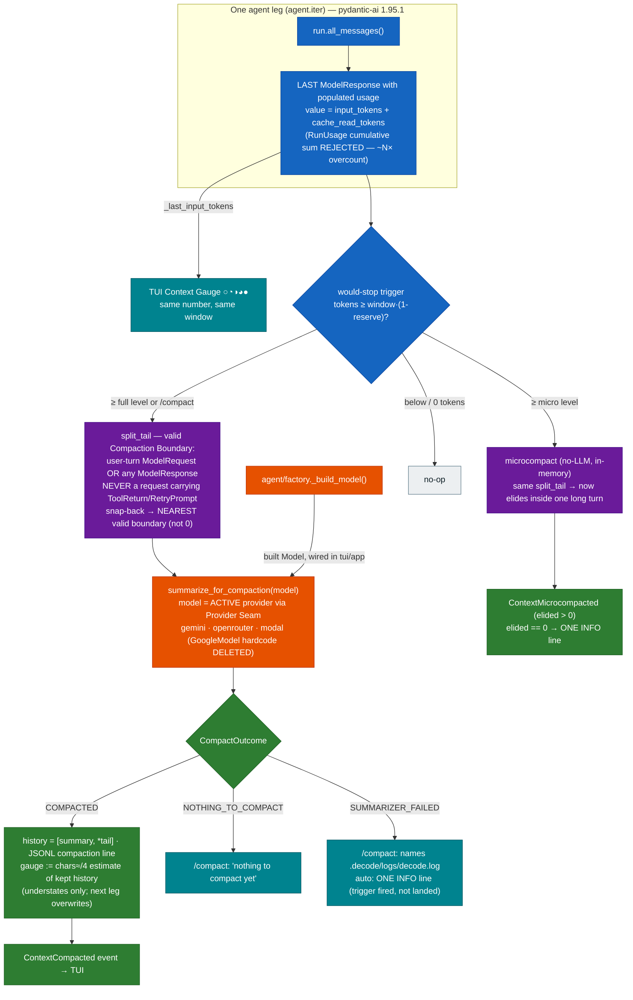

# 0018. Compaction fix — ModelResponse cut points, last-response token source, outcome surfacing, provider-seam summarizer

**Status:** Accepted — amends [ADR-0006](0006-conversation-compaction.md) §3, §3a, §5, §7 and its
"tail sizing" consequence; ADR-0006 otherwise retained (partial-amendment style per ADR-0012/0016).
**Date:** 2026-07-22

## Context

ADR-0006's compaction cascade never fires in real agentic use, and `/compact` reads as a no-op.
Verified against a real session log (`.decode/sessions/20260722T181859Z_8f85f3c9….jsonl`: ONE turn
= 1 user prompt + 63 tool messages, no `compaction` line ever), two independent root causes:

1. **Cut points.** `split_tail` (`context/compaction.py`) snaps the budget cut back to the nearest
   USER-TURN boundary (ADR-0006 §5). A single long agentic turn has exactly one — index 0 — so the
   snap collapses to 0 = "everything fits". `compact()` returns falsy silently AND `microcompact()`
   (which shares `split_tail`, §3a) elides nothing. Both tiers no-op precisely when the context is
   one long tool-heavy turn — the case compaction exists for.
2. **Token source.** `agent/loop.py` stores `run.usage().input_tokens`. Under the installed
   pydantic-ai 1.95.1 (the ADR-0009 downgrade — ADR-0006 §3's "2.0.0 property" note no longer
   describes the installed API), `RunUsage` is CUMULATIVE across every request in the leg
   (verified: `usage.py:243` accumulates `+=`; one request per tool round), so the gauge and both
   triggers overcount ~N× for N tool rounds. The true context size is the LAST response's own
   per-request usage — `ModelResponse.usage: RequestUsage` (verified `messages.py:2062`;
   default-factory, so unpopulated ⇒ `input_tokens == 0`).

Compounding both: `compact()`'s bool return can't distinguish "nothing to compact" from "the
summarizer call failed", and the summarizer hardcodes `GoogleModel` — a Modal/OpenRouter user
without `GEMINI_API_KEY` gets silent failure forever. All decisions below were explicitly settled
with the user; the alternatives are closed.

## Decision

One feature, five coordinated decisions:

1. **Valid cut points: user-turn boundary OR any `ModelResponse` boundary — snap-back to the
   NEAREST valid boundary, never to 0.** A cut is valid at a `ModelResponse`, or at a
   `ModelRequest` carrying no `ToolReturnPart`/`RetryPromptPart`; it is NEVER valid at a request
   carrying a tool return/retry — a return's matching call sits in the immediately preceding
   `ModelResponse`, so cutting AT a `ModelResponse` keeps every call/result pair intact. This
   redefines the **Compaction Boundary** (amends ADR-0006 §5) and fixes microcompaction for free
   (§3a unchanged in mechanism — it inherits `split_tail`). Post-compaction history still opens
   with the summary `ModelRequest`, so a tail starting on a `ModelResponse` is always preceded by
   a user message.
2. **Token source: the last populated `ModelResponse.usage` of the leg** (amends ADR-0006 §3's
   measurement plumbing; the window-relative reserve math stands). After each leg,
   `_last_input_tokens` = walk `run.all_messages()` backwards to the first `ModelResponse` with
   `usage.input_tokens > 0`; value = `usage.input_tokens + usage.cache_read_tokens` (cached prompt
   tokens still occupy context). None found → 0, and §3's safe fallback (0 ⇒ no tier fires) is
   retained. Gauge and triggers keep reading the SAME number — single source of truth preserved.
3. **`compact()` returns a three-valued `CompactOutcome`** — `COMPACTED` / `NOTHING_TO_COMPACT` /
   `SUMMARIZER_FAILED` — instead of bool (amends ADR-0006 §7's feedback story). `/compact` prints
   a distinct friendly line per outcome (`SUMMARIZER_FAILED` names `.decode/logs/decode.log`;
   success stays event-rendered); the auto path logs ONE INFO line when a trigger fired but did
   not land (`outcome != COMPACTED`; micro fired-but-zero-elided likewise). Degrade-don't-break is
   unchanged — failures never interrupt the turn.
4. **Post-compaction gauge seed: the chars≈/4 estimate of the new `[summary, *tail]`.** On
   `COMPACTED`, `_last_input_tokens` is set to the estimate so the footer drops immediately; the
   next leg's provider-authoritative number overwrites it. This deliberately SOFTENS ADR-0006's
   "the estimate never drives the trigger" (Consequences, tail-sizing bullet) to "the estimate
   never INFLATES the trigger": post-compaction it can only understate, briefly, and is replaced
   at the next leg — it can start no compaction loop.
5. **The summarizer rides the existing Provider Seam — least mechanism, all three providers.**
   `context/compaction.py` drops its `Settings → GoogleModel` branch; `summarize_for_compaction`
   accepts a built `pydantic_ai.models.Model`, and the ONE wiring site (`tui/app.py` — verified:
   `runtime/flow.py` wires no `AgentTurnHandler`, hence no headless cascade exists to rewire)
   hands it the ACTIVE provider's built model (`factory._build_model` output or the built agent's
   own model — same seam either way; import direction stays `tui → {agent, context}`). The
   Model-instance path remains the tests' no-network seam. **No cross-provider summarizer
   override knob** — a real second need would justify one. What would justify revisiting: a
   measured need for a cheaper dedicated summarizer model per provider.

**Non-goals (user-approved):** the empty-prompt would-stop path stays uncompacted; headless
compaction; `memory/extract.py`'s twin Gemini-hardcoded `_resolve_model` (adjacent bug class,
separate mechanism — future task).

## Diagram

## Consequences

- **Compaction now works on the workload it exists for**: one long tool-heavy turn triggers at the
  true occupancy (last-response usage) and finds a cut (ModelResponse boundaries), for BOTH tiers.
  The pairing is load-bearing — fixing only the cut points would fire ~N× too early; fixing only
  the token source would fire correctly and then find no cut.
- **The gauge stops overcounting ~N×**, so its colors and the triggers agree with what the
  provider actually bills per request; `input_tokens == 0` keeps meaning "don't fire".
- **`/compact` becomes honest**: three outcomes, three messages; a failed summarizer points the
  user at the log instead of masquerading as "nothing to compact". Auto failures leave one INFO
  breadcrumb.
- **Any provider can summarize** — a Modal/OpenRouter-only setup needs no Google key; compaction
  uses the model already serving the session. `context/compaction.py` loses its Google imports;
  the Settings branch of its `_resolve_model` is deleted (the Model-instance test seam stays).
- **The estimate's contract is weakened, deliberately**: from "never drives the trigger" to
  "never inflates it" — post-compaction it can only understate, briefly, until the next leg
  reports. Docstrings claiming the stronger contract are updated.
- **Tests churn**: every assertion on `compact()`'s bool return and on `Settings`-driven
  summarizer construction updates; a capstone regression pins the original failing session shape
  (1 prompt + dozens of tool messages) so the bug class cannot silently return.
- **Retained from ADR-0006 unchanged**: window-relative reserves and their invariant, JSONL
  checkpoint storage (§1), micro's in-memory/never-persisted nature (§3a mechanics), the summary
  skeleton (§4), the merge-for-free head property (§5), the consistency invariant (§6), memory
  compression (§8), the gauge's window/colors (§9).
- **Risks accepted**: a tail may now start with a `ModelResponse` — always preceded by the summary
  `ModelRequest`, so provider histories stay well-formed; `cache_read_tokens` semantics vary by
  provider (counted as occupancy — conservative in the safe direction).
