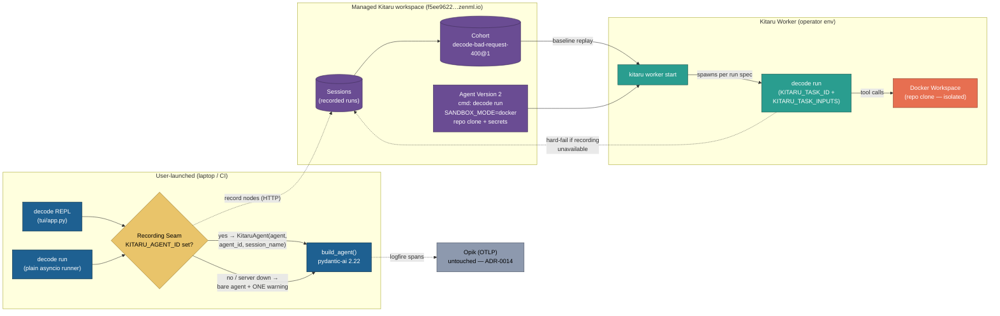

# 0019. Kitaru replay runtime — record sessions via the adapter, replay on workers; the durable runtime dies

**Status:** Accepted
**Date:** 2026-08-21

Supersedes [ADR-0008](0008-kitaru-durable-runtime.md) and [ADR-0010](0010-runtime-replay.md)
wholesale. Amends [ADR-0009](0009-downgrade-pydantic-ai-for-kitaru.md): its zenml-driven
co-resolution rationale is obsolete; the surviving pydantic-ai pin now exists for the
`kitaru-pydantic-ai` adapter (below). Amends [ADR-0015](0015-environment-bucket-secrets.md)
mechanics only: the Environment Bucket's semantics stand; its transport moves to the kitaru
0.22.2 client API.

## Context

Kitaru pivoted upstream. 0.18 was a durable-execution engine (ZenML-backed `@flow`,
checkpoints, waits, local stack) — everything ADR-0008 (headless Durable Flow, HITL waits,
durable sleep) and ADR-0010 (checkpoint-anchored what-if replay, `decode replay`) were built
on. Kitaru 0.22.2 removed ALL of it (verified against the installed package: `flow`,
`checkpoint`, `wait`, `save`, `ImageSettings`, `get_secret`, `kitaru.errors.*` — gone;
`runtime/flow.py:26` is an ImportError today). The replacement is a replay-based eval model:

- **Sessions**: agent runs recorded node-by-node (LLM + tool calls) on a FastAPI+Postgres
  server — for decode, the managed workspace `https://f5ee9622-kitaru.cloudinfra.zenml.io`.
- **Replays**: from-the-top re-execution with overrides (model/system prompt/prompt/params)
  and tool policies; no checkpoint anchors, no mid-run forks, no crash-resume.
- **Workers**: operator-run processes execute everything in *your* environment; the server
  runs nothing.
- **Adapter**: `kitaru-pydantic-ai` ships `KitaruAgent(agent, agent_id=None,
  agent_version_id=None, session_name=None, batch_size=20)` — a transparent recording wrapper
  (async `run` + `iter`; one Kitaru session per `run()`; multi-turn via message-history
  projection; worker task ids inferred). It caps `pydantic-ai <2.23`; decode is on 2.33.

Human-grilled decisions bind this ADR: design fresh around the new model; delete dead
surfaces without stubs; record BOTH REPL and headless runs; downgrade pydantic-ai.

## Decision

All related choices for this feature, together:

1. **The durable runtime dies; headless goes plain.** `runtime/flow.py` + `modal_app.py`,
   `decode replay`, `decode run --hitl` (and all wait plumbing), and the durable `sleep`
   seam are DELETED — no stubs, no shims. `decode run` is `asyncio.run` around the same
   `build_agent()` the REPL uses: bypass permissions, `ask_user` no-op, stdout = answer only.
   Guard chain, Model Override (`--model`), sandbox Workspace, Hand-back, and Opik tracing
   are preserved on the plain path (Hand-back now runs in the runner process — the
   "inside the flow" constraint died with the flow). `build_agent`'s `flow_mode` /
   keep-alive-free client die too (their rationale was 0.18's per-call event loops). HITL is
   removed, not deferred: upstream has no wait primitive.
2. **Dependency: adapter over hand-rolled recording; downgrade over isolation.**
   `kitaru-pydantic-ai>=0.1.0` is added and `pydantic-ai-slim[google,openai]` is pinned
   `>=2.22,<2.23` (human-approved). Fixing 2.23+ API fallout in decode is accepted cost;
   `kitaru[cli,mcp,worker]>=0.22.2` stays. Bias-to-least: the adapter is the platform
   feature; decode builds no recording machinery of its own.
3. **One Recording Seam, presence-based, two failure modes.** A single function wraps a built
   agent in `KitaruAgent` iff `KITARU_AGENT_ID` (new setting) and the adapter's own env
   (`KITARU_API_URL`/`KITARU_API_KEY` — resolved by the adapter client, not decode) are
   present. Both the REPL (session_name = decode session id, so turns group) and headless
   `decode run` go through it. User-launched runs DEGRADE GRACEFULLY to the bare agent with
   ONE warning line when the server is unreachable — recording is an observer, never an
   availability dependency. Worker-spawned runs (`KITARU_TASK_ID` present) HARD-FAIL —
   an unrecorded replay is a lying experiment. Invariant tightened: **no kitaru import
   unless recording is configured (or a worker task / remote-bucket context)**.
4. **Replay context is replicated, isolated, and registered — not simulated.** Agent version 2
   on the workspace's `decode` agent carries the real run spec: command `decode run` with
   `SANDBOX_MODE=docker` + a repo clone of this repo, provider credentials via Kitaru's
   version-attached secrets. `decode run` accepts its task from `KITARU_TASK_INPUTS`
   (`{"task": ..., "model": ...}`) when the CLI arg is absent, via `kitaru.task` — imported
   only in the worker branch. `KITARU_REPLAY_ID` handling is adapter-native; decode never
   touches it. Replayed tool calls land inside the docker Workspace, never the operator's
   host tree.
5. **The Environment Bucket survives; only its transport changes.** ADR-0015's semantics
   (Settings-only, inert at `local`, never-raises, `make sync-secrets`) are unchanged; the
   dead `get_secret` import is re-implemented on the 0.22.2 client's named-secrets API
   against the managed workspace. `scripts/kitaru_bootstrap_api_key.py` (local-server
   bootstrap) is deleted.
6. **Observability is untouched.** Logfire→OTLP→Opik (ADR-0014) stays as-is; the adapter
   composes with OTel. Kitaru is fed by the adapter, Opik by OTLP — one instrumentation was
   NOT unified in this round (rejected: JSONL importer pipeline — more moving parts, weaker
   replay fidelity than adapter recording).

What would justify revisiting: an upstream wait/HITL primitive returning (re-open a headless
HITL feature); the adapter lifting its `<2.23` cap (lift the pin); a second recording
consumer (re-open the importer/one-instrumentation design).

## Diagram

## Amendments

**2026-08-22 — implementation reality (tasks 134-137).** Three narrowings the Decision above did
not anticipate; the rest stands unchanged.

1. **§4, input contract — two recorded shapes are also read as a prompt.** kitaru builds a replay's
   agent task with `inputs=baseline.inputs`, i.e. it hands the baseline Kitaru Session's own
   recorded inputs to the Agent Version verbatim, and neither producer emits `{"task": …}`:
   `kitaru-pydantic-ai` records `inputs = ctx.prompt` (a bare JSON string) and the Opik importer
   records `{"input": "<prompt>", …}`. So the shipped `_task_from_inputs` accepts all three —
   canonical `{"task", "model"}` still wins, the other two are each the recorded prompt verbatim,
   and anything else (a list, a number, a structured `input`) still hard-fails, so a Worker replay
   still never guesses its own prompt. Related: `RunSpec` is `{command, working_dir, env,
   secret_ids, timeout_seconds}` — it has **no input-schema field**, so "the command carries no
   inline prompt" is the only registration-side expression of the contract.
2. **§4, secrets — the Agent Version attaches none.** Version 2 shipped with `secret_ids: []`:
   provider credentials reach the spawned `decode run` through the Kitaru Worker's own shell env
   (verified against kitaru `worker/process.py::build_process_env`, which layers the run spec on
   top of the Worker's `os.environ`), so the documented start is `set -a && . .env && set +a &&
   kitaru worker start`. Uploading live keys to the workspace would buy nothing here.
   Version-attached secrets remain the alternative for a shared or unattended Worker.
3. **§3, gate widening — a Worker Task is always recording-configured.** `recording_is_configured()`
   returns true whenever `KITARU_TASK_ID` is present, even without `KITARU_AGENT_ID` (the adapter
   infers the agent from the task). Otherwise a misconfigured Worker would silently produce an
   unrecorded — and therefore worthless — replay instead of taking §3's hard-fail exit.

## Consequences

- **Gained:** a live replay corpus from real REPL + headless usage; what-if replays and
  cohort evals on the managed workspace with zero server ops; ~600 lines of flow machinery,
  the ZenML store test fixtures, and the local-server bootstrap deleted; the REPL/headless
  paths converge on one agent build.
- **Lost (accepted):** crash-resume and durable HITL — a headless crash is a full re-run; no
  wait primitive exists upstream. Checkpoint-anchored forks are gone: replays run from the
  top, and code-level what-ifs cost a new agent version.
- **Cost:** pydantic-ai is pinned to 2.22 until the adapter lifts `<2.23` — decode forgoes
  2.3x features and pays a one-time API-fallout fix; the pin must be revisited on adapter
  releases.
- **Risk:** the same word "Worker" now names two concepts (sandbox Worker vs Kitaru Worker) —
  the glossary disambiguates and prose must qualify.
- **Test surface:** runtime unit tests shrink to the plain runner + seam fakes; the
  integration proof of replay moves OUT of pytest into the operator gate (task 137's
  documented worker replay) — CI no longer exercises kitaru end-to-end, by design.
