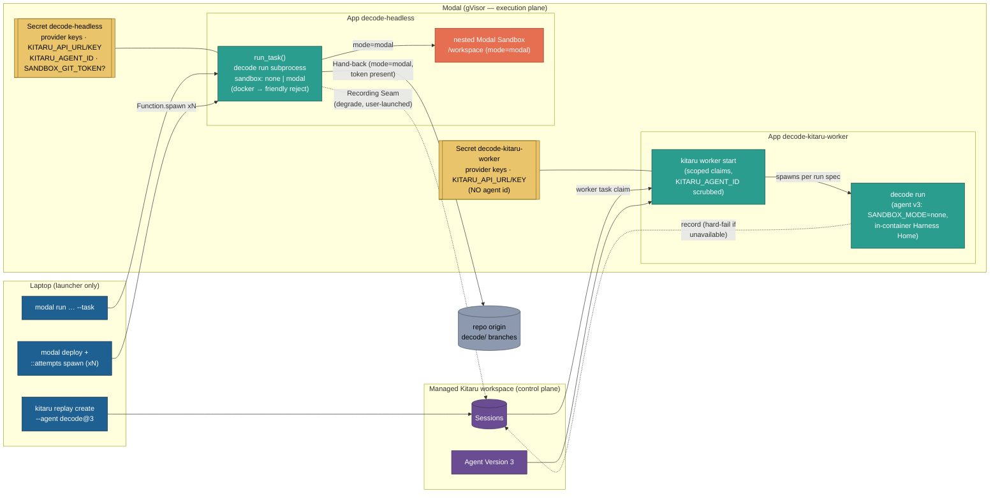

# 0020. Remote headless on Modal — Modal executes, Kitaru stays the record/replay plane

**Status:** Accepted
**Date:** 2026-08-22

Builds on [ADR-0019](0019-kitaru-replay-runtime.md) (unchanged) and finishes retiring the
surfaces its Decision left behind (07_infra's stale GCP story, the `remote` dependency group,
the demo fan-out script). Amends nothing in ADR-0012/0015/0016 — their invariants are applied,
not changed.

## Context

ADR-0019 killed the self-hosted GCP+ZenML stack that used to run `decode run` remotely, and with
it the two capabilities the course still wants: fire a headless agent from a laptop and walk
away (including N parallel attempts at one task, compared as N branches), and execute Kitaru
replays somewhere other than the operator's machine. What remains today is laptop-bound: the
Kitaru managed workspace records and orchestrates, but every run and every replay executes where
an operator's shell is. Modal is already in the stack twice (remote Sandbox backend, open-model
serving), containers are gVisor-isolated, images build in code (`sandbox/modal_backend.py`), and
secrets are a platform primitive — everything a remote harness needs, with zero servers to own.
Human-grilled decisions bind this ADR: Modal apps built in-code (no Dockerfile, no registry);
sandbox `none`/`modal` only on Modal; a Modal-hosted Kitaru Worker with agent version 3; two
purpose-split Modal Secrets; task 140 folded into this feature; no Kitaru self-hosting.

## Decision

All related choices for this feature, together:

1. **Launch-vs-execute split.** Modal is where remote *execution* happens; the Kitaru managed
   workspace stays the *record/replay control plane*; the laptop is only a launcher. Two operator
   scripts (in `scripts/`, outside the decode import graph, mirroring
   `register_kitaru_agent.py`'s pure-helpers-plus-thin-surface shape): the **Modal Headless App**
   (`decode-headless`, `scripts/modal_headless.py`) whose Function runs `decode run` as a
   subprocess of the baked console script — `modal run` for ad-hoc synchronous runs, and
   `modal deploy` + an `attempts` spawn helper for fire-and-forget including N parallel attempts
   (the successor of the deleted `demo-multiple-attempts.sh`; every ZenML warm-up/TOCTOU dance
   dies — one image, N containers). No server, no VM, no always-on cost.
2. **Images are built in-app** with `modal.Image` — uv-synced deps + the local decode source
   baked at build (the `modal_backend.py` idiom, extended). NOT `flow.Dockerfile`, NOT a
   registry; both are deleted (with `make deploy`/`run-remote`, `scripts/deploy.sh`, the demo
   script, and the GCP-only `remote` dependency group — task 140 absorbed).
3. **Sandbox compatibility on the Modal harness: `none` and `modal` ONLY.** `none`: the gVisor
   container itself is the isolation; a `repo` is cloned by the harness *into the container* and
   decode launches with that cwd — decode's `--repo`-under-`none` guard (ADR-0012 §3) is not
   relaxed, and there is no Hand-back on this path. `modal`: `--repo` passes through to decode —
   native clone, nested Modal Sandbox via the existing `ModalBackend`, Hand-back ships
   `decode/<session-id>` using a git credential helper configured from `SANDBOX_GIT_TOKEN` when
   present (skips gracefully when not — ADR-0016 unchanged). `docker` is guard-rejected
   client-side with one friendly line: there is no Docker daemon on Modal. Recording Seam
   semantics are untouched: harness runs are user-launched → graceful degrade (ADR-0019 §3).
4. **Two purpose-split Modal Secrets; `DECODE_ENV=local` in every container.**
   `decode-headless`: provider keys + `KITARU_API_URL` + `KITARU_API_KEY` + `KITARU_AGENT_ID` +
   optional `SANDBOX_GIT_TOKEN`. (`KITARU_API_KEY` added over the grilled list: a container has
   no `kitaru login` store; without it every run would degrade to unrecorded.)
   `decode-kitaru-worker`: `KITARU_API_URL` + `KITARU_API_KEY` + provider keys and deliberately
   **NO `KITARU_AGENT_ID`** — a configured agent id makes the Recording Seam probe an agents
   route a task-scoped token cannot use → 403 hard-fail (tasks/139; 08_evals_replays §7.3); the
   worker Function also scrubs the variable defensively. Secret creation is operator-side
   (`modal secret create …`), commands documented, values never committed. Secrets inject
   process env, which outranks `.env` in Settings precedence — so `DECODE_ENV` stays `local`
   and the Environment Bucket is not used on Modal: one config surface, no kitaru import at
   settings load (ADR-0015 semantics intact).
5. **Replays go remote via a Modal-hosted Kitaru Worker + agent version 3.** A long-running
   deployed Function (`decode-kitaru-worker`, shared image builder with the headless app) runs
   `kitaru worker start` with claims scoped to decode's replay/evaluator work. Agent version 3 —
   registered by extending `scripts/register_kitaru_agent.py` with `--sandbox-mode`, not by a
   new script — is the same `decode run` command with `SANDBOX_MODE=none` (default; `modal`
   allowed, `docker` impossible) and no `SANDBOX_REPO`: the container is the isolation and the
   Worker's in-container Harness Home is the tool scope. The laptop keeps agent v2 (docker);
   the two workers coexist.
6. **No Kitaru server deployment.** The managed workspace stays; self-hosting is out of scope.
7. **Docs follow the surface:** 07_infra.md carries the new story and its GCP appendix shrinks
   to a retirement note (git history is the archive); 08_evals_replays.md gains the Modal
   worker option; 02_modal_endpoints.md cross-refs.

What would justify revisiting: Modal shipping a Docker-in-gVisor daemon (lift the docker
rejection); a kitaru wait/HITL primitive (a remote HITL feature); painful 24h worker expiry
(a scheduler around §5); a real need for decode-native `--repo` under `none` (a guard-relaxation
ADR amendment, not a silent change).

## Diagram

## Consequences

- **Gained:** fire-and-forget remote headless runs and N-branch parallel attempts with zero
  servers and zero idle cost; replays that execute off-laptop; ~750 lines of dead deploy/demo
  surface plus 14 GCP dependencies deleted; both remote apps share decode's exact laptop
  surface (`decode run` subprocess), so behavior drift is structurally impossible.
- **Lost (accepted):** Hand-back under `none` mode on the harness (answer-only; use `modal`
  mode to ship a branch); Docker-parity replays on the Modal worker (agent v3 is `none` — a
  docker-faithful replay stays a laptop/v2 job); the GCP appendix's trap lessons move to git
  history.
- **Cost/risk:** the Modal worker dies at the 24h function timeout and needs a re-launch (one
  command; revisit clause above); the harness image must be redeployed when decode's source
  changes (the price of source-at-build — same coin as agent versions being immutable); a
  sandboxed harness container holds real provider keys and the optional git PAT — the ADR-0016
  rule applies: scoped, revocable credentials only.
- **Test surface:** unit tests cover the scripts' pure helpers only; the e2e proof is the
  operator gate ([HUMAN] criteria in tasks 142/143/145), consistent with ADR-0019 keeping
  kitaru out of CI.

## Amendments

**2026-09-02 — §8 Two laptop-less triggers on the Modal Headless App; §9 a request ceiling for
unwatched runs.** Extends §1 and §2; changes nothing in §3-§7.

8. **Cron and webhook triggers, both thin callers of `run_task`.** The course's remote story
   ("hooked to cron jobs, webhooks or any other event") had no code behind it: every remote run
   still began with a human typing `modal run`. Two Functions close that, and neither
   re-implements a run:
   - **`nightly`** — `@app.function(schedule=modal.Cron(…))`. The schedule AND the job (task /
     repo / sandbox mode / model / ceilings) are read from the laptop's `DECODE_NIGHTLY_*` env at
     `modal deploy` and travel with the deployment — the schedule on the Function, the job as a
     `modal.Secret.from_dict` env the container reads back under the same names. No
     `DECODE_NIGHTLY_CRON` on the laptop → no schedule registered, so a plain `modal deploy` never
     starts billing anyone's nights; a cron with no task, an impossible mode, or a non-numeric
     ceiling dies on the laptop with one line, never at 2am in a container. It runs `run_task`
     with `.local()` — same container, same Secret, same subprocess as `::main`.
   - **`webhook`** — `@modal.fastapi_endpoint(method="POST", requires_proxy_auth=True)`. Takes
     the same knobs as `::main` as a JSON body, `spawn`s `run_task` on the deployed app and
     answers at once with the call id and where to watch (`modal app logs`, `kitaru session list`,
     `git ls-remote`). Fire-and-forget by design — a webhook caller has seconds, an agent run has
     minutes. Proxy auth (the `Modal-Key` / `Modal-Secret` pair the open-model endpoints already
     use) keeps the printed URL from being a public "spend my tokens" button. The endpoint holds
     NO Secret: it spawns, it does not run. FastAPI is the one package the two apps' images no
     longer share — `build_image(extra_packages=…)` installs it into the same venv between the
     locked-deps layer and the source layer, so the expensive layer stays shared (amends §2).
9. **A request ceiling for runs nobody watches.** `decode run --max-requests N` (default
   `RUNTIME_MAX_REQUESTS`, unset = unbounded, byte-identical to the REPL) bounds a headless run
   through pydantic-ai's `UsageLimits`; past the cap the run stops with one friendly line and
   exit 1, and the Hand-back still ships what the Workspace holds (extends ADR-0019 §1's plain
   run). Every Modal surface — `::main`, `::attempts`, `DECODE_NIGHTLY_MAX_REQUESTS`, the webhook
   body — passes it straight through to that flag. Modal's `--timeout-seconds` bounds wall-clock;
   this bounds the token bill, which is the number a background run actually runs up.

Also under this amendment: `running_the_code/07_infra.md` is rewritten as the runbook for the whole
remote surface (secrets → deploy → the four triggers → the Worker), and the GCP retirement appendix
§7 kept is deleted along with every other retired-surface note in `running_the_code/` (Credential
Proxy, `RUNTIME_SECRET_*`, durable-flow asides) — git history is the archive.

**Consequences.** Gained: the two triggers the article promised, as ~150 lines of pure helpers
plus two Functions, unit-tested hermetically like the rest of the script. Cost: the headless image
gains a FastAPI layer (the Worker's does not); the deploy-time env is one more thing an operator
must export before `modal deploy` when they want a schedule. Not done (deliberately): a
multi-project manifest (N different tasks × repos) and a chained experiment loop — both are
launcher-side loops over `run_task`, and belong to their own tasks.

**2026-09-03 — §10 The launcher moves under the `decode` CLI; the ephemeral app is dropped.**
Amends §1 (the "operator scripts" framing for the headless app) and the Test surface note; changes
nothing in §2-§9.

10. **`decode remote …` replaces `modal run scripts/modal_headless.py::…`.** The headless app was
    the one remote surface a user reached through a *different* CLI than the one they were
    learning. It now lives in the package as `decode/remote/` — `headless.py` (every decision a
    run is made of, `modal`-free), `image.py` (the shared image build, formerly
    `scripts/modal_image.py`), `app.py` (the three Functions), `cli.py` (the Click group) — and is
    driven by four subcommands: `decode remote deploy` (`modal deploy -m decode.remote.app`, from a
    checkout), `decode remote run` (one synchronous run), `decode remote attempts [--detach]` (the
    fan-out), `decode remote logs`. The knobs, the guards, the messages, the nightly env and the
    webhook body are unchanged. Two consequences are deliberate:
    - **Every trigger targets the deployment.** The `::main` ephemeral-app path is gone: `decode
      remote run` resolves `Function.from_name("decode-headless", "run_task")` exactly like the
      fan-out always did, so the laptop never builds an image and the four triggers share one code
      path. The cost is one `decode remote deploy` before the first run (the fan-out, the cron and
      the webhook already required it). A missing deployment or missing Modal credentials is ONE
      friendly line, not a traceback.
    - **The REPL pays nothing.** `decode.cli` registers the group, and the group imports no
      `modal`: the import sits inside the helper that resolves the deployment, and the image
      builder imports it inside `build_image()`. A unit test pins `modal` out of `sys.modules`
      after `import decode.cli`, alongside the existing kitaru and sandbox-backend pins.
    The Kitaru Worker stays an operator script (`scripts/modal_kitaru_worker.py`): it is
    operator-only tooling with no user-facing verb, and it imports the image builder from
    `decode.remote.image` now. The registration drift guard reads the in-image paths from there
    too.

**Consequences.** Gained: one CLI for the whole course, `decode --help` lists the remote surface,
and the launcher is unit-tested through Click like `decode run` is. Cost: the deploy must run from
a repo checkout (`uv_sync` needs the lockfile; the source layer needs `src/`) — an installed wheel
gets one friendly line saying so. Not done (deliberately): moving the Worker under `decode remote
worker` — no second caller yet.
