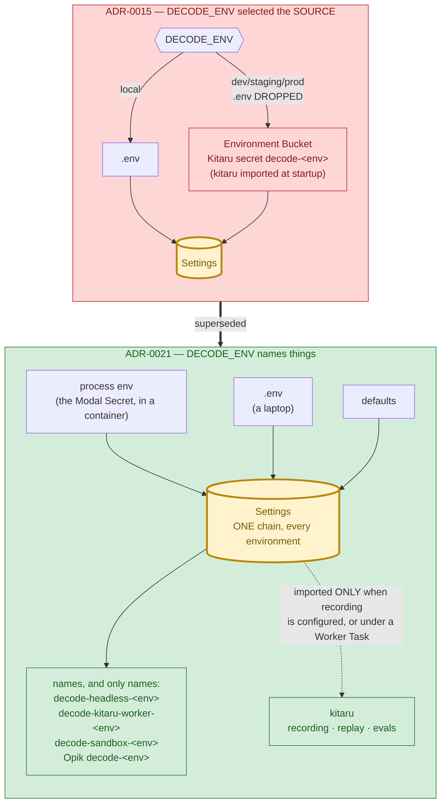

# 0021. `DECODE_ENV` is a naming suffix; one secret store per platform

Status: Accepted
Date: 2026-09-09

Supersedes [ADR-0015](0015-environment-bucket-secrets.md) §§1–3, 5, 7 (the Environment Bucket and the
`DECODE_ENV`-gated source chain) and [ADR-0020](0020-remote-headless-on-modal.md) §11 (the Modal Secret picks
`DECODE_ENV`). ADR-0015 §4 (the deleted `RUNTIME_SECRET_*` knobs), §8 (Opik projects follow the environment) and
§9 (the `.env.example` drift test) stand unchanged; §6 was already moot.

## Context

ADR-0015 gave `DECODE_ENV` one job: **select where `Settings` reads from**. `local` read `.env`; `dev` /
`staging` / `prod` read the **Environment Bucket** — a Kitaru secret named `decode-<env>` — and dropped `.env`
from the chain entirely, so a missing key failed loudly.

Two things turned out to be true about that design.

**It made Kitaru a hard startup dependency of everything.** Kitaru's role in this project is recording and
replay: an evals layer, opt-in, observed by a human ([ADR-0019](0019-kitaru-replay-runtime.md) §3). But
`DECODE_ENV=prod` also made it the *config store*, so every remote-environment run — REPL, `decode run`, and
every Modal container — had to reach a Kitaru workspace, authenticated, before its first prompt. ADR-0019 §3's
invariant already had to carve out a third branch for it ("or a remote-bucket context"). That coupling is what
we actually hit in practice: a deployed `decode-headless` whose Secret said `DECODE_ENV=prod` refused every run
with `the environment bucket 'decode-prod' could not be loaded` — no bucket had been created, and the
`ZENPROKEY_…` a container needs to read one is still unminted (`tasks/153`). The runs failed at startup,
`session=None`, for a reason that had nothing to do with the task, the provider, or the sandbox.

**Nothing else ever read the bucket.** `Settings` was its only reader. The Kitaru Worker attaches no secret to
a run spec, and `scripts/register_kitaru_agent.py` went as far as pinning `DECODE_ENV=local` into every replay
spec *specifically to keep a spawn from inheriting a bucket*. A store with one reader, which another part of
the same system works to avoid, is not a store — it is a coupling.

Meanwhile the question `DECODE_ENV` is genuinely good at answering was already being answered elsewhere and
well: `decode-sandbox-<env>` (the nested Modal sandbox app) and `decode-<env>` (the Opik project) both derive
from it, and both exist so a `local` experiment cannot disturb a `prod` one.

There is a second, quieter problem. ADR-0020 §11 put `DECODE_ENV` **inside** the Modal Secret. A Secret is
mutable by an operator and re-read at container start, so the deployment's identity ("which environment am I?")
lived in a place the deployment did not control — and `modal secret create --force` writes a *new* Secret
object, which a running deployment does not pick up until it is redeployed. The observed symptom: a Secret
rewritten to `DECODE_ENV=local` while every container kept reading `prod`.

## Decision

**`DECODE_ENV` names the environment. It never decides where config is read from.**

1. **One source chain, at every environment.** `init > process env > .env > defaults` — pydantic-settings'
   default chain, with no `settings_customise_sources` override at all. `EnvironmentBucketSettingsSource`,
   `_read_bucket`, `bucket_load_error`, `environment_bucket_name` and the out-of-band `_resolve_decode_env`
   bootstrap are **deleted**; `decode_env` becomes an ordinary field read like every other. The store that
   feeds the chain is the platform's own: a developer's `.env` on a laptop, the Modal Secret in a container.

2. **One environment, one deployment, one Secret.** Both Modal apps take the `-<env>` suffix their sandbox app
   and Opik project already had: `decode-headless-<env>` and `decode-kitaru-worker-<env>`, each running with
   the Secret of the same name. `DECODE_ENV=prod decode remote deploy` publishes `decode-headless-prod`; a
   plain deploy publishes `decode-headless-local`. `decode remote run|attempts|logs` resolve the same name
   from `settings.decode_env`, so the launcher and the deployment cannot mean different apps. A Secret carries
   **credentials**, and is the whole config surface for its container.

3. **The environment is baked, not carried.** `build_image(decode_env=…)` sets `DECODE_ENV` in the image at
   deploy, from the deploying laptop's env — the same value that just named the app and its Secret, so the
   three cannot drift. A Secret that carries its own `DECODE_ENV` and disagrees is refused at startup with ONE
   friendly line (`decode_env_mismatch_error`), because Modal's env precedence would otherwise make an app
   called `decode-headless-local` file `decode-prod` traces silently. An unknown value fails on the laptop at
   deploy (`deploy_time_decode_env`), not in a container log. `decode remote deploy` passes `DECODE_ENV`
   **explicitly** to the `modal deploy` subprocess: it re-imports the app module and reads `os.environ`, and a
   value that came from `.env` reached `Settings` without ever landing there.

4. **A replay runs AS the environment of the Worker that spawned it.** `register_kitaru_agent.py` no longer
   pins `DECODE_ENV` into the run spec. There is no bucket left to inherit, and a replay spawned by
   `decode-kitaru-worker-prod` should file its traces under `decode-prod` — not under whatever a registration
   script guessed months earlier. A run spec change means a new Agent Version.

5. **Clean break: the Environment Bucket is deleted**, and `scripts/sync_secrets.py` + `make sync-secrets` +
   `tests/support/kitaru_secrets.py` with it — the script existed only to write the store, and the store has
   no readers left. No shim, no compat path, in keeping with ADR-0015 §4's own precedent. **Kitaru is an
   evals/recording layer and nothing else**, which *tightens* ADR-0019 §3's invariant rather than loosening it:
   its third branch is gone, so recording (or a Worker Task) is now the ONLY thing that can import kitaru, at
   any `DECODE_ENV`.

**Non-goals.** `DECODE_ENV` still does not change session dirs, log paths or `MEMORY.md`. The `Literal` stays
closed — a new environment is a code change, deliberately. No secret store is introduced to replace the
bucket: if a deployment needs a key, it goes in that deployment's Secret.

## Diagram

## Consequences

**Positive.** A deployed run no longer depends on a Kitaru workspace being reachable, provisioned and
authenticated — the failure that motivated this ADR is unrepresentable, and `tasks/153`'s unminted key now
gates only the Kitaru Worker, which is the only thing that actually needs a workspace. `Settings` loses ~130
lines, one settings source, a thread-pool event-loop workaround and a module-global error channel; the whole
of `settings_customise_sources` goes with them. Two environments are two apps with two Secrets, so
"redeploy `prod`" and "point at `prod`" are the same sentence. ADR-0019 §3's invariant gets simpler: no
`DECODE_ENV` imports kitaru.

**Negative / accepted.**

- **`.env` can backfill a key at any environment.** ADR-0015 §2's loud-failure property is gone: at
  `DECODE_ENV=prod` on a laptop, a key missing from wherever you meant it to come from is silently filled from
  `.env`. Accepted — a container has no `.env` at all, so the property still holds where it was doing real
  work, and "the deployment's Secret is its config" is a rule an operator can hold in their head.
- **Credentials must be mirrored by hand into each environment's Secret.** There is no `make sync-secrets`
  any more. For two Modal apps and a handful of keys this is one documented `modal secret create` per app;
  a project with many environments would want tooling, and would then be choosing it deliberately.
- **A laptop `DECODE_ENV=prod` reads your `.env` and files traces under `decode-prod`.** That is the intended
  reading of "naming only", but it is a change in meaning for anyone who read `prod` as "and get prod's
  secrets".
- **Existing deployments must be recreated**, not migrated: `decode-headless` (unsuffixed) is a different app
  from `decode-headless-local`, and its Secret is a different Secret. Stop the old app, create the suffixed
  Secret, redeploy.
- **The Kitaru Worker's Agent Version must be re-registered** (§4 changed the run spec) — versions are
  immutable, so this is a new version, and replays must be pinned to it.
