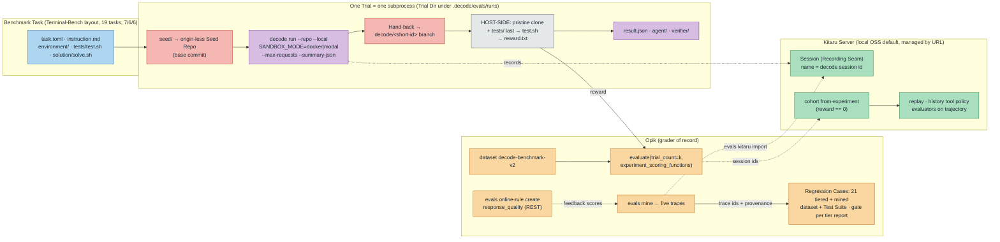

# 0022. Evals v2 — our own "Harbor" on Opik primitives, Kitaru orthogonal

Status: Accepted
Date: 2026-09-10

Supersedes [ADR-0017](0017-decode-eval-suite.md) §3 (execution through the sandbox seam for the
benchmark), §4 (in-process driving *for the benchmark*; it stands for regression cases), §5 (the
`verify/` overlay contract), §7 (per-task judges), and §8 (post-hoc aggregates attached as trace
feedback scores). ADR-0017 §1 (placement), §2 (tracks), §6 (two regression surfaces), §9 (cadence),
§10 (online) stand. Amends [ADR-0019](0019-kitaru-replay-runtime.md) §2 (the `pydantic-ai <2.23`
pin is lifted) and §3 (recording is now also the benchmark's trajectory store).

## Context

ADR-0017 shipped a working suite: 20 outcome tasks, 21 hand-written behavior probes, an Opik harness,
an online track. Six weeks of use and a research pass over Terminal-Bench, Harbor, DeepSWE and
SWE-bench exposed four gaps that matter for what the suite is *for* — measuring whether a decode
change made the agent better, and pinning fixed failures so they stay fixed:

1. **The benchmark does not measure the product.** Trials run the agent *in-process* through a
   private driver, never through `decode run`. The sandbox mode, the hand-back, the Recording Seam,
   the request cap — the actual headless runtime — are outside the measurement. A Kitaru replay of a
   benchmark trial is impossible because no Session exists.
2. **The task contract is home-grown and uncalibrated.** `task.yaml + setup/ + verify/ + solution/`
   is Harbor-shaped but not Harbor-readable; grading is an exit code, not a reward; there is no
   agent or verifier timeout, no infra-vs-agent failure split, no canary, no FAIL_TO_PASS shape for
   test-bearing tasks; prompts assume a frontier model's improvisation while the harness's default
   provider is `modal` serving `Qwen/Qwen3.6-35B-A3B-FP8`. Every one of those is a solved convention
   in Terminal-Bench (`task.toml`, `instruction.md`, `tests/test.sh` → `reward.txt`,
   `solution/solve.sh`, oracle-must-pass / nop-must-fail, canary) or SWE-bench (hidden tests applied
   after the change, FAIL_TO_PASS / PASS_TO_PASS).
3. **Regression probes are invented, not captured.** All 21 were written from the design docs. None
   came from a trace of decode failing. The one failure we did see (`ModelHTTPError 400`) is guarded
   only by a Kitaru evaluator, disjoint from the Opik gate. The live project has no online judge
   score to mine on (`decode-prod`: 0 rules, 68 traces).
4. **Stale infrastructure story.** Code and docs pin opik 1.9.8 semantics (no Test Suites, no
   `experiment_scoring_functions`); the installed 2.2.36 has both, plus REST access to automation
   rules. The pydantic-ai cap (`<2.23`) is the adapter's old one.

Two options were weighed for the benchmark runner. **Adopt Harbor** (`opik harbor run`, decode as a
Harbor `BaseAgent`): real task format, Opik integration for free; but two orchestrators (Harbor
Job/Trial and Opik Experiment) telling one story, Opik's integration is a monkey-patch of Harbor
internals, decode would run *inside* the task container with `SANDBOX_MODE=none` (its own sandbox
seam unmeasured), and a dev-group dependency on litellm + fastapi + supabase. **Build our own on Opik
primitives**: Opik `evaluate()` already *is* a Harbor Job — dataset item = task, task function =
trial, `trial_count` = attempts, `experiment_scoring_functions` = pass@k, experiment = job,
comparison UI = leaderboard. Harbor's and SWE-bench's conventions are borrowed as inspiration;
neither runner is adopted. Constraints unchanged from ADR-0017: `evals/` never ships in the wheel,
`make ci` stays keyless, live tracing is never polluted, the codebase teaches. New constraint: no
runtime dependency beyond the upgrade.

Kitaru's managed workspace was deactivated (`state_reason: subscription_ended`, 2026-09-05). The
CLI-owned local deployment (`kitaru login --local`: server image + `postgres:16-alpine` under docker
compose on `localhost:8000`) is a full server. Server choice is one URL.

## Decision

**Opik is the grader of record and experiment store for all three layers. Kitaru is the replay
engine over the Sessions those same runs record. They never talk to each other; decode's session id
is the join.**

1. **The benchmark drives `decode run`, never the driver.** One Trial = one subprocess
   `decode run "<instruction>" --repo <Seed Repo> --local --max-requests <max_steps>
   --summary-json <path>` launched from a throwaway Harness Home with `SANDBOX_MODE` = the
   `--sandbox` flag (`docker` default, `modal`), `OPIK_PROJECT_NAME` = the eval project, the parent's
   resolved `Settings` exported into the child env, `KITARU_TASK_ID` stripped. The trial measures the
   shipped runtime: sandbox seam, request cap, Recording Seam, Hand-back. The in-process driver
   (`evals/harness/driver.py`) stays for Regression Cases, where gate mode, pre-filled history and
   settings overrides are the point. `decode run` gains `--summary-json`: `{session_id,
   kitaru_session_id, exit_reason: completed|request_limit|error, error, requests, input_tokens,
   output_tokens, cost_usd, handback: {branch, pushed} | null, output}` — usage from the run's
   messages via `capture_run_messages`, cost by `observability/cost.py`'s honesty rule, written in
   the `finally` after Hand-back. Ground truth without parsing traces (ADR-0017 §4's rule, kept).

2. **Task contract = Terminal-Bench's plus SWE-bench's test shape, minus the container.** A
   Benchmark Task is `evals/benchmark/tasks/<NNN>-<slug>/`:

   ```
   task.toml          [task] name/version/description · [metadata] difficulty/category/tags ·
                      [agent] timeout_sec/max_steps · [verifier] timeout_sec · [verifier.tests] fail_to_pass/pass_to_pass
   instruction.md     the agent's prompt, verbatim; canary comment first line
   environment/       seed files (+ optional setup.sh) → the base commit of a fresh origin-less Seed Repo
   tests/test.sh      the Verifier: injected AFTER the run, writes reward.txt (one float) to $VERIFIER_DIR
   solution/solve.sh  the Oracle: applied to a fresh seed, must yield reward 1
   ```

   **Nineteen tasks convert** (010-git-hygiene is deleted: its premise — uncommitted files, a
   branch *name* — is unobservable through Hand-back), keeping 7 easy / 6 medium / 6 hard; `category`
   uses Terminal-Bench's taxonomy (Science / Software / ML / Operations / Security / Hardware /
   Media). Beyond 010, nothing is deleted except the per-task G-Eval `judges:` field. Every task
   passes one **audit checklist** (the benchmark README): tier ceilings for `max_steps` / timeouts
   (easy 15/600 s · medium 25/900 s · hard 40/1500 s), instruction names the deliverable concretely
   (exact paths, function/flag/branch names, the self-check command that exists in the sandbox image
   — no pytest, so test files are `unittest` style), hidden tests live under `tests/` and are applied
   after the agent's changes, FAIL_TO_PASS / PASS_TO_PASS declared and honoured where a test file
   exists, oracle-must-pass / nop-must-fail, canary GUID in every authored text file. **Difficulty is
   calibrated to the default provider** (a 35B MoE): easy tasks should finish reliably, hard ones
   sometimes; pass@k over trials is the sensitivity knob, never the step cap. No per-task Dockerfile:
   the sandbox image is decode's own, so a task may only depend on what that image has. Unknown
   `task.toml` keys are rejected.

3. **Grading isolation, host-side, DeepSWE-style.** The agent's work leaves the Workspace only as
   the `decode/<short-id>` Session Branch the Hand-back pushes into the Seed Repo (host-side). The
   Verifier runs **host-side** on a *pristine* `git clone --branch decode/<short-id> <seed>` (the
   base commit when the Hand-back skipped), with `tests/` copied in LAST and `VERIFIER_DIR` set, then
   `bash tests/test.sh` → `reward.txt`. No sandbox seam at grade time: agent edits to tests are
   inert, the agent never sees the grader, an unchanged Workspace grades on base and fails, and a
   reward is reproducible from the Trial Dir with a bare `python3`. Absent, empty or non-numeric
   reward is a verifier error, not a zero. Consequence for authoring: the observable is the
   handed-back HEAD — a premise that depends on uncommitted files or on a branch *name* is
   unobservable and such a task is deleted (010); verifiers that inspect history tolerate one
   trailing Hand-back capture commit.

4. **Failure taxonomy.** `agent` failure (reward 0: wrong answer, request cap, agent timeout,
   `error` exit WITH a summary, verifier ran and said no) counts in the denominator. `infra` failure
   (sandbox did not start, seed/clone failed, verifier crashed or timed out, `decode run` died before
   its summary, unreadable reward) is excluded from BOTH numerator and denominator — surfaced as Opik
   `ScoreResult(scoring_failed=True)` and counted in the run summary. A timeout is a failure, never
   an infra error (DeepSWE's rule): SIGINT to the process group so decode's `finally` reaps and hands
   back, then the partial branch is graded like any other.

5. **Oracle gate stays in `make ci`.** For every task, host-side and keyless: `solution/solve.sh` on
   a fresh seed → reward 1; nothing → reward 0. The seeder (`evals/harness/seed.py`) is the same
   code the trial runner uses, so CI proves the seeding path too. A grader that cannot tell the
   oracle from silence cannot grade an agent.

6. **Metrics on Opik's axis.** `evaluate(dataset, task=trial, scoring_metrics=[RewardMetric],
   trial_count=k, experiment_scoring_functions=[pass_at_k, pass_hat_k, success_per_dollar,
   mean_cost_usd, infra_error_rate], experiment_config={model, provider, git_sha, sandbox,
   decode_version, kitaru_agent_id, trials, job_name}, task_threads=n)`. Subprocess trials are
   independent, so `task_threads > 1` is allowed. pass@k is Harbor's unbiased estimator over binary
   rewards (equal to `any` when n = k), macro-averaged per task and rolled up per tier. The post-hoc
   feedback-score attachment (ADR-0017 §8) is deleted. Per-task LLM judges are deleted: the Verifier
   is code; where a judge encoded a checkable requirement it became a deterministic check (015's
   diff bound, 019's exact greeting); a judge audits a verifier, it never grades of record.

7. **A Trial Dir on disk, always.** `.decode/evals/runs/<job>/<task>__<short-id>/{seed/, home/,
   pristine/, agent/{stdout.txt, stderr.txt, summary.json}, verifier/{test-stdout.txt,
   test-stderr.txt, reward.txt}, result.json}`, written in a `finally` so an infra failure still
   leaves evidence. Harness artifacts anchor to Harness Home (ADR-0012), hence `.decode/`, already
   git-ignored. `result.json` carries agent info (git sha, decode version, model), the summary,
   reward, status, reason, per-phase timings.

8. **Regression Cases: the 21 stay, tiered; mined cases land beside them.** A Regression Case is
   ADR-0017's probe plus `difficulty` (easy = single-tool discipline; medium = planning, delegation,
   skills, memory, web, lsp; hard = compaction survival, permission deny, destructive caution,
   judged cases, json contract), a one-line `symptom`, and a natural-language `assertion`. One
   definition registers twice — Opik dataset item + deterministic metric (the gate), Opik Test Suite
   item + assertion (the contrast, ADR-0017 §6 kept). `python -m evals regression --difficulty`
   filters; thresholds are reported per tier and gated globally at the existing floors. Mined cases
   (`python -m evals mine` over the LIVE project: errors, low online-judge scores, token outliers,
   denied-tool loops, clustered by signature; a human picks) carry provenance — `source_trace_id`,
   `thread_id`, `symptom`, `fixed_in` — and live beside the invented ones. Nothing is deleted.

9. **Light = calibrated and readable, not fewer tasks.** Nineteen tasks and twenty-one cases stay;
   what changes is that a course reader can read any task in one screen, run one tier with
   `--difficulty`, and hold the taxonomy in their head. Cost per run is bounded by tier ceilings,
   slicing, and `--trials`.

10. **Kitaru is orthogonal, joined by one id.** decode session id = Opik `thread_id` = Kitaru
    `session_name` = the Session Branch's short id. Every benchmark trial records a Session when
    `KITARU_AGENT_ID` is set (the Recording Seam, unchanged); `root_span` metadata carries
    `git_sha`, `model`, `sandbox_mode`, `decode_env` (and `kitaru_session_id` when the adapter exposes
    it — it currently does not; the join never depends on it) so Opik traces can be filtered and
    joined. Three commands, all thin: `evals kitaru import <trace-id>…` (Opik SDK → the `opik@N`
    importer envelope → `kitaru session import`, for traces recorded *without* the seam),
    `evals kitaru cohort from-experiment <name>` (reward-0 trials → cohort version, Sessions resolved
    by `session_name`), and `scripts/bootstrap_kitaru.py` (agent, versions, importer, evaluators;
    idempotent against whatever `KITARU_API_URL` names). Kitaru evaluators grade recorded sessions;
    Opik metrics grade fresh runs; no shared evaluator code. Replays use the `history` tool policy —
    tools frozen to recorded observations, model live — so a what-if answers "would model/prompt X
    have *acted* differently"; outcome re-verification on a replay is an upgrade path.

11. **Local OSS server by default, managed by URL.** `kitaru login --local` (`make kitaru-local`) is
    the development server; the managed workspace becomes a `KITARU_API_URL` switch when its
    subscription resumes. Opik is the system of record for sessions (any trace re-imports into any
    server); registrations are a script. A Kitaru Server is disposable.

12. **Dependencies upgraded, one pin lifted, first task of the feature.**
    `pydantic-ai-slim[google,openai]>=2.40,<2.41`, `kitaru[cli,mcp,worker]>=0.26`,
    `kitaru-pydantic-ai>=0.2.1` (its own cap is `<2.41`). Spiked: 2426/2434 unit tests pass; one
    test asserts a pydantic-ai private attribute and is rewritten; seven failures were `DECODE_ENV`
    leaking from the developer's env into worker-script tests and are isolated. Kitaru 0.25 renamed
    `--evaluate-baselines` to `--baseline-evaluation-mode`; 0.24 made registration idempotent (what
    the bootstrap script relies on) and stopped returning payloads on session lists.

13. **The Online Rule is code, not a click-path.** `python -m evals online-rule create` creates the
    `response_quality` LLM-as-judge rule in the LIVE project through Opik's REST client
    (`automation_rule_evaluators.create_automation_rule_evaluator` with an
    `AutomationRuleEvaluatorWrite_LlmAsJudge`; `find_evaluators` for idempotency), sampling 1.0,
    judge model from decode's provider routing, the qualitative prompt from `evals/README.md` held as
    one constant. Until it exists `feedback_scores.response_quality` is empty and the `low-quality`
    mining preset has nothing to find.

## Diagram



## Consequences

- **Positive:** the benchmark measures the shipped runtime, so a sandbox or hand-back regression
  shows up as a reward drop; tasks are readable by anyone who has seen Terminal-Bench or SWE-bench
  and a `DecodeAgent(BaseAgent)` wrapper is all it would take to run the real thing later; grading is
  a bash script plus a float, reproducible from the Trial Dir with no Opik and no docker; the failure
  split keeps a flaky sandbox from masquerading as a dumber model; calibration makes the numbers mean
  something for the model we actually run; regression cases carry evidence and a tier; the online
  judge exists from day one of a fresh workspace; Kitaru integration is two thin commands and one id,
  and survives a server swap; the sandbox-seam grading code and per-task judges are deleted.
- **Negative / accepted:** a subprocess per trial is slower than in-process (docker warm-up per
  trial; `task_threads` recovers some); host-side verification means the verifier's tool restriction
  (bash, python3 stdlib, git) protects reproducibility rather than image parity, and test files must
  be `unittest` style because the sandbox image has no pytest; an `error` exit with a summary
  (a provider outage mid-run) counts as an agent failure with a named reason — visible, never
  silently excluded, re-run it; 010-git-hygiene is deleted rather than reframed; regression
  mining needs live traffic to mine, so the first cases come from one human session; two Kitaru
  servers means two registrations (mitigated by the bootstrap script); the pydantic-ai jump is 18
  minors in one step; twelve tasks in the feature PR.
- **Deferred / upgrade paths:** `DecodeAgent(BaseAgent)` for Terminal-Bench proper if the nineteen
  stop discriminating; per-tier regression gating once real runs justify separate floors; outcome
  re-verification on Kitaru replays (needs the Seed Repo reachable from the Worker); `evals kitaru
  sync-scores` pushing evaluator results onto Opik traces as feedback scores; a private benchmark
  mined from decode's own merged task PRs (SWE-bench shape: task md = problem statement, parent sha
  = base commit, PR test diff = hidden tests); Python-metric online rules; partial-credit rewards.

## Implementation notes (2026-09-11)

The feature shipped as decided — the benchmark drives `decode run` (§1), nineteen tasks converted
7/6/6 (§2), grading is host-side on a pristine clone (§3), the oracle gate is keyless in `make ci`
(§5). These are the points where the code is *more specific* than the Decision above; none of them
changes a decision, and each is where a reader should look when the text and the code seem to differ.

- **§10, trace metadata spelling.** `trace_metadata()` is landed by `root_span` as one
  `opik.metadata.<key>` span attribute per field — the only spelling Opik ingests into a span's
  `metadata` (`observability/tracing.py::OPIK_METADATA_PREFIX`), which is what `evals mine` filters
  on. `kitaru_session_id` is omitted rather than `None`: adapter 0.2.1 exposes no public accessor for
  it, so it is absent in practice, exactly as §10 allows ("the join never depends on it").
- **§1 vs §4, the timeout/no-summary collision.** §4 makes a timeout an agent failure and "died
  before its summary" an Infra Error; a timed-out run usually has both. The shipped rule: **timeout
  wins** — the partial branch is graded and the trial is `agent_fail` with the reason naming both
  facts; only a run that exited without a summary and did **not** time out is an Infra Error
  (`evals/harness/trial.py`).
- **§6, where the experiment's project comes from.** opik 2.2.36 resolves an `evaluate()` run's
  project from the **dataset**, so the datasets are created in `settings.eval_project_name` and
  `evaluate(project_name=…)` is passed only as the fallback for a dataset that carries none — same
  project either way, without the duplicate-configuration warning.
- **§13, the project lookup.** The rule's project id comes from `projects.retrieve_project(name=…)`
  (exact-match, unpaginated); the obvious `find_projects(name=…)` is a paginated *substring* query
  that can report an existing project as missing. Rule idempotency is `find_evaluators` plus an
  exact-name re-filter, as written.
- **§11, the importer is self-contained.** `importers/opik_importer.py` imports nothing from `evals`:
  a Kitaru Worker runs it as a registered script, so its parser must stand alone (`opik@3`).
  `scripts/bootstrap_kitaru.py` registers the agent, both Agent Versions (docker first, `none`
  second — so a freshly bootstrapped server reads `decode@1` / `decode@2`), the importer and every
  `evaluators/*.py`.
- **§2, the calibration wording.** §2 says difficulty is calibrated to "the default provider (a 35B
  MoE)"; the shipped default is `LLM_PROVIDER=gemini` (ADR-0005 §1, `.env.example`) and the 35B
  (`Qwen/Qwen3.6-35B-A3B-FP8`) is the model the course *serves on Modal*. The tier ceilings are
  calibrated to that model, so `05_evals.md` and the benchmark README say it that way and add the
  rule the numbers need: compare runs on ONE provider — the same tasks read higher on the gemini
  route.
- **§8, one open shortfall.** The first full `decode-regression-gate` run scored `max_steps` 0.737
  against its 0.8 floor: five *invented* cases carry `max_requests` budgets written for an earlier
  model. No threshold was lowered and no case was skipped — the recalibration is
  [`tasks/167-regression-step-budgets-recalibration.md`](../../tasks/167-regression-step-budgets-recalibration.md).

