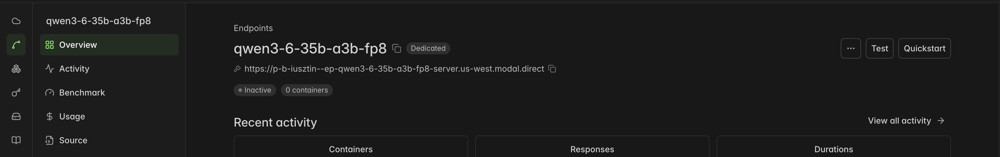
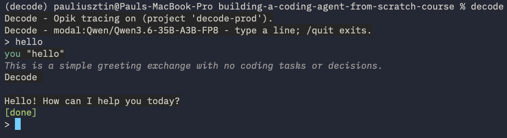

# 02. Serve your own model on Modal

Replace the rate-limited free key with an open-weights model you serve yourself. Every lesson is tested against the default below.

Modal provides $30 of free credits per month, ≈ 6–7 hours on 1×H200 ($4.54 per hour). [More on Modal's pricing](https://modal.com/pricing?source=decodingai&campaign=harnesseng)

## 1. Get a token from Modal

First, create a free account on [Modal](https://modal.com?source=decodingai&campaign=harnesseng).

Then go to Settings -> API tokens and create a token.

You will use it to authenticate the Modal CLI and do everything else from the terminal.

Set the token in your Modal CLI (the `modal` CLI is already installed in the uv virtual env):

```bash
uv run modal token set --token-id <your-token-id> --token-secret <your-token-secret>
```

## 2. Create the endpoint

Create a Modal endpoint that serves the `Qwen3.6-35B-A3B-FP8` LLM and automatically picks an NVIDIA H200 GPU (you have to wait ~5–10 minutes until the dedicated endpoint is deployed for the first time):

```bash
uv run modal endpoint create --model Qwen/Qwen3.6-35B-A3B-FP8 --env main
```

List endpoints:

```bash
uv run modal endpoint list --env main
```

## 3. Authenticate the endpoint

To authenticate the HTTP requests the agent loop makes to the endpoint, mint a proxy token pair:

```bash
uv run modal workspace proxy-tokens create
```

It outputs:

```text
Modal-Key: wk-...
Modal-Secret: ws-...
```

List proxy tokens:

```shell
uv run modal workspace proxy-tokens list
```

## 4. Point decode at the endpoint

In `.env`, set:

```bash
LLM_PROVIDER=modal
MODAL_ENDPOINT_URL=https://your-workspace--your-app.modal.run   # go to Modal's dashboard -> Endpoint -> Qwen Endpoint -> Copy endpoint URL (as in the image below)
MODAL_ENDPOINT_MODEL=Qwen/Qwen3.6-35B-A3B-FP8

MODAL_PROXY_TOKEN_ID=wk-...                                     # both, or neither (an --unauthenticated endpoint)
MODAL_PROXY_TOKEN_SECRET=ws-...
```

Get the Modal endpoint URL:


> [!NOTE]
> `MODAL_TOKEN_ID` and `MODAL_TOKEN_SECRET` authenticate the CLI, are set only via `modal token set ...`, and are **not** `.env` settings. `MODAL_PROXY_TOKEN_*` are what decode uses to call the model.

Then run `decode` as before to spin up an agent session.

## 5. Cold starts and cost

The endpoint scales to zero (Min 0), so the first turn of a session waits for a GPU. While iterating, open the endpoint in the dashboard, go to **AUTOSCALING → Edit → Override**, and set **Min 1**:


A warm container bills idle time. Switch it back to Min 0, or stop it, when done:

```bash
uv run modal endpoint list --env main
uv run modal endpoint stop <endpoint-id> --env main
```

## 6. Check that it works

Start a decode session and say hello. If you don't get a 4xx or 5xx error, you should be good to go.

Run in your terminal:

```shell
decode
```

Then say `hello`:



## 7. Other models

Run the same `uv run modal endpoint create --model <model> --env main` command with a different `--model`. Then re-point `MODAL_ENDPOINT_URL` / `MODAL_ENDPOINT_MODEL`.

| Pick               | Model ID                   | GPU    | Why                                                      |
| ------------------ | -------------------------- | ------ | -------------------------------------------------------- |
| **Course default** | `Qwen/Qwen3.6-35B-A3B-FP8` | 1×H100 | cheapest by far (MoE, ~3B active); reliable tool calling |
| Middle ground      | `openai/gpt-oss-120b`      | 1×B200 | native OpenAI tool-call format; ~2–3× faster per user    |
| Max capability     | `zai-org/GLM-5.2-FP8`      | 8×B200 | strongest agentic coding; ~8× the GPU cost               |

The full catalog and benchmarks are in the Modal dashboard; see the docs on [endpoints](https://modal.com/docs/guide/endpoints?source=decodingai&campaign=harnesseng).

## 8. Troubleshooting

| What you see                                                                  | What it means                                                                                         | Fix                                                                                                                                                                                                                                                                     |
| ----------------------------------------------------------------------------- | ----------------------------------------------------------------------------------------------------- | ----------------------------------------------------------------------------------------------------------------------------------------------------------------------------------------------------------------------------------------------------------------------- |
| `pydantic_ai.exceptions.ModelHTTPError: status_code: 503, model_name: Qwen/…` | Cold start: the endpoint scaled to zero (Min 0), and no container was ready to serve the request yet. | Wait a few minutes for the GPU container to boot, then resend the message. To avoid it, keep a container warm: open the endpoint in the dashboard, go to **AUTOSCALING → Edit → Override**, and set **Min 1** (see [5. Cold starts and cost](#5-cold-starts-and-cost)). |

Everything else: [00_troubleshooting.md](00_troubleshooting.md).

---

**Next:** [03_sandboxing.md](03_sandboxing.md) — move the agent's tools into an isolated Workspace, work on any repo, get a branch back.
