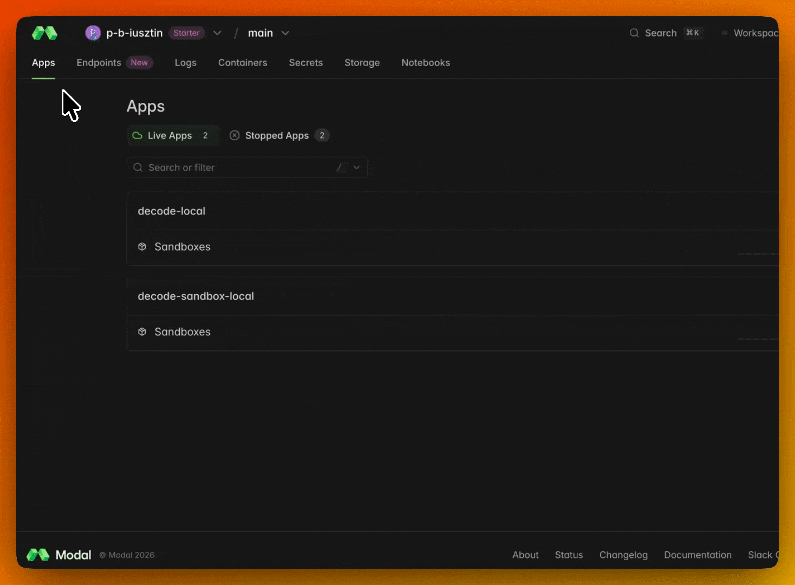

# Modal Model Catalog — Picking & Serving a Model for the `decode` Harness

> **Snapshot:** 2026-06-26, read from Modal's **Auto Endpoints** "Create Endpoint" flow. Benchmark
> figures are Modal's own **estimates** — treat them as relative, and validate with
> `modal endpoint benchmark`. Catalogs drift; re-check the dashboard before committing GPU budget.

> **Modal does more than serve models here.** It also hosts decode's headless harness
> (`decode-headless` — remote `decode run`s and N parallel attempts) and a Kitaru Worker
> (`decode-kitaru-worker` — replays off your laptop): [07_infra.md](07_infra.md).

## TL;DR

For a ReAct coding-agent harness (LLM ⇄ tools loop, OpenAI-compatible serving), working through this
course:

| Pick | Model ID | Agentic GPU | Why |
|---|---|---|---|
| **Best fit — course default** | `Qwen/Qwen3.6-35B-A3B-FP8` | **1×H100** | Cheapest serve by a wide margin (MoE, ~3B active); strong Qwen tool-calling through the `hermes`/`qwen` parser. You will re-run the loop hundreds of times while building — this is the one that lets you do that without rationing credits |
| **Middle ground** | `openai/gpt-oss-120b` | **1×B200** | Native OpenAI tool-call format → least harness friction; ~2–3× the interactivity. Step up here when slow turnaround starts costing you more than GPU time |
| **Max capability** | `zai-org/GLM-5.2-FP8` | **8×B200** | Flagship agentic-coding tuning — the ceiling of what the harness can do. 8× the GPU at the priciest tier; reserve for hard tasks (`zai-org/GLM-4.7` is the cheaper fallback) |

The three are a **cost/capability ladder, not a ranking** — every step of this course is built and
tested against the Qwen default. Reach up the ladder when a specific task actually demands it.

**The rest of the catalog** (23 models: 12 Qwen, 4 Gemma, GPT-OSS, Nemotron, 2 DeepSeek, 2 GLM,
Kimi) is browsable in the dashboard. Skip the small models (Qwen ≤9B, Gemma E2B/E4B — can't hold
tool discipline) and the frontier giants (`Qwen3.5-397B-A17B-FP8`, `DeepSeek-V4-Pro`,
`nvidia/Kimi-K2.6-NVFP4` — costly overkill for a teaching repo).

## Selection criteria for a coding-agent harness

Ranked by how much each matters to `decode`'s loop **while you are learning it**:

1. **Tool / function-calling reliability — #1.** A model that mis-formats tool calls makes the loop
   unteachable: you end up debugging the model instead of your harness. Native OpenAI format
   (GPT-OSS) is the smoothest, but Qwen's `hermes`/`qwen` parser clears this bar too — and clearing
   the bar is what counts here, not winning it.
2. **Cost per learning iteration.** Course-specific, and the reason the default is what it is: you
   will run the loop hundreds of times, most of them on turns you already understand. A model
   ~an order of magnitude cheaper to serve buys proportionally more attempts from a fixed credit
   budget. On a production harness this criterion would rank last; here it ranks second.
3. **Long context (≥128k)** — whole files, session replays, compaction; the agentic benchmark below
   uses a 61k-token input, mirroring accumulated tool results.
4. **Coding ability** — important, but a great coder that can't drive tools is useless here, and the
   hard part of this course is the harness, not the model's raw coding ceiling.
5. **Instruction following** — permission modes, agent definitions, structured outputs.
6. **Serveable footprint** — active params + quantization → GPU count → latency & cost; MoE models
   are the sweet spot, which is exactly why a 35B-A3B model serves on one H100.

**Hard disqualifier:** the model must serve through vLLM with a working **tool-call parser**
(OpenAI/harmony for GPT-OSS, hermes/qwen for Qwen). Confirm under *Advanced Configurations*.

## Benchmarked head-to-head (Modal's estimated preview)

Workload "Agentic multi-turn" — input 61,278 tokens, output 1,521 tokens:

| Model ID | GPU | Peak interactivity (tok/s/user) | Relative serve cost |
|---|---|---|---|
| `Qwen/Qwen3.6-35B-A3B-FP8` (course default) | **1×H100** | ~86 | **lowest** |
| `openai/gpt-oss-120b` | **1×B200** | ~234 → 90 | medium |
| `zai-org/GLM-5.2-FP8` | **8×B200** | ~112–168 | **highest** (~8× the GPU at the priciest tier) |

How to read this: Qwen is the slowest per user and the cheapest by a wide margin — for a loop you
are still building, waiting a few extra seconds per turn is the cheap resource and GPU-hours are the
scarce one. GPT-OSS buys ~2–3× the interactivity for a real per-hour step up; take it once you are
running the harness rather than writing it. GLM is the premium option — genuinely the most capable
of the three on hard agentic tasks, and priced accordingly.

Read the interactivity numbers as **relative**, not as a promise: they are Modal's own estimates,
and one B200 vs one H100 is a hardware difference as much as a model one.

## Setting up an endpoint via the Modal CLI (Auto Endpoints)

Docs: [endpoints guide](https://modal.com/docs/guide/endpoints?source=decodingai&campaign=harnesseng) ·
[metrics](https://modal.com/docs/guide/endpoint-metrics?source=decodingai&campaign=harnesseng) ·
[benchmarks](https://modal.com/docs/guide/endpoint-benchmarks?source=decodingai&campaign=harnesseng). If a flag has drifted, `modal
endpoint create --help` is the source of truth.

### Authenticate the CLI

```bash
modal token set --token-id <your-token-id> --token-secret <your-token-secret>
# or set MODAL_TOKEN_ID / MODAL_TOKEN_SECRET (see .env.example)
```

These **account** tokens authenticate the CLI *and* the Modal Sandbox (`SANDBOX_MODE=modal`) —
distinct from the **endpoint/proxy** tokens below, which are how `decode` *calls* your served model.

### Create the endpoint

```bash
modal endpoint create --model Qwen/Qwen3.6-35B-A3B-FP8 --env main    # best fit
modal endpoint create --model openai/gpt-oss-120b --env main         # middle ground
modal endpoint create --model zai-org/GLM-5.2-FP8 --env main         # max capability (8×B200)
```

Modal auto-selects a serving recipe + GPU config and prints the endpoint ID, URL, and dashboard link.

### Authentication — proxy tokens

Endpoints require auth by default. Create a token pair (and scope it to the env if RBAC is on):

```bash
modal workspace proxy-tokens create        # → Modal-Key: wk-... / Modal-Secret: ws-...
modal workspace proxy-tokens allow wk-... main
```

For local development only, skip auth at create time with `--unauthenticated`.

### Verify — the endpoint speaks OpenAI Chat Completions at `/v1`

```bash
curl "<your-endpoint-url>/v1/models" \
  -H "Modal-Key: $MODAL_PROXY_TOKEN_ID" \
  -H "Modal-Secret: $MODAL_PROXY_TOKEN_SECRET"
```

### Advanced config — CLI vs dashboard

| Knob | CLI at create | Dashboard after create |
|---|---|---|
| Routing region | `--routing-region` (us-west default, us-east, eu-west, ap-south) | Details → Routing Region |
| Compute placement | `--colocate-compute` (pin containers to the routing region) | Details → Compute Placement |
| Min / Max / Buffer containers | — (not supported) | AUTOSCALING → Edit → Override |

Autoscaling is **dashboard-only**: **Min ≥ 1** = keep-warm (no cold starts, you pay for idle GPU);
**Min 0** = scale-to-zero (first request after idle pays a cold start).

### Manage

```bash
modal endpoint list --env main
modal endpoint stop qwen3-6-35b-a3b-fp8 --env main
```

## Wiring an endpoint into `decode`

The endpoint is OpenAI-compatible, so it rides the same `OpenAIChatModel` path as OpenRouter
(ADR-0005): set the provider to `modal` and the Provider Seam (`agent/factory._build_model()`)
builds the model from settings:

```bash
LLM_PROVIDER=modal
MODAL_ENDPOINT_URL=https://...                    # used as base_url = {url}/v1
MODAL_ENDPOINT_MODEL=Qwen/Qwen3.6-35B-A3B-FP8     # served model id — course default
MODAL_PROXY_TOKEN_ID=wk-...                       # optional — omit if --unauthenticated
MODAL_PROXY_TOKEN_SECRET=ws-...
```

Auth nuance: Modal's proxy uses custom `Modal-Key` / `Modal-Secret` headers, not `Authorization:
Bearer`. Both proxy tokens set → sent as default headers; neither set → no headers and a placeholder
`api_key="EMPTY"`. The startup guard enforces both-or-neither, so a half-set pair is a friendly
config error, not a silent 401.

**Moving up the ladder costs two env vars.** Because every option here serves the same
OpenAI-compatible surface, going from the Qwen default to GPT-OSS or GLM-5.2 means pointing
`MODAL_ENDPOINT_URL` / `MODAL_ENDPOINT_MODEL` at the other endpoint — no harness change, no code
change. Build against the default, then re-point at a bigger model when you want to see how far the
same loop goes.

## Killing cold starts while you work

On the default autoscaling setting (**Min 0**) the endpoint scales to zero between sessions, so the
first request after an idle stretch waits for the GPU to wake. That is the right default for a
model you touch occasionally — and the wrong one while you are iterating on the harness, where it
shows up as a long pause on the first turn of every session.

The fix is one dashboard setting: **set the minimum number of containers to 1** so a container stays
warm and every turn answers immediately. Autoscaling is dashboard-only (not a `modal endpoint
create` flag) — open the endpoint, then **AUTOSCALING → Edit → Override**:



**A warm container bills for the idle time too.** That is the whole trade: you are paying GPU-hours
to not wait. Keep Min 1 for a working session, then put it back to 0 — or stop the endpoint
entirely (`uv run modal endpoint stop <endpoint-id> --env main`) — when you are done, so an
afternoon of not-coding doesn't quietly spend the $30.
