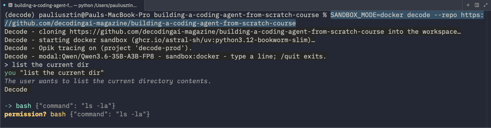
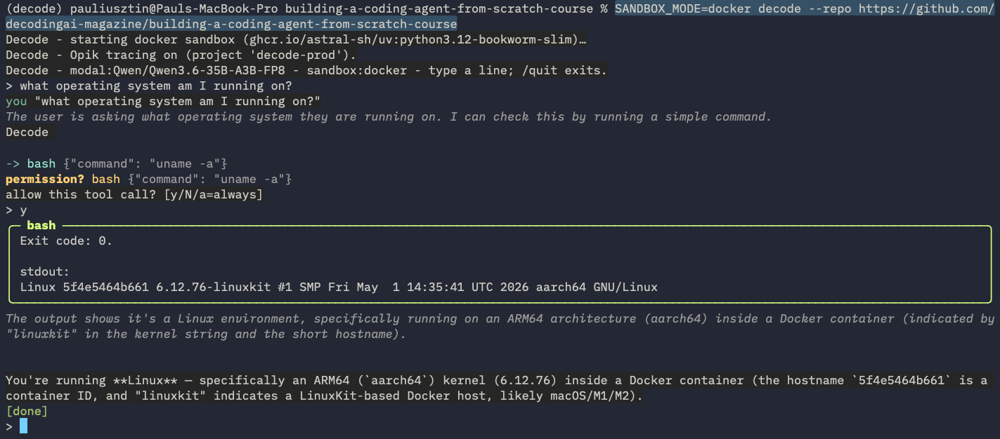
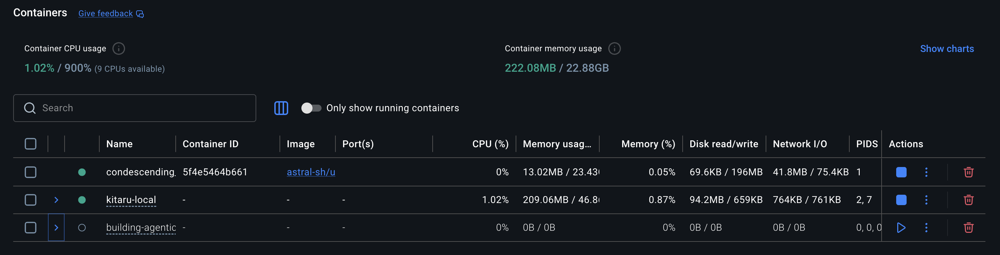
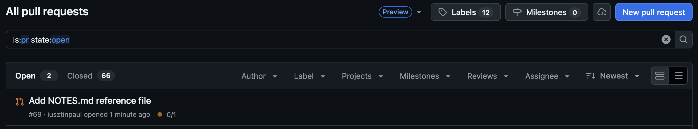
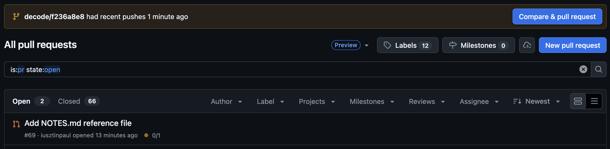
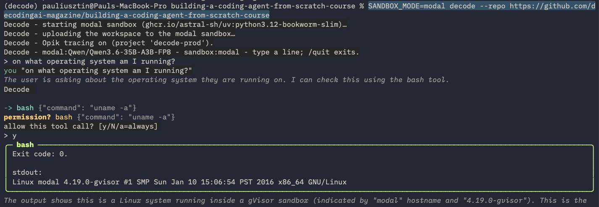
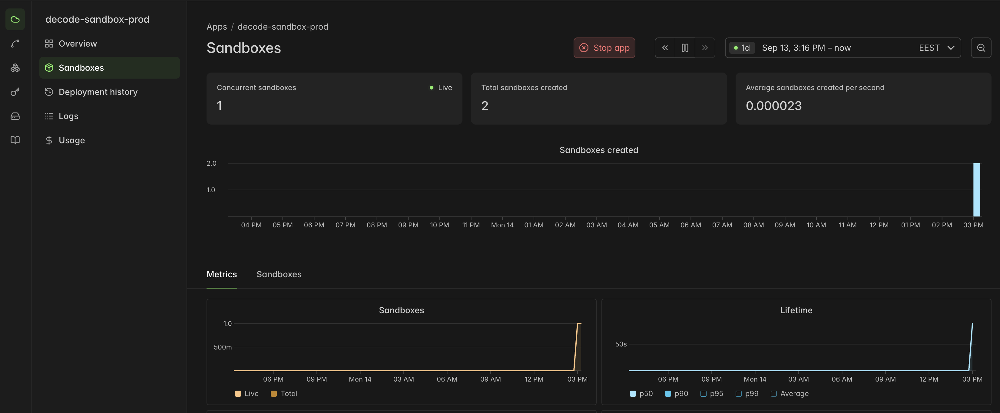

# 03. Sandboxing

By default, `bash` runs on your host and file tools edit your working directory. A **Sandbox Mode** moves the whole tool scope (file tools and `bash`) into an isolated `/workspace`. decode's own artifacts (sessions, memory, logs) stay in the launch directory ([ADR-0012](../docs/adr/0012-isolated-workspace.md)).

| `SANDBOX_MODE`   | Where tools run                                                                                                                                    | Prerequisite                                                                                                     |
| ---------------- | -------------------------------------------------------------------------------------------------------------------------------------------------- | ---------------------------------------------------------------------------------------------------------------- |
| `none` (default) | host                                                                                                                                               | —                                                                                                                |
| `docker`         | one local container per session; `/workspace` = bind mount of `.decode/sandbox/`; guards against accidents, not untrusted code                     | [Docker](https://www.docker.com) running                                                                         |
| `modal`          | one remote [Modal Sandbox](https://modal.com/docs/guide/sandboxes?source=decodingai&campaign=harnesseng) per session; nothing runs on your machine | `uv run modal token set …` ([More in the Modal endpoints setup](02_modal_endpoints.md#1-get-a-token-from-modal)) |

## 1. Work on any repo, get a branch back

You can kick off a decode session in an empty sandbox:

```bash
SANDBOX_MODE=docker decode
```

Or in a sandbox that pulls a public GitHub repository with your Python code and automatically prepares the virtual env for your agent to work in:

```bash
# --repo clones only into an EMPTY Workspace; a populated one is reused silently
rm -rf .decode/sandbox

SANDBOX_MODE=docker decode \
  --repo https://github.com/decodingai-magazine/building-a-coding-agent-from-scratch-course
```

Then ask it to list the current directory:


Or ask decode what operating system it is running on:


This is what it looks like in Docker Desktop:


It works similarly in headless mode:

```bash
SANDBOX_MODE=docker decode run \
  --repo https://github.com/decodingai-magazine/building-a-coding-agent-from-scratch-course \
  "list the current dir"
```

## 2. Optional: Push code to GitHub from the sandbox (`SANDBOX_GIT_TOKEN`)

To give the coding agent write access to your repository (to create branches, push commits, and open PRs) while it works inside the sandbox, you need to issue a Git token, such as a GitHub personal access token (PAT). [More here](https://docs.github.com/en/authentication/keeping-your-account-and-data-secure/managing-your-personal-access-tokens).

To plug it into decode, set the `SANDBOX_GIT_TOKEN` env var in your `.env`:

```.env
SANDBOX_GIT_TOKEN=...
```

Or inject it directly at runtime:

```bash
rm -rf .decode/sandbox

SANDBOX_GIT_TOKEN=<fine-grained-PAT> SANDBOX_MODE=docker \
  uv run decode run \
  --repo https://github.com/decodingai-magazine/building-a-coding-agent-from-scratch-course \
  "create NOTES.md with one line, commit it, push the branch, then open a PR against main"
```

Now your agent can create new branches, push code to them, and open PRs against main:



For context, `SANDBOX_GIT_TOKEN` is injected into the worker env as `GITHUB_TOKEN`, along with a Git credential helper ([ADR-0016 §2](../docs/adr/0016-drop-credential-proxy.md)).

> [!WARNING]
> **A sandboxed process can read `$GITHUB_TOKEN`.** A prompt-injected agent can `echo` it. Use a fine-grained, repo-scoped PAT and revoke it when done.

## 3. Creating pull requests (PRs)

A `--repo` run can leave two kinds of branches on GitHub, created by two different actors: the agent, from inside the sandbox, and decode's **Hand-back**, which ships the sandbox's work to GitHub at the end of the session so that nothing is lost. A prompt that asks for a PR (like the one above) gives you both, pointing at the same commit. In the screenshot below, PR #69 comes from the agent, while the "Compare & pull request" banner for `decode/f236a8e8` is only GitHub suggesting a PR for the Hand-back branch:



**Agent-named branch (e.g. `feat/notes-md`).** The agent creates it only when your prompt asks for it (or it decides to), using `git push` and `gh pr create` inside the sandbox. This requires `SANDBOX_GIT_TOKEN`, and it is the only path that opens a PR. Check what it opened:

```bash
gh pr list \
  --author @me \
  --limit 5
```

**Hand-back branch (`decode/<session-id>`, the first 8 characters of the session ID).** This is decode's safety net, so your work reaches GitHub even if the agent never pushes. When a `decode run` completes, you exit the REPL, or you type `/ship`, and the Workspace has changed since the cloned commit, decode commits any leftover changes, points the branch at the final `HEAD`, and pushes it from your host. It never opens a PR and never rewrites the agent's branches. You can list all Hand-back branches (newest first), open a PR from one, or delete one:

```bash
# List all Hand-back branches, newest first
git fetch origin --prune
git branch -r \
  --list 'origin/decode/*' \
  --sort=-committerdate

# Open a PR from a Hand-back branch
gh pr create \
  --head decode/<session-id> \
  --base main \
  --fill

# Delete a Hand-back branch
git push origin \
  --delete decode/<session-id>
```

## 4. Other sandbox settings

You can fine-tune the sandbox from your `.env`. All of these are optional:

| Env var                                            | Default                                         | Role                                                                                                                                                                                                   |
| -------------------------------------------------- | ----------------------------------------------- | ------------------------------------------------------------------------------------------------------------------------------------------------------------------------------------------------------ |
| `SANDBOX_REPO`                                     | empty                                           | The repo (URL or local path) cloned into the Workspace at launch. `--repo` overrides it. Empty means an empty Workspace.                                                                               |
| `SANDBOX_WORKSPACE_DIR`                            | `.decode/sandbox`                               | The host directory that **is** the Workspace (bind-mounted at `/workspace` in Docker). If you change it, delete that directory instead of `.decode/sandbox` in the commands on this page.              |
| `SANDBOX_IMAGE`                                    | `ghcr.io/astral-sh/uv:python3.12-bookworm-slim` | The container image the tools run in, for both `docker` and `modal`. It must include `bash`. git and `gh` are installed on top by each backend, so swap it for an image with your project's toolchain. |
| `SANDBOX_TIMEOUT_S`                                | `600`                                           | `modal` only: the maximum lifetime of the remote sandbox, in seconds, before Modal shuts it down. Docker containers have no lifetime cap.                                                              |
| `SANDBOX_GIT_USER_NAME` / `SANDBOX_GIT_USER_EMAIL` | `decode` / `decode@localhost`                   | The Git identity preconfigured inside the sandbox, so the agent's `git commit` succeeds. Set it to your own name and email to author the agent's commits as yourself.                                  |

## 5. Cleanup

1. Remove the sandbox artifacts: `rm -rf .decode/sandbox`.
2. Revoke the PAT.

## 6. Run remote sandboxes via Modal

First, follow the Modal setup steps in [02_modal_endpoints.md](./02_modal_endpoints.md) (this takes ~5–10 minutes).

Then you can kick off a session in a remote Modal sandbox by switching `SANDBOX_MODE` to `modal`:

```shell
SANDBOX_MODE=modal decode
```

Or operate within a GitHub repository:

```shell
SANDBOX_MODE=modal decode \
  --repo https://github.com/decodingai-magazine/building-a-coding-agent-from-scratch-course
```

For write commands, make sure that `SANDBOX_GIT_TOKEN` is set in your `.env`.

Test it by asking decode what operating system it is running on:



To see your running sandboxes, go to Modal -> Apps -> `decode-sandbox-local` or `decode-sandbox-prod` (depending on the value of the `DECODE_ENV` env var):



## 7. Troubleshooting

| What you see                                                                      | Fix                                                                                         |
| --------------------------------------------------------------------------------- | ------------------------------------------------------------------------------------------- |
| `Decode: SANDBOX_MODE=docker but the Docker daemon is not reachable`              | Start Docker Desktop, or set `SANDBOX_MODE=none`.                                           |
| `Decode: SANDBOX_MODE=modal but Modal credentials are missing`                    | Run `uv run modal token set …`.                                                             |
| `Decode: --repo/SANDBOX_REPO clones a repo into the isolated sandbox Workspace …` | `--repo` needs `docker` or `modal`.                                                         |
| `'origin' does not appear to be a git repository` on push                         | The Workspace was already populated, so `--repo` was ignored. Run `rm -rf .decode/sandbox`. |

Everything else: [00_troubleshooting.md](00_troubleshooting.md).

---

**Next:** [04_deploy.md](04_deploy.md) — run the same headless `decode run` on Modal, from the CLI, a webhook, or a cron.
