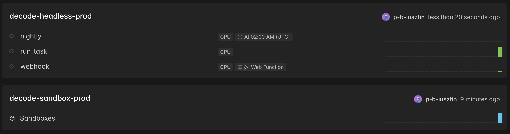
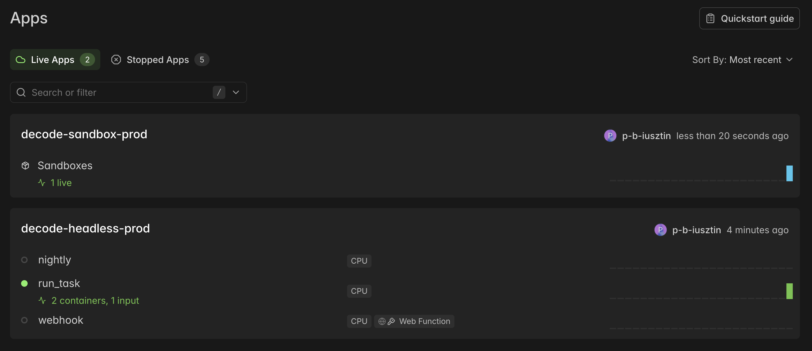
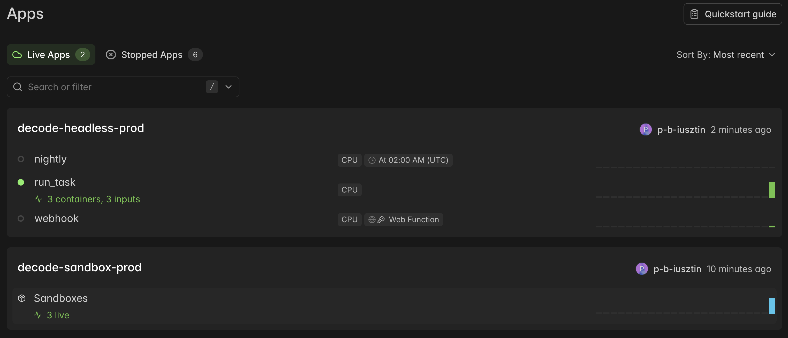
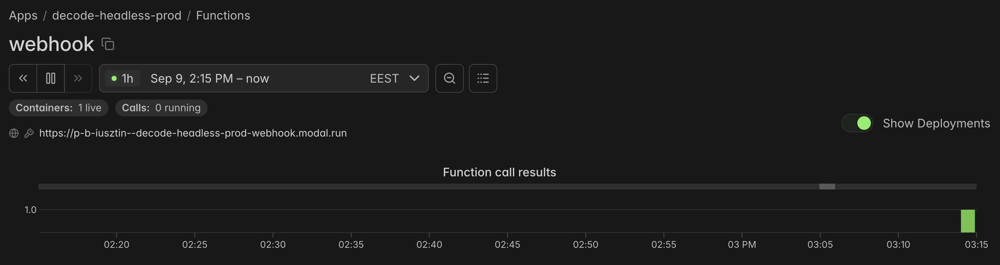
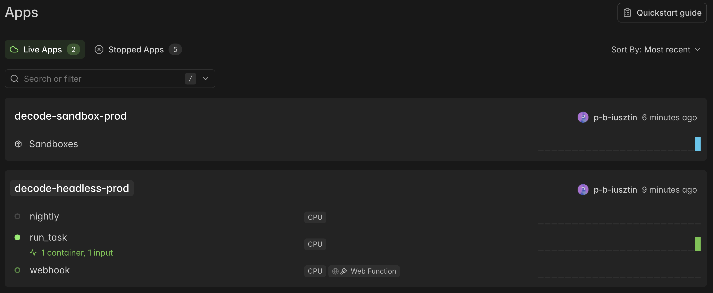

# 04 — Deploy the headless harness on Modal

Run `decode run` in a [Modal](https://modal.com?source=decodingai&campaign=harnesseng) container instead of your laptop, triggered from the CLI, a webhook, or a cron ([ADR-0020](../docs/adr/0020-remote-headless-on-modal.md)). No server: a deployed app with nothing running costs nothing.

```bash
uv run decode run        "list the python files under src and summarize the cli module"   # laptop
uv run decode remote run "list the python files under src and summarize the cli module"   # Modal
```

Needs: [01](01_install_and_usage.md) done, plus Modal tokens and the proxy token pair from [02 §1](02_modal_endpoints.md#1-create-the-endpoint).

## 1. Name the environment

One environment = one deployment = one Secret, all named by `DECODE_ENV` ([ADR-0021](../docs/adr/0021-decode-env-is-a-naming-suffix.md)). Set it once so every command on this page hits the same deployment:

```bash
echo 'DECODE_ENV=prod' >> .env      # or, this shell only:  export DECODE_ENV=prod
```

## 2. Create the `decode-headless-<env>` Secret

The container has no `.env`: **its Secret is its whole config**. Pass every key on every create (a Secret is replaced, never patched), and never put `DECODE_ENV` in it (baked in at deploy; a Secret that disagrees is refused at startup). Pick your provider's block; it loads `.env` into the shell and copies the keys. Optional lines, empty reads as unset: `OPIK_API_KEY` (+ `OPIK_WORKSPACE`) traces every remote run under `decode-<env>`; `SANDBOX_GIT_TOKEN` (§4 table).

**Modal model** (`LLM_PROVIDER=modal`, [02](02_modal_endpoints.md); drop the two `MODAL_PROXY_TOKEN_*` lines if served `--unauthenticated`):

```bash
set -a && . ./.env && set +a

uv run modal secret create "decode-headless-${DECODE_ENV:?set it in .env or export it first}" \
  LLM_PROVIDER=modal \
  MODAL_ENDPOINT_URL="$MODAL_ENDPOINT_URL" \
  MODAL_ENDPOINT_MODEL="${MODAL_ENDPOINT_MODEL:-Qwen/Qwen3.6-35B-A3B-FP8}" \
  MODAL_PROXY_TOKEN_ID="$MODAL_PROXY_TOKEN_ID" \
  MODAL_PROXY_TOKEN_SECRET="$MODAL_PROXY_TOKEN_SECRET" \
  OPIK_API_KEY="$OPIK_API_KEY" \
  OPIK_WORKSPACE="${OPIK_WORKSPACE:-default}" \
  SANDBOX_GIT_TOKEN="$SANDBOX_GIT_TOKEN" --force
```

**Gemini** (`LLM_PROVIDER=gemini`):

```bash
set -a && . ./.env && set +a

uv run modal secret create "decode-headless-${DECODE_ENV:?set it in .env or export it first}" \
  LLM_PROVIDER=gemini \
  GEMINI_API_KEY="$GEMINI_API_KEY" \
  GEMINI_MODEL="${GEMINI_MODEL:-gemini-3.5-flash}" \
  OPIK_API_KEY="$OPIK_API_KEY" \
  OPIK_WORKSPACE="${OPIK_WORKSPACE:-default}" \
  SANDBOX_GIT_TOKEN="$SANDBOX_GIT_TOKEN" --force
```

**OpenRouter** (`LLM_PROVIDER=openrouter`):

```bash
set -a && . ./.env && set +a

uv run modal secret create "decode-headless-${DECODE_ENV:?set it in .env or export it first}" \
  LLM_PROVIDER=openrouter \
  OPENROUTER_API_KEY="$OPENROUTER_API_KEY" \
  OPENROUTER_MODEL="${OPENROUTER_MODEL:-openrouter/free}" \
  OPIK_API_KEY="$OPIK_API_KEY" \
  OPIK_WORKSPACE="${OPIK_WORKSPACE:-default}" \
  SANDBOX_GIT_TOKEN="$SANDBOX_GIT_TOKEN" --force
```

> ✅ `uv run modal secret list` shows `decode-headless-<env>`.

## 3. Deploy

Builds the image with this repo's source baked in. Re-run after any code change, and after re-creating the Secret (a `--force` create writes a new Secret object; the running deployment keeps the old one):

```bash
uv run decode remote deploy       # → decode-headless-$DECODE_ENV
```

> ✅ Ends with:
>
> ```
> Decode: deploying decode-headless-prod (DECODE_ENV=prod).
> ├── 🔨 Created function run_task.
> ├── 🔨 Created function nightly.
> └── 🔨 Created web function webhook => https://<workspace>--decode-headless-prod-webhook.modal.run 🔑
> ✓ App deployed in 46.102s! 🎉
> ```

`run_task` = the run, `nightly` = the cron (§6), `webhook` = the POST endpoint (§5). All three take the same knobs: `task`, `repo`, `sandbox-mode` (`none` | `modal`), `model`, `max-requests`, `timeout-seconds`.

The same three in the dashboard, under **Apps → `decode-headless-<env>`** — idle, costing nothing. `nightly` carries its schedule badge only once §6 has set a cron:



## 4. Run from the CLI

```bash
uv run decode remote run "run bash to print uname -a and pwd and report both" --sandbox-mode none
```

> ✅ A gVisor kernel and an in-container path:
>
> ```
> - **`uname -a`**: `Linux modal 4.19.0-gvisor #1 SMP … x86_64 GNU/Linux`
> - **`pwd`**: `/harness`
> Decode: run finished — exit=0 sandbox=none session=346fbde2-… branch=None
> ```

A change to a real repo, shipped back as a branch (use a repo of yours, or a fork of ours):

```bash
uv run decode remote run "add a hello line to README and commit" \
  --repo https://github.com/<you>/<repo> --sandbox-mode modal --max-requests 60

git ls-remote https://github.com/<you>/<repo> 'refs/heads/decode/*'
```

A `--sandbox-mode modal` run is two live apps: `run_task` busy on `decode-headless-<env>`, and the nested Sandbox it opened under `decode-sandbox-<env>`:



| `--sandbox-mode` | Where `bash` runs                                                            | Hand-back                                                              |
| ---------------- | ---------------------------------------------------------------------------- | ---------------------------------------------------------------------- |
| `none` (default) | the container itself; `--repo` is cloned to `/scratch/repo` and dies with it | none                                                                   |
| `modal`          | a nested Modal Sandbox, `/workspace`                                         | pushes `decode/<session-id>` when `SANDBOX_GIT_TOKEN` is in the Secret |
| `docker`         | rejected client-side, no container                                           | —                                                                      |

`--max-requests N` stops the run after N model requests (exit 1, hand-back still runs). `--timeout-seconds` bounds the clock (default 1800).

**N attempts in parallel**, each on its own branch, for comparison:

```bash
uv run decode remote attempts "add a hello line to README and commit" \
  --repo https://github.com/<you>/<repo> --attempts 3 --sandbox-mode modal
```

> ✅ A table, one row per attempt, `shipped` = branch reached origin, then two `git` lines to compare them. Three attempts take about as long as one. `--detach` returns the call ids at once; read them later with `uv run decode remote logs`.

The fan-out is visible as one Function with three of everything — `run_task` at 3 containers / 3 inputs, and three live Sandboxes:



## 5. Run from a webhook

The deploy prints the URL once (§3). To read it again later, open **Apps → `decode-headless-<env>` → Functions → `webhook`** in the Modal dashboard: it sits under the function name, beside a globe and a key icon. The key is the point — it means proxy auth is enforced, so the bare URL is not a public "spend my tokens" button. The icon next to the `webhook` title copies it.



The shape is deterministic, so you can also just write it out:

```
https://<workspace>--decode-headless-<env>-webhook.modal.run
```

`<workspace>` is your Modal workspace slug (`p-b-iusztin` above), and the rest is the app name plus the function name. That same page is where you watch it: **Containers** / **Calls** at the top, and the call-results strip below.

First export your webhook url:

```bash
export WEBHOOK_URL=<your_webhook_url>
```

Then:

```bash
set -a && . ./.env && set +a

curl -s -X POST "$WEBHOOK_URL" \
  -H "Modal-Key: $MODAL_PROXY_TOKEN_ID" -H "Modal-Secret: $MODAL_PROXY_TOKEN_SECRET" \
  -H 'content-type: application/json' \
  -d '{"task": "add a hello line to README and commit", "repo": "https://github.com/<you>/<repo>",
       "sandbox_mode": "modal", "max_requests": 60}'
```

> ✅ `{"call_id": "fc-…", "status": "spawned", "watch": [...]}`. A bad body (`sandbox_mode: "docker"`, empty `task`) is a `400`, nothing spawned. Answer: `uv run decode remote logs`; branch: `git ls-remote`.

The POST returns in milliseconds; the work shows up on `run_task`, not on `webhook` — the endpoint spawns and is done:



Callers: a GitHub Actions step, a ticket bot, a Slack slash command.

## 6. Run on a schedule

Schedule and job are read at deploy and ship with the deployment:

```bash
DECODE_NIGHTLY_CRON="0 2 * * *" \
DECODE_NIGHTLY_TASK="Find every TODO comment, fix the ones under 20 lines, commit each fix separately." \
DECODE_NIGHTLY_REPO=https://github.com/<you>/<repo> \
DECODE_NIGHTLY_SANDBOX_MODE=modal \
DECODE_NIGHTLY_MAX_REQUESTS=120 \
uv run decode remote deploy
```

> ✅ `Decode: nightly job registered — cron='0 2 * * *' (UTC) task='Find every TODO comment, …'`

`DECODE_NIGHTLY_CRON` (UTC) turns it on; `_TASK` is then required; `_REPO` / `_SANDBOX_MODE` / `_MODEL` / `_MAX_REQUESTS` / `_TIMEOUT_SECONDS` mirror the `run` flags. Stop: redeploy without `DECODE_NIGHTLY_CRON`. Modal's dashboard has a _run now_ button on the Function.

## 7. Watch, stop, cost

```bash
uv run decode remote logs           # = modal app logs decode-headless-<env>
uv run modal app list
uv run modal app stop "decode-headless-${DECODE_ENV:?}"
```

Containers and nested sandboxes bill per run-second, nothing idle.

## 8. Troubleshooting

| Symptom                                                            | Fix                                                                                           |
| ------------------------------------------------------------------ | --------------------------------------------------------------------------------------------- |
| `Decode: the decode-headless-<env> app is not deployed …`          | `uv run decode remote deploy` at that `DECODE_ENV` (also after `modal app stop`).             |
| `Decode: Modal credentials are missing or rejected …`              | `uv run modal token set …`.                                                                   |
| `Decode: set GEMINI_API_KEY in your environment` in the run's log  | the Secret lacks the provider key: re-create it (§2), then redeploy.                          |
| `Decode: this deployment is DECODE_ENV=… but its Secret carries …` | remove `DECODE_ENV` from the Secret, or redeploy at the env the Secret names.                 |
| Runs land in the wrong Opik project / sandbox app                  | `DECODE_ENV` at deploy names both; redeploy with the one you meant.                           |
| A remote run behaves like last week's code                         | `uv run decode remote deploy`.                                                                |
| Attempts read `NOT SHIPPED`                                        | `none` mode discards its clone; `modal` mode needs a `SANDBOX_GIT_TOKEN` that can push there. |
| Webhook `401` / `403`                                              | wrong or missing `Modal-Key` / `Modal-Secret`.                                                |
| Nightly deploy dies on the laptop                                  | `DECODE_NIGHTLY_CRON` set without `DECODE_NIGHTLY_TASK`.                                      |

---

**Next:** [05_evals.md](05_evals.md) — measure whether a change made the agent better or worse, with Opik.
