# 06. Record and replay your evals with Kitaru

Record decode runs as [Kitaru](https://www.zenml.io/product/kitaru?utm_source=decodingai&utm_medium=referral&utm_campaign=coding-agent-course&utm_content=brand) Sessions, judge them, and replay them with one change, all from your laptop. This page contains only the commands; the concepts are in the [Kitaru docs](https://docs.zenml.io/kitaru/core-concepts/concepts?utm_source=decodingai&utm_medium=referral&utm_campaign=coding-agent-course&utm_content=docs).

## 1. Set up

Prerequisites:

- Running `make install` already installs the `kitaru` CLI in the `uv` virtual environment.
- **Docker** — runs the local server and the Worker.
- **Node.js** — for `npx skills add`.
- **`jq`** (`brew install jq`) — the commands below capture every id into a shell variable, so run each section in one terminal.
- **One provider** in `.env`: a key (e.g. `GEMINI_API_KEY`, more in [01_install_and_usage](01_install_and_usage.md)) or your Modal endpoint (`LLM_PROVIDER=modal` + `MODAL_ENDPOINT_URL`, more in [02_modal_endpoints](02_modal_endpoints.md)).
- **`OPIK_API_KEY`** — optional, for importing traces from Opik. Full setup in [05_evals](05_evals.md).

See [01_install_and_usage](01_install_and_usage.md) and [02_modal_endpoints](02_modal_endpoints.md) for the full setup of the coding agent; here we focus only on the setup of the Kitaru eval harness.

Full install reference: [Kitaru installation guide](https://docs.zenml.io/kitaru/getting-started/installation?utm_source=decodingai&utm_medium=referral&utm_campaign=coding-agent-course&utm_content=docs).

### Install the Skills

Not shipped in this repo; install the latest:

```bash
npx skills add zenml-io/kitaru-skills
```

Or as a Claude Code plugin (`/plugin marketplace update kitaru` refreshes an old install):

```bash
/plugin marketplace add zenml-io/kitaru-skills
/plugin install kitaru@kitaru
```

The 3 skills we use:

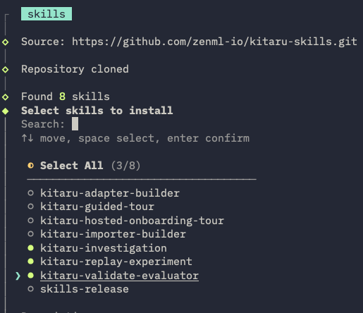

### Pick a server

Pick one. For the course, the local server is enough.

|                                | Local OSS server                               | Managed workspace                                                                                                                                               |
| ------------------------------ | ---------------------------------------------- | --------------------------------------------------------------------------------------------------------------------------------------------------------------- |
| Account                        | none                                           | [free trial](https://cloud.zenml.io/signup?product=kitaru&utm_source=decodingai&utm_medium=referral&utm_campaign=coding-agent-course&utm_content=docs), 14 days |
| `KITARU_API_URL` (from `.env`) | `http://localhost:8000`                        | `<managed_workspace_url>`, copied from the workspace                                                                                                            |
| Dashboard                      | `http://localhost:8000`                        | [Kitaru dashboard](https://www.zenml.io/product/kitaru?utm_source=decodingai&utm_medium=referral&utm_campaign=coding-agent-course&utm_content=brand)            |
| Connect                        | run `make kitaru-local` (using docker compose) | run `uv run kitaru login <url>`, then `make kitaru-bootstrap KITARU_API_URL=<url>`                                                                              |
| Stop                           | run `uv run kitaru logout`                     | —                                                                                                                                                               |
| Workers                        | your laptop                                    | your laptop; the workspace only stores results                                                                                                                  |

Both commands from `Connect` register the `decode` agent, the `opik` importer and `evaluators/*.py` on that Kitaru server.

After running `make kitaru-local` or `make kitaru-bootstrap KITARU_API_URL=<url>`, at the bottom you will see the value of the `KITARU_API_URL` and `KITARU_AGENT_ID` env vars.

Take them and add them to your `.env` file:

```text
KITARU_API_URL=http://localhost:8000
KITARU_AGENT_ID=<uuid from the output>
```

`KITARU_AGENT_ID` is per server. Re-run `make kitaru-bootstrap` when you switch servers, after `make install`, after editing `evaluators/`, or after any other change to your code.

> [!NOTE]
> As Kitaru is also [open-source](https://github.com/zenml-io/kitaru), there is also a third option: hosting the server yourself.

### MCP server

The repo root already has a `.mcp.json` file that points at the local Kitaru MCP server at `http://localhost:8000`.

- Claude Code picks it up automatically (approve it once).
- Managed workspace: change the `--server` value from `.mcp.json`.
- Other coding agents: copy the entry into their MCP config ([see full Kitaru setup](https://docs.zenml.io/kitaru/getting-started/setup?utm_source=decodingai&utm_medium=referral&utm_campaign=coding-agent-course&utm_content=docs)).

### Check

Show details about the Kitaru setup:

```bash
uv run kitaru status
```

Detailed doctor output:

```
uv run kitaru doctor
```

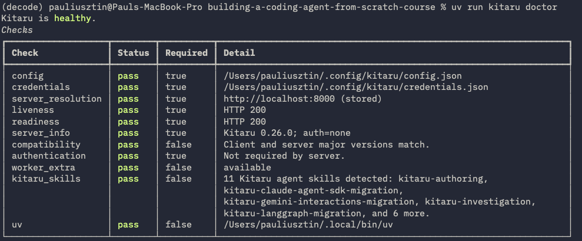

## 2. Record a session

With both `.env` lines from §1 set, every REPL turn and every `decode run` is recorded:

```bash
uv run decode run "say hi in exactly three words"
```

The run is now a Session:

```bash
uv run kitaru session list --agent decode --origin recorded --size 3
```

Keep the newest id and open it node by node:

```bash
export SESSION_ID=$(uv run kitaru session list --agent decode --origin recorded --size 1 -o json | jq -r '.items[0].id')
uv run kitaru session get "$SESSION_ID"
```

If the list is empty, one of the two `.env` lines from §1 is missing.

You can also visualize the sessions in the Kitaru dashboard, locally at [http://localhost:8000](http://localhost:8000) or in the managed version at [https://www.zenml.io/product/kitaru](https://www.zenml.io/product/kitaru?utm_source=decodingai&utm_medium=referral&utm_campaign=coding-agent-course&utm_content=brand).

## 3. Seed multiple sessions

> [!NOTE]
> A session is equal to an Opik thread.

To illustrate a real example we need a mix of 15-30 sessions. You can either run `decode run "<goal>"` yourself on ~20-30 examples or use `make kitaru-seed` to generate 30 examples (takes ~10 minutes):

```bash
make kitaru-seed
```

It generates 30 runs: 14 good, 8 cut off (--max-requests 1), 8 crashed (bogus model / broken provider).

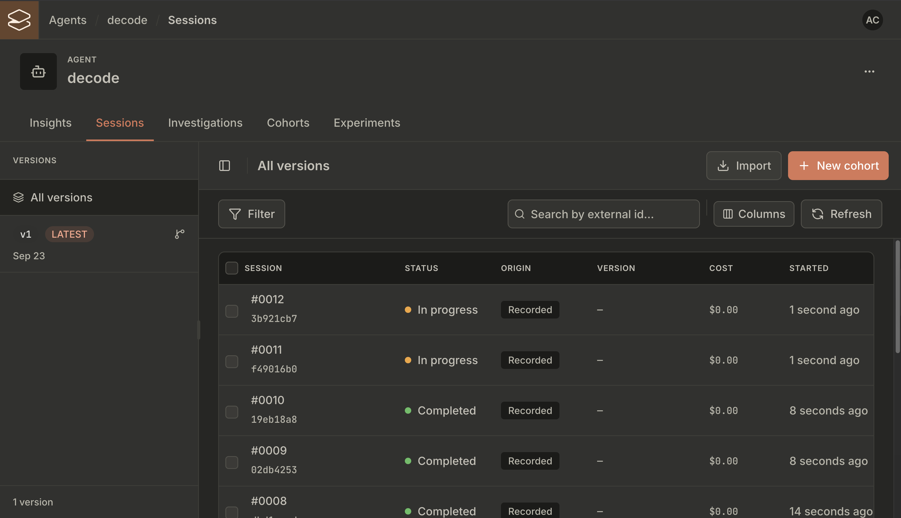

Or see what it would run first:

```bash
make kitaru-seed ARGS=--dry-run
```

## 4. Start a Worker

Imports, replays and evaluator runs are jobs that wait for a Worker to execute them. The Kitaru server executes nothing. Start one in your own terminal and leave it running.

> [!NOTE]
> When deploying Kitaru, you need to deploy the Worker separately on your infrastructure, such as Modal.

The Worker spawns `decode run` under `SANDBOX_MODE=docker` over a fresh clone of this repo, from `~/.decode-kitaru-worker`, where there is no `.env`. So its shell must carry your provider keys.

First move to the repo root (the building-a-coding-agent-from-scratch-course root directory):

```bash
cd <repo root>          # the building-a-coding-agent-from-scratch-course root directory
```

Then load the `.env` variables and unset `KITARU_AGENT_ID` (it's only needed for the Kitaru server):

```bash
set -a && . ./.env && set +a
unset KITARU_AGENT_ID
```

Start it and leave this terminal running:

```bash
uv run kitaru worker start --concurrency 1 --timeout 28800
```

`--timeout` (8 h here) is the Worker's lifetime, and its token lives that long plus 5 minutes. Without it the token dies after 1 hour and the Worker stops claiming work (see [Troubleshooting](#troubleshooting)).

`--concurrency 1` runs one replay at a time. Every replay of the `decode` Agent Version shares ONE Workspace (`~/.decode-kitaru-worker/.decode/sandbox`), so parallel replays race on its `git clone` and fail before the agent starts. It also means a replay reuses the Workspace the previous one left behind, which is harmless for read-only tasks.

Check from another terminal: `uv run kitaru worker list` shows it with `Status: live`. Watch a job: `docker ps`, `tail -f ~/.decode-kitaru-worker/.decode/logs/decode.log`.

## 5. Import traces from Opik

Optional step to backfill Sessions from decode runs you already traced in Opik. Needs `OPIK_API_KEY` in `.env` and the Worker from §4.

As you already seeded your Kitaru instance with decode runs in §3, you can skip this step, but importing more traces from Opik would add more variety to your dataset.

Pull the newest threads (one thread = one decode session = one Kitaru Session) from the Opik project `decode-<DECODE_ENV>` (e.g. `decode-local`):

```bash
uv run python -m evals kitaru import --limit 20
```

Or every thread in the project:

```bash
uv run python -m evals kitaru import
```

Prints `thread → session id`. Already-imported threads are skipped, so re-running is cheap. `--project <NAME>` reads another project; `--no-wait` files the jobs and returns.

## 6. Harvest failures into a regression suite

Now that we have our sessions prepared (via seed, Opik or both), we can sample them into an investigation, give each a verdict, freeze the `problematic` ones into a cohort, and create an evaluator per error type. Reference: [regression suite](https://docs.zenml.io/kitaru/guides/regression-suite?utm_source=decodingai&utm_medium=referral&utm_campaign=coding-agent-course&utm_content=docs).

Sample 20 of the newest 30 sessions, replays left out:

```bash
SESSION_IDS=($(uv run kitaru session list --agent decode --size 60 -o json \
  | jq -r '[.items[] | select(.origin != "replay")][:30][].id' | sort -R | head -20))
```

Number of sessions:

```bash
echo "${#SESSION_IDS[@]}"
```

Every session needs its own question, so build the flags:

```bash
ARGS=(); for id in "${SESSION_IDS[@]}"; do
  ARGS+=(--session "$id" --session-question "$id:observation=What do you notice? Did it match what should have happened?")
done
```

Create the investigation and keep its id:

```bash
INVESTIGATION=$(uv run kitaru investigation create my-discovery-1 --agent decode "${ARGS[@]}" -o json)
export INVESTIGATION_ID=$(jq -r '.item.id' <<<"$INVESTIGATION")
```

Judge each session `acceptable` / `problematic` / `uncertain` in the review UI. Run the command below to print the link to the investigation review UI. Open it, go over the sessions, and give each one a label and an optional critique. Then return to the terminal and continue this tutorial.

```bash
jq -r '.links.review' <<<"$INVESTIGATION"
```

This is what the investigation review UI looks like:

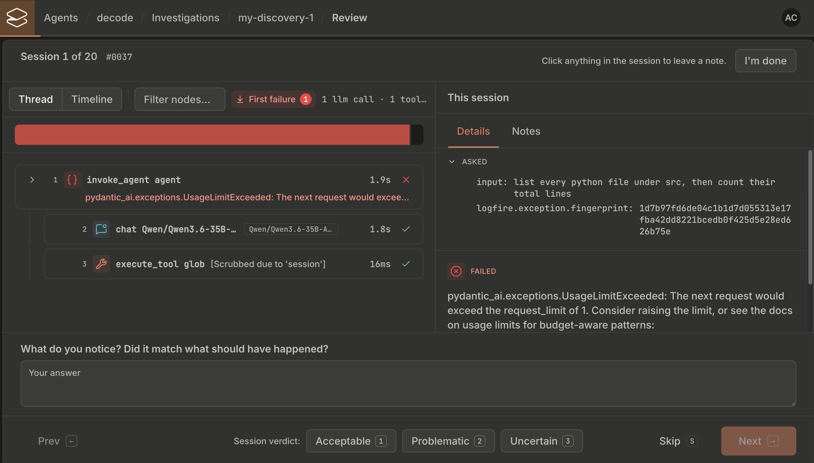

After finishing the review in the UI, list the verdict of each session in the investigation:

```bash
uv run kitaru investigation session list "$INVESTIGATION_ID" --size 100 -o json | jq -r '.items[] | "\(.session_id)  \(.verdict)"'
```

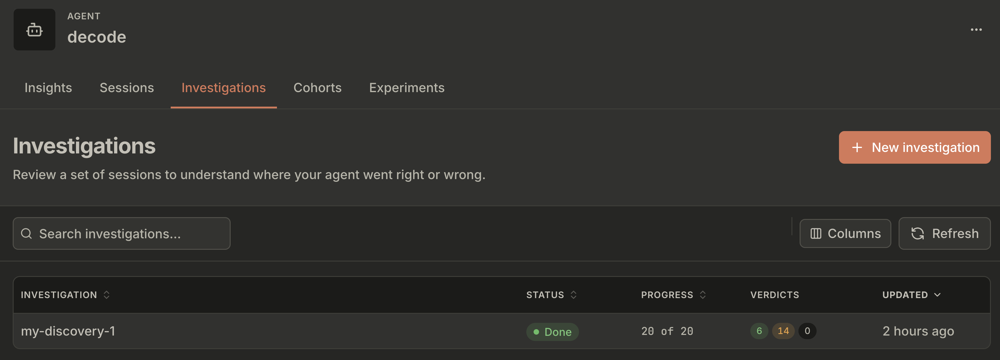

The UI also gives you a prompt to copy, like this:

```text
Investigation complete: my-discovery-1. 20 of 20 sessions reviewed, agent: decode.
Reviewed 23 September 2026.

Verdicts: 6 acceptable, 14 problematic, 0 uncertain.

Choose what to do next:
1. Build a cohort from a behavior found in these reviewed sessions.
2. Investigate the 14 problematic sessions in more detail.
```

Paste it into a coding agent opened in this project. The agent needs the Kitaru skills, which explain in detail how to operate Kitaru, and the Kitaru MCP server, which lets it talk to the Kitaru platform. I used Opus 5.5 for my tests.

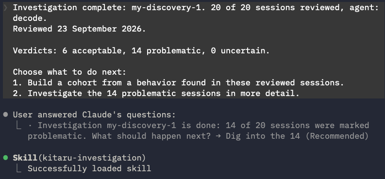

If you used our seed, it will find two cohort candidates by clustering the sessions by error type.

1. **Candidate 1:** a run that hits the request limit gives the user nothing. A decode run stopped by the request limit ends with a raw `UsageLimitExceeded`, no output, and no partial answer or explanation.
2. **Candidate 2:** connection error (I suggest rejecting it as agent behavior).

Next, pass the following prompt to create a cohort for each candidate. The cohorts help us understand the behavior in more depth and create an evaluator that can detect similar issues in the future:

```text
Create a cohort for each candidate!
```

This creates two cohorts in Kitaru, one for each candidate:

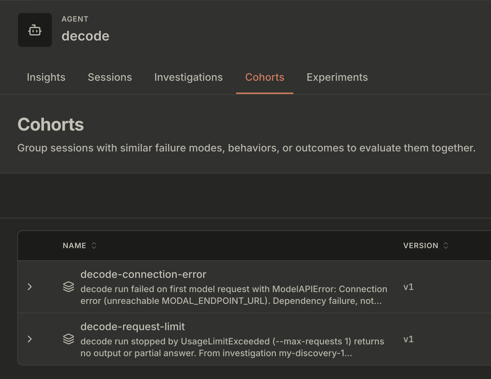

> [!WARNING]
> These are the results based on the synthetic seed. Traces imported from Opik or from other tests might change the results.

Now, we need to either apply an existing evaluator or create a new one per cohort. As we already have the evaluators for these two, we prompt:

```text
Now, apply the two existing evaluators, one per cohort:
  - cohort decode-connection-error -> evaluator: decode_connection_error.py
  - cohort decode-request-limit -> evaluator: decode_request_limit.py
```

If you had a cohort with a new failure class, you would need to create a new evaluator, which is easy since you have all the logs and errors within the cohort.

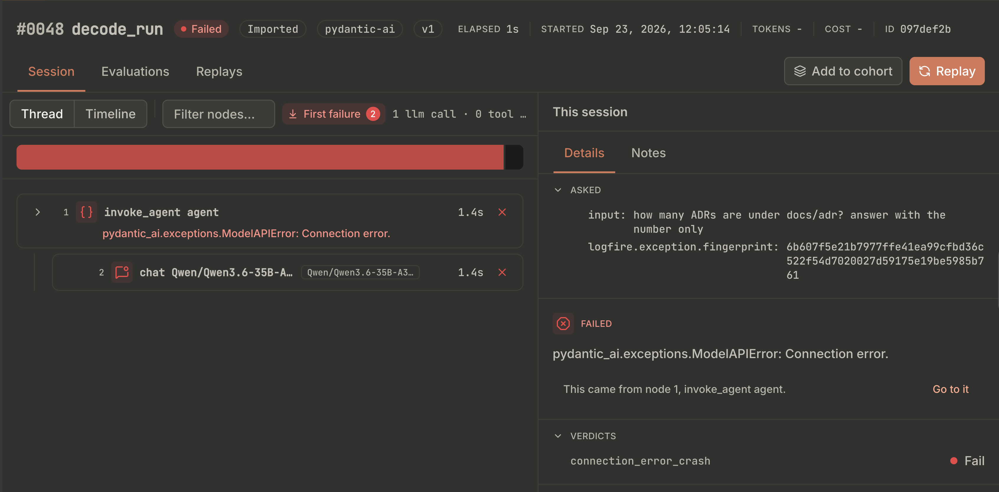

After you run the prompt above, the evaluator runs on each session in the cohort, and the results are displayed as follows:

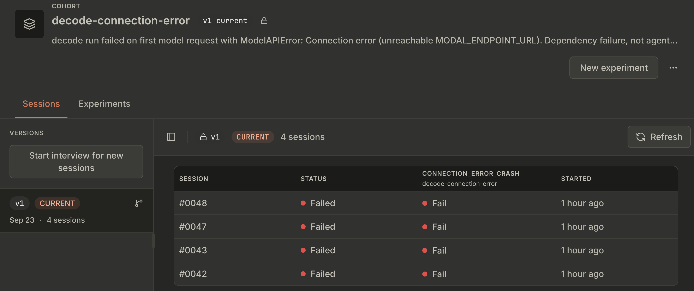

It's normal for all of them to fail, because each session still contains the error that caused the failure.

What we have to do now is fix the code that caused the failure and re-run the cohort as an experiment. Let's assume that we fixed our connection error. As it was artificially injected, we know that rerunning will work, but in a real-world scenario you would need to fix the code first. So we prompt the agent within the same session:

```text
For cohort `decode-connection-error` we fixed the connection error. Start an experiment based on the sessions from the cohort, rerun the evaluator and see if the failure class has been resolved.
```

Behind the scenes, Kitaru will take all the sessions from the cohort and use its replay feature to rerun each session with decode on the Worker we started in §4. It runs an isolated instance of decode for each session, starting from the session's original prompt. The experiment's tool policy (§7) decides whether each tool call returns its recorded result or runs again for real inside the Worker's docker Workspace. These baselines crashed before their first tool call, so there is nothing recorded to return: the agent sets the policy to run the tools for real, with `web_fetch` blocked.

Here are the experiments attached to the `decode-connection-error` cohort:

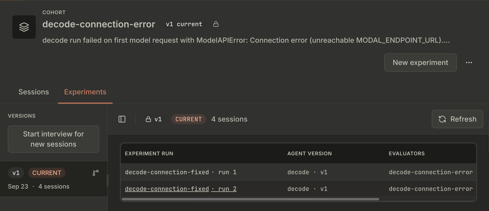

And within the second run of the experiment, after fixing the error, we can see that the failure class has been resolved on all the sessions:

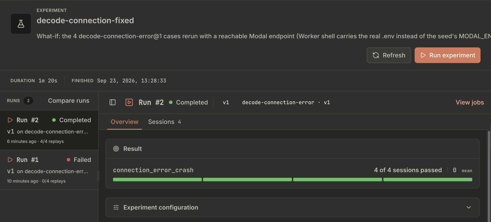

And that's it. Now we have an evaluator that can always detect this type of error.

The next steps are to repeat the same process on the other cohorts and expand your evaluator to cover all the failure classes.

## 7. More about replays

A replay re-runs `decode run` from the top. The tool policy decides whether a tool call (bash, file writes) uses its cache, fails when nothing is cached, or runs again for real. Reference: [tool policies](https://docs.zenml.io/kitaru/guides/tool-policies?utm_source=decodingai&utm_medium=referral&utm_campaign=coding-agent-course&utm_content=docs).

These policies are extremely important when running an experiment that contains replays.

Here are all the options:

| Key       | Values                                       | Meaning                                                                                            |
| --------- | -------------------------------------------- | -------------------------------------------------------------------------------------------------- |
| `type`    | `history` / `static` / `passthrough` / `llm` | answer from the recording / a fixed table / run the tool for real / let a model invent the result  |
| `on_miss` | `fail` / `error_result` / `passthrough`      | no recorded answer: stop the replay / hand the model an error and continue / run the tool for real |
| `scope`   | `baseline` / `cohort_version` / `agent`      | which recordings `history` may answer from                                                         |

Pick `on_miss` by how complete the recordings are:

- **Baselines that ran to completion**: `on_miss: fail`. A call the recording cannot answer stops the replay instead of inventing the rest.
- **Baselines that were cut off or crashed** (the §6 cohorts): `on_miss: passthrough`. Their recording ends after a call or two, so `fail` stops every replay with `ToolPolicyMissError: No history result for tool '<name>'` before the evaluator ever runs. `passthrough` runs the tool for real, inside the Worker's docker Workspace but live.

Per tool: `"tools": {"web_fetch": {"type": "passthrough"}}` next to `"default"`.

A replay always starts from a single session.

Get the session ID of the most recent recorded session:

```bash
export SESSION_ID=$(uv run kitaru session list --agent decode --origin recorded --size 1 -o json | jq -r '.items[0].id')
```

Then start the replay:

```bash
REPLAY=$(uv run kitaru replay create "$SESSION_ID" --agent decode@1 \
  --evaluator 'decode-request-limit@1' \
  --tool-policy '{"default":{"type":"history","scope":"baseline","on_miss":"fail"}}' \
  --baseline-evaluation-mode if-missing -o json)
export REPLAY_ID=$(jq -r '.item.id' <<<"$REPLAY") JOB_ID=$(jq -r '.item.job_id' <<<"$REPLAY")
```

Wait for the Worker to execute it, then read the session it produced:

```bash
export RESULT_SESSION_ID=$(uv run kitaru replay get "$REPLAY_ID" -o json | jq -r '.item.result_session_id')
```

You can see the replay within the sessions tab:

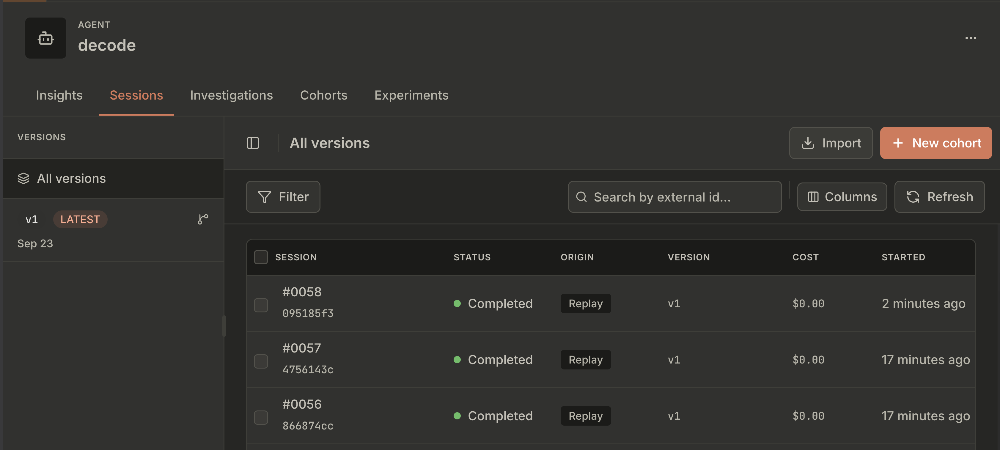

You can also compare the replay with the baseline session in the dashboard (select the two sessions and click **Compare**):

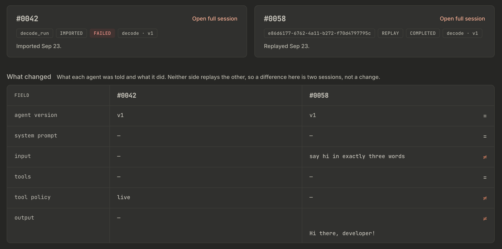

## 8. Model migration

Now, what if we want to change our code and see how it affects the harness's performance? Let's take changing the model from `Qwen/Qwen3.6-35B-A3B-FP8` (on Modal) to `gemini-3.8-flash` as an example.

First, we create an experiment with the new model (this doesn't run the experiment yet!):

```bash
uv run kitaru experiment create change-to-new-model --agent decode \
  --evaluator 'decode-connection-error@1' \
  --tool-policy '{"default":{"type":"history","scope":"baseline","on_miss":"passthrough"}}' \
  --override '{"model": "google:gemini-3.8-flash"}'
```

The `--override` parameter replaces the model of every model call in the replay (other keys: `system_prompt`, `prompt`, `model_params`). Reference: [replay and overrides](https://docs.zenml.io/kitaru/guides/replay-and-overrides?utm_source=decodingai&utm_medium=referral&utm_campaign=coding-agent-course&utm_content=docs). Two details decide whether it takes effect:

- **The new model needs its provider prefix** (`google:gemini-3.8-flash`), because a bare `gemini-3.8-flash` fails with `UserError: Unknown model`. The Worker's shell must also carry `GEMINI_API_KEY` (it does if you sourced `.env` in §4).
- **To swap only one model, use a map keyed by the name decode requests**, which includes the provider prefix: `{"model": {"openai:Qwen/Qwen3.6-35B-A3B-FP8": "google:gemini-3.8-flash"}}`. A key without the prefix (`Qwen/Qwen3.6-35B-A3B-FP8`) matches nothing, and the replay silently keeps the old model.

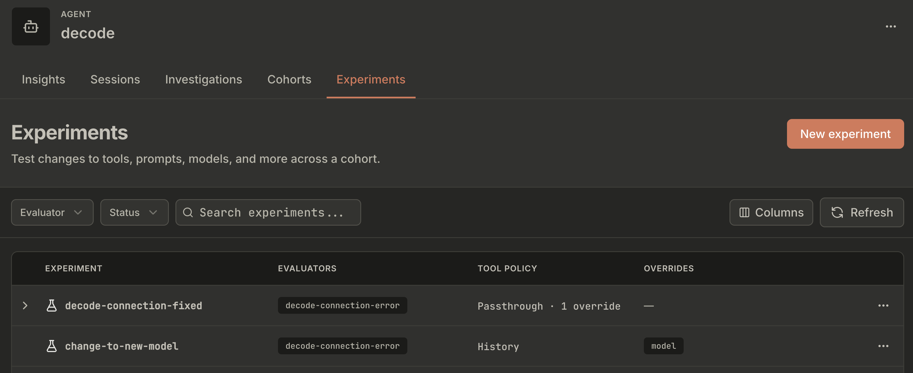

Next, get the `COHORT_VERSION_ID` of the cohort we replayed before:

```bash
export COHORT_VERSION_ID=$(uv run kitaru cohort version get decode-connection-error@1 -o json | jq -r '.item.id')
echo "$COHORT_VERSION_ID"
```

Then replay the same cohort on the new model (it runs on the Worker):

```bash
uv run kitaru experiment run start change-to-new-model \
  --cohort-version "$COHORT_VERSION_ID" --agent decode@1 --wait --timeout 1800
```

It starts to run:

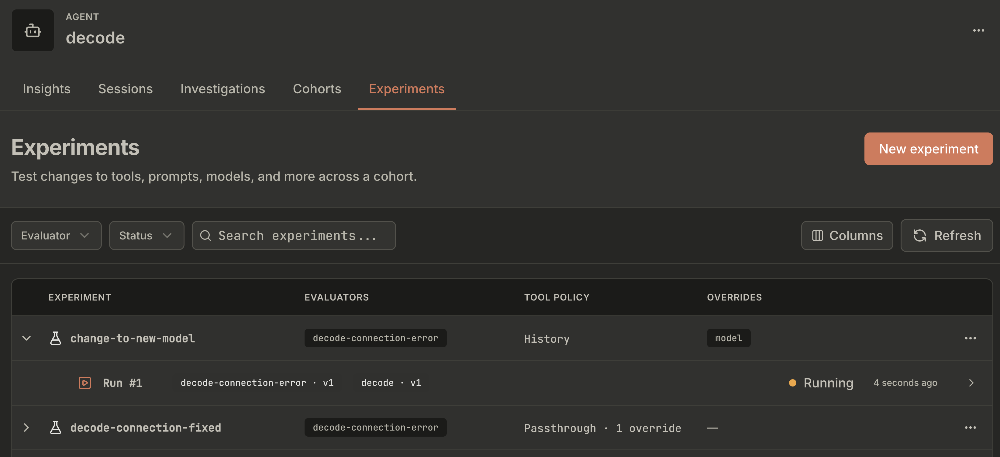

When it finishes, check the pass / fail counts for that experiment run:

```bash
export RUN_ID=$(uv run kitaru experiment run list --size 1 --sort created:desc -o json | jq -r '.items[0].id')
uv run kitaru experiment run get "$RUN_ID"
```

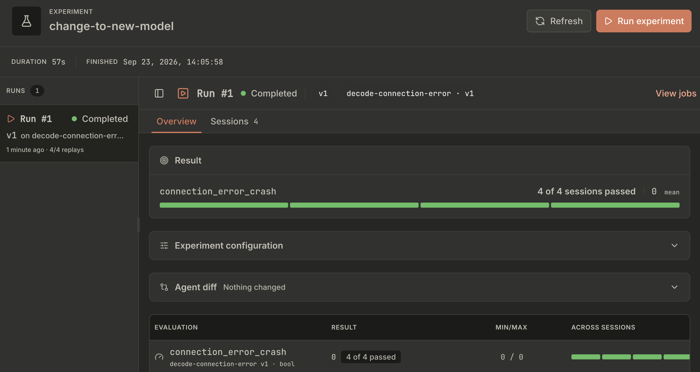

And the full experiment config:


Before trusting the result, confirm the replays really ran on the new model. Every line should print `gemini-3.8-flash`:

```bash
for s in $(uv run kitaru replay list --size 100 \
  --filter "{\"field\":\"experiment_run_id\",\"op\":\"eq\",\"value\":\"$RUN_ID\"}" \
  -o json | jq -r '.items[].result_session_id'); do
  uv run kitaru session nodes "$s" -o json --size 50 \
    | jq -r '[.items[] | select(.node_type=="llm_call") | .model] | unique | join(",")'
done
```

> [!WARNING]
> `decode-connection-error` only flags connection errors. A replay that crashes for any other reason (a wrong model name, a bad answer) still passes it. So a green run here shows the new model didn't reintroduce connection failures, not that the migration works. For that, pair it with an evaluator that checks the task itself (§9).

## 9. Write your own evaluator

You can easily scaffold a new deterministic Python evaluator under `evaluators/` by running:

```bash
uv run kitaru evaluator scaffold my-check --path evaluators/my_check.py
```

Edit the file, then check that it loads:

```bash
uv run kitaru evaluator test evaluators/my_check.py --entrypoint evaluate
```

Register it as `my-check@1`:

```bash
make kitaru-bootstrap
```

Score sessions with it, no replay involved:

```bash
uv run kitaru session evaluate --tag regression-case --evaluator 'my-check@1' --wait
```

For more details, check out [Kitaru's docs](https://docs.zenml.io/kitaru/guides/write-an-evaluator?utm_source=decodingai&utm_medium=referral&utm_campaign=coding-agent-course&utm_content=docs).

## Troubleshooting

### Debug a replay

```bash
uv run kitaru job watch "$JOB_ID"                          # ids from §7
uv run kitaru replay get "$REPLAY_ID"                      # status, error, result_session_id
uv run kitaru session get "$RESULT_SESSION_ID"             # the failed node
tail -f ~/.decode-kitaru-worker/.decode/logs/decode.log    # the spawned decode run
docker ps                                                  # its Workspace container
```

| Symptom                                                                                                          | Fix                                                                                                                                                                                                                        |
| ---------------------------------------------------------------------------------------------------------------- | -------------------------------------------------------------------------------------------------------------------------------------------------------------------------------------------------------------------------- |
| `[kitaru] not recording this run: … is unavailable`                                                              | `uv run kitaru status`; re-auth with `uv run kitaru login <url>`; check `KITARU_AGENT_ID` is the `decode` agent on **that** server.                                                                                        |
| Records nothing, says nothing                                                                                    | `KITARU_AGENT_ID` or `KITARU_API_URL` missing from `.env`. An exported `KITARU_API_URL` wins over `.env`: `unset` it if it names another server.                                                                           |
| Replay / import stays queued, or `evals kitaru import` times out                                                 | no live Worker: start one (§4) and re-run. For replays, also check the Agent Version (`uv run kitaru agent version list decode`, pick `SANDBOX_MODE=docker`).                                                              |
| `ToolPolicyMissError: No history result for tool '…'`                                                            | `on_miss: fail` did its job: the replay went past what the recording holds. Expected on cut-off or crashed baselines — use `on_miss: passthrough` (§7).                                                                    |
| `Experiment run … settled as failed`                                                                             | a replay job crashed, which is not an evaluator verdict: `uv run kitaru experiment run jobs "$RUN_ID"` shows the real error.                                                                                               |
| `could not clone … into the Workspace` … `File exists` / `No such file or directory`                             | parallel replays raced on the shared Workspace. Restart the Worker with `--concurrency 1` (§4) and start a new run.                                                                                                        |
| `Decode: set <PROVIDER>_API_KEY in your environment` (or a connection error) in a replay                         | the Worker shell has no provider key / endpoint, or `.env` was sourced from the wrong directory. `pwd`, source, restart the Worker.                                                                                        |
| Replay fails before the agent starts                                                                             | Docker down, or a stale command path after `make install`: re-run `make kitaru-bootstrap`.                                                                                                                                 |
| `403: A worker credential is required on this route` (or `403: Task credentials are not accepted on this route`) | `unset KITARU_AGENT_ID` in the Worker shell (`set -a && . ./.env` sets it), then restart it. Starts ~1 h after launch? See [below](#worker-log-fills-with-403-a-worker-credential-is-required-on-this-route-after-1-hour). |

### Worker log fills with `403: A worker credential is required on this route` after ~1 hour

```text
httpx INFO HTTP Request: POST http://localhost:8000/api/v1/tasks/claim "HTTP/1.1 200 OK"
httpx INFO HTTP Request: POST http://localhost:8000/api/v1/tasks/claim "HTTP/1.1 403 Forbidden"
kitaru.worker.worker WARNING Failed to claim tasks: 403: A worker credential is required on this route.
```

The Worker claims fine at first, then every claim fails and is retried at a growing interval (2 s … 60 s) forever. Jobs you queue stay `pending`.

**Cause** (kitaru 0.27.0): a Worker started without `--timeout` gets a token valid for 1 hour (`WORKER_TOKEN_LIFETIME_SECONDS = 3600`). The local server runs with no auth, so it answers an expired Worker token by treating the request as the default account, not with `401`. The claim route accepts Workers only, so it returns `403`. The Worker renews its token only on `401`, so it never recovers.

**Fix:** Ctrl-C the Worker and start it again, this time with a lifetime. The token then lasts `--timeout` + 5 minutes:

```bash
uv run kitaru worker start --concurrency 1 --timeout 28800
```

If the `403` shows up right at startup, the cause is different: `KITARU_AGENT_ID` is set in the Worker shell (see the table above).

More: [Kitaru troubleshooting](https://docs.zenml.io/kitaru/get-help/troubleshooting?utm_source=decodingai&utm_medium=referral&utm_campaign=coding-agent-course&utm_content=docs).
