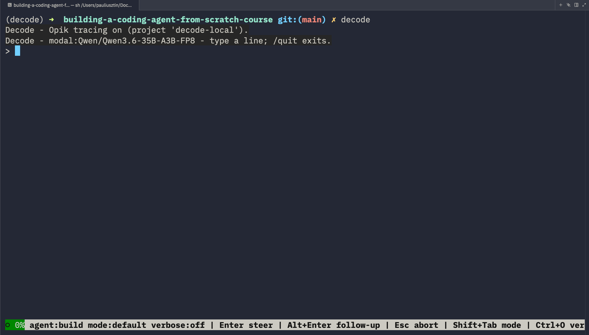

# Getting Started

Install **decode**, point it at a model, and run your first session — in about 5 minutes.

This guide is enough to set up the interactive mode of decode required for the first two lessons.

## 0. Quickstart

```bash
# 0. install uv first:  curl -LsSf https://astral.sh/uv/install.sh | sh
git clone https://github.com/decodingai-magazine/building-a-coding-agent-from-scratch-course.git
cd building-a-coding-agent-from-scratch-course
make install
cp .env.example .env      # then set GEMINI_API_KEY (free: https://aistudio.google.com/apikey)
uv run decode
```

## 1. Prerequisites

| Tool                                 | Needed for                                                   | Install                                            |
| ------------------------------------ | ------------------------------------------------------------ | -------------------------------------------------- |
| **[uv](https://docs.astral.sh/uv/)** | everything — it also installs the pinned Python 3.12 for you | `curl -LsSf https://astral.sh/uv/install.sh \| sh` |
| **git**                              | cloning the repo                                             | preinstalled on macOS/Linux                        |

Supported on **macOS, Linux, and Windows via [WSL2](https://learn.microsoft.com/windows/wsl/install)**. Native Windows (PowerShell / cmd) is untested — the TUI keybindings assume a POSIX shell.

That's the whole list. Docker and `gcloud` are required for later lessons — [sandboxing.md](sandboxing.md) and [infra.md](infra.md) will walk you through their setup.

> **✅ Checkpoint** — `uv --version` prints a version. If it says `command not found`, uv is installed but not on your PATH yet: restart your shell.

## 2. Install

```bash
git clone https://github.com/decodingai-magazine/building-a-coding-agent-from-scratch-course.git
cd building-a-coding-agent-from-scratch-course
make install        # uv sync + wire git hooks   (or just: uv sync)
```

Then install `decode` as a CLI tool:

```bash
make install-cli    # uv tool install --editable .  — the command tracks your source
```

If `decode` isn't found afterward, run `uv tool update-shell` and restart your shell. Uninstall with `make uninstall-cli`.

> **✅ Checkpoint** — `decode --version` prints `decode, version <x.y.z>`. That proves the venv, the pinned Python, and the entrypoint all resolve. It needs **no API key** — `--version` exits before any provider is built.

## 3. Point decode at a model

To wrap up the installation, you need to configure a few environment variables.

From the repo root, run:

```bash
cp .env.example .env
```

Now fill it in with **one** of the three model providers:

- **[3a. Modal](#3a-modal--your-own-open-source-model-recommended) — what we recommend.** You serve an open-weights model yourself, so there is no rate limit to hit: the $30 signup credits buy roughly 7 hours on the 1×H100 the default runs on, which is enough to run the whole course. You also get to watch your own open-weights model drive a harness you built, rather than a black box behind someone's API.
- **[3b. OpenRouter](#3b-openrouter--free-hosted-models) — hosted, still free.** One key, no GPU to manage; the free router spreads your calls across free tool-capable models. The daily cap is low until you add credit — $10 raises it.
- **[3c. Gemini](#3c-gemini--one-key-fastest-start) — the fastest first run.** One key and it's the default provider, so nothing else to set. Unfortunately, you will quickly hit its rate limits, which makes it annoying to use.

Switching later is a few lines in `.env` and no code change — so start wherever you'll be running in 60 seconds, then we recommend moving to Modal when rate limits start costing you time.

### 3a. Modal — your own open-source model (recommended)

You serve an open-weights model on a GPU, and decode talks to it over an OpenAI-compatible endpoint. Three commands and three env vars:

```bash
# 1. authenticate the CLI ($30 credits on signup: https://modal.com?source=decodingai&campaign=harnesseng)
uv run modal token set --token-id <your-token-id> --token-secret <your-token-secret>

# 2. serve the course default — Modal picks the GPU + serving recipe and prints the endpoint URL
uv run modal endpoint create --model Qwen/Qwen3.6-35B-A3B-FP8 --env main

# 3. mint a token pair so your endpoint isn't open to the world
uv run modal workspace proxy-tokens create   # → Modal-Key: wk-... / Modal-Secret: ws-...
```

> **Why `uv run modal`?** The `modal` CLI is a project dependency, not something you install separately — `make install` already put it in the venv, so `uv` finds it from the repo root. A bare `modal …` only works if you've activated the venv yourself. Step 1 is one-time: it writes `~/.modal.toml` in your home directory, and every later `uv run modal …` picks it up.

Then put the endpoint in your `.env`:

```bash
LLM_PROVIDER=modal

MODAL_TOKEN_ID=ak-...
MODAL_TOKEN_SECRET=as-...

MODAL_ENDPOINT_URL=https://your-workspace--your-app.modal.run   # decode calls {url}/v1
MODAL_ENDPOINT_MODEL=Qwen/Qwen3.6-35B-A3B-FP8
MODAL_PROXY_TOKEN_ID=wk-...          # both, or neither (an --unauthenticated endpoint)
MODAL_PROXY_TOKEN_SECRET=ws-...
```

Lost the URL? `uv run modal endpoint list --env main`.

**Two account tokens, two endpoint tokens — don't mix them up.** `MODAL_TOKEN_ID` / `MODAL_TOKEN_SECRET` authenticate the _CLI_; they are **not** decode settings, so putting them in `.env` does nothing — `modal token set` (which writes `~/.modal.toml`) or exporting them in your shell is what counts. The `MODAL_PROXY_TOKEN_*` pair above is a different thing: it's how decode _calls_ your served model, and it is both-or-neither (a half-set pair is a friendly startup error, never a silent 401).

**Watch your credits.** A GPU you keep warm bills while idle. Autoscaling **Min 0** (the default) scales to zero between sessions — you pay for the first cold start instead of the idle hour. Stop an endpoint you're done with: `uv run modal endpoint stop <endpoint-id> --env main`.

**If the first turn is slow**, that's the cold start waking the GPU. Setting `COMPACTION_CONTEXT_WINDOW_TOKENS=262144` skips decode's startup probe of `/v1/models`, which is the one request that has to wait on a cold endpoint — decode otherwise reads the window from the endpoint, then a static table, then assumes a conservative `200000`.

**Picking a different model, endpoint tuning, autoscaling, benchmarks, and the cost/capability ladder** all live in [`modal_models.md`](modal_models.md). The default above is what every lesson is built and tested against.

> **✅ Checkpoint** — this returns your model id, and proves the URL and both proxy tokens are right:
>
> ```bash
> curl "$MODAL_ENDPOINT_URL/v1/models" \
>   -H "Modal-Key: $MODAL_PROXY_TOKEN_ID" \
>   -H "Modal-Secret: $MODAL_PROXY_TOKEN_SECRET"
> ```

### 3b. OpenRouter — free hosted models

One key at [openrouter.ai](https://openrouter.ai), two lines in `.env`:

```bash
LLM_PROVIDER=openrouter
OPENROUTER_API_KEY=sk-or-...
# OPENROUTER_MODEL=openrouter/free   # the default — leave it alone unless you want a specific model
```

The default `openrouter/free` is the [Free Models Router](https://openrouter.ai/docs/guides/routing/routers/free-router): it auto-routes across free **tool-capable** models, so one congested upstream can't 429-block your loop. Free models cost $0; adding $10 of credit raises the free daily cap (~50 → ~1000 requests/day) without making the free models paid.

Pin a specific model with `OPENROUTER_MODEL=<slug>` — but check that it supports tool calling first, or the loop breaks.

> **✅ Checkpoint** — `grep -c '^OPENROUTER_API_KEY=sk-or-' .env` prints `1`.

### 3c. Gemini — one key (fastest start)

```bash
GEMINI_API_KEY=your-key-here     # free at https://aistudio.google.com/apikey
# GEMINI_MODEL=gemini-3.5-flash  # the default — leave it alone unless you want a specific model
```

That's it — `gemini` is the default provider, so no `LLM_PROVIDER` line is needed. Expect 429s once you start iterating hard; that's the free tier's per-minute cap, and the reason the course recommends Modal.

> **✅ Checkpoint** — `grep -c '^GEMINI_API_KEY=.\+' .env` prints `1`. Decode treats an unfilled placeholder (`changeme`, or blank) as **unset** and stops at startup with one line naming the variable, so a half-filled `.env` never reaches the provider.

### The provider matrix

| Provider (`LLM_PROVIDER`) | Model variable         | Default                    | Notes                                                                                                                                                                                                                                                                                                    |
| ------------------------- | ---------------------- | -------------------------- | -------------------------------------------------------------------------------------------------------------------------------------------------------------------------------------------------------------------------------------------------------------------------------------------------------- |
| `modal` **(recommended)** | `MODAL_ENDPOINT_MODEL` | `Qwen/Qwen3.6-35B-A3B-FP8` | your own endpoint — no rate limits, $30 credits ≈ ~7h on 1×H100. Setup above; catalog in [`modal_models.md`](modal_models.md).                                                                                                                                                                           |
| `gemini` (default)        | `GEMINI_MODEL`         | `gemini-3.5-flash`         | free tier at [Google AI Studio](https://aistudio.google.com/apikey); rate-limited.                                                                                                                                                                                                                       |
| `openrouter`              | `OPENROUTER_MODEL`     | `openrouter/free`          | needs `OPENROUTER_API_KEY`. The [Free Models Router](https://openrouter.ai/docs/guides/routing/routers/free-router) auto-routes across free tool-capable models so one congested provider can't 429-block you. $10 of credit raises the free daily cap (~50 → ~1000 req/day); free models still cost $0. |

## 4. Turn on tracing (optional, 30 seconds)

Tracing is what turns the loop from a wall of streamed text into something you can inspect: every turn ships as a trace, every model and tool call as a span with its tokens, latency, and cost. When the agent does something surprising, this is where you find out why.


**Get the key:** sign up at [comet.com](https://www.comet.com/signup?utm_source=workshop&utm_medium=partner&utm_campaign=paul&utm_content=coding_agent_course) (Opik is Comet's LLM observability product), then copy your API key from **Settings → API Keys**.

```bash
OPIK_API_KEY=your-key
```

**It stays free.** Opik's free plan includes **25,000 spans/month** — far more than this course needs.

> **✅ Checkpoint** — run one turn, then open your Opik project: the turn appears as a trace with a span per model/tool call.

## 5. Run

The easiest way is to run `decode` from inside the `building-a-coding-agent-from-scratch-course` repo you just cloned.

```bash
decode
```



You get an interactive REPL: type a message, the agent streams a reply, and every tool use **asks for approval first**.

| Action                                        | Key                            |
| --------------------------------------------- | ------------------------------ |
| Send a message                                | `Enter`                        |
| **Steer** a running turn (redirect it now)    | `Enter` while it's working     |
| **Follow-up** (queue work for when it's done) | `Alt+Enter` while it's working |
| **Abort** the current turn                    | `Esc`                          |
| Approve / deny a tool                         | type `y` / `n` at the prompt   |
| Quit                                          | `Ctrl-D` or `/quit`            |

Everything decode produces is saved under **`<cwd>/.decode/`** (gitignored): `sessions/*.jsonl` (replayable sessions), `MEMORY.md` (cross-session memory), `logs/decode.log` (logs stay off the terminal).

> **✅ Checkpoint** — type `what files are in this directory?` and press `Enter`. Working looks like: the agent asks to run a read-only tool, streams a list back, and `.decode/sessions/` now holds a `.jsonl` transcript. If the answer never streams, see [troubleshooting.md](troubleshooting.md).

### Resume a session

Every session is a replayable JSONL transcript under `.decode/sessions/`, keyed by session id:

```bash
decode --resume               # continue the most recent session in this directory
decode --resume <session-id>  # continue a specific one (the id is the filename stem)
```

### Memory

decode supports the standard `AGENTS.md`.

Also, `.decode/MEMORY.md` loads into context at startup, and decode appends a one-sentence summary of the session on exit — so a fresh session already knows what the last one did.

### Try a skill

We prepared a set of default skills under `.decode/skills/` as demos, so you can try the coding agent on something familiar.


```bash
cd building-a-coding-agent-from-scratch-course
decode
/demo-1-terminal-arcade    # the agent builds a playable Snake game
```

Two skills (`/commit`, `/review-diff`) ship inside the package and work from any directory. To use the demos in your own project, copy them over: `cp -r <course-repo>/.decode/skills/. ~/my-project/.decode/skills/`.

> **✅ Checkpoint** — type `/` and the completion menu lists the demos. An empty menu means decode was launched somewhere without a `.decode/skills/` directory.

**Something not working?** Every known failure and its fix is in [troubleshooting.md](troubleshooting.md).

## Develop

```bash
make test            # full test suite (unit + integration)
make unit-tests      # unit only
make lint-check      # ruff check        (lint-fix to auto-fix)
make format-check    # ruff format check (format-fix to apply)
make pre-commit      # format + lint + unit tests (the fast gate)
make ci              # what CI runs: lockfile check + format + lint + full suite
make help            # all targets
```
